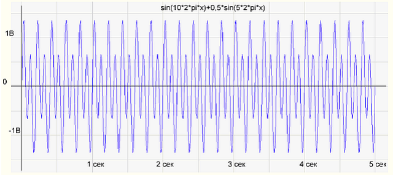
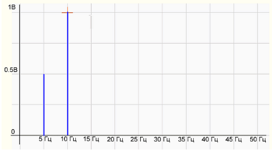

Преобразование Фурье. Вейвлет-преобразование. Оконные функции. {#1.10}
--------------------------------------------------------------

Исторически задача появилась, когда надо было понять характер поведения
закреплённой колеблющейся струны. Возникает проблема: как описать более
сложные формы, можно ли более сложные формы представить как сумму
простейших, в нашем случае - синусоидальных кривых.

**Определение 1**. *Период* - это длина $T$ промежутка времени, через
которое наша функция $f(x)$ начинает принимать те же значения:
$f(x − T) = f(x) = f(x + T)$.

**Определение 2**. *Частота* - количество повторений в единицу времени.
В нашем случае под частотой будем понимать $\omega = \frac{2\pi}{T}$

**Определение 3**. *Фаза* - это «сдвиг функции» от нулевого значения,
или координата пересечения оси $x$ с графиком функции:
$\phi = \omega t + \phi$.

**Определение 4**. *Амплитуда* - длина максимального смещения вдоль оси
$y$ от среднего положения.

Далее все выводы и доказательства можно посмотреть в ее отдельном файле
по преобразованию Фурье.

**Первое представление** разложения функции $f(x)$ в ряд Фурье:

$$f(t) = \sum\limits_{k=0}^{\infty}\Big(a_k cos(k\omega t) + b_k sin(k\omega t)\Big)$$
$$a_k = \frac{2}{T}\int\limits_0^T f(t)cos(k \omega t)dt \;\;\;\; b_k = \frac{2}{T}\int\limits_0^T f(t)sin(k \omega t)dt$$

*Note*: чисто мое мнение, что это основное преобразование, и остальные
не так важны.

**Второе представление** разложения функции $f(x)$ в ряд Фурье(просто
преобразуем некоторым образом коэффициенты из первого разложения):

$$f(t) = \sum\limits_{k=0}^{\infty} A_k cos(k \omega t - \phi_k)$$

Здесь $A_k = \sqrt{a_k^2 + b_k^2}$ - амплитуда,
$\phi_k = arctg \frac{b_k}{a_k}$ - фаза. Множество амплитуд $\{A_k\}$
называется *спектром* сигнала и показывает распределение энергии сигнала
по частотам.

Это представление даёт возможность построить график зависимости
амплитуды сигнала от частоты. На примере разложения мелодии по нотам
частота - это ноты или те клавиши, на которые мы нажимаем, а амплитуда -
сила, с которой мы нажимаем на каждую клавишу.

Пойдём дальше и вспомним формулу Эйлера - представление экспоненты через
синус и косинус: $e^{i \alpha} = cos \alpha + i sin\alpha$

$$e^{ik \omega t} = cos(k \omega t) + isin(k \omega t) \;\;\; e^{−ik \omega t} = cos(k \omega t) − isin(k \omega t)$$

**Третье представление** разложения $f(x)$ в ряд Фурье:

$$f(x) = \sum\limits_{-\infty}^{\infty} c_k e^{ik \omega t}$$

Всё, что мы делали ранее, относилось к периодическим функциям. Для
непериодических функций логично совершить предельный переход
$T \rightarrow \infty$ или $\omega \rightarrow 0$, тогда параметр $k$
теряет смысл, и разумнее перейти к новой частоте $\omega_1 = k\omega$:

$$F(w_1) = \int\limits_{-\infty}^{\infty} f(t) e^{-i w_1 t} dt$$

На практике нельзя получить сигнал на бесконечном интервале, так как нет
возможности узнать, какой был сигнал до включения устройства и какой он
будет в будущем. Для моделирования сигнала как в реальной жизни
ограничим интервала анализа, что равносильно произведению исходного
сигнала на оконную функцию. Таким образом, результатом оконного
преобразования Фурье является не спектр исходного сигнала, а спектр
произведения сигнала и оконной функции.

*Оконная функция* - это математическая функция, которая имеет нулевое
значение за пределами некоторого выбранного интервала, обычно
симметричная вокруг середины интервала, близкая к максимуму в середине и
сужающаяся от середины.

*Оконное преобразование Фурье* --- это разновидность преобразования
Фурье, определяемая следующим образом:

$$F(t,\omega )=\int \limits_{-\infty }^{\infty }f(\tau)W(\tau -t)e^{-i\omega \tau}d\tau$$

где $W(\tau - t)$ - некоторая оконная функция. В случае дискретного
преобразования оконная функция используется аналогично:

$$F(m,\omega) = \sum\limits_{-\infty}^\infty f[n] w[n-m] e^{-i\omega n}d\tau$$

Ещё один выход для избежания проблем, возникающих при преобразовании
Фурье, - вместо разложения по синусам и косинусам взять другие системы
ортогональных функций, самые известные: вейвлет \"Хаара\" и вейвлет
\"Мексиканская шляпа\".

*Вейвлет-преобразование* --- это его представление в виде обобщенного
ряда или интеграла Фурье по системе базисных функций.
Вейвлет-преобразование переводит сигнал из временного представления в
частотно-временное. Это способ преобразования функции (или сигнала) в
форму, которая или делает некоторые величины исходного сигнала более
поддающимися изучению, или позволяет сжать исходный набор данных.

Польза Вейвлет-преобразования заключается в том, что в заданном сигнале
мы можем находить функции, похожие на вейвлеты: если при заданном
масштабе и сдвига получаем большое значение вейвлета, то в заданном
сигнале будет похожий участок.

В отличие от преобразования Фурье вейвлет-преобразование дает двумерную
развертку одномерного процесса, при этом частота и время рассматриваются
как независимые переменные. В результате появляется возможность
анализировать свойства процесса одновременно во временной и частотной
областях.
