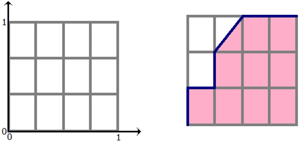

Функционалы качества для задач классификации Accuracy, Precision, Recall, F1, ROC AUC. Функционалы качества для задач регрессии: MSE, RMSE, MAE, MAPE. {#2.03}
------------------------------------------------------------------------------------------------------------------------------------------------------

Пусть есть два класса 0 и 1. Производится предсказание с помощью
какого-либо алгоритма. Тогда:

-   **TP** (True Positive) - выход алгоритма = 1 и правильный ответ = 1

-   **TN** (True Negative) - выход алгоритма = 0 и правильный ответ = 0

-   **FP** (False Positive) - выход алгоритма = 1 и правильный ответ = 0

-   **FN** (False Negative) - выход алгоритма = 0 и правильный ответ = 1

{width="15cm"}

-   **Accuracy** = $\frac{TP + TN}{TP + FP + TN + FN}$ -- доля
    правильных ответов в тесте. Минусы: не учитывает дисбаланс классов и
    не учитывается цена ошибки на объектах разных классов.

-   **Recall** = $\frac{TP}{TP + FN}$ -- доля найденных объектов среди
    релевантных (какой процент объектов положительного класса правильно
    классифицировали)

-   **Precision** = $\frac{TP}{TP + FP}$ -- доля релевантных объектов
    среди найденных (какой процент положительных объектов правильно
    классифицирован).

-   $\mathbf{F_1}$ =
    $\frac{2 \cdot Precision \cdot Recall}{Precision + Recall}$ --
    гармоническое среднее Precision и Recall, которое стремится к 0,
    когда хотя бы одно из значений стремится к 0. Максимизация этого
    функционала приводит к одновременной максимизации Precision и
    Recall.

*Note*: Precision и Recall обратно связаны, но их сумма не равна 1.

**ROC AUC**

-   Обучающая выборка: $X^m = \{(x_1, y_1), \dots, (x_m, y_m)\}$

-   Задача классификации на 2 класса: $X \rightarrow Y, Y = \{+1, -1\}$

-   Алгоритм классификации $a(x) : X \rightarrow Y$

-   Доля ложных положительных классификаций:

    $$FPR(a, X^m) = \frac{\sum\limits_{i=1}^{m} [y_i = -1][a(x_i) = +1]}{\sum\limits_{i=1}^{m}[y_i = -1]} = \frac{FP}{\sum\limits_{i=1}^{m}[y_i = -1]}$$

-   Доля верных положительных классификаций:

    $$TPR(a, X^m) = \frac{\sum\limits_{i=1}^{m} [y_i = +1][a(x_i) = +1]}{\sum\limits_{i=1}^{m}[y_i = +1]} = \frac{TP}{\sum\limits_{i=1}^{m}[y_i = +1]}$$

-   **ROC-кривая** - компромисс между уровнем ложной тревоги и долей
    верного отклика. По оси $X$ откладывается $FPR$, по оси $Y$ - $TPR$.

**Площадь под ROC-кривой**

Чем больше для каждого значения ошибки FPR значение правильного
предсказания TPR, тем лучше работает классификатор. Т.о. площадь под
кривой необходимо максимизировать.

Построение ROC-кривой:

{width="15cm"}

1.  Пусть алгоритм выдал оценки, как показано в табл. 1. Упорядочим
    строки табл. 1 по убыванию ответов алгоритма -- получим табл. 2.
    Ясно, что в идеале её столбец «класс» тоже станет упорядочен
    (сначала идут 1, потом 0); в самом худшем случае -- порядок будет
    обратный (сначала 0, потом 1); в случае «слепого угадывания» будет
    случайное распределение 0 и 1.

2.  Чтобы нарисовать ROC-кривую, надо взять единичный квадрат на
    координатной плоскости, см. рис. 1, разбить его на m равных частей
    горизонтальными линиями и на n -- вертикальными, где m -- число 1
    среди правильных меток теста (в нашем примере m=3), n -- число нулей
    (n=4). В результате квадрат разбивается сеткой на m×n блоков.

3.  Теперь будем просматривать строки табл. 2 сверху вниз и
    прорисовывать на сетке линии, переходя их одного узла в другой.
    Стартуем из точки (0, 0). Если значение метки класса в
    просматриваемой строке 1, то делаем шаг вверх; если 0, то делаем шаг
    вправо. Ясно, что в итоге мы попадём в точку (1, 1), т.к. сделаем в
    сумме m шагов вверх и n шагов вправо.

{width="15cm"}

**NOTE**: если у нескольких объектов значения оценок равны, то мы делаем
шаг в точку, которая на a блоков выше и b блоков правее, где a -- число
единиц в группе объектов с одним значением метки, b -- число нулей в
ней. В частности, если все объекты имеют одинаковую метку, то мы сразу
шагаем из точки (0, 0) в точку (1, 1).

**AUC ROC** -- площадь под ROC-кривой -- часто используют для оценивания
качества упорядочивания алгоритмом объектов двух классов. Ясно, что это
значение лежит на отрезке \[0, 1\]. В нашем примере AUC ROC = 9.5 / 12  
0.79.

**Смысл AUC ROC**

Сетка на рис. 1 разбила квадрат на m×n блоков. Ровно столько же пар вида
(объект класса 1, объект класса 0), составленных из объектов тестовой
выборки. Каждый закрашенный блок на рис. 1 соответствует паре (объект
класса 1, объект класса 0), для которой наш алгоритм правильно
предсказал порядок (объект класса 1 получил оценку выше, чем объект
класса 0), незакрашенный блок -- паре, на которой ошибся.

Таким образом, AUC ROC равен доле пар объектов вида (объект класса 1,
объект класса 0), которые алгоритм верно упорядочил, т.е. первый объект
идёт в упорядоченном списке раньше.\
**Метрики оценки качества для задач регрессии: MSE, RMSE, MAE, MAPE.**

  --------------------------------- ----------------------------------------------------------------- --
  Mean Squared Error:               $MSE = \frac{1}{n} \sum\limits_{t=1}^{n} e_t^2$                   
  Root Mean Squared Error:          $RMSE = \sqrt{\frac{1}{n} \sum\limits_{t=1}^{n} e_t^2}$           
  Mean Absolute Error:              $MAE = \frac{1}{n} \sum\limits_{t=1}^{n}|e_t|$                    
  Mean Absolute Percentage Error:   $MAPE = \frac{100\%}{n} \sum\limits_{t=1}^{n}|\frac{e_t}{y_t}|$   
  --------------------------------- ----------------------------------------------------------------- --

где $e_t = (y_t - \hat{y_t})$, $y_t$ - значение, $\hat{y_t}$ - прогноз,
$n$ - количество наблюдений.
