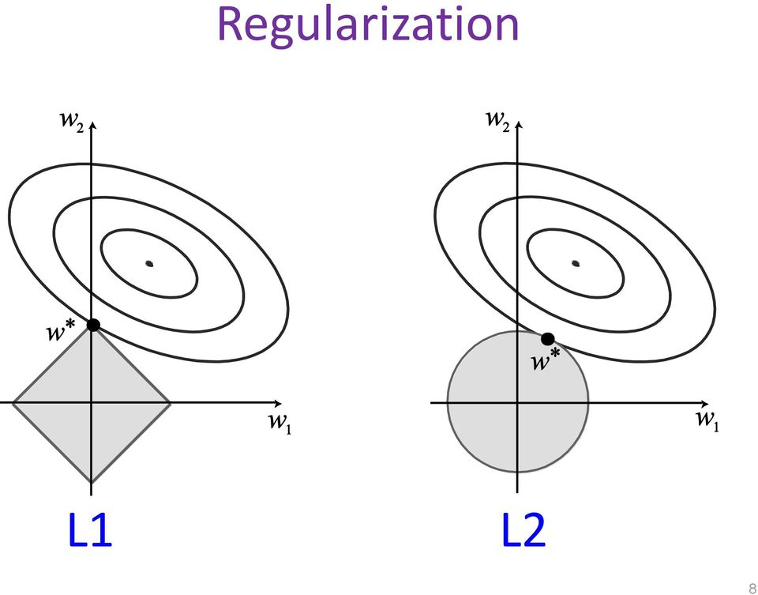

Концепция переобучения и недообучения. Методы валидации качества алгоритма. Регуляризация. L1/L2 регуляризация, множитель Лагранжа. {#2.04}
-----------------------------------------------------------------------------------------------------------------------------------

**Переобучение** -- негативное явление, возникающее, когда алгоритм
обучения вырабатывает предсказания, которые слишком близко или точно
соответствуют конкретному набору данных и поэтому не подходят для
применения алгоритма к дополнительным данным или будущим наблюдениям.

**Недообучение** -- негативное явление, при котором алгоритм обучения не
обеспечивает достаточно малой величины средней ошибки на обучающей
выборке. Недообучение возникает при использовании недостаточно сложных
моделей.

Если у нас будет слишком много признаков, то мы можем найти такие
параметры, которые бы минимизировали функцию ошибки почти до 0 на
обучающей выборке.

$$J(\theta) = \frac{1}{2m} \sum\limits_{i=1}^{m}(h_{\theta}(x^i) - y^i)^2 \approx 0$$

При этом, полученная модель будет плохо предсказывать на новых данных
(не будет достаточно робастной). Техники, способные уменьшить
переобучение, даже когда у нас фиксированы размер сети и обучающих
данных, известны как техники регуляризации. Т.е. для данной функции
минимизации ошибки надо придумать слагаемое, которое будет "удерживать"
его от падения в 0.

$$\underset{\theta}{min} (\frac{1}{2m} \sum\limits_{i=1}^{m}(h_{\theta}(x^i) - y^i)^2)$$

Это можно сделать путем добавления слагаемого.

Например, в **$L_2$-регуляризации**(регуляризация по Тихонову или Ridge
regression) слагаемое будет такое:

$$\underset{\theta}{min} (\frac{1}{2m} \sum\limits_{i=1}^{m}(h_{\theta}(x^i) - y^i)^2 + \lambda\sum\limits_{i=1}^{n}\theta_i^2)$$

А в $L_1$-регуляризации слагаемое будет такое:

$$\underset{\theta}{min} (\frac{1}{2m} \sum\limits_{i=1}^{m}(h_{\theta}(x^i) - y^i)^2 + \lambda\sum\limits_{i=1}^{n}|\theta_i|)$$
где $\lambda$ - параметр регуляризации.

Здесь есть 2 сущности: белая - это изолинии, соответствующие loss
функции, и серая - правая часть функции (по сути многомерный шар).
Минимум общий - точка на границе.
