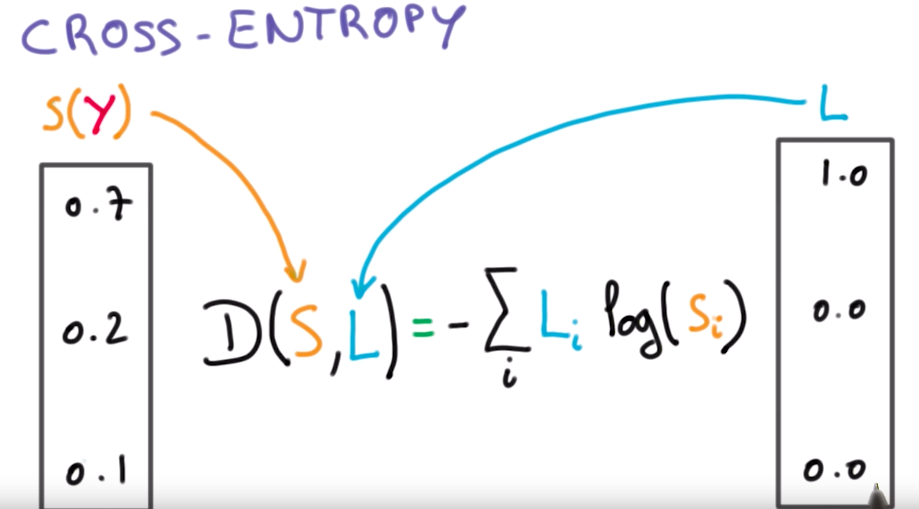

Метрики оценки качества для задач классификации. {#2.06}
------------------------------------------------

P.S. Тут будет про основные лоссы в задачах сегментации и детекта, т.к.
для задач классификации было всё описано в билете 2.3\
**Cross-entropy (CE)** -- loss функция, выраженная следующей формулой:
$$D(S, L) = -\sum_{i} L_{i}\log{S_{i}}$$ где $L$ - ground root метки (то
есть имеющиеся у нас разметка, соответствующая реальному классу, который
нужно предсказать), а $S$ - это то, что нам выдала (предсказала) модель

{width="90%"}

P.S. Dice в лекциях не упоминается никак, кроме названия и того, что нам
о нём уже рассказывали, так что всё беру из сети, рассказывать видимо
нужно будет на понимание\
**Dice** -- используется для оценки сходства между двумя образцами. С
точки зрения теории множеств, dice рассчитывается, как удвоенное
пересечение множеств $A$ и $B$ на их сумму. Если множества одинаковы, то
коэффициент dice равен 1, если вообще не совпадают -- то 0.В задачах
обнаружения границ, вместо множества $A$ пиксели истинной границы,
вместо $B$ -- пиксели прогнозируемой границы.

{width="60%"}

**Boundary loss** -- специфичная функция, используется для \"круглых
объектов\" (сосуды MRT). Считается как разница площадей $\delta{A}$
между $G_{B}^{i}$ (ground root) и $S_{B}^{i}$ (предсказанной) метриками,
то есть путем интегрирования. Берем точку $S_{B}^{i}(a^{'}, b^{'})$,
находим к ней соответствующую точку $G_{B}^{i}(a, b)$ по нормали $d_i$,
и интегрируем по всем точкам.

{width="60%"}
