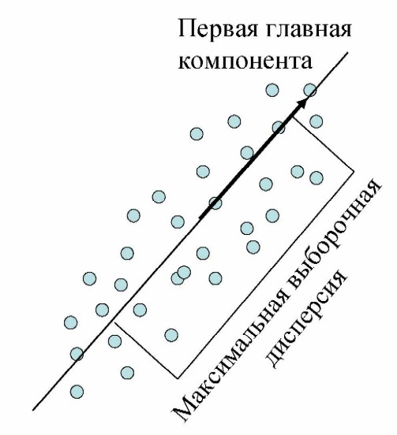
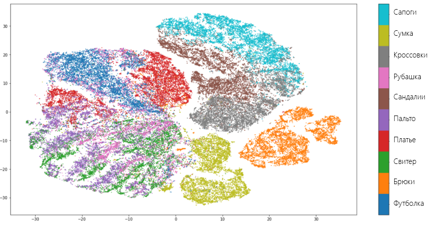
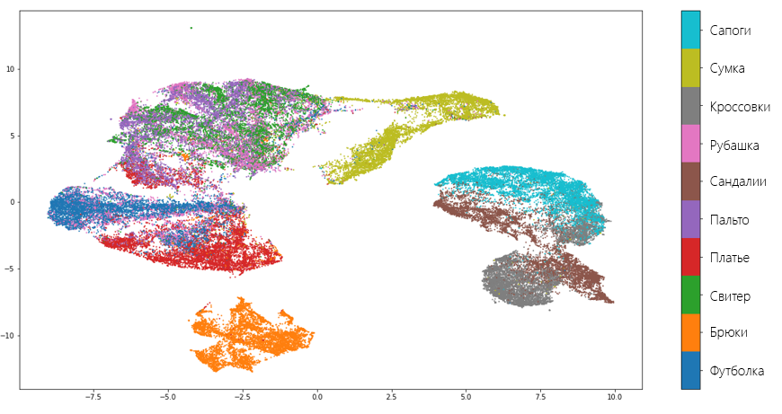

Методы снижения размерности. Метод главных компонент. SNE, t-SNE. UMAP. {#2.07}
-----------------------------------------------------------------------

P.S. матчасть метода главных компонент можно прочесть в билете 1.9.б тут
всё будет по сути\
P.P.S билет вообще про НЕЛИНЕЙНЫЕ методы сжатия пространства

Под уменьшением размерности в машинном обучении подразумевается
уменьшение числа признаков набора данных. Наличие в нем признаков
избыточных, неинформативных или слабо информативных может понизить
эффективность модели, а после такого преобразования она упрощается, и
соответственно уменьшается размер набора данных в памяти и ускоряется
работа алгоритмов ML на нем. Уменьшение размерности может быть
осуществлено методами выбора признаков или выделения признаков.\
**Метод главных компонент, или сингулярное разложение, или SVD метод** -
метод понижения размерности пространства. То есть, наша задача построить
проекцию на множество, а для этого нам нужно схлопнуть одну за одной
размерности, отобразив их на ось. Пример - из 2D множества точек
проекция на прямую. При этом хочется, чтобы расстояние от точек до
схлопнувшийся в линию размерности было минимальным.

{width="40%"}

Строится это штука по этапам:

1.  Для начала строится проекция (первое приближение,первая ось новой
    системы координат) строится таким образом, чтобы дисперсия данных
    вдоль неё была бы максимальна

2.  Затем вторая ось строится ортогонально первой так, чтобы дисперсия
    данных вдоль неё, была бы максимальной из оставшихся возможных и
    т.д. Первая ось называется первой главной компонентой, вторая ---
    второй и т.д.

**SNE**\
У нас есть набор данных с точками, описываемыми многомерной переменной с
размерностью пространства существенно больше трех. Необходимо получить
новую переменную, существующую в двумерном или трехмерном пространстве,
которая бы в максимальной степени сохраняла структуру и закономерности в
исходных данных. SNE начинается с преобразования многомерной евклидовой
дистанции между точками в условные вероятности, отражающие сходство
точек. Математически это выглядит следующим образом:

$$p_{i|j} = \frac{ \exp (- \left\| x_i - x_j \right\|^2  / 2\sigma_i^2)}{\sum_{k \neq i}{\exp (- \left\| x_i - x_k \right\|^2  / 2\sigma_i^2)}}$$

Эта формула показывает, насколько точка $X_j$ близка к точке $X_i$ при
гауссовом распределении вокруг $X_i$ с заданным отклонением $\sigma$.
Сигма будет различной для каждой точки. Она выбирается так, чтобы точки
в областях с большей плотностью имели меньшую дисперсию. Для двумерных
или трехмерных «коллег» пары $X_i$ и $X_j$, назовем их для ясности $Y_i$
и $Y_j$, не представляет труда оценить условную вероятность, используя
ту же формулу 1. Стандартное отклонение предлагается установить в
$1/\sqrt{2}$:

$$q_{i|j} = \frac{ \exp (- \left\| y_i - y_j \right\|^2 )}{\sum_{k \neq i}{\exp (- \left\| y_i - y_k \right\|^2 )}}$$

Если точки отображения $Y_i$ и $Y_j$ корректно моделируют сходство между
исходными точками высокой размерности $X_i$ и $X_j$, то соответствующие
условные вероятности $p_{i|j}$ и $q_{i|j}$ будут эквивалентны. В
качестве очевидной оценки качества, с которым $q_{i|j}$ отражает
$p_{i|j}$, используется дивергенция или расстояние Кульбака-Лейблера.
SNE минимизирует сумму таких расстояний для всех точек отображения при
помощи градиентного спуска. Функция потерь для данного метода будет
определяться формулой:

$$Cost = \sum{KL(P_i || Q_i )} = \sum_i{\sum_j{p_{j|i} \log\frac{p_{j|i}}{q_{j|i}}}}$$

При этом градиент выглядит на удивление просто:

$$\dfrac{\partial Cost}{\partial y_i} = 2\sum_j{ (p_{j|i} - q_{j|i} + p_{i|j} - q_{i|j})(y_i - y_j) }$$

Авторы предлагают следующую физическую аналогию для процесса
оптимизации: Все точки отображения соединены пружинами. Жесткость
пружины, соединяющей точки i и j зависит от разности между сходством
двух точек в многомерном пространстве и двух точек в пространстве
отображения. В этой аналогии, градиент --- это результирующая сила,
действующая на точку в пространстве отображения. Если систему
«отпустить», через какое-то время она придет в равновесие, это и будет
искомое распределение. Алгоритмически, поиск равновесия (нащих точек)
предлагается делать с учетом моментов:

$$Y^{(t)} = Y^{(t-1)} + \eta\dfrac{Cost}{Y} + \alpha(t)(Y^{(t-1)} - Y^{(t-2)})$$

где $\eta$ -- параметр, определяющий скорость обучения (длину шага), а
$\alpha$ -- коэффициент инерции.\
Если коротко, алгоритм такой: для точек X в n-мерном пространстве делают
их соответствие - точки Y в 3D или 2D пространстве. И считается, что
точки Y найдены хорошо, если условные вероятности расстояний между этими
точками совпали (но в реальности они конечно не совпадают, по этому мы
стремимся к этому совпадению, залипая на лосс). А считается это условная
вероятность так - расстояние между 1 и 2 точкой делить на сумму
расстояний от 1 точки до всех точек, кроме 2. А чтобы у нас не слиплось
в мелкую кашу условные вероятности в n-мерных областях с высокой
плотностью точек, мы делим всё это специальное для каждой точки
отклонение (в оригинале оно считается очень сложно, при помощи энтропии
Шеннона).\
Использование классического SNE позволяет получить неплохие результаты,
но может быть связано с трудностями в оптимизации функции потерь и
проблемой скученности (в оригинале -- crowding problem).\
**t-SNE**\
Имеет два принципиальных отличая от SNE. Во-первых, у t-SNE симметричная
форма сходства в многомерном пространстве и более простой вариант
градиента. Во-вторых, вместо гауссова распределения для точек из
пространства отображения используется t-распределение (Стьюдента),
«тяжелые» хвосты которого облегчают оптимизацию и решают проблему
скученности.

В качестве альтернативы минимизации суммы дивергенций Кульбака-Лейблера
между условными вероятностями $p_{i|j}$ и $q_{i|j}$ предлагается
минимизировать одиночную дивергенцию между совместной вероятностью P в
многомерном пространстве и совместной вероятностью Q в пространстве
отображения:

$$Cost = KL(P||Q) = \sum_i{\sum_j{p_{ij} \log\frac{p_{ij}}{q_{ij}}}}$$

где $p_{ii}$ и $q_{ii}$ = 0, $q_{ji} = p_{ji}$, $q_{ij} = q_{ji}$ для
любых i и j, а $p_{ij}$ определяется по формуле:

$$p_{ij} = \frac{p_{i|j} + p_{j|i}}{2n}$$

где n --- количество точек в наборе данных. Градиент для симметричного
SNE получается существенно проще, чем для классического (note from me: с
нас не спрашивают симметричный SNE, но про него почему-то везде
рассказывают):

$$\dfrac{\partial Cost}{\partial y_i} = 4\sum_j{ (p_{ij} - q_{ij})(y_i - y_j) }$$

Проблема скученности заключается в том, что расстояние между двумя
точками в пространстве отображения, соответствующими двум
среднеудаленным точкам в многомерном пространстве, должно быть
существенно больше, нежели расстояние, которое позволяет получить
гауссово распределение. Проблему решают хвосты Стьюдента. В t-SNE
используется t-распределение с одной степенью свободы. Совместная
вероятность для пространства отображения в этом случае будет
определяться формулой:

$$q_{ij} = \frac{ (1 + \left\| y_i - y_j \right\|^2 )^{-1}}{\sum_{k \neq l}{(1 + \left\| y_k - y_l \right\|^2 )^{-1}}}$$

Откуда тут l - точно не знаю, даже на вике эта опечатка. Могу только
предположить, что там должно стоять не l, а i\
А соответствующий градиент -- выражением:
$$\dfrac{\partial Cost}{\partial y_i} = 4\sum_j{ (p_{ij} - q_{ij})(y_i - y_j)(1 + \left\| y_i - y_j \right\|^2 )^{-1} }$$

Коротко про отличие от SNE - решили проблему с кучностью, поменяв
вероятностной распределение, и забили на условные вероятности, теперь
берем $p_{ij}$, а жить и считать всё стало легче. Общий алгоритм такой -
считаем $p_{i|j}$ по входным x, по ним находим $p_{ij}$, инициализируем
начальный массив 2d или 3d точек Y (авторы юзают норм распределение), и
впадаем в цикл:\
считаем qij, считаем градиент лосс функции
($\dfrac{\partial Cost}{\partial y_i}$), получаем Y(n+1) и так шагаем на
столько итераций, скока хочется.

**UMAP**\
Считается лучше всех предыдущих методов, самый молодой, но с более
сильным математическим обоснованием. Математически, изменения потерпела
формула условной вероятности:

$$p_{i|j} = \exp^{- \frac{d(x_i, x_j) - p_i}{\sigma_i}}$$ где $p_i$ --
важный параметр, который представляет расстояние от каждой i-й точки
данных до ее первого ближайшего соседа. В то же время
$\sigma = \log_2k$, где k -- колличесвто его ближайщих соседей (для
каждой точки оно определенно UMAP $k = 2^{\sum_ip_{ij}}$)

Немного другая симметризация вероятностей (правда зачем - не совсем
ясно):

$$p_{ij} = p_{i|j} + p_{j|i} - p_{i|j}p_{j|i}$$

UMAP использует семейство кривых $1 /(1 + a * y^{(2 b)})$ для
моделирования вероятностей расстояния в малых измерениях, а не в
точности по Стьюденту t-распределение, обратите внимание, что снова
нормализация не применяется (a и b обычно заданы):

$$q_{ij} = (1 + a (y_i - y_j)^{2b})^{-1}$$

UMAP использует двоичную кросс-энтропию (CE) в качестве функции
стоимости вместо KL-дивергенции, как это делает tSNE:

$$CE = \sum_i\sum_j(p_{ij}\log\frac{p_{ij}}{q_{ij}} + (1 - p_{ij})\log\frac{1 - p_{ij}}{1 - q_{ij}})$$

UMAP назначает начальные низкоразмерные координаты с помощью Лапласиана
графика в отличие от случайной нормальной инициализации, используемой
tSNE

Визуально, UMAP лучше разъединяет множества, чем tSNE:

{width="70%"}

{width="70%"}
