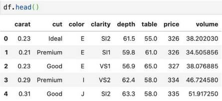
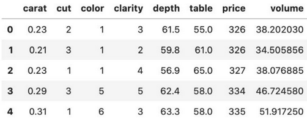
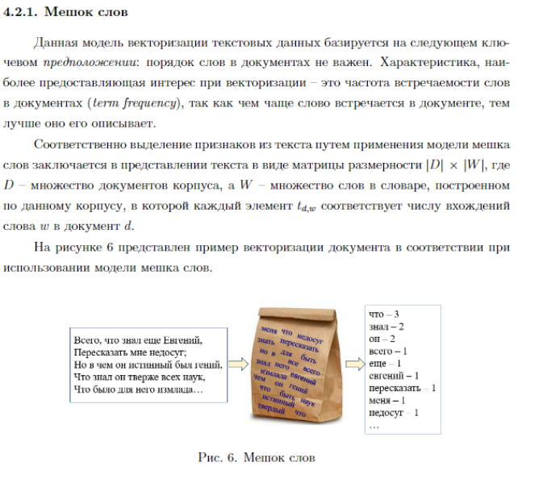
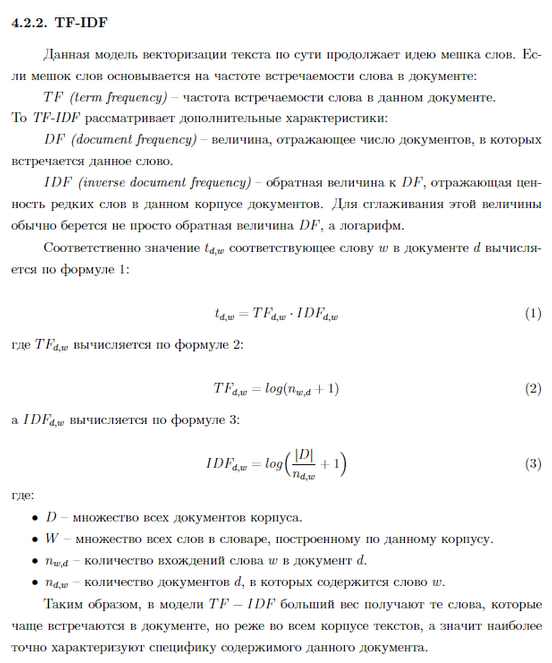

Типы признаков и их обработка. Нормализация данных, масштабирование, обработка категориальных признаков. Векторизация текстовых данных с помощью bag-of-words, tf-idf. {#2.08}
----------------------------------------------------------------------------------------------------------------------------------------------------------------------

Пусть $X$ - некоторое множество объектов. Тогда **признаком** будем
называть отображение $X \longrightarrow D_f$, где $D_f$ - множество
допустимых признаков. В зависимости от природы этого множества признаки
делятся на следующие типы:

1.  **бинарный** признак: $D_f = \{0, 1\}$

2.  **категориальный** признак: $D_f$ - конечное множество

3.  **порядковый** признак: $D_f$ - конечное упорядоченное множество

4.  **числовой** признак: $D_f$ - множество действительных чисел

### Обработка {#обработка .unnumbered}

При обработке датасета могут возникнуть несколько проблем, с которыми
нужно справиться для успешной работы алгоритма машинного обучения.

1.  У некоторых объектов датасета могут быть не определены некоторые
    признаки. Назовем это пропусками. В таком случае мы можем:

    -   Для категориальных признаков создать новый допустимый признак -
        \"неизвестно\". Или можно заполнить пропуск самым популярным в
        датасете значением признака.

    -   Для числовых признаков можно заполнить пропуск средним либо
        медианным значением.

2.  В датасете могут также присутствовать выбросы (говорим про числовые
    признаки). Чаще всего от выбросов в обучающей выборке лучше всего
    избавляться. Для того, чтобы определить, является ли значение
    выбросом, пользуются характеристикой выборки, называемой
    интерквартильным размахом. Определяется он следующим образом:\
    $IQR = Q_3 - Q_1$, где $Q_1$ --- первая квартиль --- такое значение
    признака, меньше которого ровно 25% всех значений признаков. $Q_3$
    --- третья квартиль --- значение, меньше которого ровно 75% всех
    значений признака. Для того, чтобы понять, является ли значение
    выбросом, можно воспользоваться эвристикой: выбросы лежат за
    пределами следующего интервала: $[ Q_1 -1.5IQR, Q_3 + 1.5IQR ]$.

### Нормализация {#нормализация .unnumbered}

**Нормализация** -- это приведение всех значений числового признака к
новому диапазону. Например, к диапазону $[0, 1]$. Это полезно, поскольку
значения признаков могут изменяться в очень большом диапазоне. Причем,
значения разных признаков могут отличаться на несколько порядков. А
после нормализации они все будут находиться в узком (и, часто, едином)
диапазоне.

Наиболее популярным способом нормализации является **нормализация
методом минимакса**. Для того, чтобы применить этот метод, должно быть
известно максимальное и минимальное значение признака. Проблема в том,
что эти значения известны не всегда.

$x_{new} = \frac{ x_{old} - x_{min}} {x_{max} - x_{min}}$

Также довольно популярным методом является **Z-нормализация** или
**нормализация средним**. Диапазон новых значений для Z-нормализации
выглядит следующим образом:

$(-3\sigma[X], 3\sigma[X])$

где $\sigma[X]$ --- среднеквадратическое отклонение признака $X$.

Выполняется Z-нормализация по формуле ниже.

$x_{new} = \frac{x_{old} - M[X]} {\sigma[X]}$

где $M[X]$ --- математическое ожидание признака $X$.

Отмечу, что в случае применения Z-нормализации к нескольким признакам,
диапазон значений для них будет разным.

### Обработка категориальных признаков {#обработка-категориальных-признаков .unnumbered}

Многие модели плохо работают с категориальными признаками как таковыми.
Дело в том, что признак \"Российская Федерация\" нельзя просто взять и
умножить на какое-нибудь число. Но многие модели работают именно так:
берется коэффициент и на него умножается значение признака. Аналогичная
операция выполняется с остальными признаками. Все результаты
суммируются. На основе значения суммы делается вывод о принадлежности
объекта к тому или иному классу (такие модели называются линейными).

Рассмотрим датасет следующего вида:

{width="15cm"}

**One-Hot Encoding**

Предположим, что некоторый признак может принимать $k$ разных значений.
В этом случае **One-Hot Encoding** подразумевает создание $k$ признаков,
все из которых равны нулю за исключением одного. На позицию,
соответствующую значению признака мы помещаем единицу.

{width="15cm"}

**Label Encoding**

Здесь мы по сути из каждого категориального признака делаем `enum`, как
в языках программирования. Каждому значению категориального признака
соответствует уникальный (в рамках значений этого признака) `id`.

{width="15cm"}

**Target Encoding**

Создаем признак, значение которого равно среднему целевому значению для
каждой категории. Здесь **Legendary** -- таргет. То есть, если
$Type = Fire$, то всего у нас вероятность $1/3$ того, что
$Legendary = 1$.

{width="10cm"}

**Leave-one-out Encoding**

То же самое, что и предыдущее, только при подсчетах мы не учитываем
текущую строку таблицы, т.е. которую сейчас заполняем.

**Frequency Encoding**

Выбираем категориальный признак и считаем частоту его встречаемости в
датасете.

{width="15cm"}

**Model Encoding**

Это различные модели для преобразования признаков, например `Word2Vec`

{width="15cm"}

### Векторизация текстовых данных с помощью bag-of-words, tf-idf. {#векторизация-текстовых-данных-с-помощью-bag-of-words-tf-idf. .unnumbered}

{width="18cm"}

{width="18cm"}
