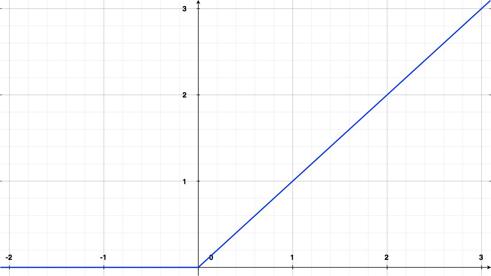
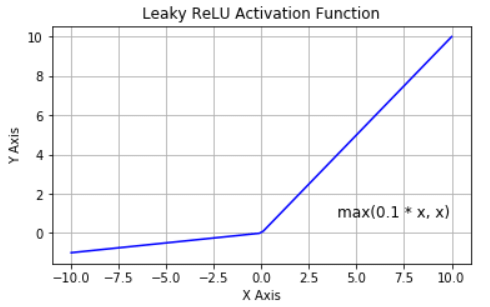
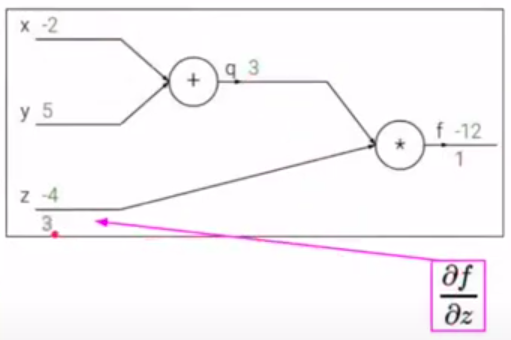
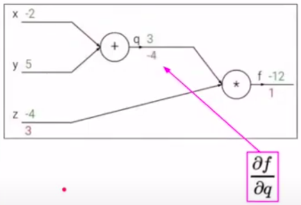
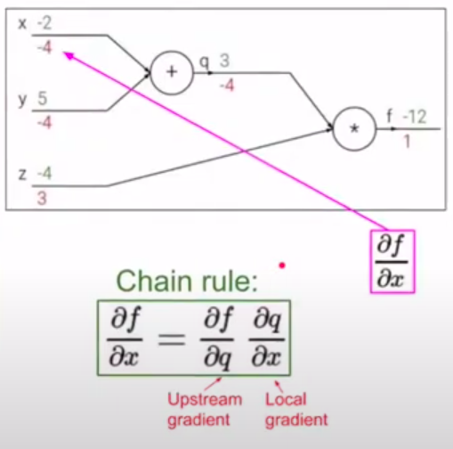

Нейронные сети. Модель нейрона. MLP. Понятие функции активации. Алгоритм обратного распространения ошибки. {#3.01}
----------------------------------------------------------------------------------------------------------

### Нейронные сети. Модель нейрона.

Искусственный нейрон - узел искусственной нейронной сети, являющийся
упрощённой моделью естественного нейрона. Математически искусственный
нейрон обычно представляют как некоторую нелинейную функцию от
единственного аргумента --- линейной комбинации всех входных сигналов.
Данную функцию называют **функцией активации**.

Математически нейрон представляет собой взвешенный сумматор,
единственный выход которого определяется через его входы и матрицу весов
следующим образом:

$$y = f(u), \text{где}\quad u=\sum_{i=1}^{n}w_ix_i+w_0x_0$$

тут $x_i$ - сигналы на входах нейрона, $w_i$ - веса входов, функция $u$
называется индуцированным локальным полем, а функция $f(u)$ -
передаточной функцией (функцией активации)

[\[fig:my\_label\]]{#fig:my_label label="fig:my_label"}

### Функция активации

В биологических нейронных сетях функция активации обычно является
абстракцией, представляющей скорость возбуждения потенциала действия в
клетке. В наиболее простой форме эта функция является двоичной --- то
есть нейрон либо возбуждается, либо нет.

Передаточная функция $f(u)$ определяет зависимость сигнала на выходе
нейрона от взвешенной суммы сигналов на его входах. В большинстве
случаев она является монотонно возрастающей. Использование различных
передаточных функций позволяет вносить нелинейность в работу нейрона и в
целом нейронной сети.

### Виды функций активации

1.  Функция Хевисайда. $$f(x) = 
                 \begin{cases}
                   1, &\text{if $x\geq T = -w_0x_0$}\\
                   0, &\text{else}
                 \end{cases}$$

    

    [\[fig:my\_label\]]{#fig:my_label label="fig:my_label"}

2.  Сигмоида $$\sigma(x) = \frac{1}{1+e^{-x}}$$

    

    [\[fig:my\_label\]]{#fig:my_label label="fig:my_label"}

3.  Гиперболический тангенс $$tanh(x) = 2\sigma(2x) -1$$

    

    [\[fig:my\_label\]]{#fig:my_label label="fig:my_label"}

4.  Rectified Linear Unit $$ReLU(x) = max(0,x)$$

    

    [\[fig:my\_label\]]{#fig:my_label label="fig:my_label"}

5.  ReLU с утечкой (Leaky ReLU)
    $$LReLU(x) = (x<0)\cdot \alpha x+(x\geq 0)\cdot x$$

    

    [\[fig:my\_label\]]{#fig:my_label label="fig:my_label"}

### Многослойный перцептрон (MLP)

Многослойный персептрон --- это класс искусственных нейронных сетей
прямого распространения, состоящих как минимум из трех слоёв: входного,
скрытого и выходного. За исключением входных, все нейроны использует
нелинейную функцию активации.

При обучении MLP используется обучение с учителем и алгоритм обратного
распространения ошибки.

[\[fig:my\_label\]]{#fig:my_label label="fig:my_label"}

В качестве активационных функций нейронов используются сигмоидальные:
логистическая или гиперболический тангенс.

### Алгоритм обратного распространения ошибки {#3.01.05}

Один из распространенных подходов к обучению заключается в
последовательном предъявлении НС векторов наблюдений и последующей
корректировки весовых коэффициентов так, чтобы выходное значение
совпадало с требуемым. Это называется обучение с учителем, так как для
каждого вектора мы знаем нужный ответ и именно его требуем от нашей НС.

Теперь, главный вопрос: как построить алгоритм, который бы наилучшим
образом находил весовые коэффициенты. Наилучший -- это значит,
максимально быстро и с максимально близкими выходными значениями для
требуемых откликов. В общем случае эта задача не решена. Нет
универсального алгоритма обучения. Поэтому, лучшее, что мы можем сделать
-- это выбрать тот алгоритм, который хорошо себя зарекомендовал в
прошлом. Основной «рабочей лошадкой» здесь является алгоритм back
propagation (обратного распространения ошибки), который, в свою очередь,
базируется на алгоритме градиентного спуска.

**Простой пример backpropagation.** Пусть дана функция:
$f(x,y,z) = (x+y)z$. Представим операции в виде графа вычислений:

[\[fig:my\_label\]]{#fig:my_label label="fig:my_label"}

К примеру, $x=-2, y=5, z=-4$

[\[fig:my\_label\]]{#fig:my_label label="fig:my_label"}

Конечная цель - нужно распространить ошибку ко входам сети, для этого
нужно вычислить производную от функции потерь (в нашем случае это
функция $f$) по входу ($x,y,z$) (дифференцируем справа налево по графу,
т.е. от конца в начало). Будем это делать с помощью цепного правила
(правило взятия производной от сложной функции) и для этого нужно
вычислить все частные производные по пути. Теперь считаем производные:
$$q=x+y, \frac{\partial q}{\partial x}=1, \frac{\partial q}{\partial y}=1$$
$$f=qz, \Rightarrow \frac{\partial f}{\partial q}=z, \frac{\partial f}{\partial z}=q$$
Хотим посчитать:
$$\frac{\partial f}{\partial x}, \frac{\partial f}{\partial y}, \frac{\partial f}{\partial z}$$

На следующих картинках: значения над стрелками - те, что получили во
время прямого прохода, значения под стрелками - во время обратного
прохода (backward pass) - частные производные.

[\[fig:my\_label\]]{#fig:my_label label="fig:my_label"}

[\[fig:my\_label\]]{#fig:my_label label="fig:my_label"}

[\[fig:my\_label\]]{#fig:my_label label="fig:my_label"}

[\[fig:my\_label\]]{#fig:my_label label="fig:my_label"}

[\[fig:my\_label\]]{#fig:my_label label="fig:my_label"}
