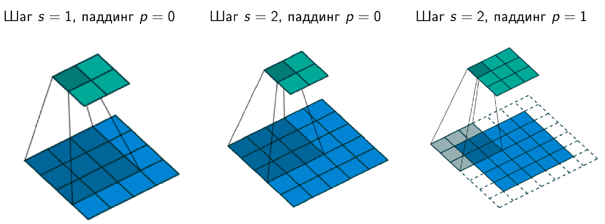
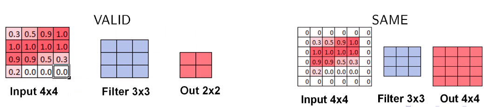
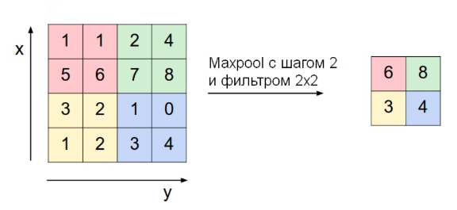
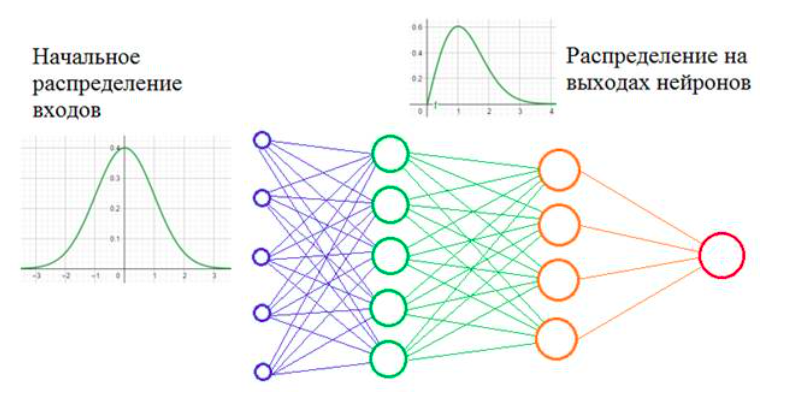

Глубокие нейронные сети. Принцип работы слоев: сверточного, полносвязного, пулинг (max pooling, average pooling), нормализации (batch normalization, layer normalization), дропаут. {#3.02}
-----------------------------------------------------------------------------------------------------------------------------------------------------------------------------------

### Сверточный слой {#3.02.01}

Скалярное произведение между элементами фильтра (также наз. **ядро
свертки**) и ограниченной областью входного слоя, с которой имеются
связи, с помощью скользящего окна (слева направо, сверху вниз). Свертка
отвечает за пространственное выделение признаков.

**Параметры сверточного слоя**

-   Размер фильтра - прямоугольный, задается двумя числами: $p\times q$.
    Также называется рецептивным полем.

-   Глубина - кол-во двумерных карт признаков (обычно интересует их
    число на выходе)

-   Шаг свертки (stride) - кол-во элементов по горизонтали или
    вертикали, на которое перемещается фильтр в режиме скользящего окна
    для получения результрующей карты признаков.

-   Добивка, паддинг (padding) - кол-во элементов, которыми дополняется
    исходная карта признаков - обычно нужна для сохранения
    пространственных размеров карты (ширина, высота)

[\[fig:my\_label\]]{#fig:my_label label="fig:my_label"}

**Padding. Режим VALID**

-   При движении скользящим окном (фильтром) размера $h\times w$ по
    изображению $H\times W$ с шагом $s=1$, если не заходить за границу
    картинки, то на выходе будет изображение размера (т.е. выходной
    размер изображения уменьшается): $$(H-h+1)\times (W-w+1)$$

**Padding. Режим SAME**

-   Добавляется рамка вокруг изображения (паддинг), состоящая либо из
    нулей, либо из зеркального отражения картинки внутри рамки, чтобы
    выходной размер был равен входному.

[\[fig:my\_label\]]{#fig:my_label label="fig:my_label"}

**Формула свертки**

-   **Входной слой** - трехмерный тензор $X_{ij}^{m}$, где верхний
    индекс - кол-во входных карт, два нижних индекса - пространственное
    разрешение карт (по горизонтали и вертикали). Всего входных карт
    $M$.

-   **Выходной слой** - трехмерный тензор $Y_{ij}^{k}$ с теми же
    обозначениями индексов. Всего выходных карт $K$.

-   **Фильтр свертки** - четырехмерный тензор $F_{uv}^{mk}$, где два
    верхних индекса отвечают за индекс входной и выходной карты, а
    нижние - пространственные размерности (например, 5 на 5); а также
    одномерный тензор сдвига (bias) $b^{k}$. Пусть пространственные
    размерности фильтра - $p\times q$
    $$Y_{ij}^{k}=\sum_{m=1}^{M}\sum_{u,v=1}^{p,q}X_{i+u-1, j+v-1}^{m}\cdot F_{uv}^{mk}+b^{k}, \forall k=1...K$$

[\[fig:my\_label\]]{#fig:my_label label="fig:my_label"}

### Полносвязный слой FC (Fully connected)

Матричное умножение - в данном случае каждый нейрон выходного слоя
связан со всеми нейронами входного слоя (в отличие от сверточного слоя)

### Слой субдискретизации POOL {#3.02.03}

Уменьшение размерности по пространственным измерениям $w,h$. Могут
использоваться разные подходы: усреднение (average pooling), взятие
максимума по подобласти (max pooling) и т.п.

Слой субдискретизации решает две проблемы:

1.  Снижает пространственную размерность

2.  Помогает не переобучаться

Параметры слоя субдискретизации:

1.  Размер фильтра - пространственная размерность области (по
    горизонтали и вертикали), внутри которой применяется фукнция
    уменьшения размерности (max, avg)

2.  Шаг (stride) - кол-во элементов по горизонтали или вертикали, на
    которое перемещается фильтр для получения результирующей карты
    признаков.

[\[fig:my\_label\]]{#fig:my_label label="fig:my_label"}

### Normalization

**Проблема:**

-   **Внутренний ковариативный сдвиг (Internal Covariative Shift,
    ICS)** - изменение распределения значений нейронов вследствие
    изменения параметров нейросети во время обучения.

-   Более глубокая сеть $\Rightarrow$ больший сдвиг

Давайте предположим, что мы обучаем НС распознавать машины (неважно
какие, главное чтобы сеть на выходе выдавала признак: машина или не
машина). Но, при обучении мы используем автомобили только черного цвета.
После этого, сеть переходит в режим эксплуатации и ей предъявляются
машины уже разных цветов. Начальное распределение цветов (пусть это
будут градации серого) обучающей выборки и распределение всего множества
цветов машин, встречающихся в тестовой выборке, имеют различные МО и
дисперсии. Эта разница статистических характеристик и приводит к
ковариационному сдвигу. И теперь мы понимаем: если такой сдвиг имеет
место быть, то это негативно сказывается на работе НС. Но это пример
внешнего ковариационного сдвига. Его легко исправить, поместив в
обучающую выборку нужное количество машин с разными цветами. Есть еще
внутренний ковариационный сдвиг -- это когда статистическая картина
меняется внутри сети от слоя к слою.

[\[fig:my\_label\]]{#fig:my_label label="fig:my_label"}

Проблемы проявляются в процессе обучения, когда при изменении весов
связей предыдущего слоя статистическое распределение выходных значений
нейронов текущего слоя становится заметно другим. И этот измененный
сигнал идет на вход следующего слоя. Это похоже на то, словно на вход
скрытого слоя поступают то машины черного цвета, то машины красного
цвета или какого другого. То есть, весовые коэффициенты в пределах
мини-батча только адаптировались к черным автомобилям, как в следующем
мини-батче им приходится адаптироваться к другому распределению --
красным машинам и так постоянно. В ряде случаев это может существенно
снижать скорость обучения и, кроме того, для адаптации в таких условиях
приходится устанавливать малое значение шага сходимости, чтобы весовые
коэффициенты имели возможность подстраиваться под разные статистические
распределения.\
**Решение:**

-   Если проблема в изменении статистических характеристик распределения
    на выходах нейронов, то давайте их стандартизировать,
    нормализовывать -- приводить к единому виду. Именно это и делается
    при помощи предложенного алгоритма **Batch Normalization**

**Когда и где применять BN:**

-   В глубоких нейронных сетях

-   Когда нужно ускорить обучение

-   **После** операции свертки или других матричных операций

-   **До** применения функции активации, т.к. она сама по себе сильно
    меняет распределение

-   Тем не менее, есть свидетельства, что порой можно применить BN и
    после активации (хотя, это не всегда работает)

**Режимы работы BN**

-   **Обучение**

    -   *Подсчитываем* $\mu_{B}$ *и* $\sigma_{B}$ *на пакете* $B$.\
        Предположим, что мы используем пакет размера $T$. Тогда,\
        $X_{ij}^{mt} \text{- четырехмерный тензор значений для некоторого слоя, где: }$\
        $1\leq i\leq H, \quad 1\leq j\leq W \text{ - пространственные координаты (ширина и высота)}$\
        $m=1...M \text{ - номер карты признаков}$\
        $t = 1...T\text{ - номер внутри пакета}$\

    -   Статистика на пакете:
        $$\mu_{B}^{m}=\frac{1}{HWT}\sum_{t}\sum_{i,j}X_{ij}^{mt}$$
        $$\sigma_{B}^{2m}=\frac{1}{HWT}\sum_{t}\sum_{i,j}(X_{ij}^{mt}-\mu_{B}^{m})^2$$

    -   *Обновляем глобальные значения (соотв. всему обуч. мн-ву)
        $\mu_{avg}$ и $\sigma_{avg}$*\

    -   Гиперпараметры:\
        $\alpha\in [0,1]\text{ - параметр сглаживания для обновления глобальных параметров}$\
        $\epsilon>0\text{ - регуляризатор (маленькое число)}$\

    -   Шаг обучения $k$:
        $$\mu_{avg,k}^{m} = \alpha\mu_{avg,k-1}^{m}+(1-\alpha)\mu_{B}^{m} \quad (\text{иниц. } \mu_{avg,0}^{m}=0)$$
        $$\sigma_{avg,k}^{2m}=\alpha \sigma_{avg,k-1}^{2m} +(1-\alpha)\sigma_{B}^{2m}\quad (\text{иниц. } \sigma_{avg,0}^{2m}=1)$$

    -   Выход нормализованного слоя:
        $$Y_{ij}^{mt}=\gamma^{m}\frac{X_{ij}^{mt}-\mu_{B}}{\sqrt{\sigma_{B}^{2m}+\epsilon}}+\beta^{m}$$

    -   Параметры $\gamma^{m}$ (масштаб, scale) и $\beta^{m}$ (сдвиг,
        shift) - обучаемые.\

    -   **Замечание.** В случае, когда
        $\gamma^{m}=\sqrt{\sigma_{B}^{2m}+\epsilon}, \beta^{m}=\mu_{B}^{m}$,
        получим $Y_{ij}^{mt} = X_{ij}^{mt}$, т.е. BN в принципе может
        обучиться ничего не делать (ничего не портить)

-   **Тестирование (inference)**

    -   Используем значения $\mu_{avg}$ и $\sigma_{avg}$ вне зависимости
        от $\mu_{B}$ и $\sigma_{B}$ на текущем пакете.\

    -   Используем уже обученные параметры масштаба $\gamma^{m}$ и
        сдвига $\beta^{m}$\

    -   Несмотря на то, что данные могут также подаваться пакетами, не
        обращаем внимание на статистику пакета $\mu_{B}^{m}$ и
        $\sigma_{B}^{2m}$\

    -   Не обновляем глобальные параметры $\mu_{avg}^{m}$ и
        $\sigma_{avg}^{2m}$\

    -   Выход нормализованного слоя:
        $$Y_{ij}^{mt}=\gamma^{m}\frac{X_{ij}^{mt}-\mu_{avg}^{m}}{\sqrt{\sigma_{avg}^{2m}+\epsilon}}+\beta^{m}$$

**Число параметров для BN:**

-   Для каждой карты признаков нужно хранить 4 числа: 2 - глобальные
    статистики, 2 - параметры сдвига и масштаба

-   Если L слоев по M карт каждый, то число BN параметров $N_{BN}=4LM$

-   $N_{BN}\ll N_{CONV}$

**Другие виды нормализаций**

1.  Нормализация по слою, а не по пакету (layer normalization)

2.  Нормализация по одной карте признаков (instance normalization)

3.  Нормализация по части слоя (group normalization)

[\[fig:my\_label\]]{#fig:my_label label="fig:my_label"}

**Layer Normalization: Нормализация по слою**

-   Предположим, что мы используем пакет размера $T$.

-   $X_{ij}^{mt} \text{- четырехмерный тензор значений для некоторого слоя, где: }$\
    $1\leq i\leq H, \quad 1\leq j\leq W \text{ - пространственные координаты (ширина и высота)}$\
    $m=1...M \text{ - номер карты признаков}$\
    $t = 1...T\text{ - номер внутри пакета}$\

-   Статистика по слою:
    $$\mu_{B}^{t} = \frac{1}{HWM}\sum_{m}\sum_{i,j}X_{ij}^{mt}$$
    $$\sigma_{B}^{2t} = \frac{1}{HWM}\sum_{m}\sum_{i,j}(X_{ij}^{mt} - \mu_{B}^{t})^2$$

### Dropout

-   Для уменьшения переобучения, во время обучения нейроны выключают с
    вероятностью $0\leq 1-p\leq 1$

-   Это можно сделать зануляя выключенные нейроны

-   На тесте нейроны не выключаются, при этом выход нейрона умножается
    на p

    -   Матожидание выхода нейрона при обучении: $px+(1-p)0=px$ (т.к. мы
        либо пропускаем нейрон без изменений, либо зануляем)

    -   Поэтому при тестировании, когда все нейроны включены, их выходы
        нужно шкалировать для такого же матожидания

-   Либо при обучении делим выход на p: тогда на тесте ничего домножать
    не надо

[\[fig:my\_label\]]{#fig:my_label label="fig:my_label"}
