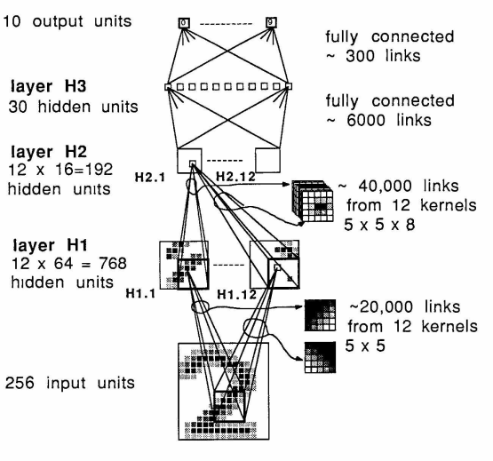
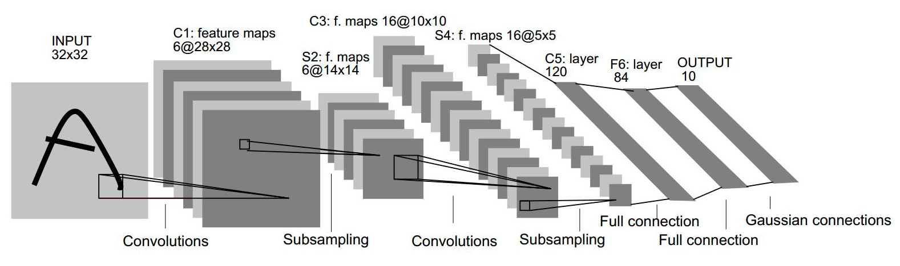
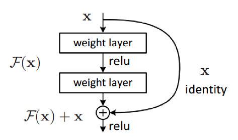
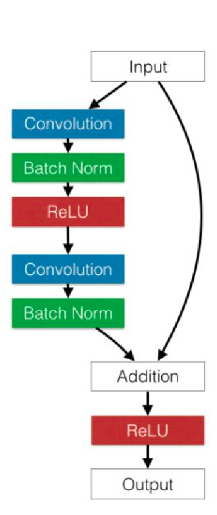
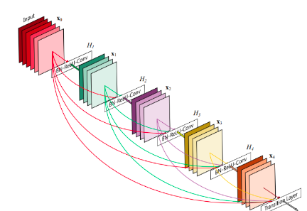
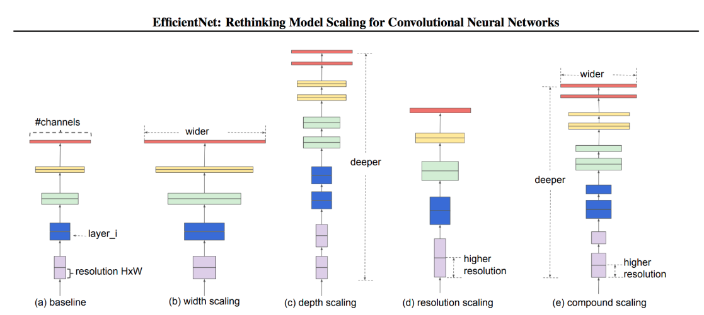

Свёрточные нейронные сети. Семейства архитектур: LeNet, AlexNet, VGG, Inception, ResNet, DenseNet, EfficientNet. {#3.03}
----------------------------------------------------------------------------------------------------------------

### LeNet

Первая современная сверточная сеть была придумана в 1989 году Яном
Лекуном и сотечает в себе все необходимые вещи, используемые и по сей
день:

-   -   

[\[fig:my\_label\]]{#fig:my_label label="fig:my_label"}

Первой известной сетью стала т.н. LeNet-5 от того же Лекуна. Изменения
по сравнению с версией 1989 года:

-   Появилось два слоя

-   Постобработка на выходе (алгоритм Витерби и т.п.)

[\[fig:my\_label\]]{#fig:my_label label="fig:my_label"}

### AlexNet

Именно AlexNet прославил СНС и положил начало их повсеместному
использованию в компьютерном зрении. ПО сравнению с LeNet, привнес
множество новых трюков.\
**Особенности AlexNet**

-   Использование ReLU вместо sigmoid. Оказывается, если отказаться от
    классических на тот момент (2012) функций активации (simoid, tanh),
    то можно ускорить обучение СНС на порядок.

-   Локальная нормализация активаций. Нормализуются карты активаций.

-   Субдискретизация с перекрытием. Обычно субдискретизация (пулинг)
    используется с окном размера $z=n$ и сдвигом (страйдом), равным
    размеру окна, т.е. $s=n$. Однако, в AlexNet применяется пулинг с
    перекрытием в одну клетку, т.е. $z=n, s=n-1$.

-   обучающей выборки

-   для уменьшения переобучения. Использовалось значение $p=0.5$ на
    полносвязных слоях, на сверточных дропаут обычно не используется. Он
    помог с переобучением, но при этом время обучения возросло в
    $\frac{1}{p}=2$ раза.

-   Аугментация на тесте

[\[fig:my\_label\]]{#fig:my_label label="fig:my_label"}

**Инициализация и оптимизатор**

-   Веса сверток задаются случайными числами из нормального
    распределения с нулевым средним и среднеквадратичным отклонением
    $0.01$

-   Коэффициент сдвига в некоторых слоя инициализируется нулем, в
    некоторых (напр. полносвязных) - единицей

-   Динамическое управление коэффициентом скорости обучения: коэффициент
    делится на 10, когда качество перестает улучшаться на валидационной
    выборке

-   Оптимизатор - momentum (накопление градиента)

-   $L_2$-регуляризация веса (weight decay)

### VGG

-   Предложена в **V**isual **G**eometry **G**roup (университет
    Оксфорда).

-   Идея простой и глубокой сверточной сети доведена до макисмума.

    -   Существуют 2 версии: VGG-16 и VGG-19 (по числу слоев с
        обучаемыми весами)

    -   Содержит огромное число параметров (138 млн и 144 млн),
        дальнейшее увеличение глубины и параметров не дало прироста на
        ImageNet

-   Используются только стандартные свертки размера $3\times 3$ (к
    примеру, в AlexNet первые две свертки были размеров $11\times 11$ и
    $5\times 5$ )

-   Входной размер $224\times 224$

[\[fig:my\_label\]]{#fig:my_label label="fig:my_label"}

### Inception

Мотивация - хочется сделать глубокую НС, но простое добавление слоев,
как в VGG не дает прироста в качестве.\
Особенности:

-   Разреженная архитектура.

    -   Проблема: линейное наращивание сверточных слоев достаточно
        быстро себя исчерпывает (вспомним VGG).

    -   Идея: использование нелинейной разреженной архитектуры

-   Конкатенация фильтров

    -   Проблема: при линейной структуре у нас признаки с рецептивного
        поля (область, которая участвует в вычислении данного нейрона)
        одного размера (ограниченного размером свертки)

    -   Идея: конкатенировать выходы сверток разного размера на слоях
        одной глубины

-   Уменьшение сложности

    -   Проблема: при большом количестве карт много вычислений свертки

    -   Идея: с помощью свертки $1\times 1$ предварительно уменьшить
        количество карт

[\[fig:my\_label\]]{#fig:my_label label="fig:my_label"}

Сеть Inception состоит из множества Inception-блоков.

**Inception. Детали архитектуры.**

-   Количество составных блоков около 100

-   Глубина 27 слоев, из них 22 - с обучаемыми параметрами

-   Перед последним полносвязным слоем - GAP

-   Введены два дополнительных классификатора в середине сети (борьба с
    затухающим градиентом, регуляризация)

-   Функции потерь для дополнительных классификаторов домножаются на
    $0.3$

-   Используется дропаут

[\[fig:my\_label\]]{#fig:my_label label="fig:my_label"}

### ResNet {#ResNet}

При увеличении \"плоских\" слоев в стиле VGG качество сети падает, а не
растет (даже на обучающей выборке, не говоря уже о тестовой). При
большой глубине НС возникает проблема затухающего градиента, таким
образом, сеть перестает обучаться.

Будем вместо целевой функции $H(x)$ обучать остаточную
(residual$\Rightarrow$ ResNet) функцию $F(x)=H(x)-x$, а целевую
рассчитывать как поточечную сумму входа $x$ и остаточной функции
$F(x): H(x)=F(x)+x$.

[\[fig:my\_label\]]{#fig:my_label label="fig:my_label"}

Таким образом мы дополнительно прокидываем тождественные связи
(identity) между входом и выходом остаточной функции (боремся с
затухающим градиентом). Эти тождественные связи носят название
\"skip-connections\" или \"short-cuts\".

-   Наиболее известны следующие разновидности ResNet (по числу
    сверточных слоев): ResNet-18, ResNet-34, ResNet-50, ResNet-101,
    ResNet-152

-   Для более глубоких сетей используется большее число карт признаков
    $\Rightarrow$ многократно возрастает количество весов фильтров и
    число операций

-   Авторы предлагают использовать дизайн бутылочного горлышка
    (bottleneck) - сначала уменьшить кол-во карт с помощью сверток
    $1\times 1$, затем применить обычную свертку $3\times 3$, и,
    наконец, вернуть кол-во карт свертками $1\times 1$. (Отчасти
    процедура схожая с такой же в Inception)

[\[fig:my\_label\]]{#fig:my_label label="fig:my_label"}

**Архитектурные особенности**

-   Перед последним полносвязным слоем применяется GAP (Global Average
    Pooling)

-   Принцип сохранения сложности (уменьшаем пространственный размер в 2
    раза $\Rightarrow$ одновременно увеличиваем в 2 раза кол-во карт
    признаков)

-   Почти везде уменьшение размерности через свертки с шагом (stride) =
    2

-   BatchNorm используется после каждой свертки

[\[fig:my\_label\]]{#fig:my_label label="fig:my_label"}

[\[fig:my\_label\]]{#fig:my_label label="fig:my_label"}

### DenseNet

Нужно больше соединений!

-   Было предложено в рамках слоев одинакового пространственного
    разрешения использовать вообще все возможные связи с помощью
    конкатенции.

-   Таким образом, если слоев $L$, то таких связей будет $L(L-1)/2$

-   DenseNet выигрывает у ResNet

[\[fig:my\_label\]]{#fig:my_label label="fig:my_label"}

### EfficientNet

Основная информация: сеть подбирается автоматически (с помощью
специального фремворка) по сетке параметров. Нужна быстрая и легкая
сеть\
Проблема: нужно оптимизировать сверточную нейронную сеть. Предыдущие
методы произвольно масштабировали размерность нейросети (например,
количество слоев и параметров). Предложенный метод равномерно
масштабирует части нейросети с фиксированными коэффициентами
масштабирования. Оптимизированные сети (EfficientNets) обходят
state-of-the-art подходы по точности при увеличении эффективности в 10
раз (меньше и быстрее).\
Эффективность масштабирования нейросети зависит от ее начальной
архитектуры. Чтобы улучшить работу нейросети, исследователи выбирали
начальную архитектуру автоматически с помощью AutoML фреймворка ---
MNAS. MNAS при выборе устройства нейросети оптимизирует и точность
модели, и ее размер одновременно. В итоге начальная модель использовала
архитектуру MBConv, схожую с MobileNetV2 и MnasNet. Начальная модель
затем масштабировалась и породила класс EfficientNets моделей.

[\[fig:my\_label\]]{#fig:my_label label="fig:my_label"}

Оптимизируются следующие параметры:

-   Глубина: $d=\alpha^{\Phi}$

-   Ширина: $w=\beta^{\Phi}$

-   Разрешение (resolution): $r=\gamma^{\Phi}$

-   s.t.
    $\alpha\cdot\beta^{2}\cdot\gamma^{2}\approx 2, \alpha\geq 1, \beta\geq 1, \gamma\geq 1$ -
    должно соблюдаться соотношение, выведенное эмпирическим путем
    (обоснования нет)

Шаги:

-   Шаг 1: для $\Phi=1.0$ параметры подбираются перебором по сетке:
    $\alpha=1.2, \beta=1.1, \gamma=1.15$

-   Шаг 2: При фиксированных $\alpha=1.2, \beta=1.1, \gamma=1.15$, меняя
    $\Phi$ получаем большие модели.
