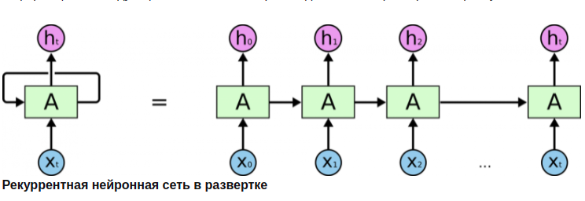
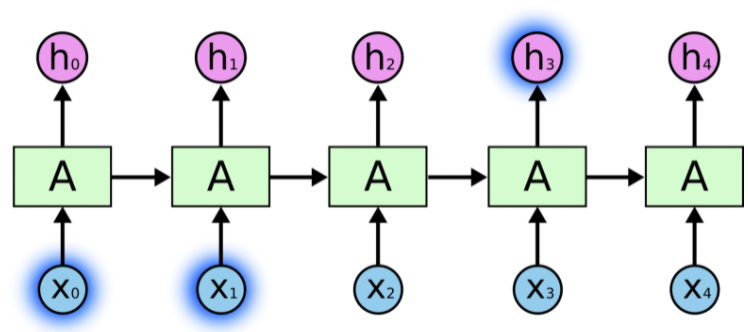
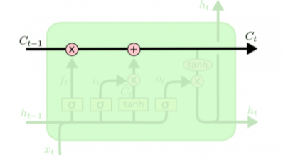
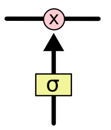
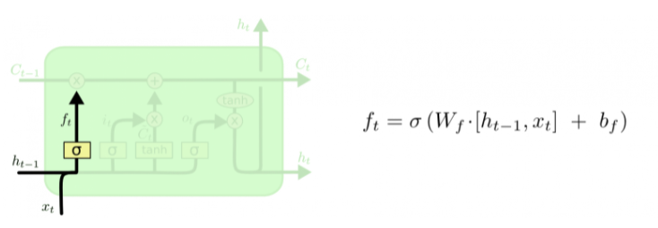
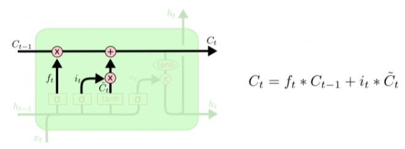
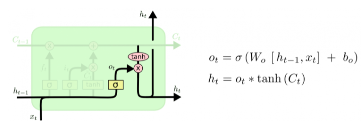
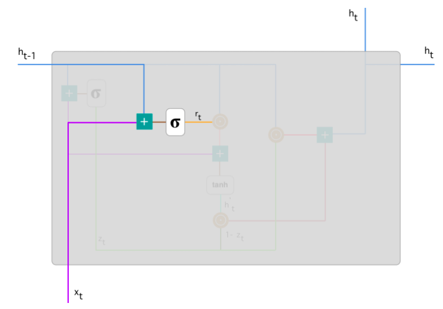
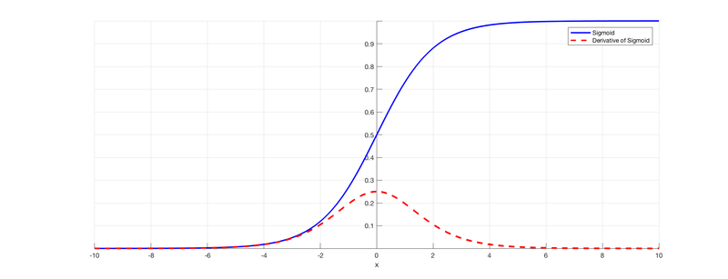

Рекуррентные нейронные сети. Архитектуры RNN, GRU, LSTM. Затухание градиента, взрыв градиента. Градиентный клиппинг. {#3.05}
--------------------------------------------------------------------------------------------------------------------

### RNN

Люди, читая текст, понимают каждое слово, основываясь на понимании
предыдущего слова. Традиционные нейронные сети не обладают этим
свойством, и в этом их главный недостаток. Представим, например, что мы
хотим классифицировать события, происходящие в фильме. Непонятно, как
традиционная нейронная сеть могла бы использовать рассуждения о
предыдущих событиях фильма, чтобы получить информацию о последующих.\
Решить эту проблемы помогают рекуррентые нейронные сети (Recurrent
Neural Networks, RNN). Это сети, содержащие обратные связи и позволяющие
сохранять информацию.

[\[fig:my\_label\]]{#fig:my_label label="fig:my_label"}

В рекуррентных сетях циклы разрешены. В этом случае выход нейрона может
быть подключен к его входу, ко входу всех нейронов в текущем слое, и ко
входу любого другого нейрона в другом слое. Рекуррентная сеть хорошо
подходит именно для анализа последовательностей потому что у нее есть
циклические соединения, через которые поступает информация о том, что
было на предыдущем шаге работы сети (память) или даже на нескольких
предыдущих шагах. Таким образом, РНС могут анализировать текст не как
набор изолированных токенов, а как последовательность.

### Как работает РНС? Разворачивание по времени:

Рекуррентную сеть можно рассматривать, как несколько копий одной и той
же сети, каждая из которых передает информацию последующей копии. На
вход копий нейронной сети поступают элементы последовательности. На вход
первой копии поступает первый элемент последовательности, на вход второй
копии - второй элемент и т.д. пока не дойдем до последней копии. На
выходе получаем два значения: выходное (a), и значение h, которое
поступает на вход копии сети в следующий момент времени - скрытое
состояние, которое учитывает то, что было на предыдущих этапах анализа
последовательности. Копия НС в следующий момент времени на сход получает
второй элемент последовательности, а также скрытое состояние с
предыдущего этапа и анализирует, выдавая снова два значения и т.д., пока
не дойдем до последнего элемента данной последовательности. Для него РНС
выдает только одно выходное значение без скрытого состояния.\
В отличие от полносвязной НС, РНС может работать с последовательностями
входных данных любой длины.

[\[fig:my\_label\]]{#fig:my_label label="fig:my_label"}

### Проблемы рекуррентных сетей: 

1.  Обучение требует длительного времени

2.  Проблема .

3.  Ограниченная длительность запоминания предыдущей информации

Иногда для выполнения текущей задачи нам необходима только недавняя
информация. Рассмотрим, например, языковую модель, пытающуюся
предсказать следующее слово на основании предыдущих. Если мы хотим
предсказать последнее слово в предложении "облака плывут по небу", нам
не нужен более широкий контекст; в этом случае довольно очевидно, что
последним словом будет "небу". В этом случае, когда дистанция между
актуальной информацией и местом, где она понадобилась, невелика, RNN
могут обучиться использованию информации из прошлого.

[\[fig:my\_label\]]{#fig:my_label label="fig:my_label"}

Но бывают случаи, когда нам необходимо больше контекста. Допустим, мы
хотим предсказать последнее слово в тексте "Я вырос во Франции \<много
текста\> Я бегло говорю по-французски". Ближайший контекст (Я бегло
говорю) предполагает, что последним словом будет называние языка, но
чтобы установить, какого именно языка, нам нужен контекст Франции из
более отдаленного прошлого. Таким образом, разрыв между актуальной
информацией и точкой ее применения может стать очень большим.\
К сожалению, по мере роста этого расстояния, RNN теряют способность
связывать информацию.

[\[fig:my\_label\]]{#fig:my_label label="fig:my_label"}

### LSTM

Долгая краткосрочная память (Long short-term memory; LSTM) -- особая
разновидность архитектуры рекуррентных нейронных сетей, способная к
обучению долговременным зависимостям. Они прекрасно решают целый ряд
разнообразных задач и в настоящее время широко используются.\
Любая рекуррентная нейронная сеть имеет форму цепочки повторяющихся
модулей нейронной сети . В обычной RNN структура одного такого модуля
очень проста, например, он может представлять собой один слой с функцией
активации tanh (гиперболический тангенс) (Рис.
[1](#fig:rnn){reference-type="ref" reference="fig:rnn"}).\

![Повторяющийся модуль в стандартной RNN состоит из одного
слоя.[]{label="fig:rnn"}](images/rnn5.png){#fig:rnn}

Структура LSTM также напоминает цепочку, но модули выглядят иначе.
Вместо одного слоя нейронной сети они содержат целых четыре, и эти слои
взаимодействуют особенным образом.

![Повторяющийся модуль в LSTM сети состоит из четырех взаимодействующих
слоев.[]{label="fig:LSTM"}](images/rnn6.png){#fig:LSTM}

На Рис. [2](#fig:LSTM){reference-type="ref" reference="fig:LSTM"} каждая
линия переносит целый вектор от выхода одного узла ко входу другого.
Розовыми кружочками обозначены поточечные операции, такие, как сложение
векторов, а желтые прямоугольники -- это обученные слои нейронной сети.
Сливающиеся линии означают объединение, а разветвляющиеся стрелки
говорят о том, что данные копируются и копии уходят в разные компоненты
сети.

### Основная идея LSTM

Ключевой компонент LSTM -- это состояние ячейки (cell state) --
горизонтальная линия, проходящая по верхней части схемы.\
Состояние ячейки напоминает конвейерную ленту. Она проходит напрямую
через всю цепочку, участвуя лишь в нескольких линейных преобразованиях.
Информация может легко течь по ней, не подвергаясь изменениям.

[\[fig:my\_label\]]{#fig:my_label label="fig:my_label"}

Тем не менее, LSTM может удалять информацию из состояния ячейки; этот
процесс регулируется структурами, называемыми фильтрами (gates).\
Фильтры позволяют пропускать информацию на основании некоторых условий.
Они состоят из слоя сигмоидальной нейронной сети и операции поточечного
умножения.\

[\[fig:my\_label\]]{#fig:my_label label="fig:my_label"}

Сигмоидальный слой возвращает числа от нуля до единицы, которые
обозначают, какую долю каждого блока информации следует пропустить
дальше по сети. Ноль в данном случае означает "не пропускать ничего",
единица -- "пропустить все".\
В LSTM три таких фильтра, позволяющих защищать и контролировать
состояние ячейки.

### Пошаговый разбор LSTM

Первый шаг в LSTM -- определить, какую информацию можно выбросить из
состояния ячейки. Это решение принимает сигмоидальный слой, называемый
"слоем фильтра забывания" (forget gate layer). Он смотрит на $h_{t-1}$ и
$x_t$ и возвращает число от 0 до 1 для каждого числа из состояния ячейки
$C_{t-1}$. 1 означает "полностью сохранить", а 0 -- "полностью
выбросить".\
Вернемся к нашему примеру -- языковой модели, предсказывающей следующее
слово на основании всех предыдущих. В этом случае состояние ячейки
должно сохранить существительного, чтобы затем использовать местоимения
соответствующего рода. Когда мы видим новое существительное, мы можем
забыть род старого.

[\[fig:my\_label\]]{#fig:my_label label="fig:my_label"}

Следующий шаг -- решить, какая новая информация будет храниться в
состоянии ячейки. Этот этап состоит из двух частей. Сначала
сигмоидальный слой под названием "слой входного фильтра" (input layer
gate) определяет, какие значения следует обновить. Затем tanh-слой
строит вектор новых значений-кандидатов $\tilde{C}_t$, которые можно
добавить в состояние ячейки.\
В нашем примере с языковой моделью на этом шаге мы хотим добавить род
нового существительного, заменив при этом старый.

[\[fig:my\_label\]]{#fig:my_label label="fig:my_label"}

Настало время заменить старое состояние ячейки $C_{t-1}$ на новое
состояние $C_t$. Что нам нужно делать --- мы уже решили на предыдущих
шагах, остается только выполнить это.\
Мы умножаем старое состояние на $f_t$, забывая то, что мы решили забыть.
Затем прибавляем $i_t*\tilde{C}_t$. Это новые значения-кандидаты,
умноженные на $t$ -- на сколько мы хотим обновить каждое из значений
состояния.\
В случае нашей языковой модели это тот момент, когда мы выбрасываем
информацию о роде старого существительного и добавляем новую информацию.

[\[fig:my\_label\]]{#fig:my_label label="fig:my_label"}

Наконец, нужно решить, какую информацию мы хотим получать на выходе.
Выходные данные будут основаны на нашем состоянии ячейки, к ним будут
применены некоторые фильтры. Сначала мы применяем сигмоидальный слой,
который решает, какую информацию из состояния ячейки мы будем выводить.
Затем значения состояния ячейки проходят через tanh-слой, чтобы получить
на выходе значения из диапазона от -1 до 1, и перемножаются с выходными
значениями сигмоидального слоя, что позволяет выводить только требуемую
информацию.\
Мы, возможно, захотим, чтобы наша языковая модель, обнаружив
существительное, выводила информацию, важную для идущего после него
глагола. Например, она может выводить, находится существительное в
единственном или множественном числе, чтобы правильно определить форму
последующего глагола.

[\[fig:my\_label\]]{#fig:my_label label="fig:my_label"}

### GRU

**G**ated **R**ecurrent **U**nit - еще один вариант ячейки, очень
похожий на LSTM, но с меньшим количеством фильтров (двумя), а значит и
параметров. Помогает решить проблему , которая присуща обычным
рекуррентным сетям.

Для решения проблемы затухающего градиента, GRU использует т.н.
механизм, основанный на фильтрах обновления (update) и сброса (reset).
Изначально имеется два вектора, которые решают, какая информация должна
быть передана на выход. Их особенность в том, что их можно обучить
сохранять информацию, поступившую далеко в прошлом, не забывая ее и
избавляться от иррелевантной информации.

Рассмотрим ячейку GRU более подробно.

[\[fig:my\_label\]]{#fig:my_label label="fig:my_label"}

Базовые операции ячейки GRU:

[\[fig:my\_label\]]{#fig:my_label label="fig:my_label"}

**Произведение Адамара** - бинарная операция над двумя матрицами
одинаковой размерности, результатом которой является матрица той же
размерности, в которой каждый элемент с индексами $i,j$ --- это
произведение элементов с индексами $i,j$ исходных матриц. Для двух
матриц $A,B$ одинаковой размерности $m\times n$ произведение Адамара
определено как покомпонентное произведение двух матриц:
$$(A\circ B)_{i,j}=(A\odot B)_{i,j}=(A)_{i,j}\cdot (B)_{i,j}$$ Для двух
матриц, которые имеют разные размерности, произведение Адамара не
определено. Пример для матриц $3\times 3$:

[\[fig:my\_label\]]{#fig:my_label label="fig:my_label"}

**Фильтр обновления (Update Gate)** - показывает, какое количество
прошлой информации модель должна запомнить. Начинаем с вычисления
фильтра обновления $z_t$ в момент времени $t$ по формуле:
$$z_t = \sigma(W^{(z)}x_t+U^{(z)}h_{t-1})$$

[\[fig:my\_label\]]{#fig:my_label label="fig:my_label"}

Когда $x_t$ подается на вход ячейке сети, он умножается на
соответствующий вес $W^{(z)}$. Аналогично и для $h_{(t-1)}$, который
содержит информацию о предыдущих $t-1$ элементах и умножается на
соответствующий вес $U^{(z)}$. Результаты складываются и применяется
сигмоида, чтобы получить число между 0 и 1 - степень пропуска прошлой
информации (полученной в предыдущие моменты времени) вперед, в будущее.
Это работает, потому что модель может решить скопировать всю информацию
(или большую ее часть) из прошлого и уменьшить риск возникновения
затухающего градиента.\
**Фильтр сброса (Reset Gate)** - этот фильтр используется моделью для
решения того, какое количество прошлой информации нужно забыть:
$$r_t=\sigma(W^{(r)}x_t +U^{(r)}h_{t-1})$$

Данная формула аналогична формуле вычисления фильтра обновления.
Различие лишь в том, какие веса используются для ее вычисления.

[\[fig:my\_label\]]{#fig:my_label label="fig:my_label"}

**Текущее состояние памяти.** Теперь рассмотрим, как эти два фильтра
влияют на конечный выход ячейки. Начнем с фильтра сброса. Введем новое
состояние памяти, которое будет использовать фильтр сбора для хранения
релевантной информации из прошлого:
$$h^{'}_{t}=tanh(Wx_t+r_t\odot Uh_{t-1})$$

1.  Перемножаем вход $x_t$ на вес $W$ и состояние $h_{t-1}$ на вес $U$.

2.  Вычислим произведение Адамара (поэлементно) фильтра сброса $r_t$ на
    $Uh_{(t-1)}$. Таким образом определяется сколько нужно удалить
    информации с предыдущих шагов. К примеру, решается задача анализа
    тональности текста для определения мнения человека по поводу
    какой-либо книги. Текст начинается следующим образом: \" Это
    фэнтези-книга, в которой описано\...\" и через несколько абзацев
    сказано следующее: \"Мне не очень понравилась книга, потому что я
    думаю, что в ней слишком много деталей\". Чтобы определить общий
    уровень удовлетворения книгой, нам необходима только последняя часть
    текста. В этом случае, по мере приближения к концу текста в процессе
    обучения сеть присвоит $r_t$ близкое к нулю значение, забывая всю
    предыдущую информацию и фокусируясь только на последних
    предложениях.

3.  Просуммировать п.1 и п.2

4.  Применить нелинейную функцию активации - гиперболический тангенс.

[\[fig:my\_label\]]{#fig:my_label label="fig:my_label"}

**Финальное состояние памяти в текущий момент времени**

В конце сети необходимо вычислить $h_t$ - вектор, который содержит
информацию от текущего элемента и передает ее вперед по сети. Для этого
необходим фильтр обновления, который определяет, что взять из текущего
состояния $h^{'}_{t}$, а что из предыдущих шагов - $h_{(t-1)}$:
$$h_t=z_t\odot h_{t-1}+(1-z_t)\odot h^{'}_t$$ Рассмотрим пример с
книгой, только в этот раз самая релевантная информация расположена в
начале текста. Модель в процессе обучения устанавливает значение $z_t$,
близкое к 1 и сохраняет большую часть предыдущей информации. Т.к. $z_t$
будет близко к 1 в текущий момент времени, $(1-z_t)$ будет близко к 0,
что позволит игнорировать большую часть текущей информации (в нашем
случае, это конец текста), которая не актуальна для предсказания.

[\[fig:my\_label\]]{#fig:my_label label="fig:my_label"}

### Взрыв градиента, затухание градиента {#3.05.03}

В процессе обратного распространения ошибки при прохождении через слои
нейронной сети в элементах градиента могут накапливаться большие
значения, что будет приводить к сильным изменениям весов. Это в свою
очередь может сделать нестабильным алгоритм обучения нейронной сети. В
таком случае элементы градиента могут переполнить тип данных, в котором
они хранятся. Такое явление называется **взрывающимся градиентом**
(англ. exploding gradient).

### Признаки, указывающие на взрывающийся градиент

-   Высокое значение функции потерь

-   Модель нестабильна, что отражается в значительных скачках значения
    функции потерь

-   Функция потерь принимает значение NaN

-   Веса модели растут экспоненциально

-   Веса модели принимают значение NaN

Существует аналогичная обратная проблема, когда в процессе обучения при
обратном распространении ошибки через слои нейронной сети градиент
становится все меньше. Это приводит к тому, что веса при обновлении
изменяются на слишком малые значения, и обучение проходит неэффективно
или останавливается, то есть алгоритм обучения не сходится. Это явление
называется **затухающим градиентом** (англ. vanishing gradient).

### Признаки, указывающие на затухающий градиент

-   Точность модели растет медленно

-   Градиент ближе к концу показывает более сильные изменения, в то
    время как градиент ближе к началу почти не показывает никакие
    изменения.

-   Веса модели уменьшаются экспоненциально во время обучения.

-   Веса модели растут экспоненциально

-   Веса модели стремятся к 0 во время обучения

### Причины

Такая проблема может возникнуть при использовании нейронных сетях
классической функции активации - сигмоиды:
$$\sigma(x)=\frac{1}{1+e^{-x}}$$

Эта функция часто используется, поскольку множество ее возможных
значений --- отрезок $[0,1]$ --- совпадает с возможными значениями
вероятностной меры, что делает более удобным ее предсказание.

[\[fig:sig\_deriv\]]{#fig:sig_deriv label="fig:sig_deriv"}

Пусть сеть состоит из подряд идущих нейронов с функцией активации
$\sigma(x)$

-   функция потерь $L(y)=MSE(y,\overline{y} )=(y−\overline{y})^2$

-   $u_d$ --- значение, поступающее на вход нейрону на слое $d$

-   $w_d$ --- вес нейрона на слое $d$

-   $y$ --- выход из последнего слоя

Оценим частные производные по весам такой нейронной сети на каждом слое.
Оценка для производной сигмоиды видна из Рис.
[\[fig:sig\_deriv\]](#fig:sig_deriv){reference-type="ref"
reference="fig:sig_deriv"}

$$\frac{\partial(L(y))}{\partial(w_d)} = \frac{\partial(L(y))}{\partial(y)}\cdot \frac{\partial(y)}{\partial(w_d)} = 2(y-\overline{y})\cdot\sigma^{'}(w_du_d)u_d\leq 2(y-\overline{y})\cdot \frac{1}{4}u_d$$
$$\frac{\partial(L(y))}{\partial(w_{d-1})} = \frac{\partial(L(y))}{\partial(w_d)}\cdot \frac{\partial(w_d)}{\partial(w_{d-1})} = 2(y-\overline{y})\cdot(\frac{1}{4})^2u_{d}u_{d-1}$$

и т.д.\
Откуда видно, что оценка элементов градиента растет экспоненциально при
рассмотрении частных производных по весам слоев в направлении входа в
нейронную сеть (уменьшения номера слоя). Это в свою очередь может
приводить либо к экспоненциальному росту градиента от слоя к слою, когда
входные значения нейронов --- числа, по модулю большие 1, либо к
затуханию, когда эти значения --- числа, по модулю меньшие 1.

В частности, сигмоида насыщается при стремлении аргумента к $+\infty$
или $-\infty$, то есть имеет там конечный предел. Это приводит к тому,
что более отдаленные слои обучаются медленнее, так как увеличение или
уменьшение аргумента насыщенной функции вносит малые изменения, и
градиент становится все меньше. Это и есть проблема затухающего
градиента.

### Способы устранения

-   Использование другой функции активации

-   Изменение модели - сокращение числа слоев. Это связано с тем, что
    частные производные по весам растут экспоненциально в зависимости от
    глубины слоя. В рекуррентных нейронных сетях можно воспользоваться
    техникой обрезания обратного распространения ошибки по времени,
    которая заключается в обновлении весов с определенной
    периодичностью.

-   Использование

-   Регуляризация весов

-   

### Градиентный клиппинг {#3.05.12}

Обрезание заключается в ограничении нормы градиента. То есть если норма
градиента превышает заранее выбранную величину $T$, то следует
масштабировать его так, чтобы его норма равнялась этой величине:

$$\nabla_{clipped} = 
 \begin{cases}
   \nabla, & ||\nabla||\leq T, \\
   \frac{T}{||\nabla||}\cdot\nabla, &\text{иначе}
 \end{cases}$$
