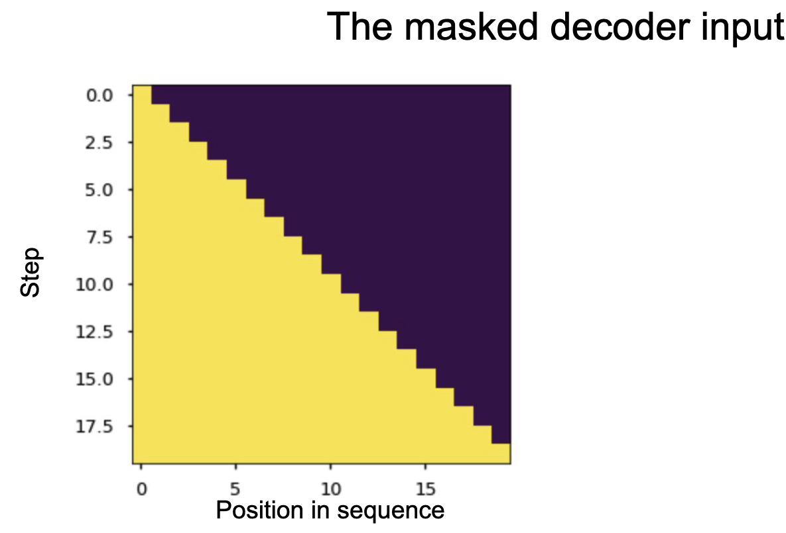

Механизм внимания. Self-Attention, Multi-head-attention. Маскированное внимание. Архитектура трансформер и использование механизма внимания в ней. Современные языковые модели: двунаправленные энкодеры (BERT), генеративные трансформеры (GPT). {#3.06}
-------------------------------------------------------------------------------------------------------------------------------------------------------------------------------------------------------------------------------------------------

Рассмотрим задачу машинного перевода, т.е. нам нужно перевести фрагмент
текста с одного языка на другой, например, с английского на русский.
Подход, используемый в нейросетевой архитектуре для машинного перевода
называется *sequence-to-sequence (seq2seq)*.

### Простейшая нейросетевая архитектура

[Encoder]{style="color: myblue"}-[Decoder]{style="color: mygreen"}
архитектура состоит из $2$-ух RNN сетей
(рисунок [\[ris:seq2seq\_basic\]](#ris:seq2seq_basic){reference-type="ref"
reference="ris:seq2seq_basic"}):

-   Первая ([голубая]{style="color: myblue"}) -- рекуррентная нейронная
    сеть. Как мы помним, каждое следующее скрытое состояние обусловлено
    на все предыдущие, то есть на весь левый контекст. Поэтому последний
    синий вектор для слова\
    textit\"great\" кодирует весь текст, который мы подали на вход нашей
    архитектуре. Так давайте тогда возьмем этот вектор и воспользуемся
    им как закодированной информацией той фразы, которую мы хотим
    перевести -- передадим его в декодер (зеленая сеть).

-   Вторая ([зелёная]{style="color: mygreen"}) -- рекуррентная нейронная
    сеть. Ей в начало приходит скрытое состояние - закодированная фраза
    из предыдущего пункта и \<SOS\> (Start of sequence) токен. Далее мы
    генерируем слово и передаём его на вход следующего этапа. Таким
    образом мы разворачиваем закодированный вектор из енкодера и
    получаем требуемый перевод.

Часто сначала учат генерировать текст энкодер и декодер на
соответствующих языках по отдельности. Потом соединяют их как тут и
дообучают под перевод.

Причём все это обучается end-to-end. На
рисунке [\[ris:seq2seq\_loss\]](#ris:seq2seq_loss){reference-type="ref"
reference="ris:seq2seq_loss"} Нужен только размеченный датасет с
переводами, что не проблема, так как много уже переведенных текстов,
например, можно взять \"Войну и Мир\" на русском и английском языке.

{width="17.0cm"}

[\[ris:seq2seq\_basic\]]{#ris:seq2seq_basic label="ris:seq2seq_basic"}

{width="17.0cm"}

[\[ris:seq2seq\_loss\]]{#ris:seq2seq_loss label="ris:seq2seq_loss"}

### Механизм внимания. Attention

Проблема предыдущего подхода заключается в том, что декодер
обуславливается на состояние, кодирующее весь входной текст. Если
входной текст будет достаточно большой, то его embedding будет
малоинформативным.

Вспомним, как мы переводим предложения с одного языка на другой -- мы
пытаемся построить некоторое отображение слов предложения в слова
другого языка с учётом правил грамматики. Мы обращаем *внимание* на то,
какое слово из предложения мы сейчас переводим.

Давайте ровно так же, при переводе каждого следующего слова будем
обращать внимание на слова исходной фразы, причём большее внимание
обращать на то слово, которое пытаемся перевести прямо сейчас.

-   Обозначим скрытые состояния (hidden states)
    [энкодера]{style="color: myblue"} как
    $\mathbf{h}_1, \mathbf{h}_2, \dots \mathbf{h}_N \in \mathbb{R}^k$.

-   Обозначим скрытое состояние (hidden states)
    [декодера]{style="color: mygreen"} в момент времени $t$ как
    $s_t \in \mathbb{R}^k$.

-   Тогда мы можем вычислить то, насколько текущее слово, которое мы
    пытаемся перевести похоже на слова из входного текста. Для этого мы
    можем вычислить некоторую меру сходства между $s_t$ и каждым из
    $\mathbf{h}_1, \mathbf{h}_2, \dots \mathbf{h}_N$, например, вычислив
    скалярное произведение между векторами. Вычисленные меры сходства
    называются *attention scores*
    (рисунок [\[ris:attention\_01\]](#ris:attention_01){reference-type="ref"
    reference="ris:attention_01"}). Обозначим полученный вектор сходств
    как $e_t = [s_t^T\mathbf{h}_1, \dots s_t^T\mathbf{h}_N]$.

-   Нам привычнее работать с вероятностями, поэтому возьмем softmax от
    *attention scores* $e_t$ и получим *attention distribution vector*
    $\alpha_t = softmax(e_t)$.

-   А теперь давайте агрегируем все векторы входных слов с весами,
    полученные из *attention distribution vector*:
    $\mathbf{a}_t = \displaystyle\sum_{i=1}^{N}\alpha_{t, i}\mathbf{h}_i \in \mathbb{R}^k$.
    А затем приконкатенируем его к текущему скрытому состоянию
    переводимого слова $s_t$, чтобы мы могли обуславливаться на входные
    слова с учетом внимания.

{width="10.0cm"}

[\[ris:attention\_01\]]{#ris:attention_01 label="ris:attention_01"}

### Self-Attention

Идея с механизмом внимания в рекуррентных сетях крутая. А можно ли без
рекуррентных сетей?

*Self-Attention* -- механизм, который используется для того, чтобы
находить значимость любых элементов последовательности друг для друга.
Для примера, рассмотрим предложение \"The animal didn't cross the street
because it was too tired\"
(рисунок [1](#ris:attention2){reference-type="ref"
reference="ris:attention2"}).

![*Self-Attention* позволяет находить значимость любых элементов
последовательности друг для
друга.[]{label="ris:attention2"}](images/attention2.png){#ris:attention2
width="10.0cm"}

Стоит обратить внимание на то, что у нас есть некоторая
\"направленность\". То есть когда мы говорим о значимости связи
$\text{element}_1\text{ и element}_2$, это не то же самое, что и связь
$\text{element}_2\text{ и element}_1$. Для того чтобы различать эти
случаи, введем направление для каждого элемента последовательности с
помощью двух векторов: [query]{style="color: mypurpur"} -- откуда и
[key]{style="color: myorange"} -- куда. Кроме того для каждого элемента
введём вектор [value]{style="color: myblue"}, который будем обозначать
смысл слова в отрыве от контекста, самого по себе.

![*Self-Attention*. У каждого слова есть его embedding, мы тренируем три
матрицы [$W^Q$]{style="color: mypurpur"},
[$W^K$]{style="color: myorange"}, [$W^V$]{style="color: myblue"}, чтобы
умножая на них вектор embedding мы переходили в пространства, с
векторами [query]{style="color: mypurpur"},
[key]{style="color: myorange"},
[value]{style="color: myblue"}[]{label="ris:attention3"}](images/attention3.png){#ris:attention3
width="16.0cm"}

![*Self-Attention*. Вычисляем score как скалярное произведение
[query]{style="color: mypurpur"} текущего слова и
[key]{style="color: myorange"} другого, нормализуем, берем софтмакс,
[value]{style="color: myblue"} вектор, суммируем по всем таким
результатам с [key]{style="color: myorange"} других векторов, получаем
новый вектор z для каждого элемента последовательности. Это результат
*Self-Attention*
слоя.[]{label="ris:attention4"}](images/attention4.png){#ris:attention4
width="10.0cm"}

### Multi-head-attention

*Multi-head-attention* -- это много *Self-Attention* (как много фильтров
в свертках), каждая из голов может выполняться параллельно, в чем
большое преимущество над RNN. Зачем? -- между словами можно пытаться
уловить зависимости разного рода, каждую из таких зависимостей будет
пытаться уловить свой *Self-Attention*.

![*Multi-head-attention*[]{label="ris:attention5"}](images/attention5.png){#ris:attention5
width="17.0cm"}

### Трансформер

![Архитектура
трансформер.[]{label="ris:transformer"}](images/transformer.png){#ris:transformer
width="14.0cm"}

{width="17.0cm"}

[\[ris:transformer\_encoder\]]{#ris:transformer_encoder
label="ris:transformer_encoder"}

Декодер в
трансформере(рисунок [\[ris:transformer\_decoder\]](#ris:transformer_decoder){reference-type="ref"
reference="ris:transformer_decoder"}) очень похож на энкодер, но только
в нём используются key и value из энкодера, а query из самого декодера,
это нужно для того, чтобы использовать внимание как в seq2seq модели с
двумя RNN.

{width="17.0cm"}

[\[ris:transformer\_decoder\]]{#ris:transformer_decoder
label="ris:transformer_decoder"}

Кроме того используется
маскирование(рисунок [\[ris:masked\_decoder\]](#ris:masked_decoder){reference-type="ref"
reference="ris:masked_decoder"}), для того, чтобы декодер не подглядывал
на все предложение, а считал внимание только на текущей обработанной
части фразы. Для этого зануляются вектора тех элементов, до которых
декодер ещё не дошел на этой итерации.

{width="13.0cm"}

[\[ris:masked\_decoder\]]{#ris:masked_decoder
label="ris:masked_decoder"}

### BERT

Взяли энкодер часть из трансформера, добавили несколько модификаций и
назвали это дело BERT-ом. \[CLS\] токен в начале, в нём по результатам
будет все скрытое представление входного текста. Далее маскируем один
токен из на входе \[MASK\], и пытаемся предсказать его на выходе. Таким
образом производим обучение.

![BERT. Прдсказывание \[MASK\]
слова[]{label="ris:BERT"}](images/BERT-language-modeling-masked-lm.png){#ris:BERT
width="16.0cm"}

Можно еще предсказывать, что одно слово за другим по смыслу или нет:

![BERT. Предсказывание предложения одно за другим или
нет[]{label="ris:bert"}](images/bert-next-sentence-prediction.png){#ris:bert
width="16.0cm"}

![BERT. Transfer Learning. Можно сначала учить на большом корпусе решать
общую задачу, а затем дообучаться под подзадачу, в том числе используя
\[CLS\]
токен.[]{label="ris:bert-transfer-learning"}](images/bert-transfer-learning.png){#ris:bert-transfer-learning
width="16.0cm"}

### GPT

-   GPT-2 появился параллельно с BERT примерно.

-   Основан на декодере трансформера.

-   Обучим его просто предсказывать следующее слово.

-   GPT-2 на 1.5 миллиарда параметров, а GPT-3 на 150 миллиардов
    параметров.

-   Обучим на огромном массиве данных (8 миллионов веб-страниц для
    GPT-2)

![GPT-2 это декодер трансформера, а BERT это энкодер
трансформера.[]{label="ris:gpt-2-transformer-xl-bert-3"}](images/gpt-2-transformer-xl-bert-3.png){#ris:gpt-2-transformer-xl-bert-3
width="16.0cm"}
