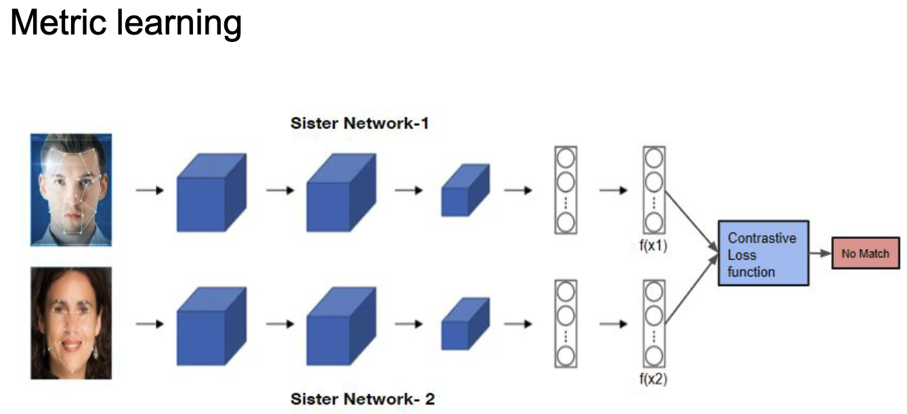

Контрастивное обучение. Примеры из компьютерного зрения и языковых задач. Сиамские сети. Функции потерь: constrastive loss, triplet loss. {#3.07}
-----------------------------------------------------------------------------------------------------------------------------------------

### Сиамская сеть

В московском метро есть системы для распознавания лиц. Людей в Москве
огромное количество, поэтому нейронные сети не решают задачу
классификации, иначе output вектор был бы огромной размерности, и меток
при обучении тоже будет очень много. Тем не менее иногда хочется
разыскивать людей или еще что. Мы можем сравнивать людей с фотографиями
в базе. Необходимо уметь отвечать на вопрос -- являются ли эти два
изображения представителями одного класса?.

*Сиамская сеть* -- это сеть, в которой два раза дублируется одна и та же
архитектура, причём веса у них общие. Входные экземпляры подаются по
одному в каждую сеть (например, две картинки). В результате получаем два
вектора embedding, которые и можно сравнить на схожесть с помощью
*constrative loss*.
Рисунок [\[ris:siamse\_network\]](#ris:siamse_network){reference-type="ref"
reference="ris:siamse_network"}.

При обучении такой сети можно аугментировать фото одного и того же
человека и ожидать на выходе метку 1 -- фото одного человека. И ожидать
метку 0 для фотографий разных людей.

{width="16.0cm"}

[\[ris:siamse\_network\]]{#ris:siamse_network
label="ris:siamse_network"}

### Constrastive loss

Для каждого фиксированного изображения -- якоря (anchor) мы можем
сопоставить изображение того же класса (positive) и изображение из
другого класса (negative). Тогда эталонный ответ в первом случае должен
быть 1, а во втором 0
(рисунок [\[ris:anchor\_pos\_neg\_example\]](#ris:anchor_pos_neg_example){reference-type="ref"
reference="ris:anchor_pos_neg_example"}). ($r$ -- embedding, $d$ --
расстояние, $margin$ -- некоторая константа, на которое хотим отделить
негативные пары)

*Constrastive loss* для сиамской сети:

$$L =
\begin{cases}
d(r_{anchor}, r_{positive}), & \text{if positive pair}\\
max(0, margin - d(r_{anchor}, r_{negative})), & \text{if negative pair}
\end{cases}$$

{width="16.0cm"}

[\[ris:anchor\_pos\_neg\_example\]]{#ris:anchor_pos_neg_example
label="ris:anchor_pos_neg_example"}

### Triplet loss

Рассмотрим теперь аналог сиамской сети -- сеть, состоящую из трёх частей
с общей архитектурой и одинаковыми весами, которая на вход принимает $3$
изображения -- якорь, изображение позитивного класса и изображение
негативного класса (рисунок [1](#ris:triplet){reference-type="ref"
reference="ris:triplet"}).

Для этой сети можно рассмотреть похожий по логике *triplet loss*:
$$L = max(0, margin + d(r_{anchor}, r_{positive}) - d(r_{anchor}, r_{negative})).$$

![Теперь не сиамская сеть, а скажем
\"тройная\"[]{label="ris:triplet"}](images/triplet.png){#ris:triplet
width="16.0cm"}
