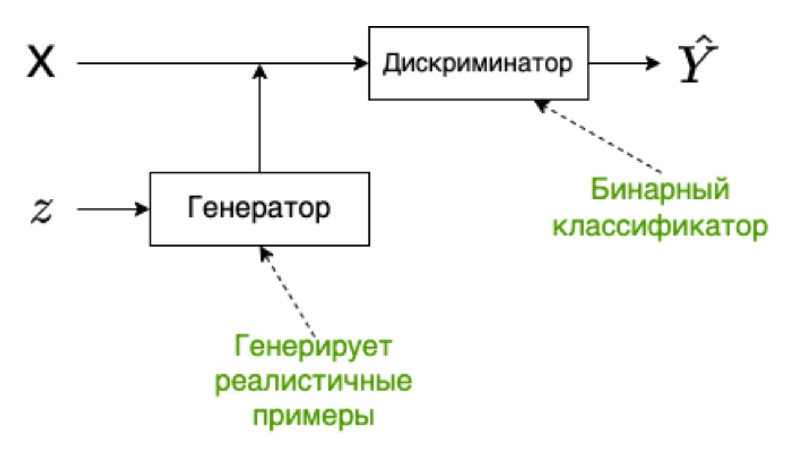

Генеративные модели в компьютерном зрении (генеративно-состязательные нейронные сети). Принцип работы генератора и дискриминатора. {#3.08}
----------------------------------------------------------------------------------------------------------------------------------

Формально задача порождающих моделей, с точки зрения максимизации
правдоподобия, выглядит следующим образом: для набора данных
$D = {x_i}^N){i=1}$ максимизировать $\Pi^N_{i=1}(x_i,\theta)$

$\underset{\theta}{\operatorname{argmax}} \sum_{i=1}^{N} \log p_{\text {model }}(x_{i}, \theta)$

Также мы можем думать о задаче максимизации правдоподобия, как о задаче
минимизации KL дивергенции (позволяет померить расстояния между
распределениями, чем оно меньше, тем лучше генерируем):

$\underset{\theta}{\operatorname{argminKL}}(P_{data}(x)||P_{model}(X,\theta)$

Таким образом мы хотим имея случайный вектор и класс $Y$ сгенерировать
синтетический пример $X$ и найти условное распределение $P (X | Y)$

Свойства, которые нужно достичь:

-   Точность (Fidelity) -- отвечает за качество генерируемых примеров,
    их реалистичность;

-   Разнообразие (Diversity) -- Генератор не должен порождать одно и
    тоже.

{width="0.7\linewidth"}

[\[ris:gen\_classification\]]{#ris:gen_classification
label="ris:gen_classification"}

### GAN

GAN - одна из наиболее эффективных архитектур для создания реалистичныйх
данных.

{width="0.5\linewidth"}

[\[ris:gan\_arc\]]{#ris:gan_arc label="ris:gan_arc"}

Состоит из двух сетей: генератора и дискриминатора.

**Генератор** -- порождает объекты в пространстве синтетических данных.
Он пытается «обмануть» дискриминатор, сделать так, что дискриминатор не
может различать распределение реальных данных и распределение
синтетических, которое порождает генератор.

**Дискриминатор** -- классификатор, который учится отличать порожденные
объекты от примеров из обучающей выборки.

### Обучение генератора и дискриминатора

Процесс обучения GAN выглядит следующим образом: создаем случайный
вектор $z$, подаем его на вход генератору, генератор порождает
синтетический пример $\hat{X}$, далее $\hat{X}$ и пример из реальных
данных $X$ подаются в дискриминатор, который выдает вероятность того
что, синтетический пример является действительно синтетическим или нет.
После чего вычисляется значение функции потерь и выполняется обратное
распространение ошибки *только для дискриминатора*, с корректировкой
весов дискриминатора.

{width="0.5\linewidth"}

[\[ris:disc\_learning\]]{#ris:disc_learning label="ris:disc_learning"}

Далее выполняется следующий шаг обучения, только на этом этапе в
дискриминатор мы подаем $\hat{X}$. В функции ошибки мы рассматриваем
только метки, которые совпали с реальными, после чего выполняем обратное
распространение ошибки *для генератора*, дискриминатор в этом процессе
не участвует. Затем корректируем веса генератора.

{width="0.5\linewidth"}

[\[ris:gen\_learning\]]{#ris:gen_learning label="ris:gen_learning"}

В процессе тренировки качество генератора и дискриминатора должно
оставаться сопоставимым, иначе если дискриминатор распознает
синтетические данные со $100\%$ вероятностью, генератор перестанет
учиться.

**Недостатки GAN**

Главным недостатком GANs является попадание модели в состояние mode
collapse. (например дискриминатор быстрее обучается (ему нужно просто
провести гиперплоскость между двумя распределениями), тогда генератор
больше не сможет обучаться, нужно искать баланс, чтобы дискриминатор
помогал обучаться генератору)

Следствие попадания в состояние mode collapse: модель постоянно
генерирует пример или примеры одного и того же класса или нескольких
классов, хотя обучалась она на примерах, размеченных для большего
количества классов.

Это проблема разнообразия (diversity). Такое происходит когда генератор
застревает в локальном минимуме и объединяет несколько мод (mode - пик в
распределении) в одну, после чего генерирует только эту моду.

Этот недостаток был связан в первую очередь с тем, что повсеместно
применяли в качестве функции ошибки бинарную перекрестную энтропию

### Лосс и метрики (в билете нет, нужно понимание на уровне идеи)

**Бинарная перекрестная энтропия** (BCE) - часто использовали, возникает
проблема с разнообразием при обучении, так как дискриминатор менее
глубокий, обычно, и учится быстрее. BCE на некоторых участках не имеет
наклона, что приводит к проблеме исчезающего градиента.

Расстояние Вассерштейна - нужно, чтобы сравнивать не метки классов, а
распределения данных.

**Earth Movers Distance** (EMD) - измеряет расстояние между двумя
распределениями и оценивает усилия, необходимые для того чтобы
генерируемое распределение сделать очень похожим на реальное.

Аппроксимацией EMD является расстояние Вассерштейна или W-loss.

$\underset{g}{\operatorname{min}}\underset{c}{\operatorname{max}} \textsce(c(x)) - \textsce(c(g(z)))$

Генератор пытается минимизировать расстояние, а critic максимизировать.
Важное требование к функции critic, она должна быть 1-L непрерывной по
Липшицу. Это означает что норма для градиента в любой точке не должна
быть больше единицы $||f(x)||_2 <= 1$

**Расстояние Фреше** или Frechet inception distance(FID), одна из
основных метрик оценки качества для GAN. Изначально эта метрика
применялась для измерения расстояния между двумя кривыми, но в
последствии стало понятно, что с помощью данной метрики можно сравнивать
распределения.

Одномерный случай:
$d(X, Y) = (\mu_x - \mu_y)^2 + (\sigma_x - \sigma_y)^2$

Базовый подход для рассчета FID, на примере генерации изображений,
содержит следующие шаги:

1\. используем предобученную на ImageNet модель строим эмбеддинги для
реальных примеров;

2\. используем предобученную на ImageNet модель строим эмбеддинги для
синтетических примеров;

3\. строим многомерные нормальные распределения для реальных и
синтетических данных;

4\. рассчитываем FID для созданных распределений.

**Inception score** Идея состоит в том что мы берем предобученный
классификатор Inceptionv3, подаем на вход сгенерированный пример и
смотрим распределение вероятностей по классам, один из классов должен
иметь макс значение, тогда у нас соблюдается точность (fidelity), а тот
факт что у других классов вероятность \> 0 говорит о разнообразии
(diversity).

Недостатки:

Не замечает проблем с разнообразием(diversity) -- к примеру модель будет
генерировать одно и тоже изображение для каждого класса, IS покажет
хорошую оценку, но в идеале GAN должен уметь генерировать несколько
разных изображений для одного класса. Это явно говорит о mode collapse.

Учитывает только сгенерированные сэмплы -- не выполняет сравнение между
реальными и сгенерированными сэмплами.
