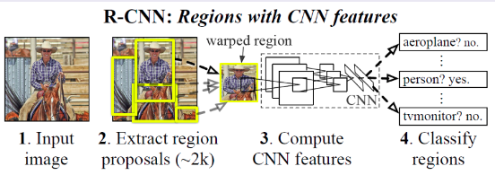
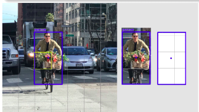

Задачи компьютерного зрения. Задачи детекции. Описание принципов работы RCNN, YOLO. Задача сегментации. Семантическая сегментация. Паноптическая сегментация. Описание принципа работы U-net. Задача распознавания лиц. Подходы для метрического обучения. {#3.10}
----------------------------------------------------------------------------------------------------------------------------------------------------------------------------------------------------------------------------------------------------------

### Задачи компьютерного зрения

Их много, основными являются те, что указаны на
рисунке [\[ris:cv\_tasks\]](#ris:cv_tasks){reference-type="ref"
reference="ris:cv_tasks"}:

{width="16cm"}

[\[ris:cv\_tasks\]]{#ris:cv_tasks label="ris:cv_tasks"}

### Задача детекции

**Недостатки классификации**

-   Классификация затруднена, если на одном изображении есть несколько
    объектов разных типов

-   Классификация не говорит от том, есть ли на изображении несколько
    объектов одного типа

-   Только классификации недостаточно для большинства приложений.

Главное отличие задачи детектирования от задачи классификации в том, что
надо не только сказать, есть ли объект на изображении, но и
**локализовать** область нахождения объекта. Если объектов несколько, то
требуется найти их все.\
**Формальное определение обнаружения объектов**

-   Вход: изображение

-   Выход (soft): набор троек \<тип объекта (object type), уверенность
    (confidence), прямоугольник (bounding box)\>

-   Для реальных приложений важнее hard-выход: набор пар \<тип объекта,
    прямоугольник\>, но для сравнения детекторов нужен soft-выход

[\[fig:my\_label\]]{#fig:my_label label="fig:my_label"}

### Метрики

**Как понять, что один метод обнаружения лучше другого?**\
Для этого используется метрика mAP - Mean Average Precision на основе
метрик : $$p = \frac{TP}{TP+FP}, r=\frac{TP}{TP+FN}$$

**Определение mAP** $$AP = \int_{0}^{1}p(r)dr$$
$$mAP = \frac{1}{n}\sum_{i=1}^{n}AP_i,$$ где $n$ - количество классов, а
$AP_i$ - $AP$ для $i$-го класса.\
*AP (Average Precision)* - вычисляется средняя точность для Recall в
диапазоне от 0 до 1 для одного класса, *mAP* - среднее значение AP по
всем классам.\
Для того, чтобы воспользоваться формулами для mAP необходимо определить
TP, FP, FN. Для этого вычислим Intersection over Union (IoU):
$$IoU=\frac{area\quad of\quad overlap}{area\quad of\quad union}$$
**TP:** IoU\>0.5;\
**FP:** IoU\<0.5 или нет пересечения, или дубликат.\
**FN:** нет обнаружения или IoU\>0.5 и неправильно определен класс
объекта;

### Нейросетевой детектор: R-CNN (Regions with CNN Features)

Детектор состоит из следующих модулей:

-   Предсказыватель объектов (около 2000 кандидатов на изображение)

-   Классификатор (без классификационной головы) для извлечения
    признаков каждого кандидата

-   Линейный SVM для классификации кандидата

[\[fig:my\_label\]]{#fig:my_label label="fig:my_label"}

**Алгоритм предсказания детекций** - selective search. В основе
алгоритма селективного поиска (selective search) лежит использование
метода иерархической группировки похожих регионов на основе соответствия
цвета, текстуры, размера или формы и графов. Для этих графов вершиной
является интенсивность текущего пикселя, а ребра соединяют пару соседних
пикселей. Абсолютная разница интенсивностей пикселей вершин используется
в качестве веса ребра. С помощью графа выделяются фрагменты, которые
затем группируются, согласно следующему принципу: ребра между двумя
вершинами в одной группе должны иметь меньшие веса, а ребра между двумя
вершинами в разных группах должны иметь больший вес. После того, как два
наиболее похожих региона сгруппированы, между полученным регионом и его
соседями вычисляется новое сходство. Процесс группировки наиболее
похожих областей повторяется до тех пор, пока все изображение не станет
одной областью. *Данный алгоритм не настраивается на данные*.\
**Backbone для извлечения признаков**

-   В качестве начальной инициализации берется классификационная сеть,
    обученная на 1000 классов из ImageNet

-   Удаляется последний слой и заменяется на слой нужного размера со
    случайной инициализацией (добавляется новый класс - фон)

-   Обучение производится на тех изображениях с разметкой, у которых
    IoU\>0.5, а остальные рассматриваются как негативные

**R-CNN: Обучение** Классификатор категорий:

-   Для каждого класса обучается свой линейный SVM (один против всех)
    Для отделения негативных примеров используется другой порог - IoU \<
    0.3 (параметр подбирается по валидации и от него очень сильно
    зависит финальный результат)

Корректировка детекций (bounding box regression):

-   Гребневая регрессия

**Достоинства и недостатки R-CNN**\
Достоинства:

-   Один из лучших методов для своего времени

-   Bounding box regression улучшает качество

-   Замена backbone на более продинутый улучшает качество

Недостатки:

-   Самый главный недостаток - скорость работы (т.к. одни и те же куски
    картинки обрабатываются много раз)

-   Сложное многоэтапное обучение

-   Обучение требует много дискового пространства и выч. ресурсов

-   Selective Search - необучаемый алгоритм

### Нейросетевой детектор YOLO

Идея:

-   Изображение покрывается сеткой $S\times S$

-   Выход сети представляет собой тензор размера
    $S\times S\times (B\cdot 5 +C)$, где $B$ - количество детекций с
    центром в этой ячейке, $C$ - количество классов

-   Детекция - это вектор $(x,y,w,h,confidence)$

-   Для всех детекций ячейки вычисляется только одно распределение по
    классам

-   Каждая ячейка предсказывает только один объект

[\[fig:my\_label\]]{#fig:my_label label="fig:my_label"}

**YOLO: Архитектура**

[\[fig:my\_label\]]{#fig:my_label label="fig:my_label"}

**Достоинства и недостатки YOLO**\
Достоинства:

-   Быстрый алгоритм, может работать в режиме реального времени

-   Все предсказания дает одна нейронная сеть, которая обучается
    end-to-end

-   Использует для предсказания всё изображение

-   Обладает хорошей обобщающей способностью

Недостатки:

-   Ограниченное количество обнаружений на ячейку

YOLO, как и большинство детекторов, может дублировать обнаружения для
одного и того же объекта. Чтобы исправить это обычно применяют алгоритм
NMS для удаления дубликатов. Такой постпроцессинг добавляет 2-3% mAP.\
Типичная реализация алгоритма выглядит следующим образом:

-   Отсортировать предсказания по confidence

-   Начиная с самых больших показателей идем по предсказаниям и удаляем
    обнаружения с тем же классом и IoU \> 0.5 с предыдущими
    предсказаниями

### Задача сегментации

При *семантической сегментации* мы каждому пикcелю изображения
присваиваем класс (котик на
рисунке [\[ris:cv\_tasks\]](#ris:cv_tasks){reference-type="ref"
reference="ris:cv_tasks"}). При *instance сегментации* мы хотим
классифицировать лишь пиксели отдельных объектов (собачки и котик на
рисунке [\[ris:cv\_tasks\]](#ris:cv_tasks){reference-type="ref"
reference="ris:cv_tasks"}). Важно отметить, что собаки при семантической
сегментации были выделены как \"DOG\", а при instance сегментации каждая
собака будет выделена отдельно. А вот *паноптическая сегментация*
объединяет в себе семантическую и instance сегментацию.

Примеры, где можно решать задачу сегментации -- беспилотные автомобили,
сегментация новообразований на снимках МРТ.

![Задача сегментации. (В данном случае семантическая сегментация),
итоговую маску можно сжать с помощью run-length encoding (то есть 5
одинаковых black пикселя будем обозначать
B5).[]{label="ris:segmentation1"}](images/segmentation1.png){#ris:segmentation1
width="16cm"}
