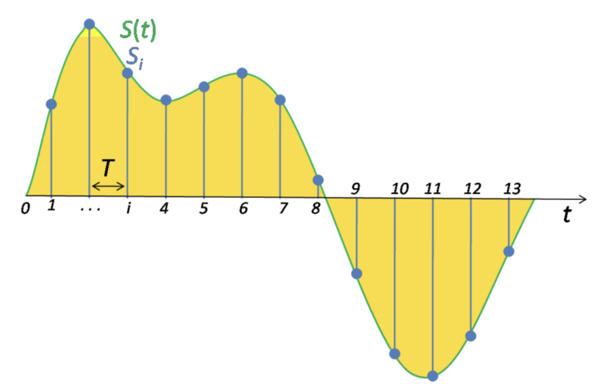
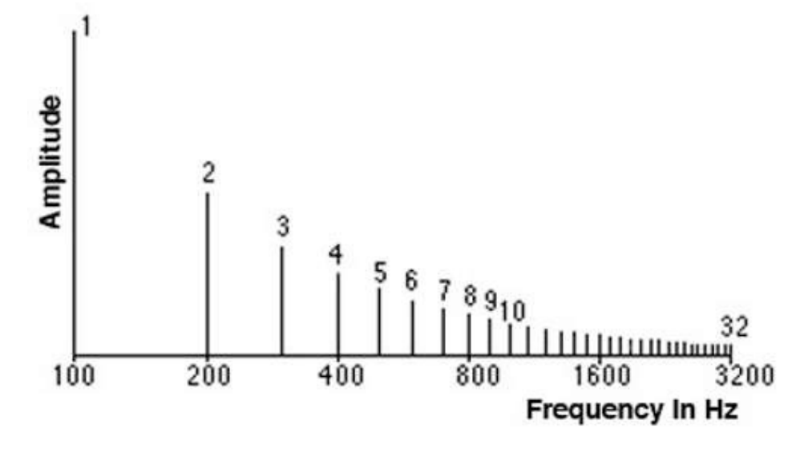

Нейросетевые модели для работы со звуком. Задача распознавания речи. Задача преобразования речи в текст. Модели Tacatron, Wave2Vec. CTC-loss. {#3.12}
---------------------------------------------------------------------------------------------------------------------------------------------

**Акустический сигнал** -- физическое явление, представляющее собой
распространение в виде упругих волн механических колебаний в твёрдой,
жидкой или газообразной среде

Сигнал часто повторяется через равные промежутки времени, так что каждая
волна имеет одинаковую форму. Высота волны показывает интенсивность
сигнала и известна как **амплитуда**. Время, которое требуется для одной
волны называется **период**. Количество волн в сигнале в секунду
называется **частотой**. Таким образом частота является обратной
величиной периода. Единицы измерения частоты -- Hertz. 1 Hz -- одно
колебание в секунду.

Для того чтобы представить сигнал в цифровом виде мы должны
преобразовать его в числовые последовательности, которые далее мы можем
использовать для обучения наших моделей. Это делается путем измерения
значения амплитуды сигнала в фикцированные интервалы времени. Каждый
такой замер называется сэмплом, а sample rate или **частота
дискретизации** -- количество таких замеров (сэмплов) в секунду. Пример:
максимальная частота дискретизации записи и воспроизведения для
мобильных устройств 22 050 Hz. Таким образом 10 секундной записи будет
соотвествовать 220 500 сэмплов.

{width="13cm"}

**Звуком** называют акустические колебания в диапазоне частот от 16 Hz
до 20 000 Hz. Ниже (инфразвук) и выше (ультразвук) человеческое ухо не
слышит, да и в пределах звукового диапазона чувствительность слуха
весьма неравномерна.

Прежде мы рассматривали **волновое** представление сигнала, когда по оси
абсцисс было отложено время, а на оси ординат амплитуда. Это
представление сигнала называется **временным** или **time domain**.

**Спектр** -- это альтернативный способ представить сигнал, который
отражает диапазон частот в конкретный момент времени. Такое
представление называется **частотным** или **frequency domain**.

{width="13cm"}

Наименьшая частота в сигнале называется **фундаментальной частотой**.
Частоты, которые представляют собой фундаментальную частоту умноженную
на целое число называются **гармониками**.

Связь между временным и частотным представлениями сигнала:

{width="13cm"}

Спектрограммы обычно получают путем применения преобразования Фурье к
исходному сигналу. Пример спектрограммы:

{width="13cm"}

**Фонема** - минимальная смыслоразличительная единица языка - типа одной
транскрипции на английском, с учётом всех возможных вариаций для этой
транскрипции.

Архитектуры всех нейронных сетей приведены опционально, сомневаюсь, что
их будут серьёзно спрашивать, но вот про преимущества и недостатки, а
также ключевые особенности может быть спросят.

**WaveNet (модель для генерации речи)**\
Впервые получилось смоделировать аудиосигнал. Каждый семпл зависит от
предыдущих:
$$P(x|h)=\prod_{t=1}^{T} P\left(x_{t} \mid x_{1}, x_{2}, \ldots, x_{t-1}, h\right)$$
где h - информация о тексте в случае TTS.

Общий вид WaveNet:

{width="13cm"}

Основная идея реализована в дилатационных свёртках:

{width="13cm"}

Преимущества и недостатки:

-   Оценка MOS порядка 4.21 (примерно 4.5 для речи проф. диктора)

-   Генерирует необработанные звуковые сигналы (16.000 сэмплов в
    секунду)

-   Вычилительно дорогой синтез

-   Требует доп. информацию типа ударений или основной частоты

-   Требует подготовки размеченных текстов

**DeepVoice (модель для генерации речи)**\
DeepVoice состояла из 4х независимых моделей:

-   Segmentation: определяет границы между фонемами

-   Graphem-to-phoneme

-   Duration prediction и Fundamental frequency

-   Audio synthesis - преобразованный WaveNet

{width="13cm"}

Преимущества и недостатки:

-   Оценка MOS порядка 2.67

-   Первая модель end-to-end

-   По скорости близка к реал-тайму

**Tacotron (модель для генерации речи)**\

{width="13cm"}

**Encoder**

Цель encoder построить представление текста. На входе encoder получает
последовательность символов, где каждый символ представлен one-hot
вектором, на выходе из encoder мы получаем уже непрерывное
представление.

-   В процессе работы к каждому one-hot вектору применяются не линейные
    преобразования объединенные в слой PreNet.

-   Далее результаты из PreNet передаются в CBHG модуль 32, состоящего
    из одномерных сверток, pooling слоя, так называемого «highway»
    модуля состоящего из 4 полносвязанных слоев, bidirection GRU слоя и
    residual connections.

-   Сверточные слои позволяют извлечь информацию о контексте
    (моделировать униграммы, биграммы, К-граммы).

-   На выходе из CBHG благодаря GRU слою нам удается извлечь признаки с
    учетом предыдущего и будущего контекстов. Помимо прочего, благодаря
    CBHG удается снизить количество ошибок в произношении, по сравнению
    с приминением стандартных RNN слоев.

**Decoder**

-   После извлечения признаков из текста, полученный результат
    передается в слой с механизмом внимания, который строит вектор
    контекста. Такие контекстные вектора строятся для кажого отрезка
    времени.

-   Далее вектор контекста складывается с результатами работы RNN,
    которая принимает на вход спектрограммы, сгенерированные на
    предыдущем шаге.

-   Далее результат попадает в CBHG, который преобразует его в линейную
    спектрограмму.

-   После чего с помощью алгоритма Гриффина-Лима, который основан на
    минимизации среднеквадратичной ошибки между оконным преобразованием
    Фурье оцениваемого сигнала и имеющимся преобразованием в
    спектрограмме, строится сам аудиосигнал.

Подробнее про модуль CBHG:

{width="13cm"}

Оценка MOS - 3,82

**CTC loss (найдено в интернете)**

-   CTC loss --- это \"softmax\" слой
    $p_{l}=\frac{\exp \left(x_{l}\right)}{\sum_{k} \exp \left(x_{k}\right)}$

-   Количество выходов слоя на 1 больше, чем всего маркеров
    $\boldsymbol{L}$

-   Активация первых \|L\| элементов слоя интерпретируется как
    вероятность

-   Активация дополнительного юнита интерпретируется как отсутствие
    маркера. \"blank\"

**Wave2Vec (модель для распознавания речи)**

Новая модель распознавания речи Facebook AI --- это последняя разработка
за несколько лет работы над моделями распознавания речи. Её
предшественниками стали wav2letter, wav2vec, Librilight, wav2vec 2.0,
XLSR и wav2vec 2.0.

Facebook разработала систему распознавания речи wav2vec Unsupervised
(wav2vec-U). В компании заверяют, что технология не требует
транскрибированных данных; в нее можно просто загрузить образцы речи и
случайный текст на нужном языке. Система сама распознает слова и фразы и
соотнесет их со словарем.

Распознавание речи wav2vec-U начинается с изучения структуры речи в
представленном отрывке аудио. Система разбивает запись на речевые
единицы, которые приблизительно соответствуют отдельным звукам. Чтобы
научиться распознавать слова в аудиозаписи, Facebook обучила
генеративную состязательную сеть (GAN). Генератор берёт каждый
аудиосегмент и предсказывает фонему, соответствующую звуку на языке.
