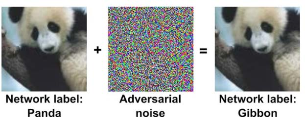
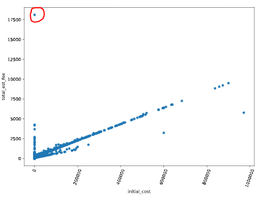
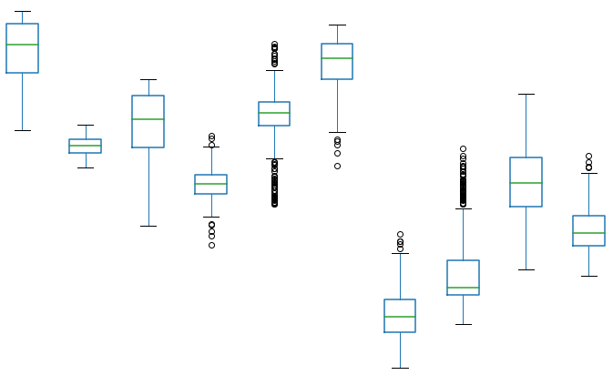
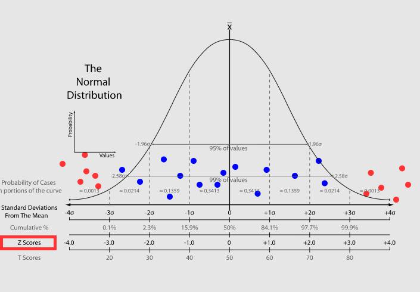

Повышение устойчивости моделей машинного обучения. Состязательные тренировки, очистка данных, адаптация домена. Сдвиг данных, его классификация и мониторинг. {#4.04}
-------------------------------------------------------------------------------------------------------------------------------------------------------------

Основные этапы повышения устойчивости:

1.  Дизайн устойчивых систем. Закладка устойчивости на этапе
    проектирования(тренировки)

2.  Очистка (фильтрация) данных, и во время тренировки, и в период
    эксплуатации

3.  Мониторинг данных и определение сдвига распределения (изменения
    характеристик входных данных)\

**Adversarial robust training (состязательные тренировки)**\
Идея: дополнять тренировочные данные состязательными примерами. Таким
образом, состязательные примеры (которые используют злоумышники) не
будут являться новыми для модели на этапе эксплуатации.

Проблемы: полнота состязательных примеров (учли ли все случаи, скорее
всего - нет), понижение точности модели.

Пример состязательной тренировки - добавление шума на существующие
картинки $\to$ получаем новый состязательный пример.

{width="70%"}

С математической точки зрения - это задача минимума-максимума: поиск
лучшего решения для наихудшего оптимума. Формально, у нас есть функция,
классификатор изображений заданного размера $h \times w \times c$ в $k$
классов.

$$f(x; \theta) : \mathbb{R}^{h \times w \times c} \to \{1 \cdots k\}$$

Если у нас есть некоторый допустимый объем изменений (бюджет изменений,
perturbation budget) , то атакующий пробует найти изменение (возмущение)
исходных данных $\delta \in  \mathbb{R}^{h \times w \times c}$, которое
максимизирует функцию потерь, например кросс-энтропию
$\mathcal{L}_{ce}$, так, что $f(x + \delta) \neq f(x)$

Соответственно, оценка для может быть представлена так:

$$\delta^* := \underset{|\delta|_p \le \epsilon}{\arg\max}\mathcal{L}_{ce}(\theta, x+\delta, y)$$

Где y -- метка для x и p -- норма 1,2,$\cdots$

**Адаптация домена**

Адаптация домена (в машинном обучении) -- это термин, который определяет
способность применять алгоритм, обученный в одном или нескольких
«исходных доменах» (одной предметной области), к другому (но связанному)
«целевому домену» (другой предметной области).

Цель - обучить нейронную сеть на одном наборе данных (источнике), для
которого доступны метки или аннотации, и обеспечить хорошую
производительность на другом наборе данных (цели), чьи метки (аннотации)
недоступны. Чтобы адаптироваться от одного домена к другому, нам нужно,
чтобы наш классификатор хорошо работал с признаками, извлеченными из
источника, а также с целевым набором данных.

{width="70%"}

Адаптация бывает:

1.  Контролируемая (Supervised). Есть размеченные данные для целевого
    домена и его размер меньше исходного.

2.  Полу-контролируемая (Semi-Supervised). В результирующем домене есть
    как размеченные, так и неразмеченные данные.

3.  Неконтролируемая -- данные в целевом домене неразмеченные.

С точки зрения анализа устойчивости: Целевой домен -- это реальные
данные, которые модель должна обрабатывать. Например, состязательный
набор. Для них у нас нет разметки. Наша модель обучалась на других
данных (исходный набор). Выделяют три метода (подхода) адаптации
предметной области:

-   Адаптация домена на основе дивергенции.\
    Работает по принципу минимизации некоторого критерия, основанного на
    расхождении между исходным и целевым распределением, что приводит к
    инвариантным функциям предметной области. Используется какой-то
    математический критерий, показывающий расхождение, например,
    максимальное среднее расхождение (MMD -Maximum Mean Discrepancy). С
    помощью MMD мы пытаемся определить, принадлежат ли данные две
    выборки к одному и тому же распределению или нет.

-   Состязательная адаптация домена.\
    Это подход, в котором используется GAN. Здесь наш генератор - это
    просто экстрактор признаков, и мы добавляем новые сети
    дискриминаторов, которые учатся различать признаки исходного и
    целевого домена. Дискриминатор помогает генератору создавать
    признаки, неотличимые для исходного и целевого домена.

-   Адаптация домена на основе реконструкции.\
    Работает на идее преобразования изображения в изображение. Один из
    простых подходов может заключаться в том, чтобы изучить перевод
    изображений целевого домена в изображение исходного домена и обучить
    классификатор в исходном домене.\

**Очистка тренировочных данных**\
Это процесс выявления неправильной, неполной, неточной, нерелевантной
или отсутствующей части данных с последующим их изменением, заменой или
удалением в зависимости от необходимости. Мусор на входе =\> мусор на
выходе.

Что чистим и как:

1.  Несогласованные столбцы\
    Характеристики, которые не используются в модели, просто удаляются

2.  Пропущенные данные\
    достаточно частая ситуация -- пропуск значений. Возможные действия

    1.  Удалить строки (столбцы) с пропущенными значениями

    2.  Заполнить пропуски посредством аппроксимации (предсказания
        пропущенных значений)

    3.  Забить болт и ничего не делать

3.  Аномалии (выбросы). Данные, которые сильно отличаются от остальных.
    Обнаружить можно(легче всего визуально):

    1.  Диаграммой рассеяния (точечная диаграмма)

        {width="40%"}

    2.  Коробчатая диаграмма -- показывает квартили. Выбросы с
        измененным цветом

        {width="40%"}

    3.  Z-оценка -- на сколько стандартных отклонений значение
        отклоняется от среднего

        {width="40%"}

4.  Дублирующие данные - удаляем дубли

5.  Соблюсти сбалансированность (чтобы не было сдвига в данных).
    Например, данные о физической активности людей, где превалирует один
    пол (одна возрастная группа), -- говно данные.

6.  Нормализация\
    Метод, который часто применяется как часть подготовки данных для
    машинного обучения. Цель нормализации -- изменить значения числовых
    атрибутов (столбцов в наборе данных) на общий масштаб, не искажая
    различия в диапазонах значений.

**Сдвиги данных**

Когда подготавливают реальные (а не тестовые) данные, они должны быть
различными. Это и есть проверка их на сдвиг распределения.

**Сдвиг распределения** - совместное распределение входов и выходов
различается для тренировочных и тестовых данных. $x$ -
переменные(свойства), $y$ - результат(цель), $P(x,y)$ - совместное
распределение

Рассматриваемые проблемы:

1\. проблема предсказания. По $X$ определить $Y$: $X -> Y$.

2\. проблема объяснения $Y ->X$.

Совместные распределения: $P(y/x)P(x)$ для $X -> Y$; $P(x/y)P(y)$ для
$Y -> X$.

**Ковариантный сдвиг** рассматривается проблема предсказания,
используется модель $P(y/x)P(x)$ и распределение тренировочных и
тестовых данных различное.

$P_{train}(y|x)=P_{test}(y|x)$ и $P_{train}(x) \neq P_{test}(x)$

{width="0.7\linewidth"}

[\[fig:cov\_shift\]]{#fig:cov_shift label="fig:cov_shift"}

**Априорный сдвиг** рассматривается проблема объяснения $Y -> X$, модель
$P(x/y)P(y)$ и распределение $P(y)$ разное для тренировачных и тестовых
данных

$P_{train}(x|y)=P_{test}(x|y)$ и $P_{train}(y) \neq P_{test}(y)$

Интуитивно понятный способ представить это - рассмотреть
несбалансированный набор данных. (датасет со спамом, спама там не 50, а
10 процентов)

{width="0.5\linewidth"}

[\[fig:ap\_shift\]]{#fig:ap_shift label="fig:ap_shift"}

Основные причины сдвига набора данных

Двумя наиболее распространенными причинами сдвига набора данных являются

\(1) систематическая ошибка выборки и

\(2) нестационарная среда: когда обучающая среда отличается от тестовой,
и вызвано это временным или пространственным изменением.

Смещение выборки не является недостатком какого-либо алгоритма или
обработки данных. Это чисто систематический недостаток в процессе сбора
или маркировки данных, который вызывает неравномерный выбор обучающих
примеров из совокупности, что приводит к формированию предвзятости во
время обучения.

Один из наиболее подходящих нестационарных сценариев включает проблемы
состязательной классификации, такие как фильтрация спама и обнаружение
сетевых вторжений. Этот тип проблемы привлекает все большее внимание в
области машинного обучения и обычно справляется с нестационарными
средами из-за существования злоумышленника, который пытается обойти
изученные концепции существующего классификатора.
