Машинное обучение
=================
Типы задач: классификация, регрессия, прогнозирование, ранжирование, обнаружение аномалий.
--------------------------------------------------------------------------------------------------------------------------------------------------------------------------------

-   **Классификация** - предсказание того, к какому из известных
    классов относится объект.

    Пример: предсказание результата сдачи экзамена(сдаст или нет)
    студента, прогнозирование возврата или невозврата кредита заемщиком,
    классификация писем на электронной почте (спам).

-   **Регрессия** - предсказание числовых значений признаков.

    Пример: предсказание цены квартиры в зависимости от ее
    характеристик.

-   **Прогнозирование** - предсказание будущих значений характеристик
    на основе временного ряда. В отличие от задачи регрессии, здесь
    осуществляется прогноз по времени, а не по признакам.

    Пример: предсказание рыночной цены актива но основе данных о его
    цене в прошлом.

-   **Ранжирование** - предсказание мест в рейтинге.

    Пример: рекомендации музыки, выдача поисковых запросов, любые
    рейтинги.

-   **Обнаружение аномалий** - обнаружение статистически менее
    вероятных данных.

    Пример: спам, подозрительный трафик.

Методы обучения: обучение с учителем, обучение без учителя, обучение с подкреплением.
--------------------------------------------------------------------------------------------------------------------------------------------------------------------------------

-   **Обучение с учителем** - имеется размеченный датасет. Пример: наше
    домашнее задание на классификацию лиц настоящих и ненастоящих людей

-   **Обучение без учителя** - нет размеченного датасета. Используем в
    случае, когда мы не в состоянии собрать датасет, который покрывает
    все возможные примеры. Пример: поиск аномалий, предсказание
    авиакатастроф (они происходят довольно редко).

-   **Обучение с подкреплением** - один из способов машинного обучения,
    в ходе которого испытуемая система (агент) обучается, взаимодействуя
    с некоторой средой. Пример: например, обучение прохождению игры.

Функции потерь для задач машинного обучения. Градиентный спуск.
---------------------------------------------------------------

Чтобы определить, какие значения параметров модели будут лучшими, нам
нужен способ количественной оценки «непригодности» параметров. И этим
способом будет специальная функция, которая принимает на вход параметры
модели и определяет, насколько плохо они работают. В машинном обучении
она называется **функцией потерь** (loss function).\
**Градиентный спуск** - это метод нахождения локального
максимума/минимума функции с помощью движения вдоль градиента. В нашем
случае, для loss ф-ции.

Пусть у нас есть функция $f(x)$. Для того, чтобы найти минимум функции:

1.  Вычислим производную функции $f$ по аргументу $x$;

2.  Изменим $x$ на значение, пропорциональное производной функции в
    точке $x$ со знаком минус;

3.  Будем повторять, пока не достигнем сходимости (пока значение функции
    потерь не достигнет заданного $\epsilon$).

until converge:\
$x := x - \alpha \cdot f'(x)$

где $\alpha$ --- размер шага вдоль градиента или скорость обучения
(learning rate).\
В случае, когда функция $f$ зависит от многих переменных
$x \rightarrow (x_{1}, x_{2}, ..., x_{m}), f \rightarrow f(x_{1}, x_{2}, \dots,x_{m})$,
вместо производной по одному параметру $x$ необходимо вычислять градиент
функции, то есть вектор:

$\triangledown f = \begin{bmatrix} 
\frac{\partial f}{\partial x_{1}}\\  \frac{\partial f}{\partial x_{2}}\\  \dots\\ \frac{\partial f}{\partial x_{m}} \end{bmatrix}$

Note: При обновлении параметров необходимо сначала сохранить все
параметры, а затем вычислять новые с использованием сохраненных. В ином
случае мы обновим один параметр, а при обновлении второго параметра
будем использовать уже новый первый параметр.\
**Градиент** - вектор, указывающий направление, в котором функция
быстрее всего возрастает, поэтому в алгоритме мы делаем шаги в
противоположном направлении.

Функции оценки качества для задач классификации Accuracy, Precision, Recall, F1, ROC AUC. 
------------------------------------------------------------------------------------------------------------------------------------------------------

Пусть есть два класса 0 и 1. Производится предсказание с помощью
какого-либо алгоритма. Тогда:

-   **TP** (True Positive) - выход алгоритма = 1 и правильный ответ = 1

-   **TN** (True Negative) - выход алгоритма = 0 и правильный ответ = 0

-   **FP** (False Positive) - выход алгоритма = 1 и правильный ответ = 0

-   **FN** (False Negative) - выход алгоритма = 0 и правильный ответ = 1

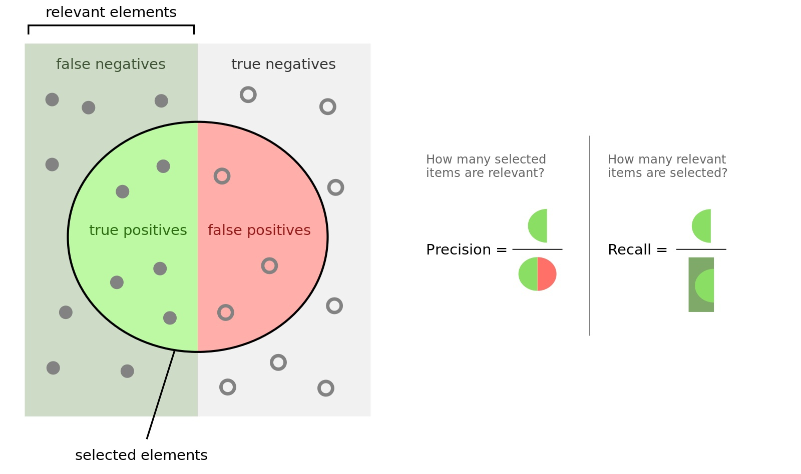

-   **Accuracy** = $\frac{TP + TN}{TP + FP + TN + FN}$ - доля
    правильных ответов в тесте. Минусы: не учитывает дисбаланс классов и
    не учитывается цена ошибки на объектах разных классов.

-   **Recall** = $\frac{TP}{TP + FN}$ - доля найденных объектов среди
    релевантных (какой процент объектов положительного класса правильно
    классифицировали)

-   **Precision** = $\frac{TP}{TP + FP}$ - доля релевантных объектов
    среди найденных (какой процент положительных объектов правильно
    классифицирован).

-   $\mathbf{F_1}$ =
    $\frac{2 \cdot Precision \cdot Recall}{Precision + Recall}$ --
    гармоническое среднее Precision и Recall, которое стремится к 0,
    когда хотя бы одно из значений стремится к 0. Максимизация этого
    функционала приводит к одновременной максимизации Precision и
    Recall.

*Note*: Precision и Recall обратно связаны, но их сумма не равна 1.

**ROC AUC**

-   Обучающая выборка: $X^m = \{(x_1, y_1), \dots, (x_m, y_m)\}$

-   Задача классификации на 2 класса: $X \rightarrow Y, Y = \{+1, -1\}$

-   Алгоритм классификации $a(x) : X \rightarrow Y$

-   Доля ложных положительных классификаций:

    $$FPR(a, X^m) = \frac{\sum\limits_{i=1}^{m} [y_i = -1][a(x_i) = +1]}{\sum\limits_{i=1}^{m}[y_i = -1]} = \frac{FP}{\sum\limits_{i=1}^{m}[y_i = -1]}$$

-   Доля верных положительных классификаций:

    $$TPR(a, X^m) = \frac{\sum\limits_{i=1}^{m} [y_i = +1][a(x_i) = +1]}{\sum\limits_{i=1}^{m}[y_i = +1]} = \frac{TP}{\sum\limits_{i=1}^{m}[y_i = +1]}$$

-   **ROC-кривая** - компромисс между уровнем ложной тревоги и долей
    верного отклика. По оси $X$ откладывается $FPR$, по оси $Y$ - $TPR$.

**Площадь под ROC-кривой**

Чем больше для каждого значения ошибки FPR значение правильного
предсказания TPR, тем лучше работает классификатор. Т.о. площадь под
кривой необходимо максимизировать.

Построение ROC-кривой:

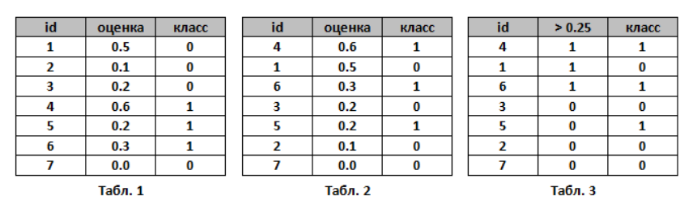

1.  Пусть алгоритм выдал оценки, как показано в табл. 1. Упорядочим
    строки табл. 1 по убыванию ответов алгоритма - получим табл. 2.
    Ясно, что в идеале её столбец «класс» тоже станет упорядочен
    (сначала идут 1, потом 0); в самом худшем случае - порядок будет
    обратный (сначала 0, потом 1); в случае «слепого угадывания» будет
    случайное распределение 0 и 1.

2.  Чтобы нарисовать ROC-кривую, надо взять единичный квадрат на
    координатной плоскости, см. рис. 1, разбить его на m равных частей
    горизонтальными линиями и на n - вертикальными, где m - число 1
    среди правильных меток теста (в нашем примере m=3), n - число нулей
    (n=4). В результате квадрат разбивается сеткой на m×n блоков.

3.  Теперь будем просматривать строки табл. 2 сверху вниз и
    прорисовывать на сетке линии, переходя их одного узла в другой.
    Стартуем из точки (0, 0). Если значение метки класса в
    просматриваемой строке 1, то делаем шаг вверх; если 0, то делаем шаг
    вправо. Ясно, что в итоге мы попадём в точку (1, 1), т.к. сделаем в
    сумме m шагов вверх и n шагов вправо.

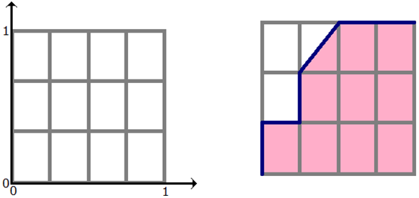

**NOTE**: если у нескольких объектов значения оценок равны, то мы делаем
шаг в точку, которая на a блоков выше и b блоков правее, где a - число
единиц в группе объектов с одним значением метки, b - число нулей в
ней. В частности, если все объекты имеют одинаковую метку, то мы сразу
шагаем из точки (0, 0) в точку (1, 1).

**AUC ROC** - площадь под ROC-кривой - часто используют для оценивания
качества упорядочивания алгоритмом объектов двух классов. Ясно, что это
значение лежит на отрезке \[0, 1\]. В нашем примере AUC ROC = 9.5 / 12  
0.79.

**Смысл AUC ROC**

Сетка на рис. 1 разбила квадрат на m×n блоков. Ровно столько же пар вида
(объект класса 1, объект класса 0), составленных из объектов тестовой
выборки. Каждый закрашенный блок на рис. 1 соответствует паре (объект
класса 1, объект класса 0), для которой наш алгоритм правильно
предсказал порядок (объект класса 1 получил оценку выше, чем объект
класса 0), незакрашенный блок - паре, на которой ошибся.

Таким образом, AUC ROC равен доле пар объектов вида (объект класса 1,
объект класса 0), которые алгоритм верно упорядочил, т.е. первый объект
идёт в упорядоченном списке раньше.\

Функции оценки качества для задач регрессии: MSE, RMSE, MAE, MAPE.
-----------------------------------------------------------------------------------------------------------------------------------

  --------------------------------- ----------------------------------------------------------------- --
  Mean Squared Error:               $MSE = \frac{1}{n} \sum\limits_{t=1}^{n} e_t^2$                   
  Root Mean Squared Error:          $RMSE = \sqrt{\frac{1}{n} \sum\limits_{t=1}^{n} e_t^2}$           
  Mean Absolute Error:              $MAE = \frac{1}{n} \sum\limits_{t=1}^{n}|e_t|$                    
  Mean Absolute Percentage Error:   $MAPE = \frac{100\%}{n} \sum\limits_{t=1}^{n}|\frac{e_t}{y_t}|$   
  --------------------------------- ----------------------------------------------------------------- --

где $e_t = (y_t - \hat{y_t})$, $y_t$ - значение, $\hat{y_t}$ - прогноз,
$n$ - количество наблюдений.

Концепция переобучения и недообучения. Методы валидации качества алгоритма. Регуляризация. L1/L2 регуляризация, множитель Лагранжа.
-----------------------------------------------------------------------------------------------------------------------------------

**Переобучение** - негативное явление, возникающее, когда алгоритм
обучения вырабатывает предсказания, которые слишком близко или точно
соответствуют конкретному набору данных и поэтому не подходят для
применения алгоритма к дополнительным данным или будущим наблюдениям.

**Недообучение** - негативное явление, при котором алгоритм обучения не
обеспечивает достаточно малой величины средней ошибки на обучающей
выборке. Недообучение возникает при использовании недостаточно сложных
моделей.

Если у нас будет слишком много признаков, то мы можем найти такие
параметры, которые бы минимизировали функцию ошибки почти до 0 на
обучающей выборке.

$$J(\theta) = \frac{1}{2m} \sum\limits_{i=1}^{m}(h_{\theta}(x^i) - y^i)^2 \approx 0$$

При этом, полученная модель будет плохо предсказывать на новых данных
(не будет достаточно робастной). Техники, способные уменьшить
переобучение, даже когда у нас фиксированы размер сети и обучающих
данных, известны как техники регуляризации. Т.е. для данной функции
минимизации ошибки надо придумать слагаемое, которое будет "удерживать"
его от падения в 0.

$$\underset{\theta}{min} (\frac{1}{2m} \sum\limits_{i=1}^{m}(h_{\theta}(x^i) - y^i)^2)$$

Это можно сделать путем добавления слагаемого.

Например, в **$L_2$-регуляризации**(регуляризация по Тихонову или Ridge
regression) слагаемое будет такое:

$$\underset{\theta}{min} (\frac{1}{2m} \sum\limits_{i=1}^{m}(h_{\theta}(x^i) - y^i)^2 + \lambda\sum\limits_{i=1}^{n}\theta_i^2)$$

А в $L_1$-регуляризации слагаемое будет такое:

$$\underset{\theta}{min} (\frac{1}{2m} \sum\limits_{i=1}^{m}(h_{\theta}(x^i) - y^i)^2 + \lambda\sum\limits_{i=1}^{n}|\theta_i|)$$
где $\lambda$ - параметр регуляризации.

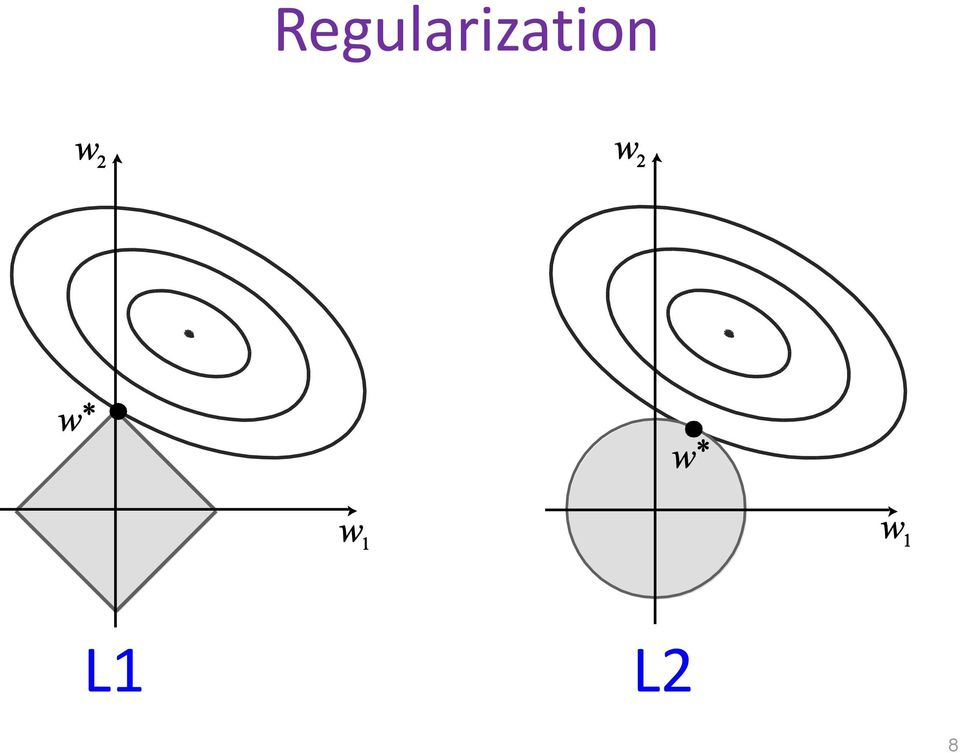

Здесь есть 2 сущности: белая - это изолинии, соответствующие loss
функции, и серая - правая часть функции (по сути многомерный шар).
Минимум общий - точка на границе.

Ансамблирование моделей: мажорантное голосование, блендинг, бустинг, бэгинг.
----------------------------------------------------------------------------

**Ансамбль методов** - это способ использования нескольких обучающих
алгоритмов с целью получения лучшей эффективности предсказания
(классификации или регрессии), чем можно было бы получить от каждого
обучающего алгоритма по отдельности. Ансамбль методов не бесконечен:
состоит из конкретного конечного множества альтернативных моделей.

**Мажорантное голосование** - ансамблирование моделей, при котором в
качестве результата предоставляется ответ, который дало большинство
базовых моделей ансамбля.

**Блендинг**. Предположим, что мы можем обучить $T$ базовых моделей. После этого мы
обучаем комбинирующую модель верхнего уровня (метамодель), входом для
которой являются выходы базовых.

1.  Разбиваем обучающую выборку на две части

2.  На первой части обучаем базовые модели

3.  На второй части получаем ответы базовых моделей, обученных ранее, а
    затем обучаем метамодель на этих ответах

4.  На тестовой выборке получаем ответы базовых моделей, к которым затем
    применяем метамодель и получаем итоговый результат

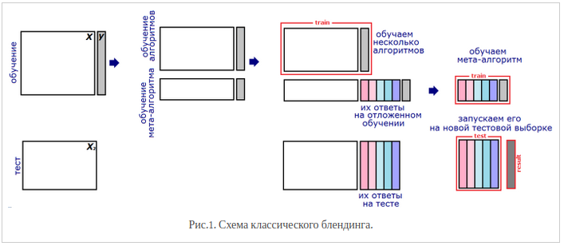

Проблема классического блендинга заключается в том, что ни базовые
алгоритмы, ни мета-алгоритм не видят всей обучающей выборки. Поэтому
можно усовершенствовать подход (подход "вширь"):

-   Разбиваем обучающую выборку на две части

-   На первой части обучаем базовые модели

-   На второй части получаем их ответы (метапризнаки), а затем обучаем
    метамодель на этих ответах

-   Повторяем пп. 2-3 $M \geq 2$ раз для других разбиений обучающей
    выборки

-   На тесте сначала получаем $M$ наборов выходов базовых моделей,
    обученных на разных разбиениях, затем для каждого набора запускаем
    соответствующую метамодель

-   Усредняем $M$ ответов метамоделей

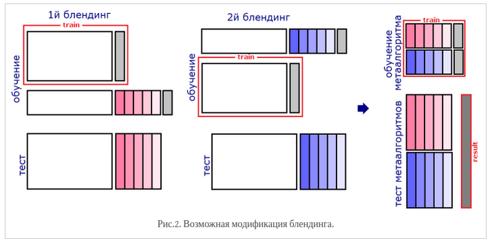

**Бустинг** --- это техника построения ансамблей, в которой
предсказатели построены не независимо, а последовательно. Бустинг
использует идею о том, что следующая модель будет учится на ошибках
предыдущей. Они имеют неравную вероятность появления в последующих
моделях, и чаще появятся те, что дают наибольшую ошибку.

В то время как бустинг алгоритмически не ограничен, большинство
алгоритмов бустинга состоит из итеративного обучения слабых
классификаторов с целью сборки их в сильный классификатор. Когда они
добавляются, им обычно приписываются некоторым образом веса, которые,
обычно, связаны с точностью обучения. После того, как слабый
классификатор добавлен, веса пересчитываются, что известно как
"пересчёт весовых коэффициентов". Неверно классифицированные входные
данные получают больший вес, а правильно классифицированные экземпляры
теряют веc. Тем самым последующее слабое обучение фокусируется больше на
примерах, где предыдущие слабые обучения дали ошибочную классификацию.
Два важных примера алгоритмов бустинга: адаптивный бустинг (`AdaBoost`)
и градиентный бустинг.

**Бэггинг** - технология классификации, где в отличие от бустинга все
базовые модели обучаются и работают параллельно (независимо друг от
друга). Идея заключается в том, что модели не исправляют ошибки друг
друга, а компенсируют их при голосовании. Базовые модели должны быть
независимыми, это могут быть модели основанные на разных группах методов
или же обученные на независимых наборах данных. Во втором случае можно
использовать один и тот же метод.

Функции потерь для задач классификации, сегментации.
------------------------------------------------

P.S. Тут будет про основные лоссы в задачах сегментации и детекта, т.к.
для задач классификации было всё описано в билете 2.3\
**Cross-entropy (CE)** - loss функция, выраженная следующей формулой:

$$D(S, L) = -\sum_{i} L_{i}\log{S_{i}}$$ 

где $L$ - ground root метки (то
есть имеющиеся у нас разметка, соответствующая реальному классу, который
нужно предсказать), а $S$ - это то, что нам выдала (предсказала) модель

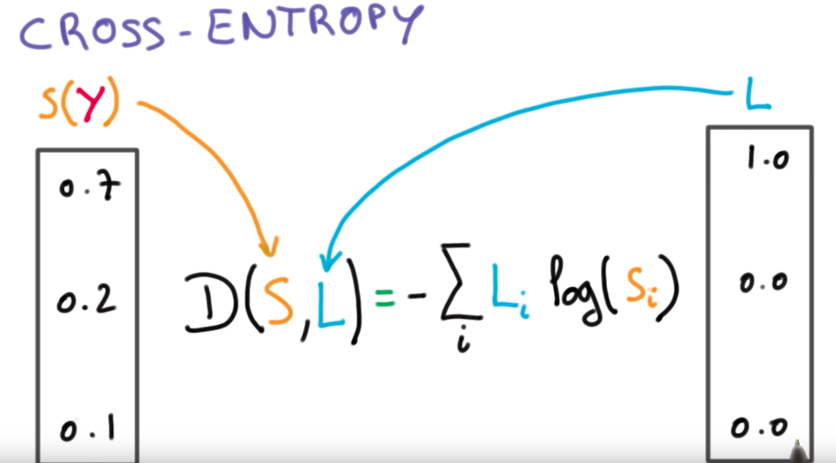

P.S. Dice в лекциях не упоминается никак, кроме названия и того, что нам
о нём уже рассказывали, так что всё беру из сети, рассказывать видимо
нужно будет на понимание\
**Dice** - используется для оценки сходства между двумя образцами. С
точки зрения теории множеств, dice рассчитывается, как удвоенное
пересечение множеств $A$ и $B$ на их сумму. Если множества одинаковы, то
коэффициент dice равен 1, если вообще не совпадают - то 0.В задачах
обнаружения границ, вместо множества $A$ пиксели истинной границы,
вместо $B$ - пиксели прогнозируемой границы.

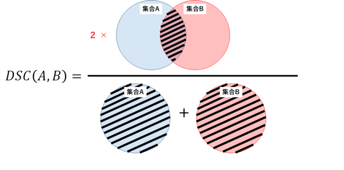

**Boundary loss** - специфичная функция, используется для "круглых
объектов" (сосуды MRT). Считается как разница площадей $\delta{A}$
между $G_{B}^{i}$ (ground root) и $S_{B}^{i}$ (предсказанной) метриками,
то есть путем интегрирования. Берем точку $S_{B}^{i}(a^{'}, b^{'})$,
находим к ней соответствующую точку $G_{B}^{i}(a, b)$ по нормали $d_i$,
и интегрируем по всем точкам.

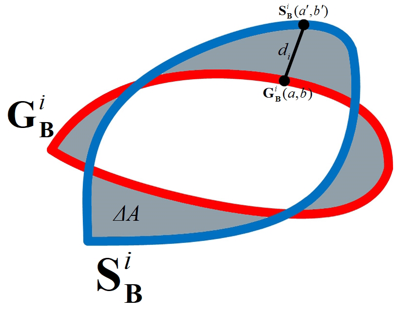

Методы снижения размерности. Метод главных компонент. SNE, t-SNE. UMAP.
-----------------------------------------------------------------------

P.S. матчасть метода главных компонент можно прочесть в билете 1.9.б тут
всё будет по сути\
P.P.S билет вообще про НЕЛИНЕЙНЫЕ методы сжатия пространства

Под уменьшением размерности в машинном обучении подразумевается
уменьшение числа признаков набора данных. Наличие в нем признаков
избыточных, неинформативных или слабо информативных может понизить
эффективность модели, а после такого преобразования она упрощается, и
соответственно уменьшается размер набора данных в памяти и ускоряется
работа алгоритмов ML на нем. Уменьшение размерности может быть
осуществлено методами выбора признаков или выделения признаков.\
**Метод главных компонент, или сингулярное разложение, или SVD метод** -
метод понижения размерности пространства. То есть, наша задача построить
проекцию на множество, а для этого нам нужно схлопнуть одну за одной
размерности, отобразив их на ось. Пример - из 2D множества точек
проекция на прямую. При этом хочется, чтобы расстояние от точек до
схлопнувшийся в линию размерности было минимальным.

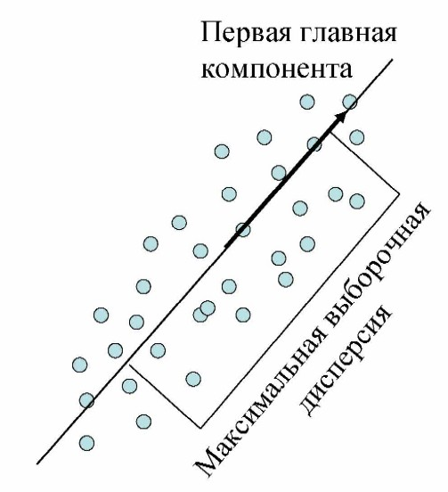

Строится это штука по этапам:

1.  Для начала строится проекция (первое приближение,первая ось новой
    системы координат) строится таким образом, чтобы дисперсия данных
    вдоль неё была бы максимальна

2.  Затем вторая ось строится ортогонально первой так, чтобы дисперсия
    данных вдоль неё, была бы максимальной из оставшихся возможных и
    т.д. Первая ось называется первой главной компонентой, вторая ---
    второй и т.д.

**SNE**\
У нас есть набор данных с точками, описываемыми многомерной переменной с
размерностью пространства существенно больше трех. Необходимо получить
новую переменную, существующую в двумерном или трехмерном пространстве,
которая бы в максимальной степени сохраняла структуру и закономерности в
исходных данных. SNE начинается с преобразования многомерной евклидовой
дистанции между точками в условные вероятности, отражающие сходство
точек. Математически это выглядит следующим образом:

$$p_{i|j} = \frac{ \exp (- \left\| x_i - x_j \right\|^2  / 2\sigma_i^2)}{\sum_{k \neq i}{\exp (- \left\| x_i - x_k \right\|^2  / 2\sigma_i^2)}}$$

Эта формула показывает, насколько точка $X_j$ близка к точке $X_i$ при
гауссовом распределении вокруг $X_i$ с заданным отклонением $\sigma$.
Сигма будет различной для каждой точки. Она выбирается так, чтобы точки
в областях с большей плотностью имели меньшую дисперсию. Для двумерных
или трехмерных «коллег» пары $X_i$ и $X_j$, назовем их для ясности $Y_i$
и $Y_j$, не представляет труда оценить условную вероятность, используя
ту же формулу 1. Стандартное отклонение предлагается установить в
$1/\sqrt{2}$:

$$q_{i|j} = \frac{ \exp (- \left\| y_i - y_j \right\|^2 )}{\sum_{k \neq i}{\exp (- \left\| y_i - y_k \right\|^2 )}}$$

Если точки отображения $Y_i$ и $Y_j$ корректно моделируют сходство между
исходными точками высокой размерности $X_i$ и $X_j$, то соответствующие
условные вероятности $p_{i|j}$ и $q_{i|j}$ будут эквивалентны. В
качестве очевидной оценки качества, с которым $q_{i|j}$ отражает
$p_{i|j}$, используется дивергенция или расстояние Кульбака-Лейблера.
SNE минимизирует сумму таких расстояний для всех точек отображения при
помощи градиентного спуска. Функция потерь для данного метода будет
определяться формулой:

$$Cost = \sum{KL(P_i || Q_i )} = \sum_i{\sum_j{p_{j|i} \log\frac{p_{j|i}}{q_{j|i}}}}$$

При этом градиент выглядит на удивление просто:

$$\dfrac{\partial Cost}{\partial y_i} = 2\sum_j{ (p_{j|i} - q_{j|i} + p_{i|j} - q_{i|j})(y_i - y_j) }$$

Авторы предлагают следующую физическую аналогию для процесса
оптимизации: Все точки отображения соединены пружинами. Жесткость
пружины, соединяющей точки i и j зависит от разности между сходством
двух точек в многомерном пространстве и двух точек в пространстве
отображения. В этой аналогии, градиент --- это результирующая сила,
действующая на точку в пространстве отображения. Если систему
«отпустить», через какое-то время она придет в равновесие, это и будет
искомое распределение. Алгоритмически, поиск равновесия (нащих точек)
предлагается делать с учетом моментов:

$$Y^{(t)} = Y^{(t-1)} + \eta\dfrac{Cost}{Y} + \alpha(t)(Y^{(t-1)} - Y^{(t-2)})$$

где $\eta$ - параметр, определяющий скорость обучения (длину шага), а
$\alpha$ - коэффициент инерции.\
Если коротко, алгоритм такой: для точек X в n-мерном пространстве делают
их соответствие - точки Y в 3D или 2D пространстве. И считается, что
точки Y найдены хорошо, если условные вероятности расстояний между этими
точками совпали (но в реальности они конечно не совпадают, по этому мы
стремимся к этому совпадению, залипая на лосс). А считается это условная
вероятность так - расстояние между 1 и 2 точкой делить на сумму
расстояний от 1 точки до всех точек, кроме 2. А чтобы у нас не слиплось
в мелкую кашу условные вероятности в n-мерных областях с высокой
плотностью точек, мы делим всё это специальное для каждой точки
отклонение (в оригинале оно считается очень сложно, при помощи энтропии
Шеннона).\
Использование классического SNE позволяет получить неплохие результаты,
но может быть связано с трудностями в оптимизации функции потерь и
проблемой скученности (в оригинале - crowding problem).\
**t-SNE**\
Имеет два принципиальных отличая от SNE. Во-первых, у t-SNE симметричная
форма сходства в многомерном пространстве и более простой вариант
градиента. Во-вторых, вместо гауссова распределения для точек из
пространства отображения используется t-распределение (Стьюдента),
«тяжелые» хвосты которого облегчают оптимизацию и решают проблему
скученности.

В качестве альтернативы минимизации суммы дивергенций Кульбака-Лейблера
между условными вероятностями $p_{i|j}$ и $q_{i|j}$ предлагается
минимизировать одиночную дивергенцию между совместной вероятностью P в
многомерном пространстве и совместной вероятностью Q в пространстве
отображения:

$$Cost = KL(P||Q) = \sum_i{\sum_j{p_{ij} \log\frac{p_{ij}}{q_{ij}}}}$$

где $p_{ii}$ и $q_{ii}$ = 0, $q_{ji} = p_{ji}$, $q_{ij} = q_{ji}$ для
любых i и j, а $p_{ij}$ определяется по формуле:

$$p_{ij} = \frac{p_{i|j} + p_{j|i}}{2n}$$

где n --- количество точек в наборе данных. Градиент для симметричного
SNE получается существенно проще, чем для классического (note from me: с
нас не спрашивают симметричный SNE, но про него почему-то везде
рассказывают):

$$\dfrac{\partial Cost}{\partial y_i} = 4\sum_j{ (p_{ij} - q_{ij})(y_i - y_j) }$$

Проблема скученности заключается в том, что расстояние между двумя
точками в пространстве отображения, соответствующими двум
среднеудаленным точкам в многомерном пространстве, должно быть
существенно больше, нежели расстояние, которое позволяет получить
гауссово распределение. Проблему решают хвосты Стьюдента. В t-SNE
используется t-распределение с одной степенью свободы. Совместная
вероятность для пространства отображения в этом случае будет
определяться формулой:

$$q_{ij} = \frac{ (1 + \left\| y_i - y_j \right\|^2 )^{-1}}{\sum_{k \neq l}{(1 + \left\| y_k - y_l \right\|^2 )^{-1}}}$$

Откуда тут l - точно не знаю, даже на вике эта опечатка. Могу только
предположить, что там должно стоять не l, а i\
А соответствующий градиент - выражением:

$$\dfrac{\partial Cost}{\partial y_i} = 4\sum_j{ (p_{ij} - q_{ij})(y_i - y_j)(1 + \left\| y_i - y_j \right\|^2 )^{-1} }$$

Коротко про отличие от SNE - решили проблему с кучностью, поменяв
вероятностной распределение, и забили на условные вероятности, теперь
берем $p_{ij}$, а жить и считать всё стало легче. Общий алгоритм такой -
считаем $p_{i|j}$ по входным x, по ним находим $p_{ij}$, инициализируем
начальный массив 2d или 3d точек Y (авторы юзают норм распределение), и
впадаем в цикл:\
считаем qij, считаем градиент лосс функции
($\dfrac{\partial Cost}{\partial y_i}$), получаем Y(n+1) и так шагаем на
столько итераций, скока хочется.

**UMAP**\
Считается лучше всех предыдущих методов, самый молодой, но с более
сильным математическим обоснованием. Математически, изменения потерпела
формула условной вероятности:

$$p_{i|j} = \exp^{- \frac{d(x_i, x_j) - p_i}{\sigma_i}}$$

где $p_i$ - важный параметр, который представляет расстояние от каждой i-й точки
данных до ее первого ближайшего соседа. В то же время
$\sigma = \log_2k$, где k - колличесвто его ближайщих соседей (для
каждой точки оно определенно UMAP $k = 2^{\sum_ip_{ij}}$)

Немного другая симметризация вероятностей (правда зачем - не совсем
ясно):

$$p_{ij} = p_{i|j} + p_{j|i} - p_{i|j}p_{j|i}$$

UMAP использует семейство кривых $1 /(1 + a * y^{(2 b)})$ для
моделирования вероятностей расстояния в малых измерениях, а не в
точности по Стьюденту t-распределение, обратите внимание, что снова
нормализация не применяется (a и b обычно заданы):

$$q_{ij} = (1 + a (y_i - y_j)^{2b})^{-1}$$

UMAP использует двоичную кросс-энтропию (CE) в качестве функции
стоимости вместо KL-дивергенции, как это делает tSNE:

$$CE = \sum_i\sum_j(p_{ij}\log\frac{p_{ij}}{q_{ij}} + (1 - p_{ij})\log\frac{1 - p_{ij}}{1 - q_{ij}})$$

UMAP назначает начальные низкоразмерные координаты с помощью Лапласиана
графика в отличие от случайной нормальной инициализации, используемой
tSNE

Визуально, UMAP лучше разъединяет множества, чем tSNE:

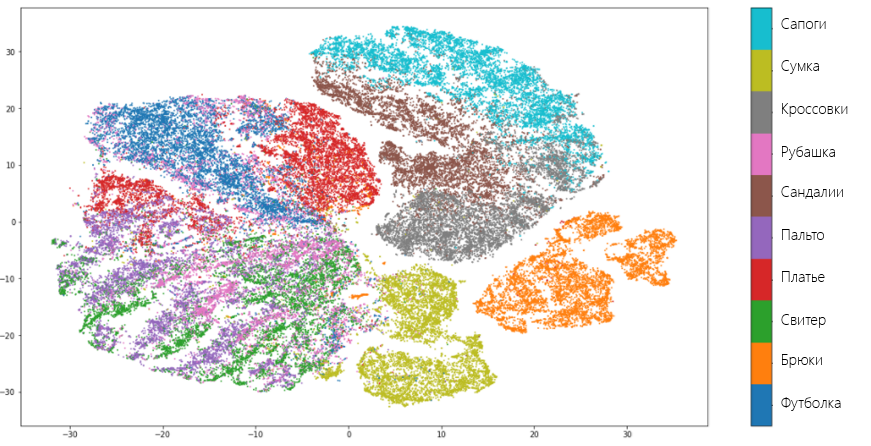

Типы признаков и их обработка. Нормализация данных, масштабирование, обработка категориальных признаков. Векторизация текстовых данных с помощью bag-of-words, tf-idf.
----------------------------------------------------------------------------------------------------------------------------------------------------------------------

Пусть $X$ - некоторое множество объектов. Тогда **признаком** будем
называть отображение $X \longrightarrow D_f$, где $D_f$ - множество
допустимых признаков. В зависимости от природы этого множества признаки
делятся на следующие типы:

1.  **бинарный** признак: $D_f = \{0, 1\}$

2.  **категориальный** признак: $D_f$ - конечное множество

3.  **порядковый** признак: $D_f$ - конечное упорядоченное множество

4.  **числовой** признак: $D_f$ - множество действительных чисел

### Обработка

При обработке датасета могут возникнуть несколько проблем, с которыми
нужно справиться для успешной работы алгоритма машинного обучения.

1.  У некоторых объектов датасета могут быть не определены некоторые
    признаки. Назовем это пропусками. В таком случае мы можем:

    -   Для категориальных признаков создать новый допустимый признак -
        "неизвестно". Или можно заполнить пропуск самым популярным в
        датасете значением признака.

    -   Для числовых признаков можно заполнить пропуск средним либо
        медианным значением.

2.  В датасете могут также присутствовать выбросы (говорим про числовые
    признаки). Чаще всего от выбросов в обучающей выборке лучше всего
    избавляться. Для того, чтобы определить, является ли значение
    выбросом, пользуются характеристикой выборки, называемой
    интерквартильным размахом. Определяется он следующим образом:\
    $IQR = Q_3 - Q_1$, где $Q_1$ --- первая квартиль --- такое значение
    признака, меньше которого ровно 25% всех значений признаков. $Q_3$
    --- третья квартиль --- значение, меньше которого ровно 75% всех
    значений признака. Для того, чтобы понять, является ли значение
    выбросом, можно воспользоваться эвристикой: выбросы лежат за
    пределами следующего интервала: $[ Q_1 -1.5IQR, Q_3 + 1.5IQR ]$.

### Нормализация

**Нормализация** - это приведение всех значений числового признака к
новому диапазону. Например, к диапазону $[0, 1]$. Это полезно, поскольку
значения признаков могут изменяться в очень большом диапазоне. Причем,
значения разных признаков могут отличаться на несколько порядков. А
после нормализации они все будут находиться в узком (и, часто, едином)
диапазоне.

Наиболее популярным способом нормализации является **нормализация
методом минимакса**. Для того, чтобы применить этот метод, должно быть
известно максимальное и минимальное значение признака. Проблема в том,
что эти значения известны не всегда.

$x_{new} = \frac{ x_{old} - x_{min}} {x_{max} - x_{min}}$

Также довольно популярным методом является **Z-нормализация** или
**нормализация средним**. Диапазон новых значений для Z-нормализации
выглядит следующим образом:

$(-3\sigma[X], 3\sigma[X])$

где $\sigma[X]$ --- среднеквадратическое отклонение признака $X$.

Выполняется Z-нормализация по формуле ниже.

$x_{new} = \frac{x_{old} - M[X]} {\sigma[X]}$

где $M[X]$ --- математическое ожидание признака $X$.

Отмечу, что в случае применения Z-нормализации к нескольким признакам,
диапазон значений для них будет разным.

### Обработка категориальных признаков

Многие модели плохо работают с категориальными признаками как таковыми.
Дело в том, что признак "Российская Федерация" нельзя просто взять и
умножить на какое-нибудь число. Но многие модели работают именно так:
берется коэффициент и на него умножается значение признака. Аналогичная
операция выполняется с остальными признаками. Все результаты
суммируются. На основе значения суммы делается вывод о принадлежности
объекта к тому или иному классу (такие модели называются линейными).

Рассмотрим датасет следующего вида:

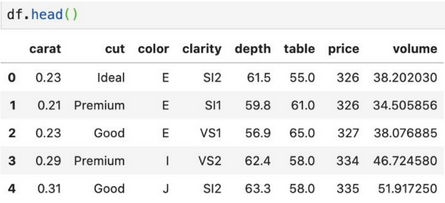

**One-Hot Encoding**

Предположим, что некоторый признак может принимать $k$ разных значений.
В этом случае **One-Hot Encoding** подразумевает создание $k$ признаков,
все из которых равны нулю за исключением одного. На позицию,
соответствующую значению признака мы помещаем единицу.

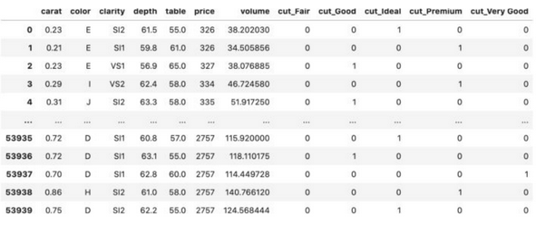

**Label Encoding**

Здесь мы по сути из каждого категориального признака делаем `enum`, как
в языках программирования. Каждому значению категориального признака
соответствует уникальный (в рамках значений этого признака) `id`.

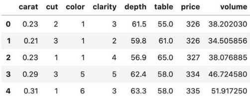

**Target Encoding**

Создаем признак, значение которого равно среднему целевому значению для
каждой категории. Здесь **Legendary** - таргет. То есть, если
$Type = Fire$, то всего у нас вероятность $1/3$ того, что
$Legendary = 1$.

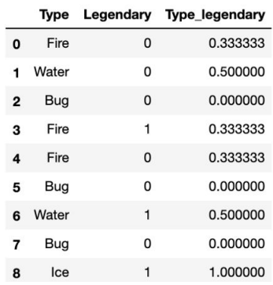

**Leave-one-out Encoding**

То же самое, что и предыдущее, только при подсчетах мы не учитываем
текущую строку таблицы, т.е. которую сейчас заполняем.

**Frequency Encoding**

Выбираем категориальный признак и считаем частоту его встречаемости в
датасете.

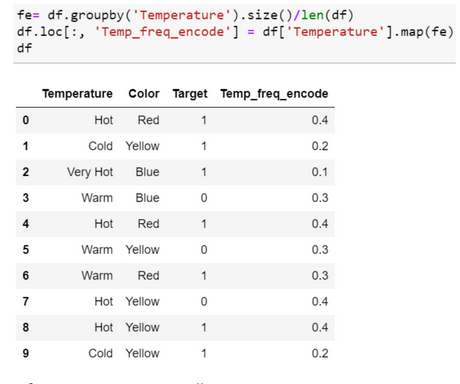

**Model Encoding**

Это различные модели для преобразования признаков, например `Word2Vec`

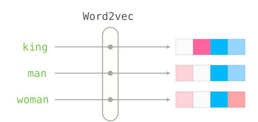

### Векторизация текстовых данных с помощью bag-of-words, tf-idf.

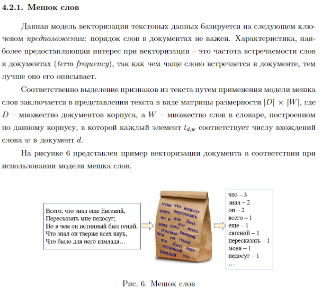

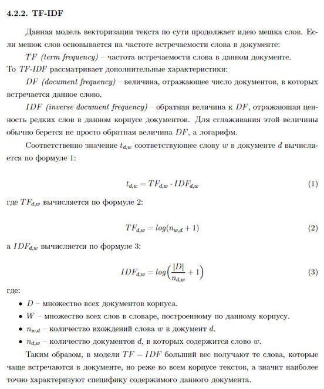

Методы оптимизации. Градиентный спуск, SGD, AdaGrad, Adam, RMSProp, момент Нестерова.
-------------------------------------------------------------------------------------

P.S. про градиентный спуск уже было в билете 2.2 (самое лучшее
объяснение за 7 минут - [здесь видос на
ютубе](https://www.youtube.com/watch?v=mdKjMPmcWjY) )\
Формула для градиентного спуска, $\alpha$ это шаг

For every epoch:\
$x := x - \alpha \cdot f'(x)$\

**SGD (стохастический градиентный спуск)** - то же самое, что и
градиентный спуск, но градиентный используется для каждой эпохи, в то
время как SGD - для каждый эпохи и каждого сэмпла. Проблема - слишком
много прыжков от точки минимума может произойти.\
**момент Нестерова**\
Сама по себе идея методов с накоплением импульса до очевидности проста:
«Если мы некоторое время движемся в определённом направлении, то,
вероятно, нам следует туда двигаться некоторое время и в будущем». Для
этого нужно уметь обращаться к недавней истории изменений каждого
параметра. Простое накопление импульса уже даёт хороший результат, но
Нестеров идёт дальше и применяет хорошо известную в вычислительной
математике идею: заглядывание вперёд по вектору обновления. (берет
производную не в точке $\gamma v_{t-1}$, а в $x - \gamma v_{t-1}$)

for every epoch t:

$$v_t = v_{t-1} + \eta f'(x - \gamma v_{t-1})$$

$$x_{t+1} = x_t - v_t$$

для краткости: далее $f'(x_t)$ равен $g_t$\
**AdaGrad**\
Хорошо бы уметь обновлять параметры с оглядкой на то, насколько типичный
признак они фиксируют. Достичь этого несложно: давайте будем хранить для
каждого параметра сети сумму квадратов его обновлений. Она будет
выступать в качестве прокси для типичности: если параметр принадлежит
цепочке часто активирующихся нейронов, его постоянно дёргают туда-сюда,
а значит сумма быстро накапливается. Перепишем формулу обновления вот
так:

for every epoch t:\

$$G_t = G_{t-1} + g_{t}^{2}$$

$$x_{t+1} = x_t - \frac{\alpha}{\sqrt{G_t + \epsilon}}g_t$$

Где $G_{t}$ ---- сумма квадратов обновлений, а $\epsilon$ ---
сглаживающий параметр, необходимый, чтобы избежать деления на
0.Недостаток Adagrad в том, что $G_{t}$ может увеличиваться сколько
угодно, что через некоторое время приводит к слишком маленьким
обновлениям и параличу алгоритма.\
**RMSProp** - модификация Adagard, мы всё так же собираемся обновлять
меньше веса, которые слишком часто обновляются, но вместо полной суммы
обновлений, будем использовать усреднённый по истории квадрат градиента.

for every epoch t:\

$$E[g^2]_t = \gamma E[g^2]_{t-1} + (1-\gamma)g_t^2$$

$$x_{t+1} = x_t - \frac{\alpha}{\sqrt{E[g^2]_t + \epsilon}}g_t$$
**Adam** Объединяет моменты Нестерова и RMSProp.

for every epoch t:\

$$E[g^2]_t = \gamma E[g^2]_{t-1} + (1-\gamma)g_t$$

$$G_t = \beta G_{t-1} + (1-\beta)g_t^2$$

$$x_{t+1} = x_t - \frac{\alpha}{\sqrt{G_t + \epsilon}}E[g^2]_t$$
