Нейронные сети
==============

Нейронные сети. Модель нейрона. MLP. Понятие функции активации. Алгоритм обратного распространения ошибки.
----------------------------------------------------------------------------------------------------------

### Нейронные сети. Модель нейрона.

Искусственный нейрон - узел искусственной нейронной сети, являющийся
упрощённой моделью естественного нейрона. Математически искусственный
нейрон обычно представляют как некоторую нелинейную функцию от
единственного аргумента --- линейной комбинации всех входных сигналов.
Данную функцию называют **функцией активации**.

Математически нейрон представляет собой взвешенный сумматор,
единственный выход которого определяется через его входы и матрицу весов
следующим образом:

$$y = f(u), \text{где}\quad u=\sum_{i=1}^{n}w_ix_i+w_0x_0$$

тут $x_i$ - сигналы на входах нейрона, $w_i$ - веса входов, функция $u$
называется индуцированным локальным полем, а функция $f(u)$ -
передаточной функцией (функцией активации)

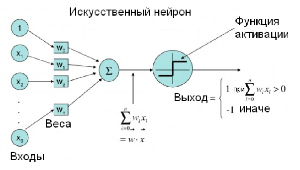

### Функция активации

В биологических нейронных сетях функция активации обычно является
абстракцией, представляющей скорость возбуждения потенциала действия в
клетке. В наиболее простой форме эта функция является двоичной --- то
есть нейрон либо возбуждается, либо нет.

Передаточная функция $f(u)$ определяет зависимость сигнала на выходе
нейрона от взвешенной суммы сигналов на его входах. В большинстве
случаев она является монотонно возрастающей. Использование различных
передаточных функций позволяет вносить нелинейность в работу нейрона и в
целом нейронной сети.

### Виды функций активации

1.  Функция Хевисайда. 

$$f(x) = 
    \begin{cases}
    1, &\text{if $x\geq T = -w_0x_0$}\\
    0, &\text{else}
\end{cases}$$

    

    

2.  Сигмоида 

$$\sigma(x) = \frac{1}{1+e^{-x}}$$

    

    

3.  Гиперболический тангенс 

$$tanh(x) = 2\sigma(2x) -1$$

    

    

4.  Rectified Linear Unit 

$$ReLU(x) = max(0,x)$$

    

    

5.  ReLU с утечкой (Leaky ReLU)
    
$$LReLU(x) = (x<0)\cdot \alpha x+(x\geq 0)\cdot x$$

    

    

### Многослойный перцептрон (MLP)

Многослойный персептрон --- это класс искусственных нейронных сетей
прямого распространения, состоящих как минимум из трех слоёв: входного,
скрытого и выходного. За исключением входных, все нейроны использует
нелинейную функцию активации.

При обучении MLP используется обучение с учителем и алгоритм обратного
распространения ошибки.

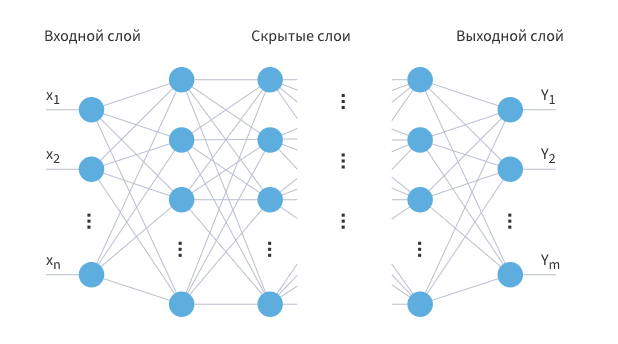

В качестве активационных функций нейронов используются сигмоидальные:
логистическая или гиперболический тангенс.

### Алгоритм обратного распространения ошибки

Один из распространенных подходов к обучению заключается в
последовательном предъявлении НС векторов наблюдений и последующей
корректировки весовых коэффициентов так, чтобы выходное значение
совпадало с требуемым. Это называется обучение с учителем, так как для
каждого вектора мы знаем нужный ответ и именно его требуем от нашей НС.

Теперь, главный вопрос: как построить алгоритм, который бы наилучшим
образом находил весовые коэффициенты. Наилучший -- это значит,
максимально быстро и с максимально близкими выходными значениями для
требуемых откликов. В общем случае эта задача не решена. Нет
универсального алгоритма обучения. Поэтому, лучшее, что мы можем сделать
-- это выбрать тот алгоритм, который хорошо себя зарекомендовал в
прошлом. Основной «рабочей лошадкой» здесь является алгоритм back
propagation (обратного распространения ошибки), который, в свою очередь,
базируется на алгоритме градиентного спуска.

**Простой пример backpropagation.** Пусть дана функция:
$f(x,y,z) = (x+y)z$. Представим операции в виде графа вычислений:

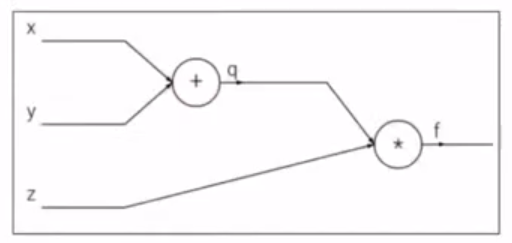

К примеру, $x=-2, y=5, z=-4$

Конечная цель - нужно распространить ошибку ко входам сети, для этого
нужно вычислить производную от функции потерь (в нашем случае это
функция $f$) по входу ($x,y,z$) (дифференцируем справа налево по графу,
т.е. от конца в начало). Будем это делать с помощью цепного правила
(правило взятия производной от сложной функции) и для этого нужно
вычислить все частные производные по пути. Теперь считаем производные:

$$q=x+y, \frac{\partial q}{\partial x}=1, \frac{\partial q}{\partial y}=1$$

$$f=qz, \Rightarrow \frac{\partial f}{\partial q}=z, \frac{\partial f}{\partial z}=q$$

Хотим посчитать:

$$\frac{\partial f}{\partial x}, \frac{\partial f}{\partial y}, \frac{\partial f}{\partial z}$$

На следующих картинках: значения над стрелками - те, что получили во
время прямого прохода, значения под стрелками - во время обратного
прохода (backward pass) - частные производные.

Глубокие нейронные сети. Принцип работы слоев: сверточного, полносвязного, пулинг (max pooling, average pooling), нормализации (batch normalization, layer normalization), дропаут.
-----------------------------------------------------------------------------------------------------------------------------------------------------------------------------------

### Сверточный слой

Скалярное произведение между элементами фильтра (также наз. **ядро
свертки**) и ограниченной областью входного слоя, с которой имеются
связи, с помощью скользящего окна (слева направо, сверху вниз). Свертка
отвечает за пространственное выделение признаков.

**Параметры сверточного слоя**

-   Размер фильтра - прямоугольный, задается двумя числами: $p\times q$.
    Также называется рецептивным полем.

-   Глубина - кол-во двумерных карт признаков (обычно интересует их
    число на выходе)

-   Шаг свертки (stride) - кол-во элементов по горизонтали или
    вертикали, на которое перемещается фильтр в режиме скользящего окна
    для получения результрующей карты признаков.

-   Добивка, паддинг (padding) - кол-во элементов, которыми дополняется
    исходная карта признаков - обычно нужна для сохранения
    пространственных размеров карты (ширина, высота)

**Padding. Режим VALID**

-   При движении скользящим окном (фильтром) размера $h\times w$ по
    изображению $H\times W$ с шагом $s=1$, если не заходить за границу
    картинки, то на выходе будет изображение размера (т.е. выходной
    размер изображения уменьшается): 

$$(H-h+1)\times (W-w+1)$$

**Padding. Режим SAME**

-   Добавляется рамка вокруг изображения (паддинг), состоящая либо из
    нулей, либо из зеркального отражения картинки внутри рамки, чтобы
    выходной размер был равен входному.

**Формула свертки**

-   **Входной слой** - трехмерный тензор $X_{ij}^{m}$, где верхний
    индекс - кол-во входных карт, два нижних индекса - пространственное
    разрешение карт (по горизонтали и вертикали). Всего входных карт
    $M$.

-   **Выходной слой** - трехмерный тензор $Y_{ij}^{k}$ с теми же
    обозначениями индексов. Всего выходных карт $K$.

-   **Фильтр свертки** - четырехмерный тензор $F_{uv}^{mk}$, где два
    верхних индекса отвечают за индекс входной и выходной карты, а
    нижние - пространственные размерности (например, 5 на 5); а также
    одномерный тензор сдвига (bias) $b^{k}$. Пусть пространственные
    размерности фильтра - $p\times q$
    
$$Y_{ij}^{k}=\sum_{m=1}^{M}\sum_{u,v=1}^{p,q}X_{i+u-1, j+v-1}^{m}\cdot F_{uv}^{mk}+b^{k}, \forall k=1...K$$

### Полносвязный слой FC (Fully connected)

Матричное умножение - в данном случае каждый нейрон выходного слоя
связан со всеми нейронами входного слоя (в отличие от сверточного слоя)

### Слой субдискретизации POOL

Уменьшение размерности по пространственным измерениям $w,h$. Могут
использоваться разные подходы: усреднение (average pooling), взятие
максимума по подобласти (max pooling) и т.п.

Слой субдискретизации решает две проблемы:

1.  Снижает пространственную размерность

2.  Помогает не переобучаться

Параметры слоя субдискретизации:

1.  Размер фильтра - пространственная размерность области (по
    горизонтали и вертикали), внутри которой применяется фукнция
    уменьшения размерности (max, avg)

2.  Шаг (stride) - кол-во элементов по горизонтали или вертикали, на
    которое перемещается фильтр для получения результирующей карты
    признаков.

### Normalization

**Проблема:**

-   **Внутренний ковариативный сдвиг (Internal Covariative Shift,
    ICS)** - изменение распределения значений нейронов вследствие
    изменения параметров нейросети во время обучения.

-   Более глубокая сеть $\Rightarrow$ больший сдвиг

Давайте предположим, что мы обучаем НС распознавать машины (неважно
какие, главное чтобы сеть на выходе выдавала признак: машина или не
машина). Но, при обучении мы используем автомобили только черного цвета.
После этого, сеть переходит в режим эксплуатации и ей предъявляются
машины уже разных цветов. Начальное распределение цветов (пусть это
будут градации серого) обучающей выборки и распределение всего множества
цветов машин, встречающихся в тестовой выборке, имеют различные МО и
дисперсии. Эта разница статистических характеристик и приводит к
ковариационному сдвигу. И теперь мы понимаем: если такой сдвиг имеет
место быть, то это негативно сказывается на работе НС. Но это пример
внешнего ковариационного сдвига. Его легко исправить, поместив в
обучающую выборку нужное количество машин с разными цветами. Есть еще
внутренний ковариационный сдвиг -- это когда статистическая картина
меняется внутри сети от слоя к слою.

Проблемы проявляются в процессе обучения, когда при изменении весов
связей предыдущего слоя статистическое распределение выходных значений
нейронов текущего слоя становится заметно другим. И этот измененный
сигнал идет на вход следующего слоя. Это похоже на то, словно на вход
скрытого слоя поступают то машины черного цвета, то машины красного
цвета или какого другого. То есть, весовые коэффициенты в пределах
мини-батча только адаптировались к черным автомобилям, как в следующем
мини-батче им приходится адаптироваться к другому распределению --
красным машинам и так постоянно. В ряде случаев это может существенно
снижать скорость обучения и, кроме того, для адаптации в таких условиях
приходится устанавливать малое значение шага сходимости, чтобы весовые
коэффициенты имели возможность подстраиваться под разные статистические
распределения.\
**Решение:**

-   Если проблема в изменении статистических характеристик распределения
    на выходах нейронов, то давайте их стандартизировать,
    нормализовывать -- приводить к единому виду. Именно это и делается
    при помощи предложенного алгоритма **Batch Normalization**

**Когда и где применять BN:**

-   В глубоких нейронных сетях

-   Когда нужно ускорить обучение

-   **После** операции свертки или других матричных операций

-   **До** применения функции активации, т.к. она сама по себе сильно
    меняет распределение

-   Тем не менее, есть свидетельства, что порой можно применить BN и
    после активации (хотя, это не всегда работает)

**Режимы работы BN**

-   **Обучение**

    -   *Подсчитываем* $\mu_{B}$ *и* $\sigma_{B}$ *на пакете* $B$.\
        Предположим, что мы используем пакет размера $T$. Тогда,\
        $X_{ij}^{mt} \text{- четырехмерный тензор значений для некоторого слоя, где: }$\
        $1\leq i\leq H, \quad 1\leq j\leq W \text{ - пространственные координаты (ширина и высота)}$\
        $m=1...M \text{ - номер карты признаков}$\
        $t = 1...T\text{ - номер внутри пакета}$\

    -   Статистика на пакете:
        
        $$\mu_{B}^{m}=\frac{1}{HWT}\sum_{t}\sum_{i,j}X_{ij}^{mt}$$
        
        $$\sigma_{B}^{2m}=\frac{1}{HWT}\sum_{t}\sum_{i,j}(X_{ij}^{mt}-\mu_{B}^{m})^2$$

    -   *Обновляем глобальные значения (соотв. всему обуч. мн-ву)
        $\mu_{avg}$ и $\sigma_{avg}$*\

    -   Гиперпараметры:\
        $\alpha\in [0,1]\text{ - параметр сглаживания для обновления глобальных параметров}$\
        $\epsilon>0\text{ - регуляризатор (маленькое число)}$\

    -   Шаг обучения $k$:
        
        $$\mu_{avg,k}^{m} = \alpha\mu_{avg,k-1}^{m}+(1-\alpha)\mu_{B}^{m} \quad (\text{иниц. } \mu_{avg,0}^{m}=0)$$
        
        $$\sigma_{avg,k}^{2m}=\alpha \sigma_{avg,k-1}^{2m} +(1-\alpha)\sigma_{B}^{2m}\quad (\text{иниц. } \sigma_{avg,0}^{2m}=1)$$

    -   Выход нормализованного слоя:
        
        $$Y_{ij}^{mt}=\gamma^{m}\frac{X_{ij}^{mt}-\mu_{B}}{\sqrt{\sigma_{B}^{2m}+\epsilon}}+\beta^{m}$$

    -   Параметры $\gamma^{m}$ (масштаб, scale) и $\beta^{m}$ (сдвиг,
        shift) - обучаемые.\

    -   **Замечание.** В случае, когда
        $\gamma^{m}=\sqrt{\sigma_{B}^{2m}+\epsilon}, \beta^{m}=\mu_{B}^{m}$,
        получим $Y_{ij}^{mt} = X_{ij}^{mt}$, т.е. BN в принципе может
        обучиться ничего не делать (ничего не портить)

-   **Тестирование (inference)**

    -   Используем значения $\mu_{avg}$ и $\sigma_{avg}$ вне зависимости
        от $\mu_{B}$ и $\sigma_{B}$ на текущем пакете.\

    -   Используем уже обученные параметры масштаба $\gamma^{m}$ и
        сдвига $\beta^{m}$\

    -   Несмотря на то, что данные могут также подаваться пакетами, не
        обращаем внимание на статистику пакета $\mu_{B}^{m}$ и
        $\sigma_{B}^{2m}$\

    -   Не обновляем глобальные параметры $\mu_{avg}^{m}$ и
        $\sigma_{avg}^{2m}$\

    -   Выход нормализованного слоя:
        
        $$Y_{ij}^{mt}=\gamma^{m}\frac{X_{ij}^{mt}-\mu_{avg}^{m}}{\sqrt{\sigma_{avg}^{2m}+\epsilon}}+\beta^{m}$$

**Число параметров для BN:**

-   Для каждой карты признаков нужно хранить 4 числа: 2 - глобальные
    статистики, 2 - параметры сдвига и масштаба

-   Если L слоев по M карт каждый, то число BN параметров $N_{BN}=4LM$

-   $N_{BN}\ll N_{CONV}$

**Другие виды нормализаций**

1.  Нормализация по слою, а не по пакету (layer normalization)

2.  Нормализация по одной карте признаков (instance normalization)

3.  Нормализация по части слоя (group normalization)

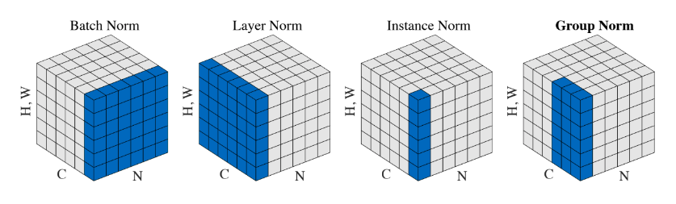

**Layer Normalization: Нормализация по слою**

-   Предположим, что мы используем пакет размера $T$.

-   $X_{ij}^{mt} \text{- четырехмерный тензор значений для некоторого слоя, где: }$\
    $1\leq i\leq H, \quad 1\leq j\leq W \text{ - пространственные координаты (ширина и высота)}$\
    $m=1...M \text{ - номер карты признаков}$\
    $t = 1...T\text{ - номер внутри пакета}$\

-   Статистика по слою:
    
    $$\mu_{B}^{t} = \frac{1}{HWM}\sum_{m}\sum_{i,j}X_{ij}^{mt}$$
    
    $$\sigma_{B}^{2t} = \frac{1}{HWM}\sum_{m}\sum_{i,j}(X_{ij}^{mt} - \mu_{B}^{t})^2$$

### Dropout

-   Для уменьшения переобучения, во время обучения нейроны выключают с
    вероятностью $0\leq 1-p\leq 1$

-   Это можно сделать зануляя выключенные нейроны

-   На тесте нейроны не выключаются, при этом выход нейрона умножается
    на p

    -   Матожидание выхода нейрона при обучении: $px+(1-p)0=px$ (т.к. мы
        либо пропускаем нейрон без изменений, либо зануляем)

    -   Поэтому при тестировании, когда все нейроны включены, их выходы
        нужно шкалировать для такого же матожидания

-   Либо при обучении делим выход на p: тогда на тесте ничего домножать
    не надо

Свёрточные нейронные сети. Семейства архитектур: LeNet, AlexNet, VGG, Inception, ResNet, DenseNet, EfficientNet.
----------------------------------------------------------------------------------------------------------------

### LeNet

Первая современная сверточная сеть была придумана в 1989 году Яном
Лекуном и сотечает в себе все необходимые вещи, используемые и по сей
день:

-   -   

Первой известной сетью стала т.н. LeNet-5 от того же Лекуна. Изменения
по сравнению с версией 1989 года:

-   Появилось два слоя

-   Постобработка на выходе (алгоритм Витерби и т.п.)

### AlexNet

Именно AlexNet прославил СНС и положил начало их повсеместному
использованию в компьютерном зрении. ПО сравнению с LeNet, привнес
множество новых трюков.\
**Особенности AlexNet**

-   Использование ReLU вместо sigmoid. Оказывается, если отказаться от
    классических на тот момент (2012) функций активации (simoid, tanh),
    то можно ускорить обучение СНС на порядок.

-   Локальная нормализация активаций. Нормализуются карты активаций.

-   Субдискретизация с перекрытием. Обычно субдискретизация (пулинг)
    используется с окном размера $z=n$ и сдвигом (страйдом), равным
    размеру окна, т.е. $s=n$. Однако, в AlexNet применяется пулинг с
    перекрытием в одну клетку, т.е. $z=n, s=n-1$.

-   обучающей выборки

-   для уменьшения переобучения. Использовалось значение $p=0.5$ на
    полносвязных слоях, на сверточных дропаут обычно не используется. Он
    помог с переобучением, но при этом время обучения возросло в
    $\frac{1}{p}=2$ раза.

-   Аугментация на тесте

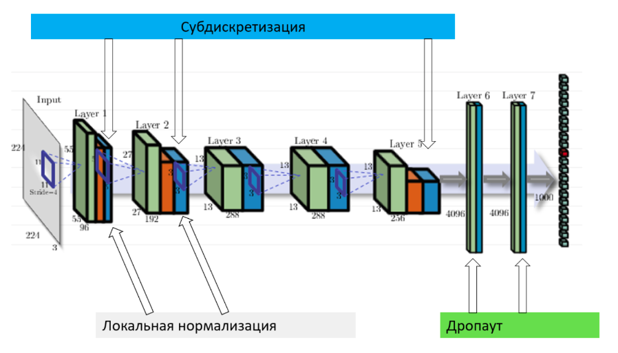

**Инициализация и оптимизатор**

-   Веса сверток задаются случайными числами из нормального
    распределения с нулевым средним и среднеквадратичным отклонением
    $0.01$

-   Коэффициент сдвига в некоторых слоя инициализируется нулем, в
    некоторых (напр. полносвязных) - единицей

-   Динамическое управление коэффициентом скорости обучения: коэффициент
    делится на 10, когда качество перестает улучшаться на валидационной
    выборке

-   Оптимизатор - momentum (накопление градиента)

-   $L_2$-регуляризация веса (weight decay)

### VGG

-   Предложена в **V**isual **G**eometry **G**roup (университет
    Оксфорда).

-   Идея простой и глубокой сверточной сети доведена до макисмума.

    -   Существуют 2 версии: VGG-16 и VGG-19 (по числу слоев с
        обучаемыми весами)

    -   Содержит огромное число параметров (138 млн и 144 млн),
        дальнейшее увеличение глубины и параметров не дало прироста на
        ImageNet

-   Используются только стандартные свертки размера $3\times 3$ (к
    примеру, в AlexNet первые две свертки были размеров $11\times 11$ и
    $5\times 5$ )

-   Входной размер $224\times 224$

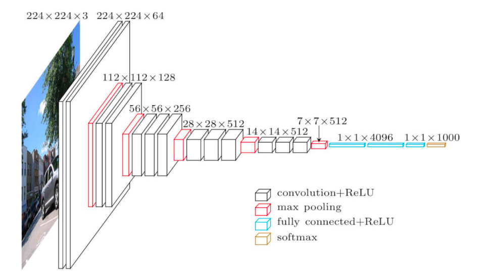

### Inception

Мотивация - хочется сделать глубокую НС, но простое добавление слоев,
как в VGG не дает прироста в качестве.\
Особенности:

-   Разреженная архитектура.

    -   Проблема: линейное наращивание сверточных слоев достаточно
        быстро себя исчерпывает (вспомним VGG).

    -   Идея: использование нелинейной разреженной архитектуры

-   Конкатенация фильтров

    -   Проблема: при линейной структуре у нас признаки с рецептивного
        поля (область, которая участвует в вычислении данного нейрона)
        одного размера (ограниченного размером свертки)

    -   Идея: конкатенировать выходы сверток разного размера на слоях
        одной глубины

-   Уменьшение сложности

    -   Проблема: при большом количестве карт много вычислений свертки

    -   Идея: с помощью свертки $1\times 1$ предварительно уменьшить
        количество карт

Сеть Inception состоит из множества Inception-блоков.

**Inception. Детали архитектуры.**

-   Количество составных блоков около 100

-   Глубина 27 слоев, из них 22 - с обучаемыми параметрами

-   Перед последним полносвязным слоем - GAP

-   Введены два дополнительных классификатора в середине сети (борьба с
    затухающим градиентом, регуляризация)

-   Функции потерь для дополнительных классификаторов домножаются на
    $0.3$

-   Используется дропаут

### ResNet

При увеличении "плоских" слоев в стиле VGG качество сети падает, а не
растет (даже на обучающей выборке, не говоря уже о тестовой). При
большой глубине НС возникает проблема затухающего градиента, таким
образом, сеть перестает обучаться.

Будем вместо целевой функции $H(x)$ обучать остаточную
(residual$\Rightarrow$ ResNet) функцию $F(x)=H(x)-x$, а целевую
рассчитывать как поточечную сумму входа $x$ и остаточной функции
$F(x): H(x)=F(x)+x$.

Таким образом мы дополнительно прокидываем тождественные связи
(identity) между входом и выходом остаточной функции (боремся с
затухающим градиентом). Эти тождественные связи носят название
"skip-connections" или "short-cuts".

-   Наиболее известны следующие разновидности ResNet (по числу
    сверточных слоев): ResNet-18, ResNet-34, ResNet-50, ResNet-101,
    ResNet-152

-   Для более глубоких сетей используется большее число карт признаков
    $\Rightarrow$ многократно возрастает количество весов фильтров и
    число операций

-   Авторы предлагают использовать дизайн бутылочного горлышка
    (bottleneck) - сначала уменьшить кол-во карт с помощью сверток
    $1\times 1$, затем применить обычную свертку $3\times 3$, и,
    наконец, вернуть кол-во карт свертками $1\times 1$. (Отчасти
    процедура схожая с такой же в Inception)

**Архитектурные особенности**

-   Перед последним полносвязным слоем применяется GAP (Global Average
    Pooling)

-   Принцип сохранения сложности (уменьшаем пространственный размер в 2
    раза $\Rightarrow$ одновременно увеличиваем в 2 раза кол-во карт
    признаков)

-   Почти везде уменьшение размерности через свертки с шагом (stride) =
    2

-   BatchNorm используется после каждой свертки

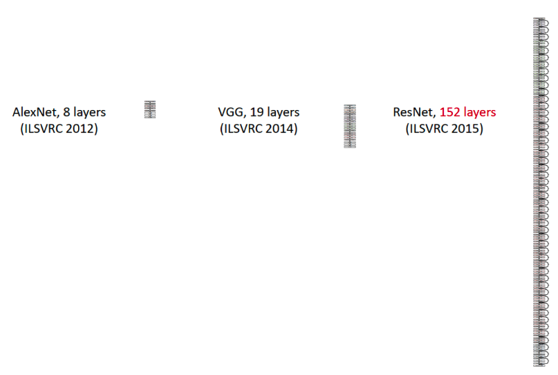

### DenseNet

Нужно больше соединений!

-   Было предложено в рамках слоев одинакового пространственного
    разрешения использовать вообще все возможные связи с помощью
    конкатенции.

-   Таким образом, если слоев $L$, то таких связей будет $L(L-1)/2$

-   DenseNet выигрывает у ResNet

### EfficientNet

Основная информация: сеть подбирается автоматически (с помощью
специального фремворка) по сетке параметров. Нужна быстрая и легкая
сеть\
Проблема: нужно оптимизировать сверточную нейронную сеть. Предыдущие
методы произвольно масштабировали размерность нейросети (например,
количество слоев и параметров). Предложенный метод равномерно
масштабирует части нейросети с фиксированными коэффициентами
масштабирования. Оптимизированные сети (EfficientNets) обходят
state-of-the-art подходы по точности при увеличении эффективности в 10
раз (меньше и быстрее).\
Эффективность масштабирования нейросети зависит от ее начальной
архитектуры. Чтобы улучшить работу нейросети, исследователи выбирали
начальную архитектуру автоматически с помощью AutoML фреймворка ---
MNAS. MNAS при выборе устройства нейросети оптимизирует и точность
модели, и ее размер одновременно. В итоге начальная модель использовала
архитектуру MBConv, схожую с MobileNetV2 и MnasNet. Начальная модель
затем масштабировалась и породила класс EfficientNets моделей.

Оптимизируются следующие параметры:

-   Глубина: $d=\alpha^{\Phi}$

-   Ширина: $w=\beta^{\Phi}$

-   Разрешение (resolution): $r=\gamma^{\Phi}$

-   s.t.
    $\alpha\cdot\beta^{2}\cdot\gamma^{2}\approx 2, \alpha\geq 1, \beta\geq 1, \gamma\geq 1$ -
    должно соблюдаться соотношение, выведенное эмпирическим путем
    (обоснования нет)

Шаги:

-   Шаг 1: для $\Phi=1.0$ параметры подбираются перебором по сетке:
    $\alpha=1.2, \beta=1.1, \gamma=1.15$

-   Шаг 2: При фиксированных $\alpha=1.2, \beta=1.1, \gamma=1.15$, меняя
    $\Phi$ получаем большие модели.

Способы искусственного расширения набора данных для увеличения обобщающей способности. Аугментация, генерация, симуляция. Перенос обучения (Transfer learning).
---------------------------------------------------------------------------------------------------------------------------------------------------------------

**Аугментация** -- генерация наборов данных на основе имеющихся данных.
К имеющимся данным применяются различные способы искажения: например,
для изображений могут использоваться различные геометрические
преобразования, искажения цвета, кадрирование, поворот, добавление шума
и иные. Для числовых данных могут использоваться такие искажения, как
добавление объектов с усреднёнными значениями, смешивание с объектами из
другого распределения, добавление случайных выбросов.

Про генерацию и симуляцию я не нашел норм инфы, но могу поделиться
мнением как я себе это представляю, и думаю, очень хорошо, если бы
кто-то из богов ML помог уточнить (например, Саит).

**Генерация** -- создание искуственных данных на уровне датасета. То
есть, аугментация является частным случаем генерации.

**Симуляция** -- создание искусственных данных уже не на уровне
датасета, а на уровне эмбеддингов (я не про таргеты, а про внутренние
представления данных из датасета).

### Transfer learning

Смысл **transfer learning** заключается в том, чтобы обучать модели,
формировать значения весов, а затем применять обученные модели для
решения других задач. Работает не всегда, т.к. например CNN-ы довольно
разнообразные, они учаться извлекать какие-то признаки с входных данных.
Эти веса для извлечения можно использовать для решения своих задач с
извлечением признаков. Но надо дообучать модели.

Если датасеты близкие, то можно просто выкинуть последний слой с $N$
классами, ставить другой последний слой с нужным $M$ количеством
классов, и дообучаем веса только на последнем слое. Так тоже делают! На
медицинские CNN так делать вообще нельзя, опасно.

Рекуррентные нейронные сети. Архитектуры RNN, GRU, LSTM. Затухание градиента, взрыв градиента. Градиентный клиппинг.
--------------------------------------------------------------------------------------------------------------------

### RNN

Люди, читая текст, понимают каждое слово, основываясь на понимании
предыдущего слова. Традиционные нейронные сети не обладают этим
свойством, и в этом их главный недостаток. Представим, например, что мы
хотим классифицировать события, происходящие в фильме. Непонятно, как
традиционная нейронная сеть могла бы использовать рассуждения о
предыдущих событиях фильма, чтобы получить информацию о последующих.\
Решить эту проблемы помогают рекуррентые нейронные сети (Recurrent
Neural Networks, RNN). Это сети, содержащие обратные связи и позволяющие
сохранять информацию.

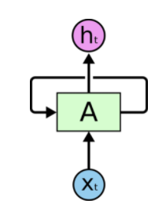

В рекуррентных сетях циклы разрешены. В этом случае выход нейрона может
быть подключен к его входу, ко входу всех нейронов в текущем слое, и ко
входу любого другого нейрона в другом слое. Рекуррентная сеть хорошо
подходит именно для анализа последовательностей потому что у нее есть
циклические соединения, через которые поступает информация о том, что
было на предыдущем шаге работы сети (память) или даже на нескольких
предыдущих шагах. Таким образом, РНС могут анализировать текст не как
набор изолированных токенов, а как последовательность.

### Как работает РНС? Разворачивание по времени:

Рекуррентную сеть можно рассматривать, как несколько копий одной и той
же сети, каждая из которых передает информацию последующей копии. На
вход копий нейронной сети поступают элементы последовательности. На вход
первой копии поступает первый элемент последовательности, на вход второй
копии - второй элемент и т.д. пока не дойдем до последней копии. На
выходе получаем два значения: выходное (a), и значение h, которое
поступает на вход копии сети в следующий момент времени - скрытое
состояние, которое учитывает то, что было на предыдущих этапах анализа
последовательности. Копия НС в следующий момент времени на сход получает
второй элемент последовательности, а также скрытое состояние с
предыдущего этапа и анализирует, выдавая снова два значения и т.д., пока
не дойдем до последнего элемента данной последовательности. Для него РНС
выдает только одно выходное значение без скрытого состояния.\
В отличие от полносвязной НС, РНС может работать с последовательностями
входных данных любой длины.

### Проблемы рекуррентных сетей: 

1.  Обучение требует длительного времени

2.  Проблема .

3.  Ограниченная длительность запоминания предыдущей информации

Иногда для выполнения текущей задачи нам необходима только недавняя
информация. Рассмотрим, например, языковую модель, пытающуюся
предсказать следующее слово на основании предыдущих. Если мы хотим
предсказать последнее слово в предложении "облака плывут по небу", нам
не нужен более широкий контекст; в этом случае довольно очевидно, что
последним словом будет "небу". В этом случае, когда дистанция между
актуальной информацией и местом, где она понадобилась, невелика, RNN
могут обучиться использованию информации из прошлого.

Но бывают случаи, когда нам необходимо больше контекста. Допустим, мы
хотим предсказать последнее слово в тексте "Я вырос во Франции \<много
текста\> Я бегло говорю по-французски". Ближайший контекст (Я бегло
говорю) предполагает, что последним словом будет называние языка, но
чтобы установить, какого именно языка, нам нужен контекст Франции из
более отдаленного прошлого. Таким образом, разрыв между актуальной
информацией и точкой ее применения может стать очень большим.\
К сожалению, по мере роста этого расстояния, RNN теряют способность
связывать информацию.

### LSTM

Долгая краткосрочная память (Long short-term memory; LSTM) -- особая
разновидность архитектуры рекуррентных нейронных сетей, способная к
обучению долговременным зависимостям. Они прекрасно решают целый ряд
разнообразных задач и в настоящее время широко используются.\
Любая рекуррентная нейронная сеть имеет форму цепочки повторяющихся
модулей нейронной сети . В обычной RNN структура одного такого модуля
очень проста, например, он может представлять собой один слой с функцией
активации tanh (гиперболический тангенс) (Рис.
[1](#fig:rnn){reference-type="ref" reference="fig:rnn"}).\

![Повторяющийся модуль в стандартной RNN состоит из одного
слоя.[]{label="fig:rnn"}](images/rnn5.png)

Структура LSTM также напоминает цепочку, но модули выглядят иначе.
Вместо одного слоя нейронной сети они содержат целых четыре, и эти слои
взаимодействуют особенным образом.

![Повторяющийся модуль в LSTM сети состоит из четырех взаимодействующих
слоев.[]{label="fig:LSTM"}](images/rnn6.png)

На Рис. [2](#fig:LSTM){reference-type="ref" reference="fig:LSTM"} каждая
линия переносит целый вектор от выхода одного узла ко входу другого.
Розовыми кружочками обозначены поточечные операции, такие, как сложение
векторов, а желтые прямоугольники -- это обученные слои нейронной сети.
Сливающиеся линии означают объединение, а разветвляющиеся стрелки
говорят о том, что данные копируются и копии уходят в разные компоненты
сети.

### Основная идея LSTM

Ключевой компонент LSTM -- это состояние ячейки (cell state) --
горизонтальная линия, проходящая по верхней части схемы.\
Состояние ячейки напоминает конвейерную ленту. Она проходит напрямую
через всю цепочку, участвуя лишь в нескольких линейных преобразованиях.
Информация может легко течь по ней, не подвергаясь изменениям.

Тем не менее, LSTM может удалять информацию из состояния ячейки; этот
процесс регулируется структурами, называемыми фильтрами (gates).\
Фильтры позволяют пропускать информацию на основании некоторых условий.
Они состоят из слоя сигмоидальной нейронной сети и операции поточечного
умножения.\

Сигмоидальный слой возвращает числа от нуля до единицы, которые
обозначают, какую долю каждого блока информации следует пропустить
дальше по сети. Ноль в данном случае означает "не пропускать ничего",
единица -- "пропустить все".\
В LSTM три таких фильтра, позволяющих защищать и контролировать
состояние ячейки.

### Пошаговый разбор LSTM

Первый шаг в LSTM -- определить, какую информацию можно выбросить из
состояния ячейки. Это решение принимает сигмоидальный слой, называемый
"слоем фильтра забывания" (forget gate layer). Он смотрит на $h_{t-1}$ и
$x_t$ и возвращает число от 0 до 1 для каждого числа из состояния ячейки
$C_{t-1}$. 1 означает "полностью сохранить", а 0 -- "полностью
выбросить".\
Вернемся к нашему примеру -- языковой модели, предсказывающей следующее
слово на основании всех предыдущих. В этом случае состояние ячейки
должно сохранить существительного, чтобы затем использовать местоимения
соответствующего рода. Когда мы видим новое существительное, мы можем
забыть род старого.

Следующий шаг -- решить, какая новая информация будет храниться в
состоянии ячейки. Этот этап состоит из двух частей. Сначала
сигмоидальный слой под названием "слой входного фильтра" (input layer
gate) определяет, какие значения следует обновить. Затем tanh-слой
строит вектор новых значений-кандидатов $\tilde{C}_t$, которые можно
добавить в состояние ячейки.\
В нашем примере с языковой моделью на этом шаге мы хотим добавить род
нового существительного, заменив при этом старый.

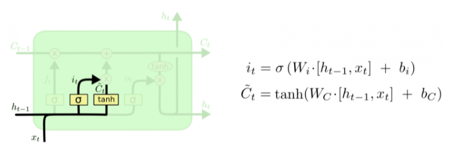

Настало время заменить старое состояние ячейки $C_{t-1}$ на новое
состояние $C_t$. Что нам нужно делать --- мы уже решили на предыдущих
шагах, остается только выполнить это.\
Мы умножаем старое состояние на $f_t$, забывая то, что мы решили забыть.
Затем прибавляем $i_t*\tilde{C}_t$. Это новые значения-кандидаты,
умноженные на $t$ -- на сколько мы хотим обновить каждое из значений
состояния.\
В случае нашей языковой модели это тот момент, когда мы выбрасываем
информацию о роде старого существительного и добавляем новую информацию.

Наконец, нужно решить, какую информацию мы хотим получать на выходе.
Выходные данные будут основаны на нашем состоянии ячейки, к ним будут
применены некоторые фильтры. Сначала мы применяем сигмоидальный слой,
который решает, какую информацию из состояния ячейки мы будем выводить.
Затем значения состояния ячейки проходят через tanh-слой, чтобы получить
на выходе значения из диапазона от -1 до 1, и перемножаются с выходными
значениями сигмоидального слоя, что позволяет выводить только требуемую
информацию.\
Мы, возможно, захотим, чтобы наша языковая модель, обнаружив
существительное, выводила информацию, важную для идущего после него
глагола. Например, она может выводить, находится существительное в
единственном или множественном числе, чтобы правильно определить форму
последующего глагола.

### GRU

**G**ated **R**ecurrent **U**nit - еще один вариант ячейки, очень
похожий на LSTM, но с меньшим количеством фильтров (двумя), а значит и
параметров. Помогает решить проблему , которая присуща обычным
рекуррентным сетям.

Для решения проблемы затухающего градиента, GRU использует т.н.
механизм, основанный на фильтрах обновления (update) и сброса (reset).
Изначально имеется два вектора, которые решают, какая информация должна
быть передана на выход. Их особенность в том, что их можно обучить
сохранять информацию, поступившую далеко в прошлом, не забывая ее и
избавляться от иррелевантной информации.

Рассмотрим ячейку GRU более подробно.

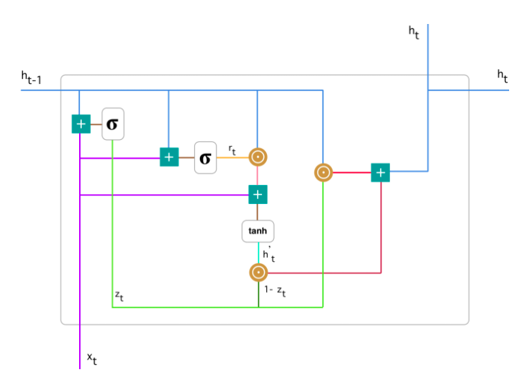

Базовые операции ячейки GRU:

**Произведение Адамара** - бинарная операция над двумя матрицами
одинаковой размерности, результатом которой является матрица той же
размерности, в которой каждый элемент с индексами $i,j$ --- это
произведение элементов с индексами $i,j$ исходных матриц. Для двух
матриц $A,B$ одинаковой размерности $m\times n$ произведение Адамара
определено как покомпонентное произведение двух матриц:

$$(A\circ B)_{i,j}=(A\odot B)_{i,j}=(A)_{i,j}\cdot (B)_{i,j}$$ 

Для двух матриц, которые имеют разные размерности, произведение Адамара не
определено. Пример для матриц $3\times 3$:

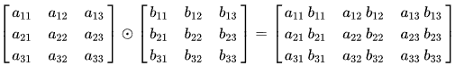

**Фильтр обновления (Update Gate)** - показывает, какое количество
прошлой информации модель должна запомнить. Начинаем с вычисления
фильтра обновления $z_t$ в момент времени $t$ по формуле:
$$z_t = \sigma(W^{(z)}x_t+U^{(z)}h_{t-1})$$

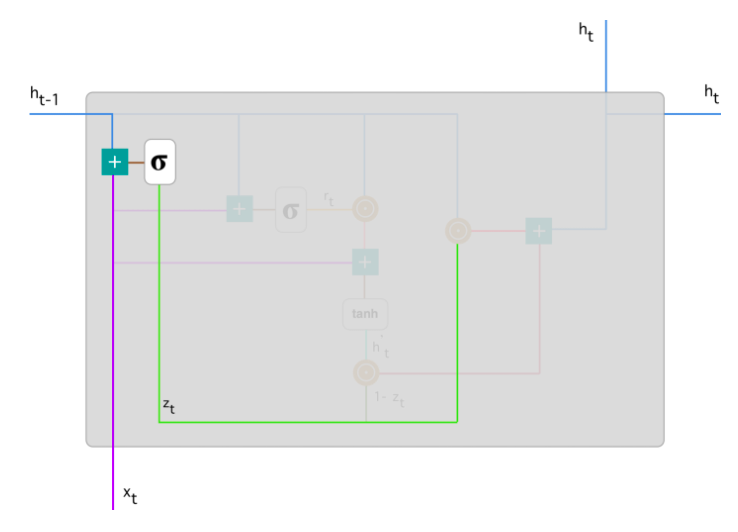

Когда $x_t$ подается на вход ячейке сети, он умножается на
соответствующий вес $W^{(z)}$. Аналогично и для $h_{(t-1)}$, который
содержит информацию о предыдущих $t-1$ элементах и умножается на
соответствующий вес $U^{(z)}$. Результаты складываются и применяется
сигмоида, чтобы получить число между 0 и 1 - степень пропуска прошлой
информации (полученной в предыдущие моменты времени) вперед, в будущее.
Это работает, потому что модель может решить скопировать всю информацию
(или большую ее часть) из прошлого и уменьшить риск возникновения
затухающего градиента.\
**Фильтр сброса (Reset Gate)** - этот фильтр используется моделью для
решения того, какое количество прошлой информации нужно забыть:

$$r_t=\sigma(W^{(r)}x_t +U^{(r)}h_{t-1})$$

Данная формула аналогична формуле вычисления фильтра обновления.
Различие лишь в том, какие веса используются для ее вычисления.

**Текущее состояние памяти.** Теперь рассмотрим, как эти два фильтра
влияют на конечный выход ячейки. Начнем с фильтра сброса. Введем новое
состояние памяти, которое будет использовать фильтр сбора для хранения
релевантной информации из прошлого:

$$h^{'}_{t}=tanh(Wx_t+r_t\odot Uh_{t-1})$$

1.  Перемножаем вход $x_t$ на вес $W$ и состояние $h_{t-1}$ на вес $U$.

2.  Вычислим произведение Адамара (поэлементно) фильтра сброса $r_t$ на
    $Uh_{(t-1)}$. Таким образом определяется сколько нужно удалить
    информации с предыдущих шагов. К примеру, решается задача анализа
    тональности текста для определения мнения человека по поводу
    какой-либо книги. Текст начинается следующим образом: " Это
    фэнтези-книга, в которой описано\..." и через несколько абзацев
    сказано следующее: "Мне не очень понравилась книга, потому что я
    думаю, что в ней слишком много деталей". Чтобы определить общий
    уровень удовлетворения книгой, нам необходима только последняя часть
    текста. В этом случае, по мере приближения к концу текста в процессе
    обучения сеть присвоит $r_t$ близкое к нулю значение, забывая всю
    предыдущую информацию и фокусируясь только на последних
    предложениях.

3.  Просуммировать п.1 и п.2

4.  Применить нелинейную функцию активации - гиперболический тангенс.

**Финальное состояние памяти в текущий момент времени**

В конце сети необходимо вычислить $h_t$ - вектор, который содержит
информацию от текущего элемента и передает ее вперед по сети. Для этого
необходим фильтр обновления, который определяет, что взять из текущего
состояния $h^{'}_{t}$, а что из предыдущих шагов - $h_{(t-1)}$:

$$h_t=z_t\odot h_{t-1}+(1-z_t)\odot h^{'}_t$$ 

Рассмотрим пример с
книгой, только в этот раз самая релевантная информация расположена в
начале текста. Модель в процессе обучения устанавливает значение $z_t$,
близкое к 1 и сохраняет большую часть предыдущей информации. Т.к. $z_t$
будет близко к 1 в текущий момент времени, $(1-z_t)$ будет близко к 0,
что позволит игнорировать большую часть текущей информации (в нашем
случае, это конец текста), которая не актуальна для предсказания.

### Взрыв градиента, затухание градиента

В процессе обратного распространения ошибки при прохождении через слои
нейронной сети в элементах градиента могут накапливаться большие
значения, что будет приводить к сильным изменениям весов. Это в свою
очередь может сделать нестабильным алгоритм обучения нейронной сети. В
таком случае элементы градиента могут переполнить тип данных, в котором
они хранятся. Такое явление называется **взрывающимся градиентом**
(англ. exploding gradient).

### Признаки, указывающие на взрывающийся градиент

-   Высокое значение функции потерь

-   Модель нестабильна, что отражается в значительных скачках значения
    функции потерь

-   Функция потерь принимает значение NaN

-   Веса модели растут экспоненциально

-   Веса модели принимают значение NaN

Существует аналогичная обратная проблема, когда в процессе обучения при
обратном распространении ошибки через слои нейронной сети градиент
становится все меньше. Это приводит к тому, что веса при обновлении
изменяются на слишком малые значения, и обучение проходит неэффективно
или останавливается, то есть алгоритм обучения не сходится. Это явление
называется **затухающим градиентом** (англ. vanishing gradient).

### Признаки, указывающие на затухающий градиент

-   Точность модели растет медленно

-   Градиент ближе к концу показывает более сильные изменения, в то
    время как градиент ближе к началу почти не показывает никакие
    изменения.

-   Веса модели уменьшаются экспоненциально во время обучения.

-   Веса модели растут экспоненциально

-   Веса модели стремятся к 0 во время обучения

### Причины

Такая проблема может возникнуть при использовании нейронных сетях
классической функции активации - сигмоиды:

$$\sigma(x)=\frac{1}{1+e^{-x}}$$

Эта функция часто используется, поскольку множество ее возможных
значений --- отрезок $[0,1]$ --- совпадает с возможными значениями
вероятностной меры, что делает более удобным ее предсказание.

[\[fig:sig\_deriv\]]

Пусть сеть состоит из подряд идущих нейронов с функцией активации
$\sigma(x)$

-   функция потерь $L(y)=MSE(y,\overline{y} )=(y−\overline{y})^2$

-   $u_d$ --- значение, поступающее на вход нейрону на слое $d$

-   $w_d$ --- вес нейрона на слое $d$

-   $y$ --- выход из последнего слоя

Оценим частные производные по весам такой нейронной сети на каждом слое.
Оценка для производной сигмоиды видна из Рис.
[\[fig:sig\_deriv\]](#fig:sig_deriv){reference-type="ref"
reference="fig:sig_deriv"}

$$\frac{\partial(L(y))}{\partial(w_d)} = \frac{\partial(L(y))}{\partial(y)}\cdot \frac{\partial(y)}{\partial(w_d)} = 2(y-\overline{y})\cdot\sigma^{'}(w_du_d)u_d\leq 2(y-\overline{y})\cdot \frac{1}{4}u_d$$

$$\frac{\partial(L(y))}{\partial(w_{d-1})} = \frac{\partial(L(y))}{\partial(w_d)}\cdot \frac{\partial(w_d)}{\partial(w_{d-1})} = 2(y-\overline{y})\cdot(\frac{1}{4})^2u_{d}u_{d-1}$$

и т.д.\
Откуда видно, что оценка элементов градиента растет экспоненциально при
рассмотрении частных производных по весам слоев в направлении входа в
нейронную сеть (уменьшения номера слоя). Это в свою очередь может
приводить либо к экспоненциальному росту градиента от слоя к слою, когда
входные значения нейронов --- числа, по модулю большие 1, либо к
затуханию, когда эти значения --- числа, по модулю меньшие 1.

В частности, сигмоида насыщается при стремлении аргумента к $+\infty$
или $-\infty$, то есть имеет там конечный предел. Это приводит к тому,
что более отдаленные слои обучаются медленнее, так как увеличение или
уменьшение аргумента насыщенной функции вносит малые изменения, и
градиент становится все меньше. Это и есть проблема затухающего
градиента.

### Способы устранения

-   Использование другой функции активации

-   Изменение модели - сокращение числа слоев. Это связано с тем, что
    частные производные по весам растут экспоненциально в зависимости от
    глубины слоя. В рекуррентных нейронных сетях можно воспользоваться
    техникой обрезания обратного распространения ошибки по времени,
    которая заключается в обновлении весов с определенной
    периодичностью.

-   Использование

-   Регуляризация весов

-   

### Градиентный клиппинг

Обрезание заключается в ограничении нормы градиента. То есть если норма
градиента превышает заранее выбранную величину $T$, то следует
масштабировать его так, чтобы его норма равнялась этой величине:

$$\nabla_{clipped} = 
 \begin{cases}
   \nabla, & ||\nabla||\leq T, \\
   \frac{T}{||\nabla||}\cdot\nabla, &\text{иначе}
 \end{cases}$$

Механизм внимания. Self-Attention, Multi-head-attention. Маскированное внимание. Архитектура трансформер и использование механизма внимания в ней. Современные языковые модели: двунаправленные энкодеры (BERT), генеративные трансформеры (GPT).
-------------------------------------------------------------------------------------------------------------------------------------------------------------------------------------------------------------------------------------------------

Рассмотрим задачу машинного перевода, т.е. нам нужно перевести фрагмент
текста с одного языка на другой, например, с английского на русский.
Подход, используемый в нейросетевой архитектуре для машинного перевода
называется *sequence-to-sequence (seq2seq)*.

### Простейшая нейросетевая архитектура

[Encoder]{style="color: myblue"}-[Decoder]{style="color: mygreen"}
архитектура состоит из $2$-ух RNN сетей
(рисунок [\[ris:seq2seq\_basic\]](#ris:seq2seq_basic){reference-type="ref"
reference="ris:seq2seq_basic"}):

-   Первая ([голубая]{style="color: myblue"}) -- рекуррентная нейронная
    сеть. Как мы помним, каждое следующее скрытое состояние обусловлено
    на все предыдущие, то есть на весь левый контекст. Поэтому последний
    синий вектор для слова\
    textit"great" кодирует весь текст, который мы подали на вход нашей
    архитектуре. Так давайте тогда возьмем этот вектор и воспользуемся
    им как закодированной информацией той фразы, которую мы хотим
    перевести -- передадим его в декодер (зеленая сеть).

-   Вторая ([зелёная]{style="color: mygreen"}) -- рекуррентная нейронная
    сеть. Ей в начало приходит скрытое состояние - закодированная фраза
    из предыдущего пункта и \<SOS\> (Start of sequence) токен. Далее мы
    генерируем слово и передаём его на вход следующего этапа. Таким
    образом мы разворачиваем закодированный вектор из енкодера и
    получаем требуемый перевод.

Часто сначала учат генерировать текст энкодер и декодер на
соответствующих языках по отдельности. Потом соединяют их как тут и
дообучают под перевод.

Причём все это обучается end-to-end. На
рисунке [\[ris:seq2seq\_loss\]](#ris:seq2seq_loss){reference-type="ref"
reference="ris:seq2seq_loss"} Нужен только размеченный датасет с
переводами, что не проблема, так как много уже переведенных текстов,
например, можно взять "Войну и Мир" на русском и английском языке.

[\[ris:seq2seq\_basic\]]

[\[ris:seq2seq\_loss\]]

### Механизм внимания. Attention

Проблема предыдущего подхода заключается в том, что декодер
обуславливается на состояние, кодирующее весь входной текст. Если
входной текст будет достаточно большой, то его embedding будет
малоинформативным.

Вспомним, как мы переводим предложения с одного языка на другой -- мы
пытаемся построить некоторое отображение слов предложения в слова
другого языка с учётом правил грамматики. Мы обращаем *внимание* на то,
какое слово из предложения мы сейчас переводим.

Давайте ровно так же, при переводе каждого следующего слова будем
обращать внимание на слова исходной фразы, причём большее внимание
обращать на то слово, которое пытаемся перевести прямо сейчас.

-   Обозначим скрытые состояния (hidden states)
    [энкодера]{style="color: myblue"} как
    $\mathbf{h}_1, \mathbf{h}_2, \dots \mathbf{h}_N \in \mathbb{R}^k$.

-   Обозначим скрытое состояние (hidden states)
    [декодера]{style="color: mygreen"} в момент времени $t$ как
    $s_t \in \mathbb{R}^k$.

-   Тогда мы можем вычислить то, насколько текущее слово, которое мы
    пытаемся перевести похоже на слова из входного текста. Для этого мы
    можем вычислить некоторую меру сходства между $s_t$ и каждым из
    $\mathbf{h}_1, \mathbf{h}_2, \dots \mathbf{h}_N$, например, вычислив
    скалярное произведение между векторами. Вычисленные меры сходства
    называются *attention scores*
    (рисунок [\[ris:attention\_01\]](#ris:attention_01){reference-type="ref"
    reference="ris:attention_01"}). Обозначим полученный вектор сходств
    как $e_t = [s_t^T\mathbf{h}_1, \dots s_t^T\mathbf{h}_N]$.

-   Нам привычнее работать с вероятностями, поэтому возьмем softmax от
    *attention scores* $e_t$ и получим *attention distribution vector*
    $\alpha_t = softmax(e_t)$.

-   А теперь давайте агрегируем все векторы входных слов с весами,
    полученные из *attention distribution vector*:
    $\mathbf{a}_t = \displaystyle\sum_{i=1}^{N}\alpha_{t, i}\mathbf{h}_i \in \mathbb{R}^k$.
    А затем приконкатенируем его к текущему скрытому состоянию
    переводимого слова $s_t$, чтобы мы могли обуславливаться на входные
    слова с учетом внимания.

[\[ris:attention\_01\]]

### Self-Attention

Идея с механизмом внимания в рекуррентных сетях крутая. А можно ли без
рекуррентных сетей?

*Self-Attention* -- механизм, который используется для того, чтобы
находить значимость любых элементов последовательности друг для друга.
Для примера, рассмотрим предложение "The animal didn't cross the street
because it was too tired"
(рисунок [1](#ris:attention2){reference-type="ref"
reference="ris:attention2"}).

![*Self-Attention* позволяет находить значимость любых элементов
последовательности друг для
друга.[]{label="ris:attention2"}](images/attention2.png)

Стоит обратить внимание на то, что у нас есть некоторая
"направленность". То есть когда мы говорим о значимости связи
$\text{element}_1\text{ и element}_2$, это не то же самое, что и связь
$\text{element}_2\text{ и element}_1$. Для того чтобы различать эти
случаи, введем направление для каждого элемента последовательности с
помощью двух векторов: [query]{style="color: mypurpur"} -- откуда и
[key]{style="color: myorange"} -- куда. Кроме того для каждого элемента
введём вектор [value]{style="color: myblue"}, который будем обозначать
смысл слова в отрыве от контекста, самого по себе.

![*Self-Attention*. У каждого слова есть его embedding, мы тренируем три
матрицы [$W^Q$]{style="color: mypurpur"},
[$W^K$]{style="color: myorange"}, [$W^V$]{style="color: myblue"}, чтобы
умножая на них вектор embedding мы переходили в пространства, с
векторами [query]{style="color: mypurpur"},
[key]{style="color: myorange"},
[value]{style="color: myblue"}[]{label="ris:attention3"}](images/attention3.png)

![*Self-Attention*. Вычисляем score как скалярное произведение
[query]{style="color: mypurpur"} текущего слова и
[key]{style="color: myorange"} другого, нормализуем, берем софтмакс,
[value]{style="color: myblue"} вектор, суммируем по всем таким
результатам с [key]{style="color: myorange"} других векторов, получаем
новый вектор z для каждого элемента последовательности. Это результат
*Self-Attention*
слоя.[]{label="ris:attention4"}](images/attention4.png)

### Multi-head-attention

*Multi-head-attention* -- это много *Self-Attention* (как много фильтров
в свертках), каждая из голов может выполняться параллельно, в чем
большое преимущество над RNN. Зачем? -- между словами можно пытаться
уловить зависимости разного рода, каждую из таких зависимостей будет
пытаться уловить свой *Self-Attention*.

![*Multi-head-attention*[]{label="ris:attention5"}](images/attention5.png)

### Трансформер

![Архитектура
трансформер.[]{label="ris:transformer"}](images/transformer.png)

[\[ris:transformer\_encoder\]]

Декодер в
трансформере(рисунок [\[ris:transformer\_decoder\]] очень похож на энкодер, но только
в нём используются key и value из энкодера, а query из самого декодера,
это нужно для того, чтобы использовать внимание как в seq2seq модели с
двумя RNN.

Кроме того используется
маскирование, для того, чтобы декодер не подглядывал
на все предложение, а считал внимание только на текущей обработанной
части фразы. Для этого зануляются вектора тех элементов, до которых
декодер ещё не дошел на этой итерации.

*Маскирование в декодере.*

### BERT

Взяли энкодер часть из трансформера, добавили несколько модификаций и
назвали это дело BERT-ом. \[CLS\] токен в начале, в нём по результатам
будет все скрытое представление входного текста. Далее маскируем один
токен из на входе \[MASK\], и пытаемся предсказать его на выходе. Таким
образом производим обучение.

![BERT. Прдсказывание \[MASK\]
слова[]{label="ris:BERT"}](images/BERT-language-modeling-masked-lm.png){#ris:BERT
width="16.0cm"}

Можно еще предсказывать, что одно слово за другим по смыслу или нет:

![BERT. Предсказывание предложения одно за другим или
нет[]{label="ris:bert"}](images/bert-next-sentence-prediction.png){#ris:bert
width="16.0cm"}

![BERT. Transfer Learning. Можно сначала учить на большом корпусе решать
общую задачу, а затем дообучаться под подзадачу, в том числе используя
\[CLS\]
токен.[]{label="ris:bert-transfer-learning"}](images/bert-transfer-learning.png){#ris:bert-transfer-learning
width="16.0cm"}

### GPT

-   GPT-2 появился параллельно с BERT примерно.

-   Основан на декодере трансформера.

-   Обучим его просто предсказывать следующее слово.

-   GPT-2 на 1.5 миллиарда параметров, а GPT-3 на 150 миллиардов
    параметров.

-   Обучим на огромном массиве данных (8 миллионов веб-страниц для
    GPT-2)

![GPT-2 это декодер трансформера, а BERT это энкодер
трансформера.[]{label="ris:gpt-2-transformer-xl-bert-3"}](images/gpt-2-transformer-xl-bert-3.png)

Контрастивное обучение. Примеры из компьютерного зрения и языковых задач. Сиамские сети. Функции потерь: constrastive loss, triplet loss.
-----------------------------------------------------------------------------------------------------------------------------------------

### Сиамская сеть

В московском метро есть системы для распознавания лиц. Людей в Москве
огромное количество, поэтому нейронные сети не решают задачу
классификации, иначе output вектор был бы огромной размерности, и меток
при обучении тоже будет очень много. Тем не менее иногда хочется
разыскивать людей или еще что. Мы можем сравнивать людей с фотографиями
в базе. Необходимо уметь отвечать на вопрос -- являются ли эти два
изображения представителями одного класса?.

*Сиамская сеть* -- это сеть, в которой два раза дублируется одна и та же
архитектура, причём веса у них общие. Входные экземпляры подаются по
одному в каждую сеть (например, две картинки). В результате получаем два
вектора embedding, которые и можно сравнить на схожесть с помощью
*constrative loss*.
Рисунок [\[ris:siamse\_network\]](#ris:siamse_network){reference-type="ref"
reference="ris:siamse_network"}.

При обучении такой сети можно аугментировать фото одного и того же
человека и ожидать на выходе метку 1 -- фото одного человека. И ожидать
метку 0 для фотографий разных людей.

[\[ris:siamse\_network\]]{#ris:siamse_network
label="ris:siamse_network"}

### Constrastive loss

Для каждого фиксированного изображения -- якоря (anchor) мы можем
сопоставить изображение того же класса (positive) и изображение из
другого класса (negative). Тогда эталонный ответ в первом случае должен
быть 1, а во втором 0
(рисунок [\[ris:anchor\_pos\_neg\_example\]](#ris:anchor_pos_neg_example){reference-type="ref"
reference="ris:anchor_pos_neg_example"}). ($r$ -- embedding, $d$ --
расстояние, $margin$ -- некоторая константа, на которое хотим отделить
негативные пары)

*Constrastive loss* для сиамской сети:

$$L =
\begin{cases}
d(r_{anchor}, r_{positive}), & \text{if positive pair}\\
max(0, margin - d(r_{anchor}, r_{negative})), & \text{if negative pair}
\end{cases}$$

[\[ris:anchor\_pos\_neg\_example\]]{#ris:anchor_pos_neg_example
label="ris:anchor_pos_neg_example"}

### Triplet loss

Рассмотрим теперь аналог сиамской сети -- сеть, состоящую из трёх частей
с общей архитектурой и одинаковыми весами, которая на вход принимает $3$
изображения -- якорь, изображение позитивного класса и изображение
негативного класса (рисунок [1](#ris:triplet){reference-type="ref"
reference="ris:triplet"}).

Для этой сети можно рассмотреть похожий по логике *triplet loss*:

$$L = max(0, margin + d(r_{anchor}, r_{positive}) - d(r_{anchor}, r_{negative})).$$

![Теперь не сиамская сеть, а скажем
"тройная"[]{label="ris:triplet"}](images/triplet.png){#ris:triplet
width="16.0cm"}

Генеративные модели в компьютерном зрении (генеративно-состязательные нейронные сети). Принцип работы генератора и дискриминатора.
----------------------------------------------------------------------------------------------------------------------------------

Формально задача порождающих моделей, с точки зрения максимизации
правдоподобия, выглядит следующим образом: для набора данных
$D = {x_i}^N){i=1}$ максимизировать $\Pi^N_{i=1}(x_i,\theta)$

$\underset{\theta}{\operatorname{argmax}} \sum_{i=1}^{N} \log p_{\text {model }}(x_{i}, \theta)$

Также мы можем думать о задаче максимизации правдоподобия, как о задаче
минимизации KL дивергенции (позволяет померить расстояния между
распределениями, чем оно меньше, тем лучше генерируем):

$\underset{\theta}{\operatorname{argminKL}}(P_{data}(x)||P_{model}(X,\theta)$

Таким образом мы хотим имея случайный вектор и класс $Y$ сгенерировать
синтетический пример $X$ и найти условное распределение $P (X | Y)$

Свойства, которые нужно достичь:

-   Точность (Fidelity) -- отвечает за качество генерируемых примеров,
    их реалистичность;

-   Разнообразие (Diversity) -- Генератор не должен порождать одно и
    тоже.

[\[ris:gen\_classification\]]{#ris:gen_classification
label="ris:gen_classification"}

### GAN

GAN - одна из наиболее эффективных архитектур для создания реалистичныйх
данных.

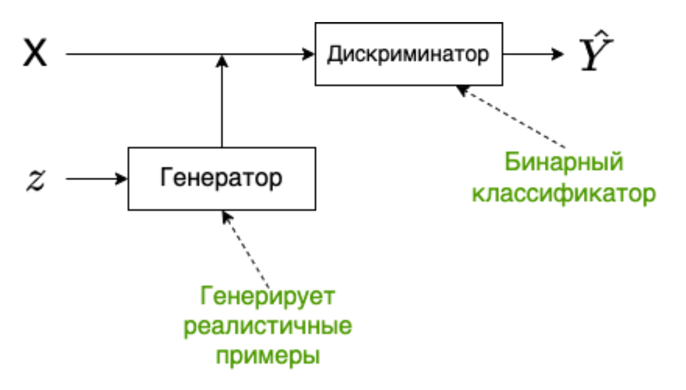

[\[ris:gan\_arc\]]

Состоит из двух сетей: генератора и дискриминатора.

**Генератор** -- порождает объекты в пространстве синтетических данных.
Он пытается «обмануть» дискриминатор, сделать так, что дискриминатор не
может различать распределение реальных данных и распределение
синтетических, которое порождает генератор.

**Дискриминатор** -- классификатор, который учится отличать порожденные
объекты от примеров из обучающей выборки.

### Обучение генератора и дискриминатора

Процесс обучения GAN выглядит следующим образом: создаем случайный
вектор $z$, подаем его на вход генератору, генератор порождает
синтетический пример $\hat{X}$, далее $\hat{X}$ и пример из реальных
данных $X$ подаются в дискриминатор, который выдает вероятность того
что, синтетический пример является действительно синтетическим или нет.
После чего вычисляется значение функции потерь и выполняется обратное
распространение ошибки *только для дискриминатора*, с корректировкой
весов дискриминатора.

[\[ris:disc\_learning\]]

Далее выполняется следующий шаг обучения, только на этом этапе в
дискриминатор мы подаем $\hat{X}$. В функции ошибки мы рассматриваем
только метки, которые совпали с реальными, после чего выполняем обратное
распространение ошибки *для генератора*, дискриминатор в этом процессе
не участвует. Затем корректируем веса генератора.

[\[ris:gen\_learning\]]

В процессе тренировки качество генератора и дискриминатора должно
оставаться сопоставимым, иначе если дискриминатор распознает
синтетические данные со $100\%$ вероятностью, генератор перестанет
учиться.

**Недостатки GAN**

Главным недостатком GANs является попадание модели в состояние mode
collapse. (например дискриминатор быстрее обучается (ему нужно просто
провести гиперплоскость между двумя распределениями), тогда генератор
больше не сможет обучаться, нужно искать баланс, чтобы дискриминатор
помогал обучаться генератору)

Следствие попадания в состояние mode collapse: модель постоянно
генерирует пример или примеры одного и того же класса или нескольких
классов, хотя обучалась она на примерах, размеченных для большего
количества классов.

Это проблема разнообразия (diversity). Такое происходит когда генератор
застревает в локальном минимуме и объединяет несколько мод (mode - пик в
распределении) в одну, после чего генерирует только эту моду.

Этот недостаток был связан в первую очередь с тем, что повсеместно
применяли в качестве функции ошибки бинарную перекрестную энтропию

### Лосс и метрики (в билете нет, нужно понимание на уровне идеи)

**Бинарная перекрестная энтропия** (BCE) - часто использовали, возникает
проблема с разнообразием при обучении, так как дискриминатор менее
глубокий, обычно, и учится быстрее. BCE на некоторых участках не имеет
наклона, что приводит к проблеме исчезающего градиента.

Расстояние Вассерштейна - нужно, чтобы сравнивать не метки классов, а
распределения данных.

**Earth Movers Distance** (EMD) - измеряет расстояние между двумя
распределениями и оценивает усилия, необходимые для того чтобы
генерируемое распределение сделать очень похожим на реальное.

Аппроксимацией EMD является расстояние Вассерштейна или W-loss.

$\underset{g}{\operatorname{min}}\underset{c}{\operatorname{max}} (c(x)) - (c(g(z)))$

Генератор пытается минимизировать расстояние, а critic максимизировать.
Важное требование к функции critic, она должна быть 1-L непрерывной по
Липшицу. Это означает что норма для градиента в любой точке не должна
быть больше единицы $||f(x)||_2 <= 1$

**Расстояние Фреше** или Frechet inception distance(FID), одна из
основных метрик оценки качества для GAN. Изначально эта метрика
применялась для измерения расстояния между двумя кривыми, но в
последствии стало понятно, что с помощью данной метрики можно сравнивать
распределения.

Одномерный случай:
$d(X, Y) = (\mu_x - \mu_y)^2 + (\sigma_x - \sigma_y)^2$

Базовый подход для рассчета FID, на примере генерации изображений,
содержит следующие шаги:

1\. используем предобученную на ImageNet модель строим эмбеддинги для
реальных примеров;

2\. используем предобученную на ImageNet модель строим эмбеддинги для
синтетических примеров;

3\. строим многомерные нормальные распределения для реальных и
синтетических данных;

4\. рассчитываем FID для созданных распределений.

**Inception score** Идея состоит в том что мы берем предобученный
классификатор Inceptionv3, подаем на вход сгенерированный пример и
смотрим распределение вероятностей по классам, один из классов должен
иметь макс значение, тогда у нас соблюдается точность (fidelity), а тот
факт что у других классов вероятность \> 0 говорит о разнообразии
(diversity).

Недостатки:

Не замечает проблем с разнообразием(diversity) -- к примеру модель будет
генерировать одно и тоже изображение для каждого класса, IS покажет
хорошую оценку, но в идеале GAN должен уметь генерировать несколько
разных изображений для одного класса. Это явно говорит о mode collapse.

Учитывает только сгенерированные сэмплы -- не выполняет сравнение между
реальными и сгенерированными сэмплами.

Autoencoder. Variational autoencoder. Примеры прикладных задач. Концепция сжатия информации. KL-дивергенция.
------------------------------------------------------------------------------------------------------------

### AutoEncoder

*AutoEncoder* -- нейронная сеть, в которой энкодер сжимает входные
данные в скрытое состояние, а затем декодер разжимает скрытое состояние
обратно (рисунок [1](#ris:autoencoder){reference-type="ref"
reference="ris:autoencoder"}). Цель - сделать реконструкцию
оригинального изображения так, чтобы расстояние между реконструированным
изображением и оригинальным было минимальным (расстояние -
попиксельное). Сжимающая часть сети - *Encoder*. Разжимающая часть сети
- *Decoder*. В качестве функции потерь $\mathcal{L}$ используется ошибка
реконструкции входа и выхода, например $L_2$ норма.

![Архитектура
AutoEncoder[]{label="ris:autoencoder"}](images/autoencoder.png){#ris:autoencoder
width="8.5cm"}

[\[ris:denoising\_autoencoder\]]{#ris:denoising_autoencoder
label="ris:denoising_autoencoder"}

### Variational autoencoder

*Variational autoencoder* -- это автоэнкодер, в котором пытаются сделать
так, чтобы скрытое состояние было из определенного распределения, как
правило, из нормального. Предположим, что распределение скрытого
состояния -- нормальное. Мы заменяем скрытое состояние на вектор,
состоящий из mean vector и std vector. Затем мы сэмплируем embedding
вектор из этого распределения. В результате скрытое подпространство VAE
лучше, чем у AE.

![VAE архитектура.[]{label="ris:VAE"}](images/VAE.png)

Распределение скрытого состояния приближаем к нормальному с помощью
$KL$-дивергенции:

$$KL(p || q) =  - \sum p \log(q) + \sum p \log(p) = \sum p \frac{\log(p)}{\log(q)}.$$

Тогда общий loss для VAE:

$$L_{VAE} =  \mathcal{L}_{reconstruction} + KL(q(z) || N(\mu, \sigma)).$$

Задачи компьютерного зрения. Задачи детекции. Описание принципов работы RCNN, YOLO. Задача сегментации. Семантическая сегментация. Паноптическая сегментация. Описание принципа работы U-net. Задача распознавания лиц. Подходы для метрического обучения.
----------------------------------------------------------------------------------------------------------------------------------------------------------------------------------------------------------------------------------------------------------

### Задачи компьютерного зрения

Их много, основными являются те, что указаны на
рисунке:

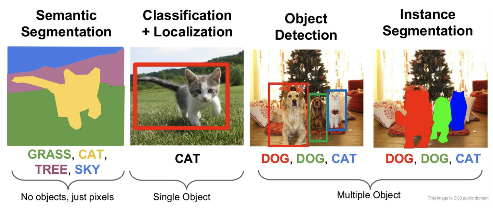*Задачи компьютерного зрения.*

### Задача детекции

**Недостатки классификации**

-   Классификация затруднена, если на одном изображении есть несколько
    объектов разных типов

-   Классификация не говорит от том, есть ли на изображении несколько
    объектов одного типа

-   Только классификации недостаточно для большинства приложений.

Главное отличие задачи детектирования от задачи классификации в том, что
надо не только сказать, есть ли объект на изображении, но и
**локализовать** область нахождения объекта. Если объектов несколько, то
требуется найти их все.\
**Формальное определение обнаружения объектов**

-   Вход: изображение

-   Выход (soft): набор троек \<тип объекта (object type), уверенность
    (confidence), прямоугольник (bounding box)\>

-   Для реальных приложений важнее hard-выход: набор пар \<тип объекта,
    прямоугольник\>, но для сравнения детекторов нужен soft-выход

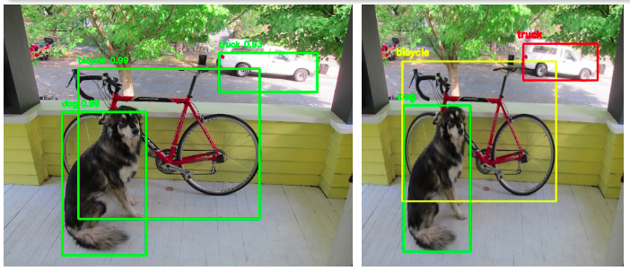*Слева - soft-выход, справа - hard-выход*

### Метрики

**Как понять, что один метод обнаружения лучше другого?**\
Для этого используется метрика mAP - Mean Average Precision на основе
метрик : 

$$p = \frac{TP}{TP+FP}, r=\frac{TP}{TP+FN}$$

**Определение mAP** 
$$AP = \int_{0}^{1}p(r)dr$$

$$mAP = \frac{1}{n}\sum_{i=1}^{n}AP_i$$ 

где $n$ - количество классов, а
$AP_i$ - $AP$ для $i$-го класса.\
*AP (Average Precision)* - вычисляется средняя точность для Recall в
диапазоне от 0 до 1 для одного класса, *mAP* - среднее значение AP по
всем классам.\
Для того, чтобы воспользоваться формулами для mAP необходимо определить
TP, FP, FN. Для этого вычислим Intersection over Union (IoU):

$$IoU=\frac{area\quad of\quad overlap}{area\quad of\quad union}$$

**TP:** IoU\>0.5;\
**FP:** IoU\<0.5 или нет пересечения, или дубликат.\
**FN:** нет обнаружения или IoU\>0.5 и неправильно определен класс
объекта;

### Нейросетевой детектор: R-CNN (Regions with CNN Features)

Детектор состоит из следующих модулей:

-   Предсказыватель объектов (около 2000 кандидатов на изображение)

-   Классификатор (без классификационной головы) для извлечения
    признаков каждого кандидата

-   Линейный SVM для классификации кандидата

**Алгоритм предсказания детекций** - selective search. В основе
алгоритма селективного поиска (selective search) лежит использование
метода иерархической группировки похожих регионов на основе соответствия
цвета, текстуры, размера или формы и графов. Для этих графов вершиной
является интенсивность текущего пикселя, а ребра соединяют пару соседних
пикселей. Абсолютная разница интенсивностей пикселей вершин используется
в качестве веса ребра. С помощью графа выделяются фрагменты, которые
затем группируются, согласно следующему принципу: ребра между двумя
вершинами в одной группе должны иметь меньшие веса, а ребра между двумя
вершинами в разных группах должны иметь больший вес. После того, как два
наиболее похожих региона сгруппированы, между полученным регионом и его
соседями вычисляется новое сходство. Процесс группировки наиболее
похожих областей повторяется до тех пор, пока все изображение не станет
одной областью. *Данный алгоритм не настраивается на данные*.\
**Backbone для извлечения признаков**

-   В качестве начальной инициализации берется классификационная сеть,
    обученная на 1000 классов из ImageNet

-   Удаляется последний слой и заменяется на слой нужного размера со
    случайной инициализацией (добавляется новый класс - фон)

-   Обучение производится на тех изображениях с разметкой, у которых
    IoU\>0.5, а остальные рассматриваются как негативные

**R-CNN: Обучение** Классификатор категорий:

-   Для каждого класса обучается свой линейный SVM (один против всех)
    Для отделения негативных примеров используется другой порог - IoU \<
    0.3 (параметр подбирается по валидации и от него очень сильно
    зависит финальный результат)

Корректировка детекций (bounding box regression):

-   Гребневая регрессия

**Достоинства и недостатки R-CNN**\
Достоинства:

-   Один из лучших методов для своего времени

-   Bounding box regression улучшает качество

-   Замена backbone на более продинутый улучшает качество

Недостатки:

-   Самый главный недостаток - скорость работы (т.к. одни и те же куски
    картинки обрабатываются много раз)

-   Сложное многоэтапное обучение

-   Обучение требует много дискового пространства и выч. ресурсов

-   Selective Search - необучаемый алгоритм

### Нейросетевой детектор YOLO

Идея:

-   Изображение покрывается сеткой $S\times S$

-   Выход сети представляет собой тензор размера
    $S\times S\times (B\cdot 5 +C)$, где $B$ - количество детекций с
    центром в этой ячейке, $C$ - количество классов

-   Детекция - это вектор $(x,y,w,h,confidence)$

-   Для всех детекций ячейки вычисляется только одно распределение по
    классам

-   Каждая ячейка предсказывает только один объект

**YOLO: Архитектура**

**Достоинства и недостатки YOLO**\
Достоинства:

-   Быстрый алгоритм, может работать в режиме реального времени

-   Все предсказания дает одна нейронная сеть, которая обучается
    end-to-end

-   Использует для предсказания всё изображение

-   Обладает хорошей обобщающей способностью

Недостатки:

-   Ограниченное количество обнаружений на ячейку

YOLO, как и большинство детекторов, может дублировать обнаружения для
одного и того же объекта. Чтобы исправить это обычно применяют алгоритм
NMS для удаления дубликатов. Такой постпроцессинг добавляет 2-3% mAP.\
Типичная реализация алгоритма выглядит следующим образом:

-   Отсортировать предсказания по confidence

-   Начиная с самых больших показателей идем по предсказаниям и удаляем
    обнаружения с тем же классом и IoU \> 0.5 с предыдущими
    предсказаниями

### Задача сегментации

При *семантической сегментации* мы каждому пикcелю изображения
присваиваем класс (котик на
рисунке [\[ris:cv\_tasks\]](#ris:cv_tasks){reference-type="ref"
reference="ris:cv_tasks"}). При *instance сегментации* мы хотим
классифицировать лишь пиксели отдельных объектов (собачки и котик на
рисунке [\[ris:cv\_tasks\]](#ris:cv_tasks){reference-type="ref"
reference="ris:cv_tasks"}). Важно отметить, что собаки при семантической
сегментации были выделены как "DOG", а при instance сегментации каждая
собака будет выделена отдельно. А вот *паноптическая сегментация*
объединяет в себе семантическую и instance сегментацию.

Примеры, где можно решать задачу сегментации -- беспилотные автомобили,
сегментация новообразований на снимках МРТ.

![Задача сегментации. (В данном случае семантическая сегментация),
итоговую маску можно сжать с помощью run-length encoding (то есть 5
одинаковых black пикселя будем обозначать
B5).[]{label="ris:segmentation1"}](images/segmentation1.png)

Трансформеры в компьютерном зрении. Описание принципа работы архитектуры ViT и его разновидностей.
--------------------------------------------------------------------------------------------------

ViT -- Vision Transformers. Общая концепция очень похожа на NLP
трансформеры. Изображение делится на патчи (маленькие кусочки), затем
полносвязный слой и позиционное кодирование на получившихся embeddings.
А потом encoder часть из трансформера (как в BERT), затем еще одна
полносвязная часть для классификации / или другой целевой задачи.
Смотреть рисунок [\[\]](#){reference-type="ref" reference=""}

![Базовая архитектура ViT.[]{label="ris:ViT"}](images/ViT.png)

Общепринятый подход к задачам компьютерного зрения --- использовать
картинки как 3D array (высота, ширина, количество каналов) и применять к
ним свертки. У такого подхода есть ряд недостатков:

-   не все пиксели одинаково полезны. Например, если у нас задача
    классификации, то нам важнее сам объект, чем фон. Интересно, что
    авторы не говорят о том, что Attention уже пробуют применять в
    задачах компьютерного зрения

-   Свертки не достаточно хорошо работают с пикселями, находящимися
    далеко друг от друга. Есть подходы с dilated convolutions и global
    average pooling, но они не решают саму проблему

-   Свертки недостаточно эффективны в очень глубоких нейронных сетях.

*Идея*: конвертировать изображения в некие визуальные токены и подавать
их в трансформер\

-   Вначале используется обычный backbone для получения feature maps

-   Далее feature map конвертируется в визуальные токены

-   Токены подаются в трансформеры

-   Выход трансформера может использоваться для задач классификации

-   А если объединить выход трансформера с feature map, то можно
    получить предсказания для задач сегментации\

**Visual transformer**\
Каждый visual transformer состоит из трёх частей: токенизатор,
трансформер, проектор (projector)

**Токенизатор**

Токенизатор извлекает визуальные токены. По сути мы берем feature map,
делаем reshape в (H \* W, C) и из этого получаем токены

**Position encoding**

Как обычно, трансформерам нужны не только токены, но ещё и информация об
их позиции.

$$P = downsample(A)^\intercal W_{A \to P}$$

Вначале мы делаем downsample, потом домножаем на тренируемые веса и
конкатенируем с токенами. Для корректировки количества каналов можно
добавить 1D свертку.

**Transformer**

$$T_{out} = T_{in} + (softmax((T_{in}K)(T_{in}Q)^\intercal) (T_{in}V))F$$

$T_{in}, T_{out}$ - входящие и выходящие токены.

Нейросетевые модели для работы со звуком. Задача распознавания речи. Задача преобразования речи в текст. Модели Tacatron, Wave2Vec. CTC-loss.
---------------------------------------------------------------------------------------------------------------------------------------------

**Акустический сигнал** -- физическое явление, представляющее собой
распространение в виде упругих волн механических колебаний в твёрдой,
жидкой или газообразной среде

Сигнал часто повторяется через равные промежутки времени, так что каждая
волна имеет одинаковую форму. Высота волны показывает интенсивность
сигнала и известна как **амплитуда**. Время, которое требуется для одной
волны называется **период**. Количество волн в сигнале в секунду
называется **частотой**. Таким образом частота является обратной
величиной периода. Единицы измерения частоты -- Hertz. 1 Hz -- одно
колебание в секунду.

Для того чтобы представить сигнал в цифровом виде мы должны
преобразовать его в числовые последовательности, которые далее мы можем
использовать для обучения наших моделей. Это делается путем измерения
значения амплитуды сигнала в фикцированные интервалы времени. Каждый
такой замер называется сэмплом, а sample rate или **частота
дискретизации** -- количество таких замеров (сэмплов) в секунду. Пример:
максимальная частота дискретизации записи и воспроизведения для
мобильных устройств 22 050 Hz. Таким образом 10 секундной записи будет
соотвествовать 220 500 сэмплов.

**Звуком** называют акустические колебания в диапазоне частот от 16 Hz
до 20 000 Hz. Ниже (инфразвук) и выше (ультразвук) человеческое ухо не
слышит, да и в пределах звукового диапазона чувствительность слуха
весьма неравномерна.

Прежде мы рассматривали **волновое** представление сигнала, когда по оси
абсцисс было отложено время, а на оси ординат амплитуда. Это
представление сигнала называется **временным** или **time domain**.

**Спектр** -- это альтернативный способ представить сигнал, который
отражает диапазон частот в конкретный момент времени. Такое
представление называется **частотным** или **frequency domain**.

Наименьшая частота в сигнале называется **фундаментальной частотой**.
Частоты, которые представляют собой фундаментальную частоту умноженную
на целое число называются **гармониками**.

Связь между временным и частотным представлениями сигнала:

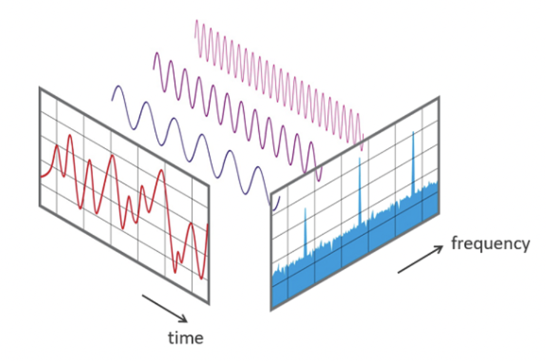

Спектрограммы обычно получают путем применения преобразования Фурье к
исходному сигналу. Пример спектрограммы:

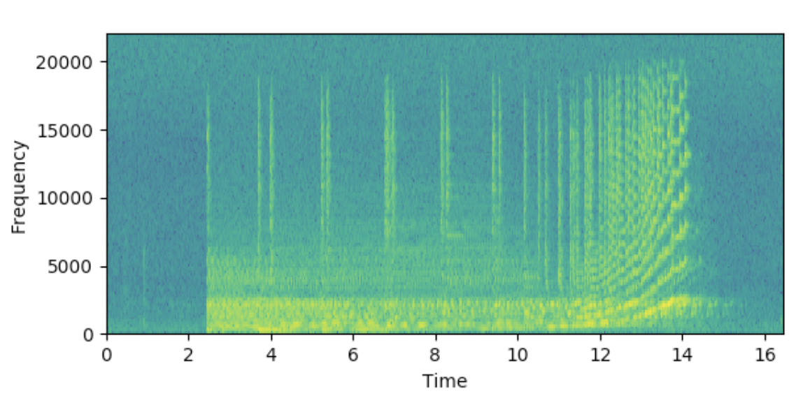

**Фонема** - минимальная смыслоразличительная единица языка - типа одной
транскрипции на английском, с учётом всех возможных вариаций для этой
транскрипции.

Архитектуры всех нейронных сетей приведены опционально, сомневаюсь, что
их будут серьёзно спрашивать, но вот про преимущества и недостатки, а
также ключевые особенности может быть спросят.

**WaveNet (модель для генерации речи)**\
Впервые получилось смоделировать аудиосигнал. Каждый семпл зависит от
предыдущих:

$$P(x|h)=\prod_{t=1}^{T} P\left(x_{t} \mid x_{1}, x_{2}, \ldots, x_{t-1}, h\right)$$

где h - информация о тексте в случае TTS.

Общий вид WaveNet:

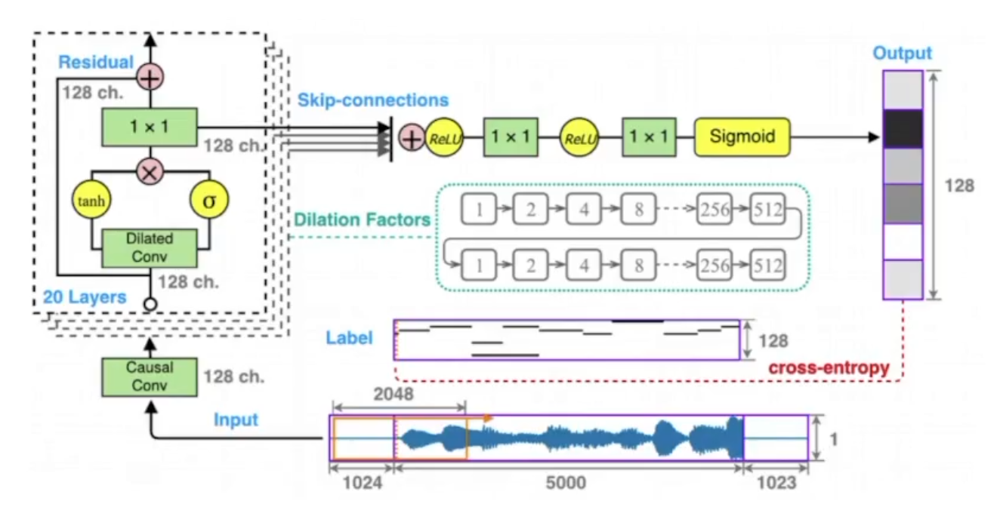

Основная идея реализована в дилатационных свёртках:

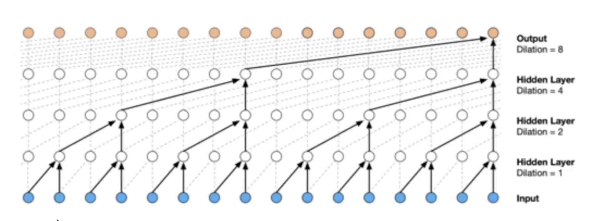

Преимущества и недостатки:

-   Оценка MOS порядка 4.21 (примерно 4.5 для речи проф. диктора)

-   Генерирует необработанные звуковые сигналы (16.000 сэмплов в
    секунду)

-   Вычилительно дорогой синтез

-   Требует доп. информацию типа ударений или основной частоты

-   Требует подготовки размеченных текстов

**DeepVoice (модель для генерации речи)**\
DeepVoice состояла из 4х независимых моделей:

-   Segmentation: определяет границы между фонемами

-   Graphem-to-phoneme

-   Duration prediction и Fundamental frequency

-   Audio synthesis - преобразованный WaveNet

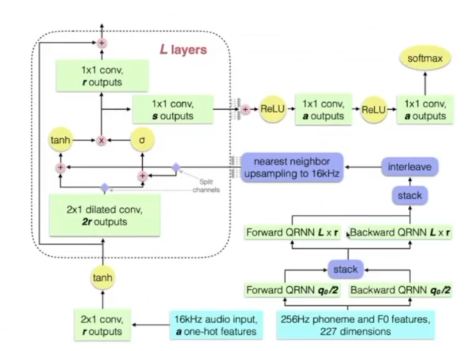

Преимущества и недостатки:

-   Оценка MOS порядка 2.67

-   Первая модель end-to-end

-   По скорости близка к реал-тайму

**Tacotron (модель для генерации речи)**\

**Encoder**

Цель encoder построить представление текста. На входе encoder получает
последовательность символов, где каждый символ представлен one-hot
вектором, на выходе из encoder мы получаем уже непрерывное
представление.

-   В процессе работы к каждому one-hot вектору применяются не линейные
    преобразования объединенные в слой PreNet.

-   Далее результаты из PreNet передаются в CBHG модуль 32, состоящего
    из одномерных сверток, pooling слоя, так называемого «highway»
    модуля состоящего из 4 полносвязанных слоев, bidirection GRU слоя и
    residual connections.

-   Сверточные слои позволяют извлечь информацию о контексте
    (моделировать униграммы, биграммы, К-граммы).

-   На выходе из CBHG благодаря GRU слою нам удается извлечь признаки с
    учетом предыдущего и будущего контекстов. Помимо прочего, благодаря
    CBHG удается снизить количество ошибок в произношении, по сравнению
    с приминением стандартных RNN слоев.

**Decoder**

-   После извлечения признаков из текста, полученный результат
    передается в слой с механизмом внимания, который строит вектор
    контекста. Такие контекстные вектора строятся для кажого отрезка
    времени.

-   Далее вектор контекста складывается с результатами работы RNN,
    которая принимает на вход спектрограммы, сгенерированные на
    предыдущем шаге.

-   Далее результат попадает в CBHG, который преобразует его в линейную
    спектрограмму.

-   После чего с помощью алгоритма Гриффина-Лима, который основан на
    минимизации среднеквадратичной ошибки между оконным преобразованием
    Фурье оцениваемого сигнала и имеющимся преобразованием в
    спектрограмме, строится сам аудиосигнал.

Подробнее про модуль CBHG:

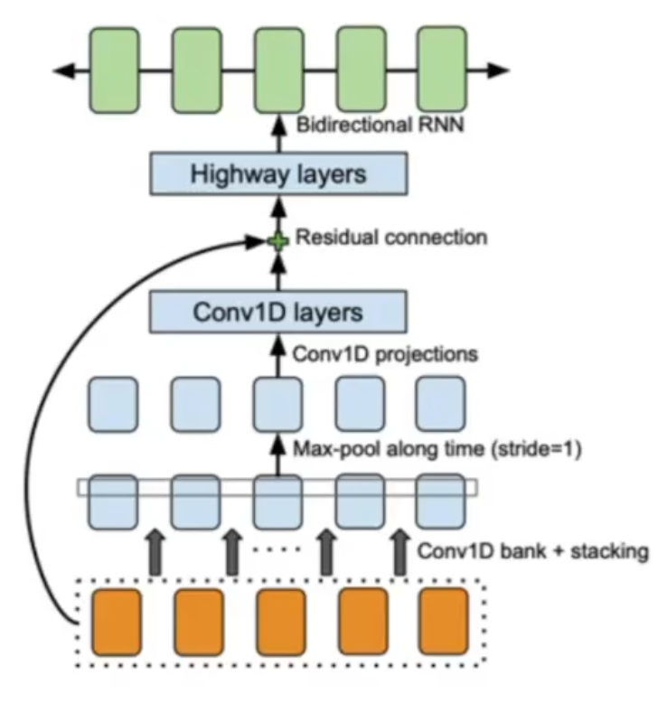

Оценка MOS - 3,82

**CTC loss (найдено в интернете)**

-   CTC loss --- это "softmax" слой
    $p_{l}=\frac{\exp \left(x_{l}\right)}{\sum_{k} \exp \left(x_{k}\right)}$

-   Количество выходов слоя на 1 больше, чем всего маркеров
    $\boldsymbol{L}$

-   Активация первых \|L\| элементов слоя интерпретируется как
    вероятность

-   Активация дополнительного юнита интерпретируется как отсутствие
    маркера. "blank"

**Wave2Vec (модель для распознавания речи)**

Новая модель распознавания речи Facebook AI --- это последняя разработка
за несколько лет работы над моделями распознавания речи. Её
предшественниками стали wav2letter, wav2vec, Librilight, wav2vec 2.0,
XLSR и wav2vec 2.0.

Facebook разработала систему распознавания речи wav2vec Unsupervised
(wav2vec-U). В компании заверяют, что технология не требует
транскрибированных данных; в нее можно просто загрузить образцы речи и
случайный текст на нужном языке. Система сама распознает слова и фразы и
соотнесет их со словарем.

Распознавание речи wav2vec-U начинается с изучения структуры речи в
представленном отрывке аудио. Система разбивает запись на речевые
единицы, которые приблизительно соответствуют отдельным звукам. Чтобы
научиться распознавать слова в аудиозаписи, Facebook обучила
генеративную состязательную сеть (GAN). Генератор берёт каждый
аудиосегмент и предсказывает фонему, соответствующую звуку на языке.

Вопросы практической реализации нейронных сетей в условиях ограничения вычислительных ресурсов. Дистилляция. Прунинг. Квантизация.
----------------------------------------------------------------------------------------------------------------------------------

Зачем это всё нужно?

-   Ускорение модели - чтобы она работала быстрее

-   Оптимизация модели под конкретное устройство - телефон мобильный,
    специфические видеокамеры и т.д.

-   Сжатие модели - чтобы занимала меньше места на диске или в памяти

Зачастую методы по ускорению, сжатию, оптимизации схожи, так как на
устройстве может быть доступен только специфический набор операций для
нейросети (например, доступны не все функции активации, не все способы
сверток и т.д.)

### Прунинг

**Прунинг** - это удаление связей в нейронных сетях (разреживание).

**Как выбирать удаляемые связи?**

-   Чтобы обнуление веса наименьшим образом влияло на качество, надо
    удалять наименее значимые связи, например те, у которых наименьшие
    веса (так как они дают наименьший вклад в результирующее решение
    нейросети)

Однако появляется проблема (несмотря на то, что удаленные веса малы,
они, всё же не нулевые и имеют некоторое влияние на итоговые активации)
- при удалении связей может существенно падать точность модели.\
Возможные решения:

-   при обучении нейросети добавлять $l_1, l_2$ - регуляризацию, чтобы
    появлялось больше весов с маленьким весом.

-   производить дообучение модели после обнуления весов, чтобы
    перераспределить ту ошибку, которая появилась после того, как мы
    удалили хоть и малозначащие, но тем не менее вносящие вклад веса.

С точки зрения вычислений выгоднее удалять не связи из графа, а нейроны
целиком или карты или, даже, слои.

Детали алгоритма

-   Удаление карты происходит путем удаления весов с минимальной нормой
    веса (сумма квадратов или сумма абсолютных значений)

-   Эта же норма добавляется к функции потерь с некоторым весом

-   Удаление происходит постепенно и итеративно вместе с дообучением

-   Критерий остановки - либо достижение порога по качеству модели, либо
    достижение необходимого вычислительного бюджета.

### Квантование

Архитектуру не трогаем, а работаем с самими значениями весов.

**Квантование** - уменьшение битности параметров нейронной сети.\
По умолчанию при обучении нейросети веса 32-битные (float32), могут быть
и double. Если сеть большая, то она занимает очень много места.

-   При уменьшении битности параметров вычисления можно проводить
    быстрее

-   Существенно уменьшается размер модели

**Методы квантования**

-   Обучение модели в полной точности, а потом округление весов до
    нужного количества бит

-   Как правило, после округления идет дообучение (возможно итеративно,
    как в случае с прунингом)

-   Есть методы, позволяющие обучать сразу квантованные модели

**Бинарные нейронные сети** - экстремальный случай квантования, когда
веса имеют только два значения.

В таком виде обучение модели градиентным спуском затруднено, так как
пространство дискретное

Нужно различать квантование весов и квантование значений, которые
возникают при проходе по сети. Т.к. например, мы можем иметь
квантованные (даже бинарные) веса, а когда считаем сумму произведений
(напр. свертку), то не обязательно затем квантовать. И сети тоже
отличатся - активации перед подачей на следующий слой могут
квантоваться, а могут и нет.

### Дистилляция

-   Идея - передать знания от Учителя (большая нейронная сеть или
    ансамбль моделей) к Студенту (маленькая нейронная сеть)

Сделаем допущение - будем рассматривать классификационную нейронную
сеть. Возникает вопрос, почему использование учителя может работать
лучше, чем просто обучение? Ответ:

-   В задаче классификации разметка осуществляется путем выбора одного
    наиболее подходящего класса. Обученная нейронная сеть же выдает
    распределение по классам, которое содержит дополнительную информацию
    (при этом распределение не будет являться onehot. Argmax по этому
    вектору дает нужный ответ, но и у других классов вероятность
    $\neq 0$. Т.е. сеть говорит, что картинка в целом собака, но еще
    немного похожа на кошку, свинью и лошадь. И эта информация, что
    ответ не только собака, но и есть схожесть с другими классами -
    важна, так как в случае человека есть априорные знания, что какая-то
    вещь похожа на другие в какой-то степени. И эта информация будет
    передана Ученику от Учителя).

-   Можно расширить обучающий датасет, используя выход Учителя как
    аннотацию. (есть размеченные данные, запускаем на них учителя и
    получаем новую разметку, таким образом получаем новые данные)

При обучении применяется функция потерь Softmax с температурой:

$$q_{i}=\frac{exp(\frac{z_i}{T})}{\sum_{j}exp(\frac{z_j}{T})}$$ 

где $z_i$ - активации\
Свойства:

-   При $T=1$ - обычный Softmax

-   При $T\rightarrow\infty$ вероятности будут все больше выравниваться
    (примерно будет $\frac{1}{n}$)

-   Где-то в промежутке станет доступна для обучения дополнительная
    информация из распределения (сам Хинтон называл это "dark
    knowledge")

Дистилляционная функция потерь:

$$\mathcal{L}(x;W)=\alpha\ast \mathcal{H}(y,\sigma(z_s;T=1))+\beta\ast\mathcal{H}(\sigma(z_t;T=\tau),\sigma(z_s, T=\tau))$$

Здесь: $\mathcal{H}$ - некая функция потерь (напр., кросс-энтропия).
Левое слагаемое - обучаем Ученика на ground truth метках (в формате
onehot encoding) с температурой $T=1$. Правое слагаемое - Ученика
обучаем с температурой $T=\tau$ и в качестве меток берем выход учителя
($z_t$)

![Дистилляция знаний. Вход идет в Учителя и Ученика. У Ученика при
температурном коэфф = 1 делаем hard prediction (кросс-энтропийная ф.п.,
обычное обучение). Но хотим еще и привлечь данные от Учителя, применяем
температурный Softmax, получаем распределение (soft labels) и сравниваем
распределения (для этого выход Ученика тоже пропускаем через
температурный Softmax и сравниваем уже этот выход (soft prediction) с
выходом Учителя (soft labels). Тут уже метка не важна. Веса Учителя
зафиксированы (считается, что он хорошо обучен), обучается только
Ученик)](images/dist_tech_stu.png)

