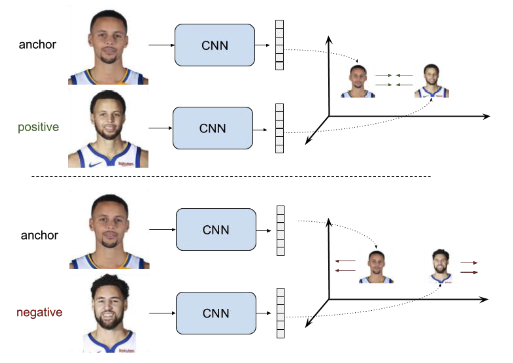
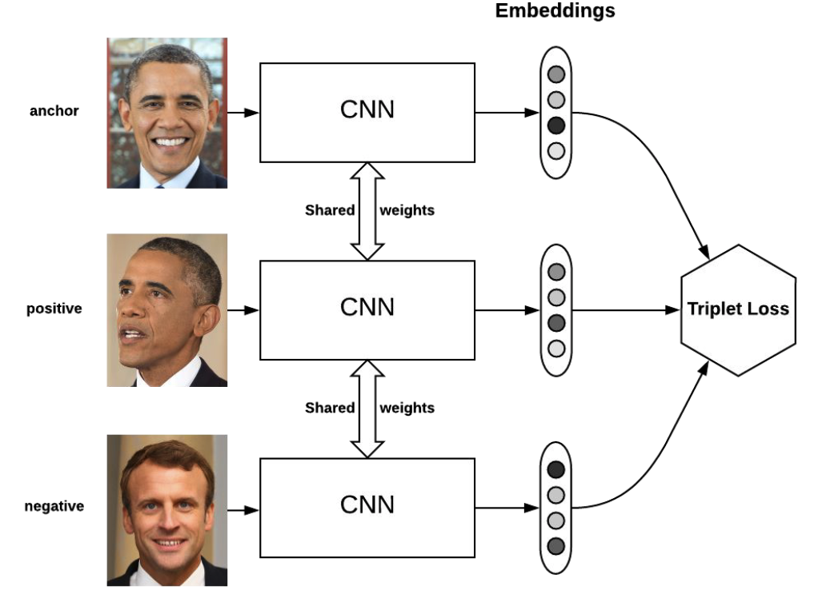

Архитектуры нейронных сетей
===========================

Свёрточные нейронные сети. Семейства архитектур: LeNet, AlexNet, VGG, Inception, ResNet, DenseNet, EfficientNet.
----------------------------------------------------------------------------------------------------------------

### LeNet

Первая современная сверточная сеть была придумана в 1989 году Яном
Лекуном и сотечает в себе все необходимые вещи, используемые и по сей
день:

Первой известной сетью стала т.н. LeNet-5 от того же Лекуна. Изменения
по сравнению с версией 1989 года:

-   Появилось два слоя

-   Постобработка на выходе (алгоритм Витерби и т.п.)

### AlexNet

Именно AlexNet прославил СНС и положил начало их повсеместному
использованию в компьютерном зрении. ПО сравнению с LeNet, привнес
множество новых трюков.\
**Особенности AlexNet**

-   Использование ReLU вместо sigmoid. Оказывается, если отказаться от
    классических на тот момент (2012) функций активации (simoid, tanh),
    то можно ускорить обучение СНС на порядок.

-   Локальная нормализация активаций. Нормализуются карты активаций.

-   Субдискретизация с перекрытием. Обычно субдискретизация (пулинг)
    используется с окном размера $z=n$ и сдвигом (страйдом), равным
    размеру окна, т.е. $s=n$. Однако, в AlexNet применяется пулинг с
    перекрытием в одну клетку, т.е. $z=n, s=n-1$.

-   обучающей выборки

-   для уменьшения переобучения. Использовалось значение $p=0.5$ на
    полносвязных слоях, на сверточных дропаут обычно не используется. Он
    помог с переобучением, но при этом время обучения возросло в
    $\frac{1}{p}=2$ раза.

-   Аугментация на тесте

**Инициализация и оптимизатор**

-   Веса сверток задаются случайными числами из нормального
    распределения с нулевым средним и среднеквадратичным отклонением
    $0.01$

-   Коэффициент сдвига в некоторых слоя инициализируется нулем, в
    некоторых (напр. полносвязных) - единицей

-   Динамическое управление коэффициентом скорости обучения: коэффициент
    делится на 10, когда качество перестает улучшаться на валидационной
    выборке

-   Оптимизатор - momentum (накопление градиента)

-   $L_2$-регуляризация веса (weight decay)

### VGG

-   Предложена в **V**isual **G**eometry **G**roup (университет
    Оксфорда).

-   Идея простой и глубокой сверточной сети доведена до макисмума.

    -   Существуют 2 версии: VGG-16 и VGG-19 (по числу слоев с
        обучаемыми весами)

    -   Содержит огромное число параметров (138 млн и 144 млн),
        дальнейшее увеличение глубины и параметров не дало прироста на
        ImageNet

-   Используются только стандартные свертки размера $3\times 3$ (к
    примеру, в AlexNet первые две свертки были размеров $11\times 11$ и
    $5\times 5$ )

-   Входной размер $224\times 224$

### Inception

Мотивация - хочется сделать глубокую НС, но простое добавление слоев,
как в VGG не дает прироста в качестве.\
Особенности:

-   Разреженная архитектура.

    -   Проблема: линейное наращивание сверточных слоев достаточно
        быстро себя исчерпывает (вспомним VGG).

    -   Идея: использование нелинейной разреженной архитектуры

-   Конкатенация фильтров

    -   Проблема: при линейной структуре у нас признаки с рецептивного
        поля (область, которая участвует в вычислении данного нейрона)
        одного размера (ограниченного размером свертки)

    -   Идея: конкатенировать выходы сверток разного размера на слоях
        одной глубины

-   Уменьшение сложности

    -   Проблема: при большом количестве карт много вычислений свертки

    -   Идея: с помощью свертки $1\times 1$ предварительно уменьшить
        количество карт

Сеть Inception состоит из множества Inception-блоков.

**Inception. Детали архитектуры.**

-   Количество составных блоков около 100

-   Глубина 27 слоев, из них 22 - с обучаемыми параметрами

-   Перед последним полносвязным слоем - GAP

-   Введены два дополнительных классификатора в середине сети (борьба с
    затухающим градиентом, регуляризация)

-   Функции потерь для дополнительных классификаторов домножаются на
    $0.3$

-   Используется дропаут

### ResNet

При увеличении "плоских" слоев в стиле VGG качество сети падает, а не
растет (даже на обучающей выборке, не говоря уже о тестовой). При
большой глубине НС возникает проблема затухающего градиента, таким
образом, сеть перестает обучаться.

Будем вместо целевой функции $H(x)$ обучать остаточную
(residual$\Rightarrow$ ResNet) функцию $F(x)=H(x)-x$, а целевую
рассчитывать как поточечную сумму входа $x$ и остаточной функции
$F(x): H(x)=F(x)+x$.

Таким образом мы дополнительно прокидываем тождественные связи
(identity) между входом и выходом остаточной функции (боремся с
затухающим градиентом). Эти тождественные связи носят название
"skip-connections" или "short-cuts".

-   Наиболее известны следующие разновидности ResNet (по числу
    сверточных слоев): ResNet-18, ResNet-34, ResNet-50, ResNet-101,
    ResNet-152

-   Для более глубоких сетей используется большее число карт признаков
    $\Rightarrow$ многократно возрастает количество весов фильтров и
    число операций

-   Авторы предлагают использовать дизайн бутылочного горлышка
    (bottleneck) - сначала уменьшить кол-во карт с помощью сверток
    $1\times 1$, затем применить обычную свертку $3\times 3$, и,
    наконец, вернуть кол-во карт свертками $1\times 1$. (Отчасти
    процедура схожая с такой же в Inception)

**Архитектурные особенности**

-   Перед последним полносвязным слоем применяется GAP (Global Average
    Pooling)

-   Принцип сохранения сложности (уменьшаем пространственный размер в 2
    раза $\Rightarrow$ одновременно увеличиваем в 2 раза кол-во карт
    признаков)

-   Почти везде уменьшение размерности через свертки с шагом (stride) =
    2

-   BatchNorm используется после каждой свертки

### DenseNet

Нужно больше соединений!

-   Было предложено в рамках слоев одинакового пространственного
    разрешения использовать вообще все возможные связи с помощью
    конкатенции.

-   Таким образом, если слоев $L$, то таких связей будет $L(L-1)/2$

-   DenseNet выигрывает у ResNet

### EfficientNet

Основная информация: сеть подбирается автоматически (с помощью
специального фремворка) по сетке параметров. Нужна быстрая и легкая
сеть\
Проблема: нужно оптимизировать сверточную нейронную сеть. Предыдущие
методы произвольно масштабировали размерность нейросети (например,
количество слоев и параметров). Предложенный метод равномерно
масштабирует части нейросети с фиксированными коэффициентами
масштабирования. Оптимизированные сети (EfficientNets) обходят
state-of-the-art подходы по точности при увеличении эффективности в 10
раз (меньше и быстрее).\
Эффективность масштабирования нейросети зависит от ее начальной
архитектуры. Чтобы улучшить работу нейросети, исследователи выбирали
начальную архитектуру автоматически с помощью AutoML фреймворка ---
MNAS. MNAS при выборе устройства нейросети оптимизирует и точность
модели, и ее размер одновременно. В итоге начальная модель использовала
архитектуру MBConv, схожую с MobileNetV2 и MnasNet. Начальная модель
затем масштабировалась и породила класс EfficientNets моделей.

Оптимизируются следующие параметры:

-   Глубина: $d=\alpha^{\Phi}$

-   Ширина: $w=\beta^{\Phi}$

-   Разрешение (resolution): $r=\gamma^{\Phi}$

-   s.t.
    $\alpha\cdot\beta^{2}\cdot\gamma^{2}\approx 2, \alpha\geq 1, \beta\geq 1, \gamma\geq 1$ -
    должно соблюдаться соотношение, выведенное эмпирическим путем
    (обоснования нет)

Шаги:

-   Шаг 1: для $\Phi=1.0$ параметры подбираются перебором по сетке:
    $\alpha=1.2, \beta=1.1, \gamma=1.15$

-   Шаг 2: При фиксированных $\alpha=1.2, \beta=1.1, \gamma=1.15$, меняя
    $\Phi$ получаем большие модели.

Контрастивное обучение. Примеры из компьютерного зрения и языковых задач. Сиамские сети. Функции потерь: constrastive loss, triplet loss.
-----------------------------------------------------------------------------------------------------------------------------------------

### Сиамская сеть

В московском метро есть системы для распознавания лиц. Людей в Москве
огромное количество, поэтому нейронные сети не решают задачу
классификации, иначе output вектор был бы огромной размерности, и меток
при обучении тоже будет очень много. Тем не менее иногда хочется
разыскивать людей или еще что. Мы можем сравнивать людей с фотографиями
в базе. Необходимо уметь отвечать на вопрос -- являются ли эти два
изображения представителями одного класса?.

*Сиамская сеть* -- это сеть, в которой два раза дублируется одна и та же
архитектура, причём веса у них общие. Входные экземпляры подаются по
одному в каждую сеть (например, две картинки). В результате получаем два
вектора embedding, которые и можно сравнить на схожесть с помощью
*constrative loss*.

При обучении такой сети можно аугментировать фото одного и того же
человека и ожидать на выходе метку 1 -- фото одного человека. И ожидать
метку 0 для фотографий разных людей.

*Сиамская нейронная сеть.*

### Constrastive loss

Для каждого фиксированного изображения -- якоря (anchor) мы можем
сопоставить изображение того же класса (positive) и изображение из
другого класса (negative). Тогда эталонный ответ в первом случае должен
быть 1, а во втором 0. ($r$ -- embedding, $d$ --
расстояние, $margin$ -- некоторая константа, на которое хотим отделить
негативные пары)

*Constrastive loss* для сиамской сети:

$$L =
\begin{cases}
d(r_{anchor}, r_{positive}), & \text{if positive pair}\\
max(0, margin - d(r_{anchor}, r_{negative})), & \text{if negative pair}
\end{cases}$$

*Пример якоря, и изображений позитивного и негативного классов.*

### Triplet loss

Рассмотрим теперь аналог сиамской сети -- сеть, состоящую из трёх частей
с общей архитектурой и одинаковыми весами, которая на вход принимает $3$
изображения -- якорь, изображение позитивного класса и изображение
негативного класса.

Для этой сети можно рассмотреть похожий по логике *triplet loss*:

$$L = max(0, margin + d(r_{anchor}, r_{positive}) - d(r_{anchor}, r_{negative})).$$

*Теперь не сиамская сеть, а скажем "тройная"*

Генеративные модели в компьютерном зрении (генеративно-состязательные нейронные сети). Принцип работы генератора и дискриминатора.
----------------------------------------------------------------------------------------------------------------------------------

Формально задача порождающих моделей, с точки зрения максимизации
правдоподобия, выглядит следующим образом: для набора данных
$D = {x_i}^N){i=1}$ максимизировать $\Pi^N_{i=1}(x_i,\theta)$

$\underset{\theta}{\operatorname{argmax}} \sum_{i=1}^{N} \log p_{\text {model }}(x_{i}, \theta)$

Также мы можем думать о задаче максимизации правдоподобия, как о задаче
минимизации KL дивергенции (позволяет померить расстояния между
распределениями, чем оно меньше, тем лучше генерируем):

$\underset{\theta}{\operatorname{argminKL}}(P_{data}(x)||P_{model}(X,\theta)$

Таким образом мы хотим имея случайный вектор и класс $Y$ сгенерировать
синтетический пример $X$ и найти условное распределение $P (X | Y)$

Свойства, которые нужно достичь:

-   Точность (Fidelity) -- отвечает за качество генерируемых примеров,
    их реалистичность;

-   Разнообразие (Diversity) -- Генератор не должен порождать одно и
    тоже.

*Таксономия(классификация) порождающих моделей*

### GAN

GAN - одна из наиболее эффективных архитектур для создания реалистичныйх
данных.

*Архитектура GAN*

Состоит из двух сетей: генератора и дискриминатора.

**Генератор** -- порождает объекты в пространстве синтетических данных.
Он пытается «обмануть» дискриминатор, сделать так, что дискриминатор не
может различать распределение реальных данных и распределение
синтетических, которое порождает генератор.

**Дискриминатор** -- классификатор, который учится отличать порожденные
объекты от примеров из обучающей выборки.

### Обучение генератора и дискриминатора

Процесс обучения GAN выглядит следующим образом: создаем случайный
вектор $z$, подаем его на вход генератору, генератор порождает
синтетический пример $\hat{X}$, далее $\hat{X}$ и пример из реальных
данных $X$ подаются в дискриминатор, который выдает вероятность того
что, синтетический пример является действительно синтетическим или нет.
После чего вычисляется значение функции потерь и выполняется обратное
распространение ошибки *только для дискриминатора*, с корректировкой
весов дискриминатора.

*Обучение дискриминатора*

Далее выполняется следующий шаг обучения, только на этом этапе в
дискриминатор мы подаем $\hat{X}$. В функции ошибки мы рассматриваем
только метки, которые совпали с реальными, после чего выполняем обратное
распространение ошибки *для генератора*, дискриминатор в этом процессе
не участвует. Затем корректируем веса генератора.

*Обучение генератора*

В процессе тренировки качество генератора и дискриминатора должно
оставаться сопоставимым, иначе если дискриминатор распознает
синтетические данные со $100\%$ вероятностью, генератор перестанет
учиться.

**Недостатки GAN**

Главным недостатком GANs является попадание модели в состояние mode
collapse. (например дискриминатор быстрее обучается (ему нужно просто
провести гиперплоскость между двумя распределениями), тогда генератор
больше не сможет обучаться, нужно искать баланс, чтобы дискриминатор
помогал обучаться генератору)

Следствие попадания в состояние mode collapse: модель постоянно
генерирует пример или примеры одного и того же класса или нескольких
классов, хотя обучалась она на примерах, размеченных для большего
количества классов.

Это проблема разнообразия (diversity). Такое происходит когда генератор
застревает в локальном минимуме и объединяет несколько мод (mode - пик в
распределении) в одну, после чего генерирует только эту моду.

Этот недостаток был связан в первую очередь с тем, что повсеместно
применяли в качестве функции ошибки бинарную перекрестную энтропию

### Лосс и метрики

**Бинарная перекрестная энтропия** (BCE) - часто использовали, возникает
проблема с разнообразием при обучении, так как дискриминатор менее
глубокий, обычно, и учится быстрее. BCE на некоторых участках не имеет
наклона, что приводит к проблеме исчезающего градиента.

Расстояние Вассерштейна - нужно, чтобы сравнивать не метки классов, а
распределения данных.

**Earth Movers Distance** (EMD) - измеряет расстояние между двумя
распределениями и оценивает усилия, необходимые для того чтобы
генерируемое распределение сделать очень похожим на реальное.

Аппроксимацией EMD является расстояние Вассерштейна или W-loss.

$$\underset{g}{\operatorname{min}}\underset{c}{\operatorname{max}} (c(x)) - (c(g(z)))$$

Генератор пытается минимизировать расстояние, а critic максимизировать.
Важное требование к функции critic, она должна быть 1-L непрерывной по
Липшицу. Это означает что норма для градиента в любой точке не должна
быть больше единицы $||f(x)||_2 \leq 1$

**Расстояние Фреше** или Frechet inception distance (FID), одна из
основных метрик оценки качества для GAN. Изначально эта метрика
применялась для измерения расстояния между двумя кривыми, но в
последствии стало понятно, что с помощью данной метрики можно сравнивать
распределения.

Общая формула:

$$d(\mathcal{N}(\mu, \Sigma), \mathcal{N}(\hat{\mu}, \hat{\Sigma})) = ||\mu - \hat{\mu}||^2 + Tr(\Sigma + \hat{\Sigma} - 2\sqrt{\Sigma\hat{\Sigma}})$$

Одномерный случай:

$$d(\mathcal{N}(\mu, \sigma), \mathcal{N}(\hat{\mu}, \hat{\sigma})) = (\mu - \hat{\mu})^2 + (\sigma - \hat{\sigma})^2$$

Базовый подход для рассчета FID, на примере генерации изображений, содержит следующие шаги:

**Input**: Функция для генерации эмбедингов $f: \Omega_X \rightarrow \mathbb{R}^n$; Два датасета: с изображениями из выборки $S \subset \Omega_X$  и сгенерированные $\hat{S}$

**Algorithm**:

- Посчитать эмбединги для данных двух наборов данных $f(S), f(\hat{S})$
- Найти нормальные распределения $\mathcal{N}(\mu, \Sigma)$ и $\mathcal{N}(\hat{\mu}, \hat{\Sigma})$ для полученных $f(S), f(\hat{S})$.
- Посчитать $d(\mathcal{N}(\mu, \sigma), \mathcal{N}(\hat{\mu}, \hat{\sigma}))$

**Inception score** Идея состоит в том что мы берем предобученный
классификатор Inceptionv3, подаем на вход сгенерированный пример и
смотрим распределение вероятностей по классам, один из классов должен
иметь макс значение, тогда у нас соблюдается точность (fidelity), а тот
факт что у других классов вероятность \> 0 говорит о разнообразии
(diversity).

Недостатки:

Не замечает проблем с разнообразием(diversity) -- к примеру модель будет
генерировать одно и тоже изображение для каждого класса, IS покажет
хорошую оценку, но в идеале GAN должен уметь генерировать несколько
разных изображений для одного класса. Это явно говорит о mode collapse.

Учитывает только сгенерированные сэмплы -- не выполняет сравнение между
реальными и сгенерированными сэмплами.

Autoencoder. Variational autoencoder. Примеры прикладных задач. Концепция сжатия информации. KL-дивергенция.
------------------------------------------------------------------------------------------------------------

### AutoEncoder

*AutoEncoder* -- нейронная сеть, в которой энкодер сжимает входные
данные в скрытое состояние, а затем декодер разжимает скрытое состояние
обратно. Цель - сделать реконструкцию
оригинального изображения так, чтобы расстояние между реконструированным
изображением и оригинальным было минимальным (расстояние -
попиксельное). Сжимающая часть сети - *Encoder*. Разжимающая часть сети
- *Decoder*. В качестве функции потерь $\mathcal{L}$ используется ошибка
реконструкции входа и выхода, например $L_2$ норма.

*Архитектура AutoEncoder*

*Denoising AutoEncoder. Автоэнкодер можно применять как средство для понижения шума.*

### Variational autoencoder

*Variational autoencoder* -- это автоэнкодер, в котором пытаются сделать
так, чтобы скрытое состояние было из определенного распределения, как
правило, из нормального. Предположим, что распределение скрытого
состояния -- нормальное. Мы заменяем скрытое состояние на вектор,
состоящий из mean vector и std vector. Затем мы сэмплируем embedding
вектор из этого распределения. В результате скрытое подпространство VAE
лучше, чем у AE.

*VAE архитектура.*

Распределение скрытого состояния приближаем к нормальному с помощью
$KL$-дивергенции:

$$KL(p || q) =  - \sum p \log(q) + \sum p \log(p) = \sum p \frac{\log(p)}{\log(q)}.$$

Тогда общий loss для VAE:

$$L_{VAE} =  \mathcal{L}_{reconstruction} + KL(q(z) || N(\mu, \sigma)).$$
