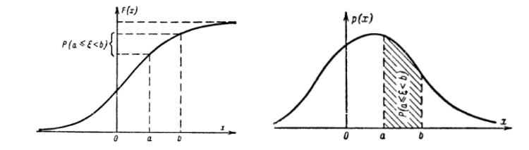
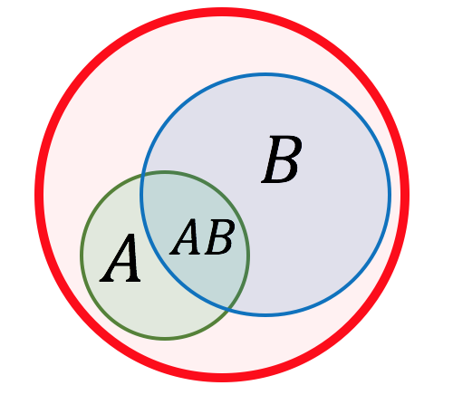
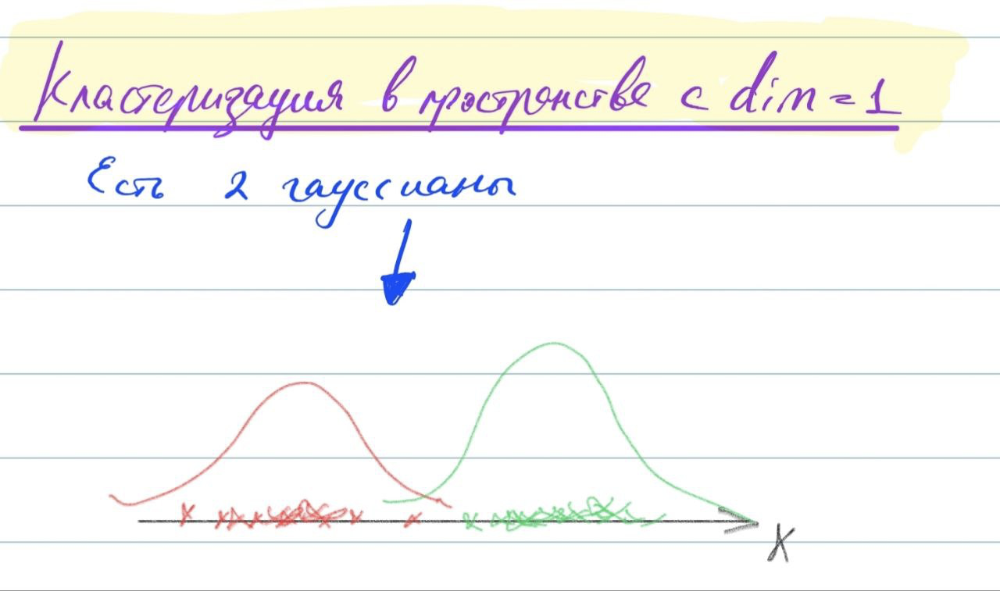
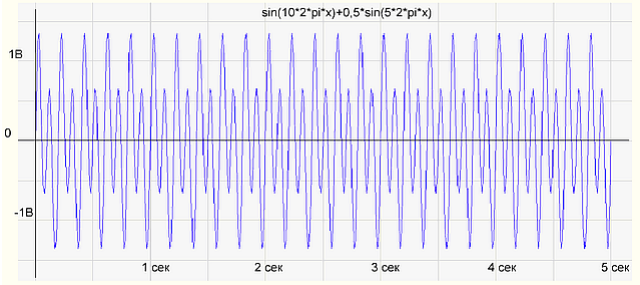
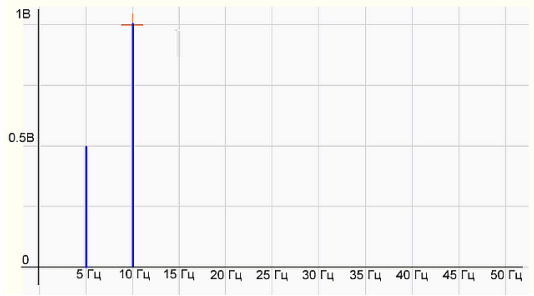

01_Math_01.md
01_Math_02.md
01_Math_03.md
01_Math_05.md
01_Math_06.md
01_Math_07.md
01_Math_08.md
01_Math_09.md
01_Math_10.md
Вероятностное пространство. Аксиоматика Колмогорова. Вероятностная мера. Функция распределения вероятностной меры. Понятие случайной величины. Геометрическое понимание случайной величины. Распределение вероятностей и функция распределения. {#1.01}
-----------------------------------------------------------------------------------------------------------------------------------------------------------------------------------------------------------------------------------------------

Произвольное множество $\Omega$ (не обязательно конечное) называется
**пространством элементарных событий**. Элемент этого множества $\omega$
называется элементарным **событием**

Обозначим множество подмножеств элементарных событий $\Omega$ как
$\mathkal{F}$. Множество $\mathcal{F}$ называется **алгеброй множеств**,
если выполнены следующие требования

1.  $\Omega \in \mathcal{F}, \varnothing\in\mathcal{F}$ ($\varnothing$ -
    пустое множество)

2.  $A \in \mathcal{F} \Rightarrow \overline{A} \in \mathcal{F}$

3.  $A \in \mathcal{F}$ и
    $B \in \mathcal{F} \Rightarrow A \cup B \in \mathcal{F}, A \cap B \in \mathcal{F}$

Алгебра $\mathcal{F}$ называется *$\sigma$-алгеброй*, если
$A_1, A_2, \dots \in \mathcal{F} \Rightarrow \bigcup\limits_{i=1}^{\infty} A_i \in \mathcal{F}, \bigcap\limits_{i=1}^{\infty} A_i \in \mathcal{F}$

Функция $\mathbb{P}: \mathcal{F} \rightarrow \mathbb{R}$ на множестве
событий называется **вероятностью**, если:

-   Каждому случайному событию $A$ ставится в соответсиве
    неотрицательное число $\mathbb{P}(A)$, называемое его вероятностью.

-   $\mathbb{P}(\Omega) = 1$

-   Если события $A_1, A_2, ..., A_n$ попарно несовметимы, то
    $\mathbb{P}(\bigcup\limits_{k=1}^{\infty} A_k) = \sum\limits_{k=1}^{\infty}\mathbb{P}(A_k)$

**Вероятностное пространство** - это тройка
$(\Omega, \mathcal{F}, \mathbb{P})$.

**Случайная величина** - это функция
$\xi: \Omega \rightarrow \mathbb{R}$, измеримая относительно
$\mathcal{F}$ и борелевской $\sigma$-алгебры на $\mathbb{R}$.

**Дискретной случайной величиной** называется случайная величина,
множество значений которой не более, чем счётно. Пример: выпадение орла
или решки при подбрасывании монеты или выпадение определённого числа на
игральном кубике.

**Непрерывной случайной величиной** называют случайную величину, которая
в результате испытания принимает все значения из некоторого числового
промежутка. Число возможных значений непрерывной случайной величины
бесконечно. Пример: измерение скорости перемещения любого вида
транспорта или температуры в течение конкретного интервала времени.

**Функцией распределения** вероятностной меры называется
$F(x) = P(\{-\infty < x\}), x \in \mathbb{R}$, которая обладает
следующими свойствами:

-   $F(x)$ - неубывающая

-   $\lim_{x\rightarrow -\infty}F(x) = 0$;
    $\lim_{x\rightarrow +\infty}F(x) = 1$

-   $F(x)$ непрерывна справа
    $\lim_{\varepsilon\rightarrow0+}F(x+\varepsilon)=F(x)$

**Функцией распределения случайной величины** называется
$$F(x) = \mathbb{P}(\xi \leq x), x \in \mathbb{R}$$

Случайную величину $\xi$ называют непрерывной, если существует такая
неотрицательная функция $p(x)$, что $\forall x \in \mathbb{R}$
выполняется
$$F(x) = \mathbb{P}\{\xi \leq x\} = \int\limits_{-\infty}^{x}p(t)dt; \frac{dF}{dx} = p(x)$$
Функция $p(t)$ называется **плотностью** распределения.

Смысл функции $p(x)$: если событие «случайная величина $\xi$ попадет в
малый интервал $\Delta x$», то вероятность этого события
$\mathbb{P}(x < \xi < x + \Delta x) \sim F'(x)dx = p(x)\Delta x.$ При
этом $\int\limits_{-\infty}^{\infty} p(x) = 1$, так как попадание $\xi$
в неограниченный интервал гарантировано.

Математическое ожидание случайной величины. Дисперсия случайной величины. Ковариация случайных величин. Матрица ковариаций вектора случайных величин. Дисперсия суммы независимых случайных величин. {#1.02}
----------------------------------------------------------------------------------------------------------------------------------------------------------------------------------------------------

Пусть $\xi$ - абсолютно непрерывная случайная величина, $p(x)$ - ее
плотность распределения. Тогда ее **математическим ожиданием**
называется величина
$$\mathbb{E}(\xi) = \int\limits_{-\infty}^{\infty} x \cdot p(x) dx$$

Свойства математического ожидания:

-   $\mathbb{E}(a\xi + b\eta) = a \cdot \mathbb{E}(\xi) + b \cdot \mathbb{E}(\eta)$

-   $\xi = const = C \Rightarrow \mathbb{E}(\xi) = C$

-   если $\xi$ и $\eta$ независимы, то
    $\mathbb{E}(\xi \eta) = \mathbb{E}(\xi) \cdot \mathbb{E}(\eta)$

**Математическое ожиданием в дискретном** случае можно посчитать как
$$\mathbb{E}(\xi)=\sum\limits_{x \in X} x \cdot p(\xi = x)$$

**Дисперсией** случайной величины называют математическое ожидание
квадрата отклонения случайной величины от её математического ожидания.
Пусть $\xi$ - случайная величина, тогда дисперсией называется:
$$D(\xi) = E(\xi - E(\xi))^2$$

Свойства дисперсии:

-   $D(\xi) \geq 0$

-   $D(a\xi) = a^2 D(\xi)$

-   $D(\xi + const) = D(\xi)$

-   $D(const) = 0$

-   $D(\xi) = \mathbb{E}(\xi^2) - \mathbb{E}^2(\xi)$

-   если $\xi$ и $\eta$ независимы, то
    $D(\xi + \eta) = D(\xi) + D(\eta)$

Пусть $\xi$ и $\eta$ - случайные величины. Тогда **ковариация**
определяется как
$$cov(\xi, \eta) = \mathbb{E}\big[(\xi - \mathbb{E}(\xi)) \cdot (\eta - \mathbb{E}(\eta))]$$

Ковариация случайной величины с собой является дисперсией
$cov(\xi, \xi) = D(\xi)$

**Корреляцией** случайных величин $\xi$ и $\eta$ называется число
$$corr(\xi, \eta) = \frac{cov(\xi, \eta)}{\sqrt{D(\xi) \cdot D(\eta)}}$$
Корреляция принимает значения от -1 до 1, и помимо направления
зависимости она также показывает меру зависимости между случайными
величинами, насколько сильно они зависят друг от друга.

Если у нас есть вектор случайных величин $(\xi_1, \xi_2, \dots, \xi_n)$,
то **матрица ковариаций** этого вектора выглядит: $$\begin{bmatrix}
            cov(\xi_1, \xi_1) & cov(\xi_1, \xi_2) & \dots & cov(\xi_1, \xi_n) \\
            cov(\xi_2, \xi_1) & cov(\xi_2, \xi_2) & \dots & cov(\xi_2, \xi_n) \\
            \dots             & \dots             & \dots & \dots             \\
            cov(\xi_n, \xi_1) & cov(\xi_n, \xi_2) & \dots & cov(\xi_n, \xi_n) \\
        \end{bmatrix}$$

В многомерном пространтсве по этой матрице можно понять попарную
ковариацию (т.е. положительно или отрициательно зависят друг от друга
случайные величины). А по диагональным элементам понять дисперсию
случайной величины

Неравенство Маркова. Неравенство Чебышева. Закон больших чисел (в форме Чебышева). Центральная предельная теорема. {#1.05}
------------------------------------------------------------------------------------------------------------------

**Неравенство Маркова** позволяет дать оценку вероятности, что
неотрицательная случайная величина превзойдёт по модулю фиксированную
положительную константу, в терминах ее математического ожиадния.

Итак, пусть $(\Omega, \mathcal{A}, \mathbb{P})$ - некоторое
вероятностное пространство и $\xi \geq 0$. Тогда
$\forall \varepsilon > 0$
$$\mathbb{P}\{ \xi \geq \varepsilon \} \leq \frac{\mathbb{E}(\xi)}{\varepsilon}$$

**Неравенство Чебышева** утверждает, что случайная величина в основном
принимает значения, близкие к своему среднему. А более точно, оно даёт
оценку вероятности того, что случайная величина примет значение, далёкое
от своего среднего.

Пусть $(\Omega, \mathcal{A}, \mathbb{P})$ - некоторое вероятностное
пространство и $\xi$ - случайная величина с конечными математическим
ожиданием и дисперсией. Тогда $\forall \varepsilon > 0$
$$\mathbb{P}\{ | \xi - E(\xi) | \geq \varepsilon \} \leq \frac{D(\xi)}{\varepsilon^2}$$

В частности, случайная величина с конечной дисперсией отклоняется от
среднего больше, чем на 2 стандартных отклонения, с вероятностью меньше
$\frac{1}{4}$, на 3 стандартных отклонения с вероятностью меньше
$\frac{1}{9}$.

**ЗБЧ в форме Чебышева**. Согласно закону, среднее значение конечной
выборки из фиксированного распределения близко к математическому
ожиданию этого распределения.

Пусть $X$ --- случайная величина с конечным математическим ожиданием
$\mu$ и конечной ненулевой дисперсией $\sigma^{2}$. Тогда для любого
действительного числа $k>0$ выполняется

$$P{\big (}|X-\mu |\geqslant k\sigma {\big )}\leqslant {\frac {1}{k^{2}}}$$

Условная вероятность и независимость событий. Теорема Байеса. Условные распределения. {#1.06}
-------------------------------------------------------------------------------------

Пусть $(\Omega, \mathcal{A}, \mathbb{P})$ - некоторое вероятностное
пространство.

**Условной вероятностью** события $A$ при условии события $B$ с
$P(B) > 0$ называется величина
$$P(A|B) = \frac{P(A\cap B)}{P(B)} = \frac{P(AB)}{P(B)}$$

События $A$ и $B$ называются **независимыми**, если $$P(AB) = P(A)P(B)$$

{width="30%"}

Пусть события $B_1, \dots, B_n$ образуют полную группу, т.е.

1.  $B_i \cap B_j = \varnothing$

2.  $\bigcup\limits_{i=1}^{n} B_i = \Omega$

3.  $P(B_i) > 0 \;\; \forall i$

Тогда
$A = A \cap \Omega = A \cap \bigcup\limits_{i=1}^{n} B_i = \bigcup\limits_{i=1}^{n} A \cap B_i$,
причем $(AB_i)\cup(AB_j) = \varnothing$\
Тогда верна **формула полной вероятности**:
$$P(A) = \sum\limits_{i=1}^{n} P(B_i) \cdot P(A | B_i)$$

**Теорема Байеса**. $$P(A|B) = \frac{P(B|A)P(A)}{P(B)}$$

Если же представить $P(B) = \sum \limits_{i=1}^{N} P(B|A_i)P(A_i)$, то
формулу Байеса можно записать как
$$P(A_i|B) = \frac{P(A_i) \cdot P(B|A_i)}{\sum\limits_{i=1}^{n} P(A_i) \cdot P(B|A_i)}$$

Формула Байеса позволяет «переставить причину и следствие»: по
известному факту события вычислить вероятность того, что оно было
вызвано данной причиной. При этом необходимо понимать, для применения
теоремы причинно-следственная связь между $A$ и $B$ не является
обязательной.
Теория информации. Энтропия по Шеннону. {#1.07}
---------------------------------------

Менее вероятное событие более информативно. Например, сообщение
\"сегодня утром выглянуло солнце\" гораздо менее информативно (оно
обычное, для нас это не новая информация), чем \"сегодня утром было
солнечное затмение\". Сообщение, вероятность которого равна 1, несёт
нулевую информацию(информация о том, что трава зеленая, нам ничего не
дает).

Основываясь на идее о том, что прирост информации равен утраченной
неопределённости, Шеннон выдвинул разумные требования для функции
энтропии $H$:

1.  мера должна быть непрерывной;

2.  в случае, когда все варианты равновероятны, увеличение количества
    вариантов должно всегда увеличивать значение функции;

3.  должна быть возможность сделать выбор в два шага, в которых значение
    функции конечного результата должно являться суммой функций
    промежуточных результатов.

**Собственной информацией** случайной величины $x$ с плотностью
распределения $p_{X}(x)$ называется число $$I(x) = − \log{p_{X}(x)}$$,
$log$ можно брать по разным основаниям. Если основание = 2, то единица
измерения количества информации называется «бит», если берётся
натуральный логарифм, то - «нат».

Собственная информация сама является случайной величиной определённая
для множества сообщений $X =
        x_1, \dots , x_n$ с распределением вероятностей
$P = p(x_1), \dots , p(x_n)$, которую следует отличать от её среднего
значения --- информационной энтропии.

Информация аддитивна для статистически независимых сообщений:
$I(x_1, x_2) = I(x_1) + I(x_2)$.

*Доказательство*. Действительно, если сообщения независимы, то
$p(x_1, x_2) = p(x_1) \cdot p(x_2)$, а следовательно:
$$I(x_1, x_2) = −\log p(x_1, x_2) = −\log ( p(x_1) \cdot p(x_2) ) = −\log p(x_1) − \log p(x_2) = I(x_1) + I(x_2) \blacksquare$$

Математическое ожидание этой случайной величины $I(x)$ называется
**энтропией**:
$$H(x) = \mathbb{E}(I(x)) = -\sum\limits_{x \in X} p_{X}(x) \cdot \log{p_{X}(x)}$$

Простыми словами энтропия - это мера неопределённости. Если у нас много
информации, то у нас меньше неопределенности, следовательно, меньше
энтропия, и наоборот.

**Перекрестная энтропия(или кросс-энтропия)** - ожидаемая длина
закодированных сообщений в битах при использовании распределения $Q(x)$
вместо $P(x)$: $$H(P, Q) = -\sum\limits_{x \in X} P(x) \log Q(x)$$

Ее можно рассматривать как меру разницы между двумя распределениями.
Перекрестная энтропия уже широко используется в глубоком обучении в
качестве функции потерь для включения обучения. В этом случае истинное
распределение $P(x)$ вероятностей - это метка, а прогнозируемое
распределение $Q(x)$- это значение из текущей модели.

Пусть $P(x)$ - истинное распределение вероятностей сообщений, а $Q(x)$ -
прогнозируемое распределение вероятностей сообщений.

Измерить схожесть одного распределения $P$ с другим распределением $Q$
позволяет **дивергенция Кульбака-Лейблера (KL-дивергенция)**:
$$KL(P\|Q) = -\sum\limits_{x \in X} P(x) \log Q(x) + \sum\limits_{x \in X} P(x) \log P(x) = \sum \limits_{x \in X} P(x) \log\frac{P(x)}{Q(x)}$$
Это значение можно понимать как количество неучтённой информации
распределения $P(x)$, если бы $Q(x)$ было использовано для приближения
$P(x)$. Здесь $P(x)$ рассматривается как априорное распределение, $Q(x)$
как проверяемое.

KL-дивергенция неотрицательна и измеряет различие между 2
распределениями, но эта мера - не расстояние, т.к. не является
симметричной (не всегда $KL(P\|Q) = KL(Q\|P)$).

{width="80%"}
Понятие выборки и генеральной совокупности. Доверительный интервал. Функция правдоподобия. Метод максимального правдоподобия. EM-алгоритмы. {#1.08}
-------------------------------------------------------------------------------------------------------------------------------------------

В целом основная задача математической статистики это поиск
распределения по выборке, а-ля подгоните наш эксперимент так, чтобы его
можно было понять какой это вид распределения и вероятностно обсчитать.

Обычно мы от распределения не знаем какой-то числовой параметр, чтобы
его оценить, пользуются известной нам функцией - статистикой $T(X)$. И
да, скорее правильно сказать не выборка из P, а выборка с распределением
P.\

{width="80%"}

**Генеральная совокупность** -- это совокупность всех мысленно возможных
объектов данного вида, над которыми проводятся наблюдения с целью
получения конкретных значений определенной случайной величины.

**Выборкой (выборочной совокупностью)** называется совокупность случайно
отобранных объектов из генеральной совокупности.

**Статистикой** $T(X)$ называется любая случайная величина, являющаяся
функцией лишь от выборки $X$.

Пусть у нас есть параметрическое семейство распределений
$\{P_\theta | \theta \in \Theta\}$.\
\
**Определение 4**. Пусть $X=(X_1,\dots,X_n)$ --- выборка из
$P \in \{P_\theta | \theta \in \Theta\}$ и $\Theta \subset \mathbb{R}$.
*Доверительным интервалом* уровня $\gamma \in (0, 1)$ для параметра
$\theta$ называется интервал $(T_1(X), T_2(X))$, что
$$\forall \theta \in \Theta \;\; P_\theta (T_1(X) \leq \theta \leq T_2(X)) \geq \gamma$$
То есть доверительный интервал - это такой интервал, что вероятность
принадлежности параметра $\theta$ больше $\gamma$.

Пример. Пусть у нас есть семейство параметрических нормальных
распределений $\mathcal{N}(\theta, \sigma^2)$, то есть наш параметр -
это среднее. Обычно доверительные интервалы используют двумя способами:
фиксируют $\theta$ или $\gamma$. Если мы фиксируем $\theta$, то мы хотим
узнать с какой вероятностью наш параметр (в примере среднее) принадлежит
доверительному интервалу. Если мы фиксируем $\gamma$, мы хотим оценить в
каком доверительном интервале лежит наш параметр с заданной
вероятностью(обычно эта вероятность большая $\sim 95\%$).

**Определение 5**. Пусть $X=(X_1,\dots,X_n)$ --- выборка из
$P \in \{P_\theta | \theta \in \Theta\}$, $x = (x_1, \dots, x_n)$ -
реализация выборки $X$. Если $X$ имеет дискретное распределение, то
определим функцию $L(x, \theta)$:
$$L(x, \theta) = \prod\limits_{i=1}^{n} P(X_i = x_i)$$ Если $X$ имеет
непрерывное распределение с плотностью $p(x, \theta)$, то определим
функцию $L(x, \theta)$:
$$L(x, \theta) = \prod\limits_{i=1}^{n} p(x_i, \theta)$$ Функция
$L(x, \theta)$ называется *функцией правдоподобия*.

**Определение 6**. Пусть $X=(X_1,\dots,X_n)$ --- выборка из
$P \in \{P_\theta | \theta \in \Theta\}$ и $\Theta \in \mathbb{R}$ и
$L(x, \theta)$ - функция правдоподобия. *Оценкой максимального
правдоподобия* $\hat{\theta}$ называется такая точка параметрического
множества $\Theta$, в которой функция максимального правдоподобия
$L(x ,\theta)$ при заданном $x$ достигает максимума:
$$L(x, \hat{\theta}) = \sup_{\theta \in \Theta} L(x, \theta)$$\
Для максимизации функции правдоподобия обычно берут ее логарифм, т.к.
вычисления будут проще.

**Определение 7**.*EM-алгоритм* (expectation-maximization) - алгоритм
для нахождения оценок максимального правдоподобия параметров, в случае,
когда модель зависит от некоторых скрытых переменных.

Как правило, ЕМ-алгоритм применяется для решения задач двух типов.

-   задачи, связанные с анализом неполных данных, когда некоторые
    статистические данные отсутствуют в силу каких-либо причин.

-   задачи, в которых функцию правдоподобия сложно максимизировать, но
    это можно сделать, если в задачу искусственно ввести дополнительные
    переменные.

Рассмотрим подробнее на примере. Пусть у нас есть смесь двух гауссовых
распределений. $q$ - вероятность первого гауссового распределения,
$1 - q$ - вероятность второго гауссового распределения.
$f(x|\mu_1, \sigma_1^2)$ - плотность первого гауссового распределения,
$f(x|\mu_2, \sigma_2^2)$ - плотность второго гауссового распределения.

Плотность смеси распределений будет иметь вид:
$$p(x|q, \mu_1, \sigma_1, \mu_2, \sigma_2) = q \cdot f(x|\mu_1, \sigma_1^2) + (1-q) \cdot f(x|\mu_2, \sigma_2^2)$$

Применим к этой функции метод максимального правдоподобия:
$$\begin{gathered}
    L(X|q, \mu_1, \sigma_1, \mu_2, \sigma_2) = \\
    \prod\limits_{i=1}^{n}p(x_i|q, \mu_1, \sigma_1, \mu_2, \sigma_2) = \\
    \prod\limits_{i=1}^{n}  \big( q \cdot f(x_i|\mu_1, \sigma_1^2) + (1-q) \cdot f(x_i|\mu_2, \sigma_2^2) \big)\end{gathered}$$

Данное выражение будет сложно оптимизировать напрямую. Добавим
искусственно скрытые переменные для решения нашей задачи. Т.е. перейдем
от $X = \{x_i\}_{i=1}^n \Rightarrow \{x_i, z_i\}_{i=1}^n$, где $z_i$ -
индикатор i-ой гауссианы.

$$\begin{gathered}
    L(X, Z|q, \mu_1, \sigma_1, \mu_2, \sigma_2) = \prod\limits_{i=1}^{n}p(x_i, z_i|q, \mu_1, \sigma_1, \mu_2, \sigma_2) = \\
    \prod\limits_{i=1}^{n}p(z_i|q, \mu_1, \sigma_1, \mu_2, \sigma_2) = p(x_i|z_i, q, \mu_1, \sigma_1, \mu_2, \sigma_2) = \\
    \prod\limits_{i=1}^{n} q^{z_i} \cdot (1-q)^{1-z_i} \cdot f(x_i|\mu_1, \sigma_1^2)^{z_i} \cdot f(x_i|\mu_2, \sigma_2^2)^{1-z_i}\end{gathered}$$

Полученное выражение нужно максимизировать. Если мы возьмем логарифм,
как в обычном методе максимального правдоподобия и будем максимизировать
его, беря производную, то найдем все параметры.

Но мы не знаем $z$, откуда его взять? Для этого как раз таки и нужен
EM-алгоритм.

Нам нужно найти $L(X, Z| \theta)$, где $X$ - видимые переменные, $Z$ -
скрытые переменные, $\theta$ - параметры.

-   На E-шаге (expectation) вычисляется ожидаемое значение функции
    правдоподобия, при этом скрытые переменные рассматриваются как
    наблюдаемые: фиксируем $\theta$ и ищем математическое ожидание
    $E(Z)$(для каждого случая поиск мат. ожидания индивидуальный)

-   На M-шаге (maximization) вычисляется оценка максимального
    правдоподобия, таким образом увеличивается ожидаемое правдоподобие,
    вычисляемое на E-шаге: фиксируем математическое ожидание $E(Z)$ и
    ищем $L(X, Z| \theta)$, где $Z$ заменяем на $E(Z)$ и максимизируем
    по $\theta$. Затем это значение используется для E-шага на следующей
    итерации.

Эти шаги мы проводим до сходимости.
Матричные разложения. Сингулярное разложение. {#1.09}
---------------------------------------------

P.S. в лекциях упоминается только спектральное и SVD (сингулярное)
разложение матриц, поправьте, если что-то упустила\
Несколько типов матриц, которые понадобятся нам в дальнейшем:

1.  Единичная $E$ - на главной диагонали стоят 1, в остальных местах 0.

2.  Транспонированная $A^\intercal$ - все элементы матрицы
    переставляются симметрично относительно главной диагонали.

3.  Обратная матрица $A^{−1} : AA^{−1} = A^{−1}A = E$

4.  Унитарная матрица $A : AA^\intercal = A^\intercal{A} = E$ Строки и
    столбцы такой матрицы образуют ортонормированный базис, а
    преобразование, заданное унитарной матрицей, сохраняет длины всех
    векторов и скалярное произведение.\

**Определение 1** Определитель матрицы $A - \det{A}$ - одна из
характеристик матрицы. Формула для нахождения определителя через
разложение по $i$-й строке:
$$\det{A} = a_{i1}A_{i1} + a_{i2}A_{i2} + \cdots  + a_{in}A_{in}$$

где алгебраическое дополнение $A_{ij} = (-1)^{i+j}\det{M}_{ij}$, а
подматрица $M_{ij}$ получается вычеркиванием $i$-й строчки и $j$-го
столбца из матрицы $A_{ij}$.

(Получается, что модуль определителя $\left|\det{A}\right|$ --- это
коэффициент изменения объекта при преобразовании пространства матрицей
A: для одномерного пространства --- длина отрезка, для плоскости ---
площадь фигуры, для трёхмерной фигуры --- её объём.)

**Определение 2** Ранг матрицы --- это истинная (максимальная)
размерность пространства, для которого определитель не равен нулю.

**Определение 3** Если $\det{A} = 0$, то матрица вырождена (убирает
объём). Если $\det{A} \neq 0$, то матрица обратима.

**Определение 4** Собственный вектор -- вектор не меняющий своё
направление при преобразованиях (а просто увеличивающийся на коэффициент
- собственное значение): $A\vec{v} = \lambda\vec{v}$, где
$\vec{v} \neq 0$

Метод поиска собственных векторов:
$$A\vec{v} = \lambda\vec{v} \quad A\vec{v} - \lambda\vec{v}=0 \quad A\vec{v} - \lambda\vec{v}E = 0 \quad (A\vec{v} - \lambda{E})\vec{v} = 0$$
$$\det{(A - \lambda{E})}\vec{v} = 0, \quad \vec{v} \neq 0 \implies \det{(A - \lambda{E})} = 0$$\
/\*А теперь про разложение, самое важное\*/\
\
**Определение 5** Спектральное разложение - разложение матрицы $A$ вида
$A = VLV^{−1}$ или $AV = VL$, где $V$ - матрица, в столбцах которой
стоят собственные векторы, $L$ - диагональная матрица, на диагонали
которой стоят собственные значения. Зачем это делать - хочется для
удобства разложить матрицы на более простые объекты (аналог --
разложение числа на простые множители).\
Норма вектора:
$$\left\|x \right\| = \left(\sum _{i}\left|x_{i}\right|^{2}  \right)^{\frac{1}{2}}$$

Норма матрицы:
$$\left\|A\right\| = \max_{1\le j\le n} \sum_{i=1}^{m} \left|a_{ij}\right|$$

Норма Фробениуса для матриц:
$$\left\|A\right\|_{F} = \left\|A\right\|_{2} = \sqrt{ \sum_{ij} \left|a_{ij}\right|^2} = \sqrt{Tr A^\intercal{A}}$$

**Метод главных компонент** - это метод выбора подпространства меньшей
размерности с минимальной потерей данных. А сингулярное разложение
(Singular Value Decomposition) - метод, который используется для такого
выбора. У нас есть множество данных, представим их как точки в
пространстве, наша задача - найти такое подпростанство, «проекция на
которое» сохранит максимальный разброс точек. Потом приблизим эту
«проекцию» эллипсом, в который попадут максимальное количество точек.
Остальные точки воспринимаем как «шум».\
Алгоритм SVD-разложения матрицы $A_{m×n}$:

1.  Составляем матрицу $A^\intercal{A}$ и находим её собственные
    значения $\lambda_{1} \re \cdots \re \lambda_{n}$, находим ненулевые
    сингулярные числа $\sigma_{i} = \sqrt{\lambda_{i}}$ и составляем из
    них диагональную матрицу $\Sigma$.

2.  Находим собственные векторы $v_{i}, i \in (1, \cdots, n)$ ,
    соответствующие значениям $\lambda_{i}$, производим нормирование
    каждого вектора. Ставим их как столбцы в матрицу $V$ и находим
    $V^\intercal$ .

3.  Строим векторы $u_{i} = \frac{Av_{i}}{\sigma_{i}}$ и дополняем
    любыми векторами до ортонормированного базиса
    $u_{i}, i \in (1, \cdots, m )$. Ставим их как столбцы в матрицу $U$.

4.  Записываем разложение $A = U\Sigma V^\intercal$ .
Преобразование Фурье. Вейвлет-преобразование. Оконные функции. {#1.10}
--------------------------------------------------------------

Исторически задача появилась, когда надо было понять характер поведения
закреплённой колеблющейся струны. Возникает проблема: как описать более
сложные формы, можно ли более сложные формы представить как сумму
простейших, в нашем случае - синусоидальных кривых.

**Определение 1**. *Период* - это длина $T$ промежутка времени, через
которое наша функция $f(x)$ начинает принимать те же значения:
$f(x − T) = f(x) = f(x + T)$.

**Определение 2**. *Частота* - количество повторений в единицу времени.
В нашем случае под частотой будем понимать $\omega = \frac{2\pi}{T}$

**Определение 3**. *Фаза* - это «сдвиг функции» от нулевого значения,
или координата пересечения оси $x$ с графиком функции:
$\phi = \omega t + \phi$.

**Определение 4**. *Амплитуда* - длина максимального смещения вдоль оси
$y$ от среднего положения.

Далее все выводы и доказательства можно посмотреть в ее отдельном файле
по преобразованию Фурье.

**Первое представление** разложения функции $f(x)$ в ряд Фурье:

$$f(t) = \sum\limits_{k=0}^{\infty}\Big(a_k cos(k\omega t) + b_k sin(k\omega t)\Big)$$
$$a_k = \frac{2}{T}\int\limits_0^T f(t)cos(k \omega t)dt \;\;\;\; b_k = \frac{2}{T}\int\limits_0^T f(t)sin(k \omega t)dt$$

*Note*: чисто мое мнение, что это основное преобразование, и остальные
не так важны.

**Второе представление** разложения функции $f(x)$ в ряд Фурье(просто
преобразуем некоторым образом коэффициенты из первого разложения):

$$f(t) = \sum\limits_{k=0}^{\infty} A_k cos(k \omega t - \phi_k)$$

Здесь $A_k = \sqrt{a_k^2 + b_k^2}$ - амплитуда,
$\phi_k = arctg \frac{b_k}{a_k}$ - фаза. Множество амплитуд $\{A_k\}$
называется *спектром* сигнала и показывает распределение энергии сигнала
по частотам.

Это представление даёт возможность построить график зависимости
амплитуды сигнала от частоты. На примере разложения мелодии по нотам
частота - это ноты или те клавиши, на которые мы нажимаем, а амплитуда -
сила, с которой мы нажимаем на каждую клавишу.

Пойдём дальше и вспомним формулу Эйлера - представление экспоненты через
синус и косинус: $e^{i \alpha} = cos \alpha + i sin\alpha$

$$e^{ik \omega t} = cos(k \omega t) + isin(k \omega t) \;\;\; e^{−ik \omega t} = cos(k \omega t) − isin(k \omega t)$$

**Третье представление** разложения $f(x)$ в ряд Фурье:

$$f(x) = \sum\limits_{-\infty}^{\infty} c_k e^{ik \omega t}$$

Всё, что мы делали ранее, относилось к периодическим функциям. Для
непериодических функций логично совершить предельный переход
$T \rightarrow \infty$ или $\omega \rightarrow 0$, тогда параметр $k$
теряет смысл, и разумнее перейти к новой частоте $\omega_1 = k\omega$:

$$F(w_1) = \int\limits_{-\infty}^{\infty} f(t) e^{-i w_1 t} dt$$

На практике нельзя получить сигнал на бесконечном интервале, так как нет
возможности узнать, какой был сигнал до включения устройства и какой он
будет в будущем. Для моделирования сигнала как в реальной жизни
ограничим интервала анализа, что равносильно произведению исходного
сигнала на оконную функцию. Таким образом, результатом оконного
преобразования Фурье является не спектр исходного сигнала, а спектр
произведения сигнала и оконной функции.

*Оконная функция* - это математическая функция, которая имеет нулевое
значение за пределами некоторого выбранного интервала, обычно
симметричная вокруг середины интервала, близкая к максимуму в середине и
сужающаяся от середины.

*Оконное преобразование Фурье* --- это разновидность преобразования
Фурье, определяемая следующим образом:

$$F(t,\omega )=\int \limits_{-\infty }^{\infty }f(\tau)W(\tau -t)e^{-i\omega \tau}d\tau$$

где $W(\tau - t)$ - некоторая оконная функция. В случае дискретного
преобразования оконная функция используется аналогично:

$$F(m,\omega) = \sum\limits_{-\infty}^\infty f[n] w[n-m] e^{-i\omega n}d\tau$$

Ещё один выход для избежания проблем, возникающих при преобразовании
Фурье, - вместо разложения по синусам и косинусам взять другие системы
ортогональных функций, самые известные: вейвлет \"Хаара\" и вейвлет
\"Мексиканская шляпа\".

*Вейвлет-преобразование* --- это его представление в виде обобщенного
ряда или интеграла Фурье по системе базисных функций.
Вейвлет-преобразование переводит сигнал из временного представления в
частотно-временное. Это способ преобразования функции (или сигнала) в
форму, которая или делает некоторые величины исходного сигнала более
поддающимися изучению, или позволяет сжать исходный набор данных.

Польза Вейвлет-преобразования заключается в том, что в заданном сигнале
мы можем находить функции, похожие на вейвлеты: если при заданном
масштабе и сдвига получаем большое значение вейвлета, то в заданном
сигнале будет похожий участок.

В отличие от преобразования Фурье вейвлет-преобразование дает двумерную
развертку одномерного процесса, при этом частота и время рассматриваются
как независимые переменные. В результате появляется возможность
анализировать свойства процесса одновременно во временной и частотной
областях.
