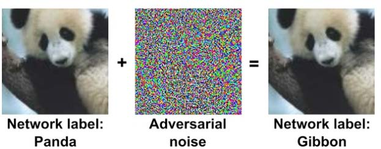
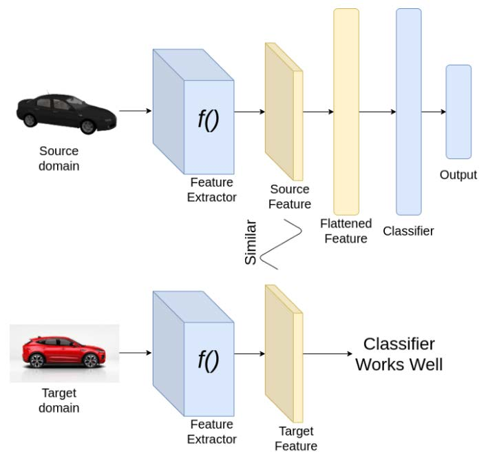
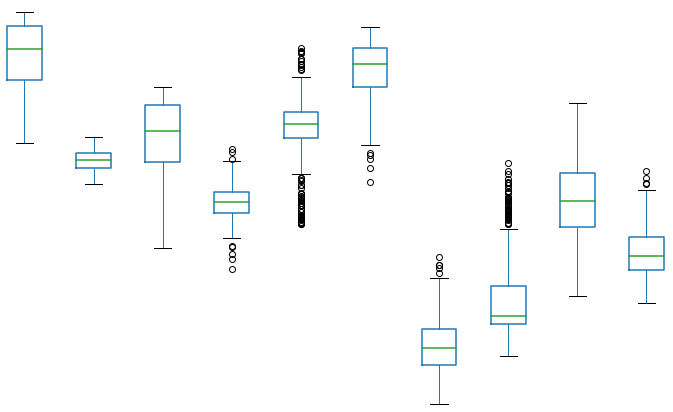
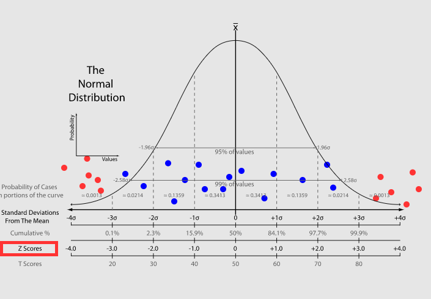

Безопасность систем ИИ
======================
Базовые принципы создания атакующих примеров. Классификация атак. Атаки уклонением. Атаки отравлением данных. Отравление модели, зашумление данных, порча меток. Инверсия модели.
---------------------------------------------------------------------------------------------------------------------------------------------------------------------------------

*текста много, но суть проста, не бойтесь*

Опасность для систем машинного обучения (в цифровой среде) -- это прямое
или косвенное воздействие на элементы конвейера (пайплайна) систем
машинного обучения (МО) для того, чтобы добиться одного (или нескольких
эффектов):

-   Получить желаемое поведение системы МО

-   Воспрепятствовать правильной работе системы МО

-   Полностью исключить возможность работы систем МО

-   Получить непубличную информацию о системе МО и/или данных,
    использованных при обучении

Искусственное воздействие на элементы конвейера систем МО принято
называть атаками

Соответственно, чисто формально, атаки могут затрагивать (воздействовать
на) тренировочные данные, тестовые данные (данные периода исполнения или
реальные данные) и саму модель.

**Классификация атак**

  --------------------- --------------------------- ----------------------------
  **Атака**             **Место Атаки**             **Затрагиваемые параетры**
  Adversarial Attack    использование               Входные данные
  Backdoor Attack       тренировка                  Параметры сети
  Data poisining        тренировка, использование   Входные данные
  IP stealing           использование               Отклик системы
  Neural-level trojan   тренировка                  Отклик системы
  Hardware trojan       аппаратное проектирование   Отклик системы
  Side-channel Attack   использование               Отклик системы
  --------------------- --------------------------- ----------------------------

***Состязательные атаки*** -- подбор входных данных, которые
\"обманывают\" систему МО. Чаще всего представляются как специально
подобранные модификации корректно обрабатываемых данных. (например
данные с наложенным специальным шумом)

Остальные атаки (отравление данных,бэкдор) -- концептуально похожи на
классические проблемы кибербезопасности.

### Использование API

**Репликация модели**

Злоумышленник может воспроизвести функциональность модели машинного
обучения, используя ее API вывода. В этом случае репликации модели
злоумышленник неоднократно запрашивает API вывода жертвы, и использует
его в качестве идей для сбора комбинации данных и метки. Из комбинации
(данные, метка) злоумышленник строит теневую модель, которая эффективно
функционирует как модель жертвы, но с меньшей точностью. Обычно это
первый шаг к атакам уклонения.

**Кража модели**

Функциональные возможности моделей машинного обучения могут быть
украдены с использованием API вывода.

Разница между извлечением модели и репликацией модели: в атаках
извлечения модели злоумышленник может построить теневую модель, точность
которой совпадает с точностью модели жертвы, и, следовательно, атаки с
кражей / извлечением модели приводят к украденной интеллектуальной
собственности. В атаках репликации модели теневая модель не имеет такой
же точности, как модель жертвы.

### Атаки уклонением

В отличие от атак отравления, которым требуется доступ к обучающим
данным, злоумышленники могут обмануть классификатор ML, просто испортив
запрос к модели ML.

В более широком смысле -- входные данные, которые не позволяют модели
машинного обучения точно идентифицировать выборку данных. Этот метод
можно использовать для обхода модели машинного обучения. И здесь есть
два режима -- offline и online.

**Offline уклонение**

Есть автономная копия модели МО, полученная с помощью репликации модели
или извлечения модели - в зависимости от конкретного случая автономная
копия может быть теневой копией или точной реконструкцией исходной
модели.

Благодаря наличию offline копии модели, учимся уклоняться от модели МО,
не опасаясь раскрытия. Нашли образец для уклонения, злоумышленник может
по существу воспроизвести образец на реальной модели.

Как алгоритмически найти образец, который уклоняется от автономной
модели машинного обучения?

Существует множество стратегий выбора данных для уклонения, и в
зависимости от экономики (собственных затрат): простое преобразование
входных данных (обрезка, сдвиг, перевод), обычное искажение (добавление
белого шума в фон), состязательные примеры (специально вычисленные
возмущения ввода для достижения желаемого результата) и специальные
данные, которые вызывают предопределенный отклик.

**Online уклонение**

Те же самые вспомогательные техники, как простое преобразование входных
данных (обрезка, сдвиг, перевод), обычное искажение (добавление белого
шума в фон), состязательные примеры (специально вычисленные возмущения
ввода для достижения желаемого результата) и специальные данные, которые
вызывают предопределенный отклик также работают и в контексте
онлайн-атак с уклонением. Различие между Offline и Online заключается в
том, что в первом случае атакованная модель либо украдена /
реплицирована, а во втором случае - это живая модель машинного обучения.
Отметим также, что запросы к реальной системе могут быть и затратными
(например, подбор уклонения для некоторого платного сервиса).

### Неверные модели

Суть:

Все модели машинного обучения существуют в виде кода и поэтому уязвимы
для «традиционных программных атак». Ряд популярных пакетов, таких как
Tensorflow, Caffe, OpenCV, имеют открытые CVE (Common Vulnerabilities
and Exposures), что делает их уязвимыми для традиционных атак на
переполнение кучи и переполнение буфера.

Часто используют предобученные модели, тем самым подложив \"взломанную\"
модель или данные в открытый источник можно получить требуемый результат
при атаке. (Предостережение, нужно брать модели и датасеты всегда из
проверенных источников)

Также это всё может быть провернуто через внедрение в образы облачных
контейнеров вредоносного кода. Amazon Web Service (AWS), образы Google
Cloud Platform (GCP) и образы Azure, а также популярные среды выполнения
контейнеров, такие как Docker.

### Отравление модели МО

Злоумышленники могут обучать модели машинного обучения, которые являются
производительными, но содержат бэкдоры, которые приводят к ошибкам
вывода при представлении входных данных, содержащих триггер,
определенный самим злоумышленником.

Модель с бэкдором может быть представлена конечным пользователям (как
говорилось в подсекции *Неверные модели*) через предварительно обученную
модель с бэкдором или как результат отравления данных. Эта отравленная
модель может быть использована во время вывода с помощью атаки
уклонения.

### Отравление данных

Злоумышленники могут попытаться отравить наборы данных, используемые
системой машинного обучения, путем изменения базовых данных или их
меток. Это позволяет злоумышленнику внедрять уязвимости в модели
машинного обучения, обученные на данных, которые может быть трудно
обнаружить. Встроенную уязвимость можно активировать позже, предоставив
модели данные, содержащие триггер. Отравление данных может помочь
включить атаки уклонением.

**Загрязнение данных**

Злоумышленники могут попытаться добавить свои собственные данные в набор
данных с открытым исходным кодом, что может создать бэкдор
классификации. Например, злоумышленник может вызвать целевую атаку с
ошибочной классификацией только тогда, когда в запросе присутствуют
определенные триггеры. В остальных случая система будет работать честно.

**Зашумление данных**

Добавление шума к набору данных снизит точность модели, потенциально
делая модель более уязвимой для неправильной классификации.

**Порча меток**

Аналогично с Загрязнением данных, только портим метки.

Злоумышленники могут попытаться изменить метки в обучающем наборе, что
приведет к неправильной классификации модели. Изменение обучающих меток
может создать бэкдор в модели, так что злонамеренный ввод всегда будет
классифицироваться в пользу злоумышленника. Например, злоумышленник
может вызвать целевую атаку с ошибочной классификацией только тогда,
когда в запросе присутствуют определенные триггеры. В остальных случая
система будет работать правильно.

### Инверсия модели МО

Под «инверсией модели» понимают возможность получения обучающих данных
из обученной модели.

Данные обучения моделей машинного обучения можно реконструировать,
используя оценки достоверности, доступные через API вывода. Опрашивая
результаты вывода, злоумышленник может получить обратно потенциально
конфиденциальную информацию, встроенную в обучающие данные. Это может
привести к нарушениям конфиденциальности, если злоумышленник сможет
восстановить данные конфиденциальных функций, используемых в алгоритме.
Методы генерации вредоносных искажений. $L_p$ норма. Атаки белого ящика. Атаки черного ящика. Отравление данных.
----------------------------------------------------------------------------------------------------------------

$L_p$ - незаметность. В силу небольших изменений, человек не в состоянии
замечать возмущений во входных данных.

$||x||_p=(|x_1|^p+|x_2|^p+...+|x_n|^p)^{1/p}$

$||x||_{\inf}=max\{|x_1|,|x_2|,...,|x_n|\}$

-   Незаметность внимания, когда в силу малости изменений человек
    практически не должен замечать изменений. Для *изображений* здесь
    обычно упоминают повороты и трансляции.

-   Незаметность изменения *результатов*. Человек-наблюдатель не может
    легко заметить отклонения в результатах.

-   Незаметность для *детекторов*. При этом детекторы могут искать
    возмущения в исходных данных, в результатах и в шаблонах активации
    (то есть, в работе сети).

**Норма $L_0$**: Атака с ограничением нормы L0 обычно включает в себя
изменение определенного количества характеристик входного сигнала
модели. Атаки с ограничением $L_0$-нормы часто очень реалистичны и могут
быть запущены в реальных системах. (Типичный пример - наклейка,
добавленная к знаку остановки, которая может заставить беспилотный
автомобиль не замедляться - весь фон сохраняется, и изменяется только
крошечная часть окружающей среды.)

**Норма $L_1$**: Атака с ограничением по норме $L_1$ включает ограничение
сверху суммы общих значений возмущения. Эта атака довольно необычна.

**Норма $L_2$**: Атака с ограничением по норме $L_2$ включает
ограничение сверху евклидова расстояния / пифагорова расстояния
возмущения $d$. Атаки с ограничением по норме $L_2$ используются
довольно часто из-за математической значимости норм $L_2$ в линейной
алгебре и геометрии.

**Норма $L_{\inf}$**: это значение максимальной разницы среди пикселей.
Была обнаружена первой, такие атаки изучаются больше всего из-за их
простоты и математического удобства при надежной оптимизации.

Атака -- это сознательная генерация (подбор) состязательных примеров,
которые существуют (могут существовать) и без злонамеренных
пользователей.

Отсюда -- важно понимать природу данных ("физику" системы) и возможность
оценки генеральной совокупности.

### Атаки белового ящика

White-box (белый ящик) -- атакующий имеет полную информацию о модели
(архитектура, веса, стратегии тренировки и т.д.)

злоумышленник может вычислить функцию потерь модели J(θ, X, y) где X -
входное изображение, y - выходной класс, а θ - внутренние параметры
модели.

Эта функция потерь обычно является вероятностью отрицательной потери для
методов классификации

Все методы атак белого ящика пытаются максимизировать изменение функции
потерь модели, сохраняя при этом небольшое возмущение входного
изображения.

Заметка: Чем выше размерность пространства входного изображения, тем
легче создавать состязательные примеры, неотличимые от чистых
изображений человеческим глазом.

$x$ - вход модели, $\ell$ - результат классификации, $x_0$ - порожденный
вход, $\ell_0$ - результат классификации порожденного входа,
$L(x, \ell)$ - функция потерь

Атаки на основе градиента линеаризуют потери (например, кросс-энтропию)
вокруг входа $x$, чтобы найти направления $\rho$, к которому прогнозы
модели для класса $\ell$ наиболее чувствительны

$L(x+\rho,\ell) \approx L(x,\ell)+\rho T \nabla_x L(x,\ell)$

$\nabla_x L(x,\ell)$ - градиент функции потерь по входу $x$.

Градиент используется для определения направления. Так как из
backpropogation выходной градиент определяет и входные градиенты
(направления изменения входных параметров).

**Gradient Attack** Атака вычисляет градиент:
$g(x_0)=\nabla_x L(x_0, \ell_0)$, а далее ищет минимальное значение
(шаг) $\epsilon$ так, что $x_0+\epsilon g(x_0)$ -- состязательный пример
(на нем будет ощибочная классификация)

**Gradient Sign Attack(FGSM)** Атака вычисляет градиент:
$g(x_0)=\nabla_x L(x_0, \ell_0)$, а далее ищет минимальное значение
(шаг) $\epsilon$ так, что $x_0+\epsilon \operatorname{sign}(g(x_0))$ --
состязательный пример

FGSM заключается в добавлении шума (а не случайного шума), направление
которого совпадает с градиентом функции стоимости по отношению к данным.
Шум масштабируется по параметру $\epsilon$. В этой формуле имеет
значения величина не величина градиента, а его направление.

Это похоже на градиентный спуск, который предназначен для обновления
весов модели, чтобы минимизировать функцию стоимости путем получения
градиента по отношению к весу.

**Iterative Gradient Attack** Потери максимизируются на небольших
ступенях в направлении $g(x)=\nabla_x L(x, \ell_0)$. Итеративно
обновляется $x_{k+1} \xleftarrow[]{} x_k+\epsilon g(x_k)$

$\epsilon$ настраивается внутри, чтобы найти минимальное возмущение.

**Iterative Gradient Sign Attack**
$g(x_0)=\operatorname{sign}(\nabla_x L(x_0, \ell_0))$ --
$x_{k+1} \xleftarrow[]{} x_k+\epsilon g(x_k)$

**DeepFool Attack** На каждой итерации DeepFool вычисляет для каждого
класса $\ell \neq \ell_0$ минимальное расстояние $d(\ell, \ell_0)$,
необходимое для достижения границы класса, путем аппроксимации
классификатора модели линейным классификатором. Затем он делает
соответствующий шаг в направлении класса с наименьшим расстоянием.

**Jacobian-Based Saliency Map Attack** Эта целевая атака использует
градиент для вычисления оценки значимости для каждого входного параметра
(например, пикселя). Этот *показатель значимости отражает*, насколько
сильно каждая функция может подтолкнуть классификацию модели от
эталонного к целевому классу. Этот *процесс повторяется*, и на каждой
итерации нарушается только функция с максимальной оценкой значимости.

### Атаки черного ящика

-   Черный ящик с прозрачным выходом -- структура модели неизвестна, но
    есть полный доступ к результатам работы

-   Черный ящик с ограниченными запросами -- структура модели
    неизвестна, есть полный доступ к результатам работы, но либо
    количество запросов, либо их частота ограничены

-   Черный ящик с ограниченными результатами. Структура модели
    неизвестна, доступна только часть выходных результатов. Чаще всего
    -- классы без вероятностей (для задач классификации, которые и
    являются наиболее частым объектом атак).

-   Черный ящик. Структура модели неизвестна, результаты работы
    недоступны. Атакующий должен создать атаку без обращений к атакуемой
    системе.

Во многих работах неоднократно отмечалось, что состязательные примеры
довольно хорошо передаются между моделями, а это означает, что они могут
быть разработаны для целевой модели A, но в конечном итоге эффективны
против любой другой модели, обученной на аналогичном наборе данных.

**Аддитивная равномерная шумовая атака** -- Эта атака проверяет
надежность модели на добавление равномерного шума. Внутренний поиск
выполняется для нахождения минимальных посторонних возмущений.

**Аддитивная шумовая атака по Гауссу** -- Эта атака проверяет надежность
модели на добавление нормального шума. Внутренний поиск выполняется для
нахождения минимальных посторонних возмущений.

**Шумовая атака Salt And Pepper** -- Эта атака проверяет надежность
модели на добавление специального шума (соли -- белые пиксели и перца --
черные пиксели). Внутренний поиск выполняется для нахождения минимальных
посторонних возмущений.

**Атака уменьшения контрастности** -- Эта атака проверяет устойчивость
модели к снижению контрастности. Внутренний поиск выполняется для
нахождения минимальных посторонних возмущений.

***Внутренний поиск*** может выполняться следующим образом: 1) строится
дискретная сетка параметров, значения считаются по сетке и выбирается
наихудшее 2) случайно выбираются k значений параметра. Из результатов
выбирается худший

**Размытие по Гауссу** (проверка устойчивости к размытию по Гауссу)

**Однопиксельная атака** (устойчивость к изменению отдельных пикселей,
устанавливая для одного пикселя черный или белый цвет)

**Атака на локальный поиск** -- измеряет чувствительность модели к
отдельным пикселям, применяя экстремальные возмущения и наблюдая влияние
на вероятность правильного класса, так ищутся наиболее чувствительные
пиксели, и делается состязательное изображение.

### Отравление данных

Атаки с отравлением данных, напротив, могут манипулировать процессом
обучения. Атакующие стремятся манипулировать обучающими данными
(например, изменять метки, манипулировать настройками конфигурации
модели, изменять веса модели и т.п.), чтобы повлиять на результат
обучения модели.

**Переворачивание меток**

Простой и эффективный способ атаковать процесс обучения -- поменять
местами метки некоторых экземпляров обучения.

Атака с переворачиванием *случайных* меток не зависит от модели.
Алгоритм просто выбирает подмножество обучающих экземпляров и
переворачивает (изменяет) их метки.

Несмотря на то, что эта случайная стратегия выглядит простой, она
способна уменьшить точность классификации.

Атаки со случайным переворачиванием меток можно разделить на две группы:
*целевые* и *нецелевые*.

В *нецелевой* атаке со случайным переключением меток, атакующий может
выбрать некоторые экземпляры из класса A, чтобы ошибочно
классифицировать их как класс B и некоторые экземпляры из класса B,
чтобы ошибочно классифицировать их как класс A.

В *целевой* атаке, злоумышленник последовательно ошибочно классифицирует
один класс как другой. Целевая атака случайного переключение меток
является более серьезной по сравнению с нецелевой, поскольку целевая
атака постоянно вводит в заблуждение алгоритм обучения для классификации
определенного класса экземпляров как другого определенного класса.

Вместо случайного переключения меток злоумышленник также может
использовать атаки с переворотом меток, которые зависят от модели.

Например, можно попробовать изменить гиперплоскость в SVM, воздействуя
на (неверно классифицируя) вектора, которые находятся "далеко" от
гиперплоскости (то есть те, которые без атаки правильно
классифицировались).
Оценка устойчивости моделей машинного обучения к внешним воздействиям. Формальная верификация моделей. SAT / SMT решатели, линейное программирование и проверка теорем, неполная верификация. Чувствительность моделей к шуму.
------------------------------------------------------------------------------------------------------------------------------------------------------------------------------------------------------------------------------

Под **устойчивым** (надежным) машинным обучением обычно понимается
устойчивость (надежность) алгоритмов машинного обучения.

Чтобы алгоритм машинного обучения считался надежным, либо ошибка
тестирования должна согласовываться с ошибкой обучения, либо
производительность должна быть стабильной после добавления некоторого
шума в набор данных.

При этом важно, что мы отмечаем именно проблемы (изменения) в данных.
Ничего не говорится о природе этих изменений.

Другой важный вопрос, который часто не акцентируется. Мы говорим о
добавлении шума к исходным данным (данным для обучения) потому, что мы
не знаем, вообще говоря, ничего о реальных данных. Поэтому единственный
способ как-то представить возможные тестовые данные -- это получить их
из реальных путем добавления возмущений.

*Оценка устойчивости зависит от того, насколько точно (репрезентативно)
тренировочные данные представляют реальные (тестовые) данные*

Google (Deepmind) в обзорной публикации своей исследовательской группы
Robust and Verified Deep Learning Group отмечает, что системы машинного
обучения по умолчанию не являются надежными.

3 базовых правила:

I. Вы не должны тренироваться на данных, которым не полностью доверяете
(из-за возможного отравления данных)

II\. Вы не должны позволять никому использовать вашу модель или наблюдать
за ее работой (из-за кражи модели и атак черного ящика).

III\. Вы не должны полностью доверять предсказаниям вашей модели (из-за
возможных состязательных примеров).

Как можно оценивать устойчивость систем машинного обучения? Как
говорилось выше, отсутствие устойчивости -- фундаментальное свойство
систем машинного обучения. (всегда можно придумать состязательный
пример)

Во-первых, можно рассматривать системы машинного обучения как
законченные программные продукты, для которых существуют подходы к
ограничениям (проверке, фильтрации) входных данных и проверке работы
системы в реальном времени (assertion). Это точно также применимо и к
программной системе, которой является обученная модель. Естественно, это
не гарантирует, в общем случае, устойчивости, но это "лучше чем ничего".
По крайней мере, присутствие (отсутствие) таких проверок может
использоваться при сравнении моделей.

Проверка работы в реальном времени, если она должна делать что-то больше
журналирования результатов, также зависит от предметной области. В
каких-то случаях можно остановить работу системы при срабатывании
проверок (как правило -- для всех систем, не связанных с управлением в
реальном времени), в каких-то случаях -- такое может быть невозможным.

Оценка устойчивости:

Во-первых, это *верификация устойчивости*, которая обеспечивает
теоретические гарантии обеспечения уровня возмущений исходных данных, не
влияющего на работу сети.

Второй подход -- это собственно *количественная оценка* устойчивости,
которая вводится как оценка трудности нахождения исходных данных,
которые приводят к неверным результатам работы. Интуитивно понятно, что
чем сложнее генерировать такие входные данные, тем надежнее модель.

Из общих соображений, верификация (теоретическое подтверждение)
является, конечно, более предпочтительной. Этот подход является крайне
интересным, но в настоящий момент он испытывает проблемы с
масштабируемостью. Причину проблем можно объяснить достаточно просто.

Формальная верификация означает формальное же описание проблемы (в
данном случае -- системы машинного обучения). (Например -- записать
(представить) модель в виде набора логических утверждений.)

(Противоречие: при создании модели мы набираем большое число фичей,
чтобы найти скрытые закономерности, то есть моделирование требует
увеличения размерности, верификация -- уменьшения.)

Смысл верификации состоит в доказательстве того, что при известных
ограничениях на входные значения, выходные значения будут находиться в
заданных (известных) границах.

Есть 4 группы подходов к формальной верификации систем машинного
обучения 1. SAT/SMT решатели 2. Линейное программирование 3. Проверка
теорем 4. Неполная верификация

### SAT/SMT

**Satisfiability (SAT) и Satisfiability Modulo Theories (SMT)** -- это
задача выполнимости булевых формул и задача выполнимости формул в
теориях.

SAT -- это задача проверки выполнимости булевой формулы, состоящая
только из имён переменных, скобок и операций И, ИЛИ и (HE).

SMT-формула --- это формула в логике первого порядка, в которой
некоторые функции и предикатные символы имеют дополнительную
интерпретацию.

Проверяются программные ограничения и ограничения, налагаемые на
переменные. Точно также и для системы ML - ограничения на сеть и
ограничения на элементы сети.

[\[fig:sat\_smt\]]{#fig:sat_smt label="fig:sat_smt"}

Модель системы и проверяемое свойство выражаются в логике высказываний и
записываются в виде нормальной конъюнктивной формы (CNF), которая затем
проверяется автоматическим SAT-решателем.

Вывод решателя двоичный: SAT означает наличие контрпримера, UNSAT
подразумевает отсутствие каких-либо контрпримеров, и, следовательно,
указывает на то, что указанное высказывание справедливо для системы.

Теории выполнимости по модулю (SMT) работает аналогично SAT, но
позволяет использовать теории, выходящие за рамки логики высказываний,
такие, как линейная арифметика.

SAT - двоичные значения, поэтому он для бинарированных нейронных сетей
(BNN), где веса и активации, преимущественно, бинарные.

Соответственно, SMT решатели используются для верификации DNN с
цифровыми (целыми и вещественными) параметрами.

Далее предположим, что существует семейство операций $\Delta$, которые
мы называем манипуляциями, которые определяют модификации изображения,
под которым классификационное решение должно оставаться неизменным в
регионе $\eta$. (Такие манипуляции могут представлять собой, например,
погрешности камеры, изменение угла камеры или замену параметров
(features).)

• Решение безопасное для ввода $X$ и региона $\eta$ с учетом набора
манипуляций $\Delta$, если применение манипуляций к $X$ не изменяют
классификацию.

### Линейное программирование

Верификация на основе линейного программирования (LP) работает путем
определения верифицируемой системы как набора линейных ограничений с
максимизацией или минимизацией заданной целевой функции.

[\[fig:lp\_prog\]]{#fig:lp_prog label="fig:lp_prog"}

Для верификации устойчивости к атакам, целью проверки является
нахождение минимального шума (изменения данных), при котором ограничения
сохраняются (удовлетворяются), а классификация -- меняется. Это
проиллюстрировано на рисунке ниже, так же в сравнении с верификацией
программ.

Для DNN одной из проблем использования линейного программирований
(соответственно, линейных ограничений) являются нелинейные функции
активации.

Соответственно, для целей верификации они могут быть заменены линейными
аппроксимациями.

### Проверка теорем

Доказательство теорем - это тип формальной проверки, в которой система и
ее свойства определены математически, и свойства проверяются для системы
по правилам естественной дедукции.

Для проверки система должна быть представлена в виде логической модели с
формальной математической нотацией. Свойство аналогично выражается как
формальная цель доказательства. Цель состоит в том, чтобы использовать
аксиомы и правила, выведенные из этих аксиом, для проверки свойств.

Такое представление требует глубокого знания процессов, лежащих в основе
системы для ее реалистичного моделирования.

[\[fig:theor\_check\]]{#fig:theor_check label="fig:theor_check"}

### Неполная верефикация

Под этим понимается процесс верификации некоторого приближения системы.

Неполная верификация часто использует абстрактную интерпретацию,
линейную аппроксимацию и другие подобные подходы для формального
моделирования системы. В результате, модель системы модель не является
точным представлением реальной системы, а, скорее, некоторым ее
избыточным приближение.

Важно отметить, что моделирование/тестирование, которое также дает
неполные результаты, не следует путать с неполной верификацией.

Неполное результаты - в резульате рассмоторения системы как черный ящик.

Неполная верификация - система \"белый ящик\", просто модель упрощена.

[\[fig:not\_full\]]{#fig:not_full label="fig:not_full"}

Очевидно, что упрощение положительно влияет на масштабируемость, но,
вместе с тем, отсутствие опровергающих примеров для упрощенной модели не
означает того же самого для полной модели.

### Чувствительность к шуму

Сеть должна устойчиво классифицировать данные из обучающих примеров, а
также в окрестности существующих данных (образцов)

Noise Sensitivity Score - NSS -- оценка чувствительности к шуму.

Чем выше среднее минимальное (по всем данным из имеющегося набора)
возмущение (чем больше круги), которое требуется для неправильной
классификации образца, тем надежнее DNN по отношению к состязательным
атакам.

При всей ясности такого подхода, вопрос, который возникает немедленно --
каковы гарантии, что мы нашли все состязательные примеры (чтобы
декларировать минимальное расстояние)?

Также вычисление такой оценки может быть достаточно затратным.
Повышение устойчивости моделей машинного обучения. Состязательные тренировки, очистка данных, адаптация домена. Сдвиг данных, его классификация и мониторинг.
-------------------------------------------------------------------------------------------------------------------------------------------------------------

Основные этапы повышения устойчивости:

1.  Дизайн устойчивых систем. Закладка устойчивости на этапе
    проектирования(тренировки)

2.  Очистка (фильтрация) данных, и во время тренировки, и в период
    эксплуатации

3.  Мониторинг данных и определение сдвига распределения (изменения
    характеристик входных данных)\

**Adversarial robust training (состязательные тренировки)**\
Идея: дополнять тренировочные данные состязательными примерами. Таким
образом, состязательные примеры (которые используют злоумышники) не
будут являться новыми для модели на этапе эксплуатации.

Проблемы: полнота состязательных примеров (учли ли все случаи, скорее
всего - нет), понижение точности модели.

Пример состязательной тренировки - добавление шума на существующие
картинки $\to$ получаем новый состязательный пример.

С математической точки зрения - это задача минимума-максимума: поиск
лучшего решения для наихудшего оптимума. Формально, у нас есть функция,
классификатор изображений заданного размера $h \times w \times c$ в $k$
классов.

$$f(x; \theta) : \mathbb{R}^{h \times w \times c} \to \{1 \cdots k\}$$

Если у нас есть некоторый допустимый объем изменений (бюджет изменений,
perturbation budget) , то атакующий пробует найти изменение (возмущение)
исходных данных $\delta \in  \mathbb{R}^{h \times w \times c}$, которое
максимизирует функцию потерь, например кросс-энтропию
$\mathcal{L}_{ce}$, так, что $f(x + \delta) \neq f(x)$

Соответственно, оценка для может быть представлена так:

$$\delta^* := \underset{|\delta|_p \le \epsilon}{\arg\max}\mathcal{L}_{ce}(\theta, x+\delta, y)$$

Где y -- метка для x и p -- норма 1,2,$\cdots$

**Адаптация домена**

Адаптация домена (в машинном обучении) -- это термин, который определяет
способность применять алгоритм, обученный в одном или нескольких
«исходных доменах» (одной предметной области), к другому (но связанному)
«целевому домену» (другой предметной области).

Цель - обучить нейронную сеть на одном наборе данных (источнике), для
которого доступны метки или аннотации, и обеспечить хорошую
производительность на другом наборе данных (цели), чьи метки (аннотации)
недоступны. Чтобы адаптироваться от одного домена к другому, нам нужно,
чтобы наш классификатор хорошо работал с признаками, извлеченными из
источника, а также с целевым набором данных.

Адаптация бывает:

1.  Контролируемая (Supervised). Есть размеченные данные для целевого
    домена и его размер меньше исходного.

2.  Полу-контролируемая (Semi-Supervised). В результирующем домене есть
    как размеченные, так и неразмеченные данные.

3.  Неконтролируемая -- данные в целевом домене неразмеченные.

С точки зрения анализа устойчивости: Целевой домен -- это реальные
данные, которые модель должна обрабатывать. Например, состязательный
набор. Для них у нас нет разметки. Наша модель обучалась на других
данных (исходный набор). Выделяют три метода (подхода) адаптации
предметной области:

-   Адаптация домена на основе дивергенции.\
    Работает по принципу минимизации некоторого критерия, основанного на
    расхождении между исходным и целевым распределением, что приводит к
    инвариантным функциям предметной области. Используется какой-то
    математический критерий, показывающий расхождение, например,
    максимальное среднее расхождение (MMD -Maximum Mean Discrepancy). С
    помощью MMD мы пытаемся определить, принадлежат ли данные две
    выборки к одному и тому же распределению или нет.

-   Состязательная адаптация домена.\
    Это подход, в котором используется GAN. Здесь наш генератор - это
    просто экстрактор признаков, и мы добавляем новые сети
    дискриминаторов, которые учатся различать признаки исходного и
    целевого домена. Дискриминатор помогает генератору создавать
    признаки, неотличимые для исходного и целевого домена.

-   Адаптация домена на основе реконструкции.\
    Работает на идее преобразования изображения в изображение. Один из
    простых подходов может заключаться в том, чтобы изучить перевод
    изображений целевого домена в изображение исходного домена и обучить
    классификатор в исходном домене.\

**Очистка тренировочных данных**\
Это процесс выявления неправильной, неполной, неточной, нерелевантной
или отсутствующей части данных с последующим их изменением, заменой или
удалением в зависимости от необходимости. Мусор на входе =\> мусор на
выходе.

Что чистим и как:

1.  Несогласованные столбцы\
    Характеристики, которые не используются в модели, просто удаляются

2.  Пропущенные данные\
    достаточно частая ситуация -- пропуск значений. Возможные действия

    1.  Удалить строки (столбцы) с пропущенными значениями

    2.  Заполнить пропуски посредством аппроксимации (предсказания
        пропущенных значений)

    3.  Забить болт и ничего не делать

3.  Аномалии (выбросы). Данные, которые сильно отличаются от остальных.
    Обнаружить можно(легче всего визуально):

    1.  Диаграммой рассеяния (точечная диаграмма)

        

    2.  Коробчатая диаграмма -- показывает квартили. Выбросы с
        измененным цветом

        

    3.  Z-оценка -- на сколько стандартных отклонений значение
        отклоняется от среднего

        

4.  Дублирующие данные - удаляем дубли

5.  Соблюсти сбалансированность (чтобы не было сдвига в данных).
    Например, данные о физической активности людей, где превалирует один
    пол (одна возрастная группа), -- говно данные.

6.  Нормализация\
    Метод, который часто применяется как часть подготовки данных для
    машинного обучения. Цель нормализации -- изменить значения числовых
    атрибутов (столбцов в наборе данных) на общий масштаб, не искажая
    различия в диапазонах значений.

**Сдвиги данных**

Когда подготавливают реальные (а не тестовые) данные, они должны быть
различными. Это и есть проверка их на сдвиг распределения.

**Сдвиг распределения** - совместное распределение входов и выходов
различается для тренировочных и тестовых данных. $x$ -
переменные(свойства), $y$ - результат(цель), $P(x,y)$ - совместное
распределение

Рассматриваемые проблемы:

1\. проблема предсказания. По $X$ определить $Y$: $X -> Y$.

2\. проблема объяснения $Y ->X$.

Совместные распределения: $P(y/x)P(x)$ для $X -> Y$; $P(x/y)P(y)$ для
$Y -> X$.

**Ковариантный сдвиг** рассматривается проблема предсказания,
используется модель $P(y/x)P(x)$ и распределение тренировочных и
тестовых данных различное.

$P_{train}(y|x)=P_{test}(y|x)$ и $P_{train}(x) \neq P_{test}(x)$

[\[fig:cov\_shift\]]{#fig:cov_shift label="fig:cov_shift"}

**Априорный сдвиг** рассматривается проблема объяснения $Y -> X$, модель
$P(x/y)P(y)$ и распределение $P(y)$ разное для тренировачных и тестовых
данных

$P_{train}(x|y)=P_{test}(x|y)$ и $P_{train}(y) \neq P_{test}(y)$

Интуитивно понятный способ представить это - рассмотреть
несбалансированный набор данных. (датасет со спамом, спама там не 50, а
10 процентов)

[\[fig:ap\_shift\]]{#fig:ap_shift label="fig:ap_shift"}

Основные причины сдвига набора данных

Двумя наиболее распространенными причинами сдвига набора данных являются

\(1) систематическая ошибка выборки и

\(2) нестационарная среда: когда обучающая среда отличается от тестовой,
и вызвано это временным или пространственным изменением.

Смещение выборки не является недостатком какого-либо алгоритма или
обработки данных. Это чисто систематический недостаток в процессе сбора
или маркировки данных, который вызывает неравномерный выбор обучающих
примеров из совокупности, что приводит к формированию предвзятости во
время обучения.

Один из наиболее подходящих нестационарных сценариев включает проблемы
состязательной классификации, такие как фильтрация спама и обнаружение
сетевых вторжений. Этот тип проблемы привлекает все большее внимание в
области машинного обучения и обычно справляется с нестационарными
средами из-за существования злоумышленника, который пытается обойти
изученные концепции существующего классификатора.
