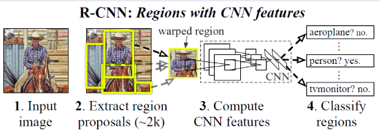
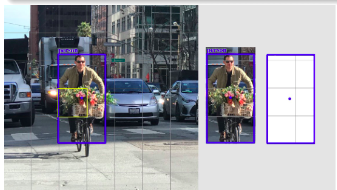
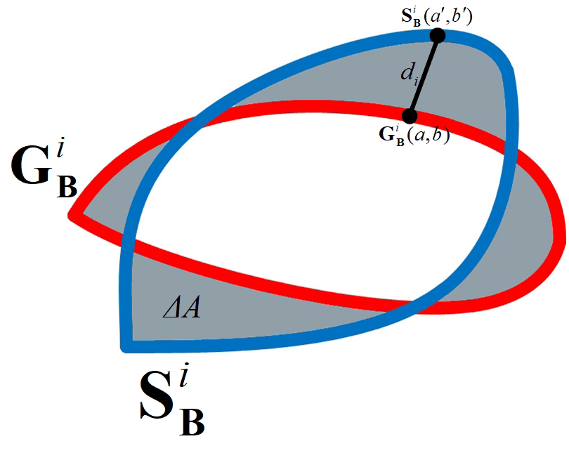
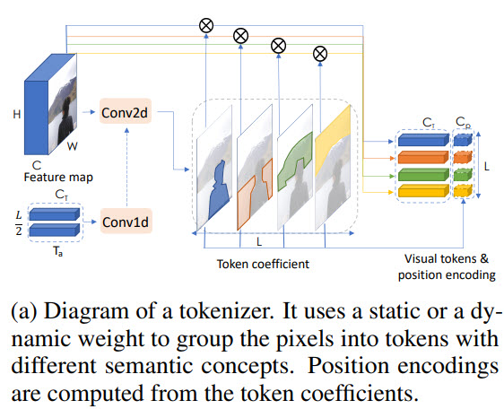

Задачи компьютерного зрения
===========================

Задачи компьютерного зрения. Задачи детекции. Описание принципов работы RCNN, YOLO. Задача сегментации. Семантическая сегментация. Паноптическая сегментация. Описание принципа работы U-net. Задача распознавания лиц. Подходы для метрического обучения. Функции потерь для задач классификации, сегментации.
----------------------------------------------------------------------------------------------------------------------------------------------------------------------------------------------------------------------------------------------------------

Их много, основными являются те, что указаны на
рисунке:

||
|:--:|
|*Задачи компьютерного зрения.*|

### Задача детекции

**Недостатки классификации**

-   Классификация затруднена, если на одном изображении есть несколько
    объектов разных типов

-   Классификация не говорит от том, есть ли на изображении несколько
    объектов одного типа

-   Только классификации недостаточно для большинства приложений.

Главное отличие задачи детектирования от задачи классификации в том, что
надо не только сказать, есть ли объект на изображении, но и
**локализовать** область нахождения объекта. Если объектов несколько, то
требуется найти их все.\
**Формальное определение обнаружения объектов**

-   Вход: изображение

-   Выход (soft): набор троек \<тип объекта (object type), уверенность
    (confidence), прямоугольник (bounding box)\>

-   Для реальных приложений важнее hard-выход: набор пар \<тип объекта,
    прямоугольник\>, но для сравнения детекторов нужен soft-выход

||
|:--:|
|*Слева - soft-выход, справа - hard-выход*|

### Метрики

**Как понять, что один метод обнаружения лучше другого?**\
Для этого используется метрика mAP - Mean Average Precision на основе
метрик : 

$$p = \frac{TP}{TP+FP}, r=\frac{TP}{TP+FN}$$

**Определение mAP** 
$$AP = \int_{0}^{1}p(r)dr$$

$$mAP = \frac{1}{n}\sum_{i=1}^{n}AP_i$$ 

где $n$ - количество классов, а
$AP_i$ - $AP$ для $i$-го класса.\
*AP (Average Precision)* - вычисляется средняя точность для Recall в
диапазоне от 0 до 1 для одного класса, *mAP* - среднее значение AP по
всем классам.\
Для того, чтобы воспользоваться формулами для mAP необходимо определить
TP, FP, FN. Для этого вычислим Intersection over Union (IoU):

$$IoU=\frac{area\quad of\quad overlap}{area\quad of\quad union}$$

**TP:** IoU\>0.5;\
**FP:** IoU\<0.5 или нет пересечения, или дубликат.\
**FN:** нет обнаружения или IoU\>0.5 и неправильно определен класс
объекта;

### Нейросетевой детектор: R-CNN (Regions with CNN Features)

Детектор состоит из следующих модулей:

-   Предсказыватель объектов (около 2000 кандидатов на изображение)

-   Классификатор (без классификационной головы) для извлечения
    признаков каждого кандидата

-   Линейный SVM для классификации кандидата

||
|:--:|
|*R-CNN*|

**Алгоритм предсказания детекций** - selective search. В основе
алгоритма селективного поиска (selective search) лежит использование
метода иерархической группировки похожих регионов на основе соответствия
цвета, текстуры, размера или формы и графов. Для этих графов вершиной
является интенсивность текущего пикселя, а ребра соединяют пару соседних
пикселей. Абсолютная разница интенсивностей пикселей вершин используется
в качестве веса ребра. С помощью графа выделяются фрагменты, которые
затем группируются, согласно следующему принципу: ребра между двумя
вершинами в одной группе должны иметь меньшие веса, а ребра между двумя
вершинами в разных группах должны иметь больший вес. После того, как два
наиболее похожих региона сгруппированы, между полученным регионом и его
соседями вычисляется новое сходство. Процесс группировки наиболее
похожих областей повторяется до тех пор, пока все изображение не станет
одной областью. *Данный алгоритм не настраивается на данные*.\
**Backbone для извлечения признаков**

-   В качестве начальной инициализации берется классификационная сеть,
    обученная на 1000 классов из ImageNet

-   Удаляется последний слой и заменяется на слой нужного размера со
    случайной инициализацией (добавляется новый класс - фон)

-   Обучение производится на тех изображениях с разметкой, у которых
    IoU\>0.5, а остальные рассматриваются как негативные

**R-CNN: Обучение** Классификатор категорий:

-   Для каждого класса обучается свой линейный SVM (один против всех)
    Для отделения негативных примеров используется другой порог - IoU \<
    0.3 (параметр подбирается по валидации и от него очень сильно
    зависит финальный результат)

Корректировка детекций (bounding box regression):

-   Гребневая регрессия

**Достоинства и недостатки R-CNN**\
Достоинства:

-   Один из лучших методов для своего времени

-   Bounding box regression улучшает качество

-   Замена backbone на более продинутый улучшает качество

Недостатки:

-   Самый главный недостаток - скорость работы (т.к. одни и те же куски
    картинки обрабатываются много раз)

-   Сложное многоэтапное обучение

-   Обучение требует много дискового пространства и выч. ресурсов

-   Selective Search - необучаемый алгоритм

### Нейросетевой детектор YOLO

Идея:

-   Изображение покрывается сеткой $S\times S$

-   Выход сети представляет собой тензор размера
    $S\times S\times (B\cdot 5 +C)$, где $B$ - количество детекций с
    центром в этой ячейке, $C$ - количество классов

-   Детекция - это вектор $(x,y,w,h,confidence)$

-   Для всех детекций ячейки вычисляется только одно распределение по
    классам

-   Каждая ячейка предсказывает только один объект

**YOLO: Архитектура**

**Достоинства и недостатки YOLO**\
Достоинства:

-   Быстрый алгоритм, может работать в режиме реального времени

-   Все предсказания дает одна нейронная сеть, которая обучается
    end-to-end

-   Использует для предсказания всё изображение

-   Обладает хорошей обобщающей способностью

Недостатки:

-   Ограниченное количество обнаружений на ячейку

YOLO, как и большинство детекторов, может дублировать обнаружения для
одного и того же объекта. Чтобы исправить это обычно применяют алгоритм
NMS для удаления дубликатов. Такой постпроцессинг добавляет 2-3% mAP.\
Типичная реализация алгоритма выглядит следующим образом:

-   Отсортировать предсказания по confidence

-   Начиная с самых больших показателей идем по предсказаниям и удаляем
    обнаружения с тем же классом и IoU \> 0.5 с предыдущими
    предсказаниями

### Задача сегментации

При *семантической сегментации* мы каждому пикcелю изображения
присваиваем класс (котик на
рисунке. При *instance сегментации* мы хотим
классифицировать лишь пиксели отдельных объектов (собачки и котик на
рисунке. Важно отметить, что собаки при семантической
сегментации были выделены как "DOG", а при instance сегментации каждая
собака будет выделена отдельно. А вот *паноптическая сегментация*
объединяет в себе семантическую и instance сегментацию.

Примеры, где можно решать задачу сегментации -- беспилотные автомобили,
сегментация новообразований на снимках МРТ.

||
|:--:|
|*Задача сегментации. (В данном случае семантическая сегментация), итоговую маску можно сжать с помощью run-length encoding (то есть 5 одинаковых black пикселя будем обозначать B5)*|

P.S. Тут будет про основные лоссы в задачах сегментации и детекта, т.к.
для задач классификации было всё описано в билете 2.3\
**Cross-entropy (CE)** - loss функция, выраженная следующей формулой:

$$D(S, L) = -\sum_{i} L_{i}\log{S_{i}}$$ 

где $L$ - ground root метки (то
есть имеющиеся у нас разметка, соответствующая реальному классу, который
нужно предсказать), а $S$ - это то, что нам выдала (предсказала) модель

P.S. Dice в лекциях не упоминается никак, кроме названия и того, что нам
о нём уже рассказывали, так что всё беру из сети, рассказывать видимо
нужно будет на понимание\
**Dice** - используется для оценки сходства между двумя образцами. С
точки зрения теории множеств, dice рассчитывается, как удвоенное
пересечение множеств $A$ и $B$ на их сумму. Если множества одинаковы, то
коэффициент dice равен 1, если вообще не совпадают - то 0.В задачах
обнаружения границ, вместо множества $A$ пиксели истинной границы,
вместо $B$ - пиксели прогнозируемой границы.

**Boundary loss** - специфичная функция, используется для "круглых
объектов" (сосуды MRT). Считается как разница площадей $\delta{A}$
между $G_{B}^{i}$ (ground root) и $S_{B}^{i}$ (предсказанной) метриками,
то есть путем интегрирования. Берем точку $S_{B}^{i}(a^{'}, b^{'})$,
находим к ней соответствующую точку $G_{B}^{i}(a, b)$ по нормали $d_i$,
и интегрируем по всем точкам.

Трансформеры в компьютерном зрении. Описание принципа работы архитектуры ViT и его разновидностей.
--------------------------------------------------------------------------------------------------

ViT -- Vision Transformers. Общая концепция очень похожа на NLP
трансформеры. Изображение делится на патчи (маленькие кусочки), затем
полносвязный слой и позиционное кодирование на получившихся embeddings.
А потом encoder часть из трансформера (как в BERT), затем еще одна
полносвязная часть для классификации / или другой целевой задачи.
Смотреть рисунок.

||
|:--:|
|*Базовая архитектура ViT.*|

Общепринятый подход к задачам компьютерного зрения --- использовать
картинки как 3D array (высота, ширина, количество каналов) и применять к
ним свертки. У такого подхода есть ряд недостатков:

-   не все пиксели одинаково полезны. Например, если у нас задача
    классификации, то нам важнее сам объект, чем фон. Интересно, что
    авторы не говорят о том, что Attention уже пробуют применять в
    задачах компьютерного зрения

-   Свертки не достаточно хорошо работают с пикселями, находящимися
    далеко друг от друга. Есть подходы с dilated convolutions и global
    average pooling, но они не решают саму проблему

-   Свертки недостаточно эффективны в очень глубоких нейронных сетях.

*Идея*: конвертировать изображения в некие визуальные токены и подавать
их в трансформер\

-   Вначале используется обычный backbone для получения feature maps

-   Далее feature map конвертируется в визуальные токены

-   Токены подаются в трансформеры

-   Выход трансформера может использоваться для задач классификации

-   А если объединить выход трансформера с feature map, то можно
    получить предсказания для задач сегментации\

**Visual transformer**\
Каждый visual transformer состоит из трёх частей: токенизатор,
трансформер, проектор (projector)

**Токенизатор**

Токенизатор извлекает визуальные токены. По сути мы берем feature map,
делаем reshape в (H \* W, C) и из этого получаем токены

**Position encoding**

Как обычно, трансформерам нужны не только токены, но ещё и информация об
их позиции.

$$P = downsample(A)^\intercal W_{A \to P}$$

Вначале мы делаем downsample, потом домножаем на тренируемые веса и
конкатенируем с токенами. Для корректировки количества каналов можно
добавить 1D свертку.

**Transformer**

$$T_{out} = T_{in} + (softmax((T_{in}K)(T_{in}Q)^\intercal) (T_{in}V))F$$

$T_{in}, T_{out}$ - входящие и выходящие токены.