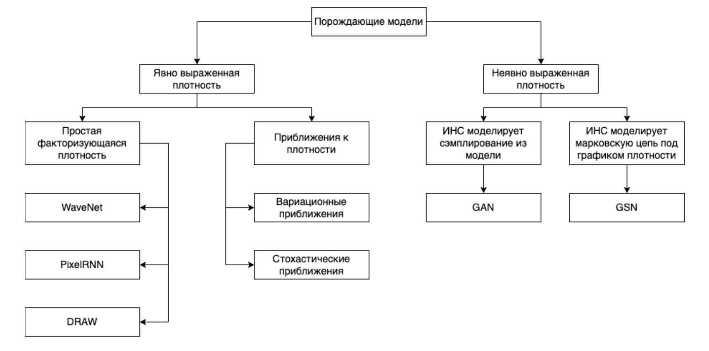

Генеративные модели в компьютерном зрении (генеративно-состязательные нейронные сети). Принцип работы генератора и дискриминатора.
----------------------------------------------------------------------------------------------------------------------------------

Формально задача порождающих моделей, с точки зрения максимизации
правдоподобия, выглядит следующим образом: для набора данных
$D = {x_i}^N){i=1}$ максимизировать $\Pi^N_{i=1}(x_i,\theta)$

$\underset{\theta}{\operatorname{argmax}} \sum_{i=1}^{N} \log p_{\text {model }}(x_{i}, \theta)$

Также мы можем думать о задаче максимизации правдоподобия, как о задаче
минимизации KL дивергенции (позволяет померить расстояния между
распределениями, чем оно меньше, тем лучше генерируем):

$\underset{\theta}{\operatorname{argminKL}}(P_{data}(x)||P_{model}(X,\theta)$

Таким образом мы хотим имея случайный вектор и класс $Y$ сгенерировать
синтетический пример $X$ и найти условное распределение $P (X | Y)$

Свойства, которые нужно достичь:

-   Точность (Fidelity) -- отвечает за качество генерируемых примеров,
    их реалистичность;

-   Разнообразие (Diversity) -- Генератор не должен порождать одно и
    тоже.

||
|:--:|
|*Таксономия(классификация) порождающих моделей*|

### GAN

GAN - одна из наиболее эффективных архитектур для создания реалистичныйх
данных.

||
|:--:|
|*Архитектура GAN*|

Состоит из двух сетей: генератора и дискриминатора.

**Генератор** -- порождает объекты в пространстве синтетических данных.
Он пытается «обмануть» дискриминатор, сделать так, что дискриминатор не
может различать распределение реальных данных и распределение
синтетических, которое порождает генератор.

**Дискриминатор** -- классификатор, который учится отличать порожденные
объекты от примеров из обучающей выборки.

### Обучение генератора и дискриминатора

Процесс обучения GAN выглядит следующим образом: создаем случайный
вектор $z$, подаем его на вход генератору, генератор порождает
синтетический пример $\hat{X}$, далее $\hat{X}$ и пример из реальных
данных $X$ подаются в дискриминатор, который выдает вероятность того
что, синтетический пример является действительно синтетическим или нет.
После чего вычисляется значение функции потерь и выполняется обратное
распространение ошибки *только для дискриминатора*, с корректировкой
весов дискриминатора.

||
|:--:|
|*Обучение дискриминатора*|

Далее выполняется следующий шаг обучения, только на этом этапе в
дискриминатор мы подаем $\hat{X}$. В функции ошибки мы рассматриваем
только метки, которые совпали с реальными, после чего выполняем обратное
распространение ошибки *для генератора*, дискриминатор в этом процессе
не участвует. Затем корректируем веса генератора.

||
|:--:|
|*Обучение генератора*|

В процессе тренировки качество генератора и дискриминатора должно
оставаться сопоставимым, иначе если дискриминатор распознает
синтетические данные со $100\%$ вероятностью, генератор перестанет
учиться.

**Недостатки GAN**

Главным недостатком GANs является попадание модели в состояние mode
collapse. (например дискриминатор быстрее обучается (ему нужно просто
провести гиперплоскость между двумя распределениями), тогда генератор
больше не сможет обучаться, нужно искать баланс, чтобы дискриминатор
помогал обучаться генератору)

Следствие попадания в состояние mode collapse: модель постоянно
генерирует пример или примеры одного и того же класса или нескольких
классов, хотя обучалась она на примерах, размеченных для большего
количества классов.

Это проблема разнообразия (diversity). Такое происходит когда генератор
застревает в локальном минимуме и объединяет несколько мод (mode - пик в
распределении) в одну, после чего генерирует только эту моду.

Этот недостаток был связан в первую очередь с тем, что повсеместно
применяли в качестве функции ошибки бинарную перекрестную энтропию

### Лосс и метрики

**Бинарная перекрестная энтропия** (BCE) - часто использовали, возникает
проблема с разнообразием при обучении, так как дискриминатор менее
глубокий, обычно, и учится быстрее. BCE на некоторых участках не имеет
наклона, что приводит к проблеме исчезающего градиента.

Расстояние Вассерштейна - нужно, чтобы сравнивать не метки классов, а
распределения данных.

**Earth Movers Distance** (EMD) - измеряет расстояние между двумя
распределениями и оценивает усилия, необходимые для того чтобы
генерируемое распределение сделать очень похожим на реальное.

Аппроксимацией EMD является расстояние Вассерштейна или W-loss.

$$\underset{g}{\operatorname{min}}\underset{c}{\operatorname{max}} (c(x)) - (c(g(z)))$$

Генератор пытается минимизировать расстояние, а critic максимизировать.
Важное требование к функции critic, она должна быть 1-L непрерывной по
Липшицу. Это означает что норма для градиента в любой точке не должна
быть больше единицы $||f(x)||_2 \leq 1$

**Расстояние Фреше** или Frechet inception distance (FID), одна из
основных метрик оценки качества для GAN. Изначально эта метрика
применялась для измерения расстояния между двумя кривыми, но в
последствии стало понятно, что с помощью данной метрики можно сравнивать
распределения.

Общая формула:

$$d(\mathcal{N}(\mu, \Sigma), \mathcal{N}(\hat{\mu}, \hat{\Sigma})) = ||\mu - \hat{\mu}||^2 + Tr(\Sigma + \hat{\Sigma} - 2\sqrt{\Sigma\hat{\Sigma}})$$

Одномерный случай:

$$d(\mathcal{N}(\mu, \sigma), \mathcal{N}(\hat{\mu}, \hat{\sigma})) = (\mu - \hat{\mu})^2 + (\sigma - \hat{\sigma})^2$$

Базовый подход для рассчета FID, на примере генерации изображений, содержит следующие шаги:

**Input**: Функция для генерации эмбедингов $f: \Omega_X \rightarrow \mathbb{R}^n$; Два датасета: с изображениями из выборки $S \subset \Omega_X$  и сгенерированные $\hat{S}$

**Algorithm**:

- Посчитать эмбединги для данных двух наборов данных $f(S), f(\hat{S})$
- Найти нормальные распределения $\mathcal{N}(\mu, \Sigma)$ и $\mathcal{N}(\hat{\mu}, \hat{\Sigma})$ для полученных $f(S), f(\hat{S})$.
- Посчитать $d(\mathcal{N}(\mu, \sigma), \mathcal{N}(\hat{\mu}, \hat{\sigma}))$

**Inception score** Идея состоит в том что мы берем предобученный
классификатор Inceptionv3, подаем на вход сгенерированный пример и
смотрим распределение вероятностей по классам, один из классов должен
иметь макс значение, тогда у нас соблюдается точность (fidelity), а тот
факт что у других классов вероятность \> 0 говорит о разнообразии
(diversity).

Недостатки:

Не замечает проблем с разнообразием(diversity) -- к примеру модель будет
генерировать одно и тоже изображение для каждого класса, IS покажет
хорошую оценку, но в идеале GAN должен уметь генерировать несколько
разных изображений для одного класса. Это явно говорит о mode collapse.

Учитывает только сгенерированные сэмплы -- не выполняет сравнение между
реальными и сгенерированными сэмплами.

Autoencoder. Variational autoencoder. Примеры прикладных задач. Концепция сжатия информации. KL-дивергенция. Трюк с репараметризацией.
------------------------------------------------------------------------------------------------------------

### AutoEncoder

*AutoEncoder* -- нейронная сеть, в которой энкодер сжимает входные
данные в скрытое состояние, а затем декодер разжимает скрытое состояние
обратно. Цель - сделать реконструкцию
оригинального изображения так, чтобы расстояние между реконструированным
изображением и оригинальным было минимальным (расстояние -
попиксельное). Сжимающая часть сети - *Encoder*. Разжимающая часть сети
- *Decoder*. В качестве функции потерь $\mathcal{L}$ используется ошибка
реконструкции входа и выхода, например $L_2$ норма.

||
|:--:|
|*Архитектура AutoEncoder*|

||
|:--:|
|*Denoising AutoEncoder. Автоэнкодер можно применять как средство для понижения шума.*|

### Variational autoencoder

*Variational autoencoder* -- это автоэнкодер, в котором пытаются сделать
так, чтобы скрытое состояние было из определенного распределения, как
правило, из нормального. Предположим, что распределение скрытого
состояния -- нормальное. Мы заменяем скрытое состояние на вектор,
состоящий из mean vector и std vector. Затем мы сэмплируем embedding
вектор из этого распределения. В результате скрытое подпространство VAE
лучше, чем у AE.

||
|:--:|
|*VAE архитектура.*|

Распределение скрытого состояния приближаем к нормальному с помощью
$KL$-дивергенции:

$$KL(p || q) =  - \sum p \log(q) + \sum p \log(p) = \sum p \frac{\log(p)}{\log(q)}.$$

Тогда общий loss для VAE:

$$L_{VAE} =  \mathcal{L}_{reconstruction} + KL(q(z) || N(\mu, \sigma)).$$

TODO Трюк с репараметризацией

Диффузионные модели. Прямой проход. Обратный проход.
------------------------------------------------------------------------------------------------------------

TODO

Диффузионные модели пришли из неравновесной термодинамики. В случае генерации изображений это процесс постепенного добавления шума к данным, для того, чтобы затем обучить модель обращать процесс диффузии (т.е. убирать шум).

### Прямой проход

Для заданного изображения, выбранной из распределения $x_0 \sim q(x)$, определим процесс прямой диффузии, в котором мы постепенно добавляем гауссовский шум к выборке за $T$ шагов, создавая последовательность зашумленных выборок $x_1, \dots, x_T
$. Размеры шага (степень добавления шума) контролируются "планировщиком" отклонений (variance schedule) $\{\beta_t \in (0, 1)\}_{t=1}^T$

$$q(x_t \vert x_{t-1}) = \mathcal{N}(x_t; \sqrt{1 - \beta_t} x_{t-1}, \beta_t\mathbf{I}) \quad
q(x_{1:T} \vert x_0) = \prod^T_{t=1} q(x_t \vert x_{t-1})$$

Изображение $x_0$ постепенно теряет свои отличительные черты по мере увеличения шага. На последних шагах $T\rightarrow \infty$ изображение $x_T$ становится эквивалентным распределению Гаусса.

[Материал](https://lilianweng.github.io/posts/2021-07-11-diffusion-models/)