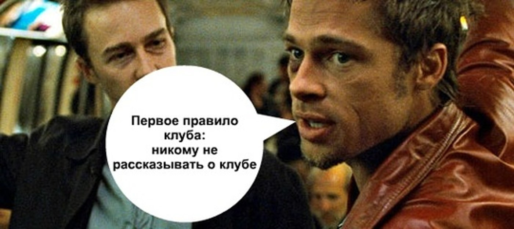

# **Робастные модели в машинном обучении**

Курс ведут Екатерина Строева, Даниэль Саада, Нарек Малоян, Евгений Ильюшин, Дмитрий Намиот

## Этот сборник помогали составлять 
Алтана Батуева, Варвара Ахапкина, Каринэ Карапетянц, Алексей Смирнов, Алексей Тонких, Павел Мамаев, Саит Шарипов

Использовались материалы из лекций Дьяконова, курсов MIT (6.S191, 18.s191, 6.034), Stanford (CS229, CS231N), Deep Learning School, HuggingFace tutorial

## Полезные материалы

-   [Материалы
    лекций.](https://drive.google.com/drive/folders/1u4NoJvY7buZH81Cs52RIPNcBmgK4q38I)

-   [Видео
    лекций.](https://drive.google.com/drive/folders/1bOVd7SCPktI0Lf7kMKbS3acH7yFnyHh_)

-   [Видео от Каринэ.](https://disk.yandex.ru/d/tYn2HH1XOqHkpQ)

-   В чат в телеграмме иногда присылали полезные материалы.

-   В нашем чате ВК Паша прилагал NLP лекции со своего курса.

-   [Ссылка на гугл-док подготовки в 1-ом
    семестре.](https://docs.google.com/document/d/1RrpWw9zke-gXQFMZad1oDo_CEtAO9lkCACrCUs9Faz8/edit?usp=sharing)

-   [Ответы Алтаны для подготовки в 1-ом
    семестре](https://www.overleaf.com/read/jqnskfhpdsbs).

-   [Видеозаписи Саита](https://disk.yandex.ru/d/aWl2QwfFi0RW6Q)

