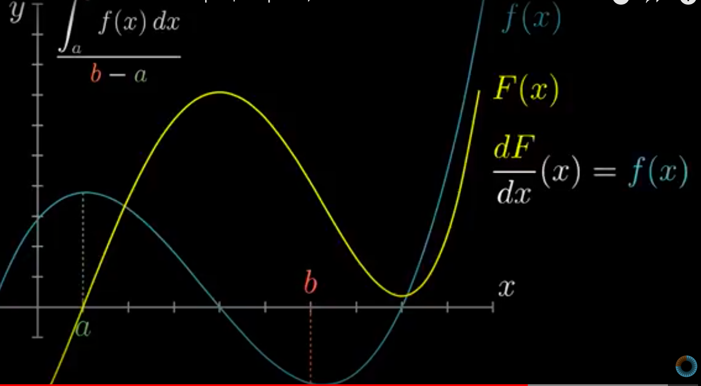
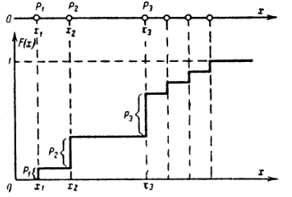

Основы математического анализа и линейной алгебры
==============

Вектор, скалярное и векторное произведение, линейная оболочка.
----------------------------------------------------------------------------------------------------------

В школе нам говорят, что вектор - направленный отрезок, в университете,
что это элемент векторного пространства с заданными свойствами, нам
будет удобно представлять вектор как набор чисел, записанных в строку.

*Опр. Вектор - строка чисел $e = (e_1, e_2, \dots, e_n)$.*

Векторы можно представлять строками и столбцами:

$$\vec e =\begin{bmatrix} e_1 \\ e_2 \\ e_3 \end{bmatrix}, \qquad \vec e^T = (e_1, e_2, e_3)$$

*Изображение $\pi$, как вектор $1 \times 64$
$(0.65, 0.05, 0.20, . . . , 0.28, 0.00, 0.90).$*

Сложение векторов происходит покомпонентно:
$\vec a + \vec b = (a_1+b_1; a_2+b_2)$.
НЕ путать операцию сложения с операцией + в python, которая сделает
"присоединение": $(1,2)+(3,4,5)=(1,2,3,4,5)$.
Умножение вектора на число также покомпонентно:
$k \cdot \vec a = (k \cdot a_1;k \cdot a_2)$, например, если $\vec a$
отвечает за аудио-сигнал, и надо повысить или понизить громкость --
производим умножение этого вектора на коэффициент
$k>0:\,\, k \cdot \vec a$ - усиленный сигнал, если $k>1$, и ослабленный,
если $0<k<1$.\
*Опр. Линейная комбинация векторов - выражение
$\lambda_1 \cdot a_1 + \dots + \lambda_n \cdot a_n$*.

*Опр. Линейная оболочка множеств векторов - множество всех линейных
комбинаций заданных векторов.*\

*Опр. Базис пространства -- набор максимального количества линейно
независимых векторов. С помощью линейной комбинации этих векторов можно
представить любой элемент векторного пространства.*\
Самым простым примером базиса двумерного пространства являются векторы
$e_1=(1;0), e_2=(0;1)$, трёхмерного -
$e_1=(1;0;0), e_2=(0;1;0), e_3=(0;0;1)$. Понятно, что все остальные
векторы представляются как линейные комбинации векторов базиса.

Численно линейная комбинация выглядит так:

$$\begin{bmatrix} -1 \\ 3 \\ 5 \end{bmatrix} = (-1) \begin{bmatrix} 1 \\ 0 \\ 0 \end{bmatrix} + 3 \begin{bmatrix} 0 \\ 1 \\ 0 \end{bmatrix} + 5 \begin{bmatrix} 0 \\ 0 \\ 1 \end{bmatrix}$$

Пример: аудиодорожка по каждому инструменту представляет собой отдельный
вектор, умножая каждый из них на коэффициент, отвечающий за громкость,
«дирижёр» сводит аудиодорожку из всех инструментов к гармоничному
звуку. Если все коэффициенты равны 1, то линейная комбинация есть просто сумма
векторов. Произведение весов на векторы в нейросети -- пример линейной комбинации
векторов.

*Что такое скалярное произведение векторов и откуда оно взялось?*
оказался одним из самых сложных вопросов. Я придерживаюсь мнения, что
математика и её констрункции рождались из реальной жизни и поставленных
физиками задач, так и получилось в этот раз: скалярное произведение -
это работа, которую *делает* один вектор в направлении другого
вектора.

Предположим, что нам надо найти работу, которую совершает сила $\vec F$,
действующая на тело, и за время дествия силы тело совершило перемещение
$\vec S$. Разложим силу $\vec F$ на две составляющих:
$F = F_{\Vert} + F_{\bot}$,

задающих базис пространства в нашей задаче. Работой $A$ силы $\vec F$
называется в данном случае произведение модуля параллельной составляющей
на модуль перемещения: $A = F_{\Vert} \cdot S = F \cos{\alpha} \cdot S$.
Отсюда первая формула для нахождения скалярного произведения:
$(\vec a; \vec b) = |\vec a| \cdot |\vec b| \cdot \cos{\alpha}$, здесь
$|\vec a|, |\vec b|$ - длины векторов $\vec a$ и $\vec b$, $\alpha$ -
угол между ними.

Далее, пусть на тело действуют две силы: $\vec F_1$ и $\vec F_2$. Эти
силы совершают соответственно работы $A_1$ и $A_2$. Какую работу
совершает равнодействующая $\vec F$ этих сил?

$$A= \vec F \cdot \vec S= (\vec F_1 + \vec F_2) \cdot \vec S= \vec F_1 \cdot \vec S+\vec F_2 \cdot \vec S=A_1 +A_2$$

Вывод: работа равнодействующей силы равна сумме работ каждой из сил в
отдельности. Иными словами, приложенные к телу силы складываются
векторно, а их работы --- алгебраически. Отсюда следует переход от
произведения векторов к скаляру.

Итого: проекцию, взятую со знаком, одного вектора на линию, содержащую
второй вектор, умножаем на второй вектор, полученный результат -
скалярное произведение данных двух векторов. Скалярное произведение
может быть отрицательным, это показатель того, что векторы направлены в
разные стороны.

*Как численно работать со скалярным произведением?*

Посмотрим, что происходит, если разложить векторы по базису и
перемножить в таком виде:
$\vec a = a_x \cdot \vec i + a_y \cdot \vec j, \quad \vec b = b_x \cdot \vec i + b_y \cdot \vec j$

$$\vec a \cdot \vec b = (a_x \cdot \vec i + a_y \cdot \vec j) \cdot (b_x \cdot \vec i + b_y \cdot \vec j) = a_xb_x \cdot \vec i \cdot \vec i + a_xb_y \cdot \vec i \cdot \vec j + a_yb_x \cdot \vec j \cdot \vec i +a_yb_y \cdot \vec j \cdot \vec j = a_xb_x + a_yb_y,$$

учитывая, что
$\vec i \cdot \vec i = \vec j \cdot \vec j = 1, \quad \vec i \cdot \vec j = \vec j \cdot \vec i = 0$,
то есть *для нахождения скалярного произведения мы просто покомпонентно
умножаем соответствующие координаты векторов и складываем полученные
произведения*.

Интересный пример применения скалярного произведения: есть два множества
А и В, зададим векторы, отвечающие за вхождение каждого элемента в
множество: $\vec a = (0;1;1;1;1;1;1)$ и $\vec b=(1;0;1;0;1;0;0)$, тогда
скалярное произведение даст количество элементов, принадлежащих
пересечению этих множеств:
$(\vec a;\vec b) = 1\times 0 + 0\times1 + 1\times1 + 1\times0 + 1\times1 + 1\times0 + 1\times0 = 2$

Следующее понятие - векторное произведение, как сказали специалисты,
появилось из алгебры умножения кватернионов, но в данном вопросе мы не
будем глубоко вникать в теорию и просто ограничимся геометрическим
смыслом и применением этого понятия.

*Опр. Векторное произведение векторов $\vec a$ и $\vec b$ - снова вектор
$\vec c = [\vec a \times \vec b]$, перпендикулярный плоскости, заданной
векторами $\vec a$ и $\vec b$, и численно равный площади
параллелограмма, "натянутого"  на векторы $\vec a$ и $\vec b$.*

Векторное произведение применяется для более быстрого подсчёта площадей
и для проверки коллинеарности трёхмерных векторов.

Матрица, определитель и след матрицы, норма.
----------------------------------------------------------------------------------------------------------

*Опр. Матрица -- прямоугольная таблица чисел.* С другой стороны, матрицу
можно рассматривать как набор векторов. Интересна интерпретация матрицы
как объекта, задающего линейное преобразование пространства.

Если векторы $b_1, \dots, b_n$ выражаются через векторы
$a_1, \dots, a_n$ как:

$$b_1 = \alpha_{11} a_1 + \dots + \alpha_{1n} a_n$$ 

$$\dots$$

$$b_n = \alpha_{n1} a_1 + \dots + \alpha_{nn} a_n$$ 

то матрицей перехода
от базиса $a_1, \dots, a_n$ к базису $b_1, \dots, b_n$ будет

$$\begin{bmatrix} \alpha_{11}  & \dots & \alpha_{1n} \\ & \dots & \\ \alpha_{n1}  & \dots & \alpha_{nn}  \end{bmatrix}$$

Матрица представляет собой набор векторов, поэтому при умножении матрицы
на вектор умножаем каждый вектор из матрицы скалярно на заданный вектор.

Рассмотрим две полезные матрицы преобразований: растяжение вдоль осей и
поворот против часовой стрелки.

Если нам нужно растянуть вектор вдоль каждой оси, то ставим на диагонали
соответствующие коэффициенты растяжения. Так, матрица
$\begin{bmatrix} 2 & 0 \\ 0 & 3 \end{bmatrix}$ растянет векторы вдоль
оси $x$ в 2 раза, вдоль оси $y$ - в 3 раза.

Поворот на угол $\phi$ против часовой стрелки задаётся матрицей
$\begin{bmatrix} \cos{\phi} & -\sin{\phi} \\ \sin{\phi} & \cos{\phi} \end{bmatrix}$.

Произведение матриц представляет собой последовательное применение
преобразований к векторам, просто для удобства придумали правило
«строчка на столбик» и соответствующую запись и расположение (обратим
внимание, что умножение матриц не симметрично!) при умножении матрицы на
вектор и матрицы на матрицу.

Разберём на примере: есть пространство $V$, заданное базисом
$\vec e_1 = (1;0), \quad \vec e_2 = (0;1)$ и вектор $\vec a = (-1;2)$,
совершили преобразование над $V$, получили новое пространство с новым
базисом
$V \rightarrow \hat V, \quad \vec e_1 \rightarrow \hat e_1 = (1;-2), \quad \vec e_2 \rightarrow \hat e_2=(3;0)$,
найдём, в какой вектор перейдёт $\vec a \rightarrow \hat a = (?;?)$.
Логично, что сохранится линейная комбинация:
$\qquad \vec a = 1 \cdot \vec e_1 + (-2) \cdot \vec e_2, \qquad \hat a = (-1) \cdot \hat e_1 + 2 \cdot \hat e_2 = (-1) \cdot \begin{bmatrix} 1 \\ -2 \end{bmatrix} + 2 \cdot \begin{bmatrix} 3 \\ 0 \end{bmatrix} = \begin{bmatrix} 5 \\ 2 \end{bmatrix}$,
если записать это в другом виде, а именно зададим матрицу перехода
$V \xrightarrow{M} \hat V$:

$$M = \begin{bmatrix} 1 & 3 \\ \underbrace{-2}_{e_1} & \underbrace{0}_{e_2} \end{bmatrix}$$

тогда разумно представить результат преобразования вектора $\vec a$ как
работу, которую произвели над вектором $\vec a$ по каждому направлению
фиксированных координатных осей $x$ и $y$, "растягивая"  его по
направлениям координатных осей $x$ и $y$ при преобразовании базиса
(будем применять введённое ранее скалярное произведение векторов):

$$\hat a = M \vec a = \begin{bmatrix} 1 & \ \ 3 \ \ \} x \\ \underbrace{-2}_{e_1} & \underbrace{0}_{e_2} \} y \end{bmatrix} \begin{bmatrix} -1 \\ \underbrace{2}_{a} \end{bmatrix} = \begin{bmatrix}  \ \ \ 1 \times (-1) + 3 \times 2 \quad \ \} x \\(-2) \times (-1) + 0 \times 2 \ \  \} y\end{bmatrix} = \begin{bmatrix} 5 \\ 2 \end{bmatrix}$$

Что именно происходит при последовательном преобразовании пространства
(произведение матриц): есть две фиксированные координатные оси cо
стандартным базисом единичных взаимно перпендикулярных векторов, в тех
же осях $x-y$ задаётся набор векторов, который мы считаем *новым
базисом*, задающим новое пространство $V_1$ c матрицей перехода
$M_1$, и возьмём ещё одно пространство $V_2$ со своим базисом и матрицей
$M_2$. Посмотрим, что произойдёт со всеми векторами из пространства $V$
при последовательном преобразовании пространства
$V \xrightarrow{M_1} V_1 \xrightarrow{M_2} V_2$ (например разделим
отдельно две операции: сначала поворот на угол, потом симметричное
отражение). Итоговый результат тогда запишется как $M_2 M_1$ и мы увидим
поэтапно как при изменении пространства изменяются векторы, при этом
оставаясь заданными координатами в фиксированных осях $x$ и $y$.

Настоятельно рекомендую посмотреть видео, в котором в движении показаны
все преобразования и переходы: [Matrix multiplication as composition \|
Chapter 4, Essence of linear
algebra](https://www.youtube.com/watch?v=XkY2DOUCWMU&list=PLZHQObOWTQDPD3MizzM2xVFitgF8hE_ab&index=4)

Несколько типов матриц, которые понадобятся нам в дальнейшем:

1. Единичная $E$ - на главной диагонали стоят 1, в остальных местах 0.
2. Транспонированная $A^T$- все элементы матрицы переставляются
симметрично относительно главной диагонали.
3. Обратная матрица $A^{-1}$: $A A^{-1} = A^{-1} A = E$.
4. Унитарная матрица $A$: $A A^T = A^T A = E$. Строки и столбцы такой
матрицы образуют ортонормированный базис, а преобразование, заданное
унитарной матрицей, сохраняет длины всех векторов и скалярное
произведение.

Одна из характеристик матрицы называется определителем. Абсолютную
величину определителя можно рассматривать как меру сжатия или расширения
пространства матрицей. Если определитель равен 0, то пространство
полностью сворачивается хотя бы по одному измерению, то есть теряется
весь объём. Если определитель равен 1, то преобразование сохраняет
объём.

Наиболее простая формула для нахождения определителя через разложение по
$i$-й строке:

$$det A = a_{i1} A_{i1} + a_{i2} A_{i2} + ... + a_{in} A_{in},$$ 

где алгебраическое дополнение $A_{ij} = (-1)^{i+j} det M_{ij}$, а подматрица
$M_{ij}$ получается вычёркиванием $i$-й строчки и $j$-го столбца из
матрицы $A_{ij}$.

Получается, что модуль определителя $|det A|$--- это коэффициент
изменения объекта при преобразовании пространства матрицей $A$: для
одномерного пространства --- длина отрезка, для плоскости --- площадь
фигуры, для трёхмерной фигуры --- её объём. Если объём фигуры (то есть
определитель для матрицы $3\times 3$) равен нулю, то это означает, что
сама фигура не является трёхмерной, то есть она может быть при этом
двухмерной, одномерной или вообще представлять собой точку). Знак
определителя по сути показывает ориентацию векторов - правую или левую.

Ранг матрицы --- это истинная (максимальная) размерность пространства,
для которого определитель не равен нулю.

Если $det A = 0$, то матрица вырождена (убирает объём). Если
$det A \not= 0$, то матрица обратима.

**Собственный вектор** - не меняющий своё направление при
преобразованиях. Он может только «растянуться» вдоль своего же
направления, коэффициент, на который от растянется, называется
собственным значением: $A \vec v = \lambda \vec v$, причём
$\vec v \not = 0$. Все векторы, коллинеарные собственному, так же будут
собственными.

*Собственный вектор --
красный*

Метод поиска собственных векторов очень простой:

$$A \vec v = \lambda \vec v, \quad A \vec v - \lambda \vec v = 0,  \quad A \vec v - \lambda \vec v E = 0, \quad (A - \lambda E) \vec v = 0$$

$$det (A - \lambda E) \vec v = 0, \quad \vec v \not= 0 \quad \Rightarrow \quad det (A - \lambda E) = 0$$

все корни последнего уравнения (его называют характеристическим)
$\lambda$ - собственные числа, собственные векторы - соответствующие им.

Но если у матрицы размерность больше 2, решать характеристические
уравнения высоких степеней не всегда просто, поэтому придумали пару
критериев подбора решений:

1.  Сумма собственных значений с учётом кратности (след матрицы) равна
    сумме диагональных элементов.

2.  Произведение собственных значений равно определителю матрицы $A$.

3.  Для треугольных матриц собственные значения совпадают с
    диагональными элементами.

Надо понять, как упрощать действия и операции при работе с матрицами.
Самое простое -- разложить их на более простые объекты (аналог --
разложение числа на простые множители). Алгебрически очень просто
построить спектральное разложение просто перемножив матрицы в правильном
порядке: $A V = V L , \quad A = V L V^{-1}$, где $V$ - матрица, в
столбцах которой стоят собственные векторы, $L$ - диагональная матрица,
на диагонали которой стоят собственные значения.

**Норма** - функция, которая показывает, как считать длины в данном
конкретном случае, то есть обобщает понятие длины или абсолютного
значения. Другими словами норма - расширение знакомого со школы понятия
модуля числа. Напомним, что геометрическая интерпретация модуля числа -
расстояние от нуля до заданного числа.

Самым показательным примером для понимания показалась конструкция
манхэттенкой нормы: для таксиста расстояние от точки $A$ до точки $B$
будет явно не равно длине вектора $\overrightarrow{AB}$. Как
рассказывает Рудольф-Лилит (математик, которая придумала и рассчитала
алгоритм поиска кратчайшего пути для таксиста), все в том же Манхэттене
расстояние от одной точки до другой по прямой может быть 4,3 мили, но на
самом деле кратчайший маршрут таксиста составит около 6 миль, ведь ехать
можно только по улицам и проспектам, которые пересекаются под прямым
углом. В этом случае карту города можно задать как множество точек,
соответствующее перекресткам. Тогда любой маршрут будет задаваться
линией, которую мы проведем по этим точкам, причем использовать
диагонали нельзя. Алгебраически манхэттенская норма $L_1$ задаётся как
$||AB|| = |x_2-x_1| + |y_2-y_1|$.

Эта норма часто используется в машинном обучении, когда важно различать
элементы, в точности равные нулю и мало отличающиеся от нуля. Всякий раз
как элемент вектора $x$ отдаляется от 0 на $\epsilon$, норма $L_1$
увеличивается на $\epsilon$.

Приведём примеры классических норм и их представления как *единичных
окружностей*: манхэттенская норма $L_1$, описанная выше; евклидова
норма $L_2$, которая считается по Теореме Пифагора; максимальная норма
$L_\infty$ - наибольшая координата вектора для общего случая.

Норма вектора - аналог длины вектора, которая находится по Теореме
Пифагора: $||x|| = \Biggl( \sum_{i} |x_i|^2 \Biggr) ^ \frac{1}{2}$.
Отметим, что также норму можно записать через скалярное произведение
$||x|| = \sqrt{(x;x)}$.

Норма матрицы показывает, насколько максимально растягивается вектор $v$
при отображении $Av$:

$$||A|| = \max_{1\le j \le n} \sum_{i=1}^{m} |a_{ij}|$$

Аналогом Евклидовой нормы для векторов служит норма Фробениуса для
матриц:

$$\|A\|_{F}=\|A\|_{2}={\sqrt {\sum _{i,j}|a_{ij}|^{2}}}={\sqrt {\mathrm {Tr} \,A^{T} A}}$$

Метод главных компонент. SVD - разложение матриц.
----------------------------------------------------------------------------------------------------------

Если говорить максимально просто, то Метод главных компонент - это метод
выбора подпространства меньшей размерности с минимальной потерей данных.
А сингулярное разложение (Singular Value Decomposition) - метод, который
используется для такого выбора.

Итак, у нас есть множество данных, представим их как точки в
пространстве, наша задача - найти такое подпростанство, *проекция на
которое* сохранит максимальный разброс точек. Потом приблизим эту
*проекцию* эллипсом, в который попадут максимальное количество
точек. Остальные точки воспринимаем как *шум*.

В общем, многомерном случае, процесс выделения главных компонент
происходит так:

1. Ищется центр облака данных, и туда переносится новое начало
координат -- это нулевая главная компонента (PC0)
2. Выбирается направление максимального изменения данных -- это первая
главная компонента (PC1)
3. Если данные описаны не полностью (шум велик), то выбирается еще одно
направление (PC2) -- перпендикулярное к первому, так чтобы описать
оставшееся изменение в данных и т.д.

Для наглядности рассмотрим проекцию двумерного пространства на прямую
линиию, проходящую через начало координат. Будем искать такую линию,
чтобы расстояния от точек до неё были минимальными. Отметим, что похожей
задачей по наилучшему приближению является метод наименьших квадратов,
но он минимизирует расстояние по вертикали от точки до прямой.

Расстояние от начала координат до точки фиксировано, значит, по теореме
Пифагора, для уменьшения расстояния от точки до прямой, нам надо
увеличить длину проекции вектора, соединяющего начало координат с
выбранной точкой.

Теперь вспомним, что если проекцию вектора мы умножим на единичный
направляющий вектор $\vec v$ заданной прямой, то мы получим скалярное
произведение координаты точки $(x_1, x_2)$ и компонент единичного
вектора $\vec v$. В общем случае множество точек представим как матрицу
$A$, прямую так же через единичный направляющий вектор $\vec v$, и сумму
квадратов проекций всех точек на выбранное направление как
$||A \vec v||^2$ по норме Фробениуса.

Среди всех единичных векторов найдём тот, который максимизирует
$\vec v_1 = argmax_{||v||=1} ||A \vec v||$, он называется правым
единичным вектором, а значение $\sigma_1(A) = ||A \vec v_1||$ называется
первым сингулярным значением матрицы $A$, $\sigma_1^2$ равна сумме
квадратов проекций точек на прямую, заданную $\vec v_1$. Далее найдём
перпендикулярный $v_1$ единичный вектор
$\vec v_2 = argmax_{||v||=1, v_1 \bot v_2} ||A \vec v||$, и т.д.
Получаем множество правых единичных векторов с матрицей $V$.

Множество левых сингулярных векторов определим как образы правых
векторов при *действии* на них матрицей $A$, после нормировки
$\vec u_i = \frac{A \vec v_i}{\sigma_i(A)}$, матрица левых сингулярных
векторов $U$.

А теперь соберём всё воедино и поймём все названия. Итак: у нас есть
единичная окружность и векторы $\vec v_1 \bot \vec v_2$,
*подействовав* на них матрицей $A$ получим эллипс с осями,
заданными векторами $\sigma_1 \vec v_1 \bot \sigma_2 \vec v_2$. То есть
$AV = U \Sigma$, где $\Sigma$ - диагональная матрица, на диагонали
которой стоят числа $\sigma_i$. Можно записать это по-другому
$A = U \Sigma V^T$. Заметим, что $U$ и $V$ - унитарные матрицы. Итак, мы
получили сингулярное разложение матрицы $A$, правые сингулярные векторы
умножаются справа, левые - слева, а по центру стоит диагональная матрица
из сингулярных значений. По-другому можно сказать, что такое разложение
представляет поворот, растяжение и снова поворот пространства.

Алгоритм SVD-разложения матрицы $A_{m \times n}$:\
1. Составляем матрицу $A^{T} A$ и находим её собственные значения
$\lambda_1 \ge \dots \ge \lambda_n$, находим ненулевые сингулярные числа
$\sigma_i = \sqrt{\lambda_i}$ и составляем из них матрицу $\Sigma$.
2. Находим собственные векторы $v_i (i \in 1,\dots, n)$, соответствующие
значениям $\lambda_i$, производим нормирование каждого вектора. Ставим
их как столбцы в матрицу $V$ и находим $V^{T}$.
3. Строим векторы $u_i = \frac{A v_i}{\sigma_i}$ и дополняем любыми
векторами до ортонормированного базиса $u_i (i \in 1,\dots, m)$. Ставим
их как столбцы в матрицу $U$.
4. Записываем разложение $A = U \Sigma V^{T}$.

Сингулярное разложение матрицы используется для уменьшения объёма
памяти, требуемого для хранения изображения. На рисунке (d) сложно
отличить реконструкцию от оригинала, но точности восстановления
достаточно для получения необходимой информации. Объём памяти, требуемый
для изображения снижается в 3 раза с 751 кб до 252 кб.

Очень подробный пример на метод главных компонент в статье
<http://math-info.hse.ru/f/2015-16/ling-mag-quant/lecture-pca.html>

Предел, производная, дифференциал. Производная по направлению, градиент. Первообразная, интеграл. Производные высших порядков, максимум и минимум проверхности, ряд Тейлора.
----------------------------------------------------------------------------------------------------------

На мой взгляд, основная идея или метод решения задач в математическом
анализе состоит в замене функций, с которыми тяжело работать, на близкие
к ним (с устраивающей нас разницей/погрешностью приближения), которые
уже давно изучены и понятны, то есть с которыми работать легко.

В жизненных задачах как правило нам не нужно знать само точное значение,
а достаточно понимать порядок (количество цифр в записи числа) или
приближение с нужной нам точностью. Приведём пример с покупкой квартиры:
предположим, что она стоит 9 987 567 рублей, но нам легче округлить до
10 миллионов, поскольку это проще и понятнее воспринимается. Но есть
тонкий момент: 8 987 567 мы тоже можем округлить до 10 миллионов, только
порядок округления может не всех устроить. В первом случае мы прибавили
около 100 000, что составляет 0,01 от исходной цифры, а во втором случае
- около 1 100 000, что составит уже 0,1 от исходной цифры, а такое
приближение уже не все могут себе позволить.

Лучше идеи с переходом к окрестности точки ещё никто не смог придумать,
логика такова: надо определить понятие *максимально близких
точек*, то есть расстояние между которыми очень близко к нулю, или
другими словами, они находятся в одном интервале, длина которого очень
маленькая. В терминах математики: $\epsilon$-окрестность точки $x_0$ -
интервал $(x_0-\epsilon;x_0+\epsilon)$, где $\epsilon$ - очень маленькое
число. А дальше заменяем значение функции в точке на значения функции в
точках, максимально близких к рассматриваемой, или из той же
окрестности.

Строгое определение: число $A$ называется пределом функции $f(x)$ при
$x$ стремящемся к $a$, если для любого, сколь угодно малого
положительного числа $\epsilon$ найдётся такое положительное число
$\delta$, что для любого $x$ из проколотой $\delta$-окрестности точки
$a$ значения функции$f(x)$ попадают в $\epsilon$-окрестность f(a)=A:
$$0<|x-a|<\delta \Rightarrow |f(x) -A|<\epsilon.$$

Итак, точки мы заменяли на близкие им точки, а функции будем заменять на
близкие им функции.

Напомним определение: функция - правило, по которому одному числу из
множества $X$ ставится в соответствие одно число из множества $Y$.
Функция может быть задана: таблицей, графиком, формулой, алгоритмом.
Чаще всего мы работаем с формулами и графиками.

Теперь у нас стоит задача: понять, где функция растёт, где убывает, в
каких точках достигает максимальное и минимальное значения. Если у нас
есть график, то всё просто видно, а вот если функция задана формулой,
причём довольно сложной, нужно придумывать *обходные пути*.

Для начала определимся, как понимать *рост* функции $y=f(x)$: если
при увеличении $x$ увеличивается $y$, то функция возрастает, если
наоборот, при увеличении $x$ уменьшается $y$, то функция убывает. Теперь
определим как именно функция возрастает, то есть с какой скоростью. Из
физики мы помним, что скорость - это искуственно введённая величина,
которая показывает какую часть расстояния мы преодолели за единицу
времени. В терминах нашей задачи нас интересует мгновенная скорость: как
изменился $y$ при небольшом изменении $x$. То есть мы совсем немного
увеличили $x$ (существуем в $\epsilon$-окрестности), и смотрим, как
изменится $y$. В качестве примера возьмём всё ту же гиперболу
$y=\frac{1}{x}$: при одном и том же изменении $\Delta x=0,0009$ с
$0,0001$ до $0,001$ $y$ изменился на 900 единиц, а при изменении с
$100,0001$ до $100,001$ всего на $0,00000009$ - разница внушительная.

Итак, зафиксируем точку $(x;y)$ и переместимся во вторую точку
$(x+\Delta x;y+ \Delta y)$, скорость роста тогда равна
$\frac{\Delta y}{\Delta x}$. Осталось вспомнить, что мы *работаем*
с близкими точками, когда $\Delta x$ очень мала, по сути точки $(x;y)$ и
$(x+\Delta x;y+ \Delta y)$ почти сливаются и соединяющая их прямая
превращается в касательную, проходящую через эти *слипшиеся*
точки. Осталось воспользоваться понятием предела и получить итоговое
определение:

Производной функции $f(x)$ называется новая функция $f'(x)$, которая
показывает скорость роста исходной функции в окрестности данной точки:

$$f'(x) = \lim_{\Delta x \to 0} \frac{\Delta y}{\Delta x} = \lim_{\Delta x \to 0} \frac{f(x+\Delta x) - f(x)}{\Delta x}$$

Геометрически получается, что это отношение как раз есть тангенс угла
наклона касательной $f'(x)= \tan{\alpha}$.

Другими словами, мы приближаем нашу функцию касательной, проходящей
через точку $(x;y)$, потому что поведение касательной однозначно может
сказать, что происходит с функцией: касательная идёт вверх $\tan{\alpha}>0$ - функция возрастает, касательная идёт вниз $\tan{\alpha}<0$ - функция убывает. Идея поиска максимума и минимума, известная со школы - найти нули производной (таблицу производных для нас
уже давно посчитали учёные) и точки, в которых функция определена, а
производная - нет. Далее выбираем те точки, в которых производная меняет
знак.

Если первая производная - это скорость роста функции или тангенс угла
наклона касательной к графику функции, то вторая производная -
ускорение, или скорость роста тангенса угла наклона касательной.
Получается, что если тангенс растет, то касательная *огибает*
график, заворачиваясь влево, если тангенс убывает, то касательная
заворачивается вправо. Вторая производная позволяет находить точки
перегиба: в самой точке первая производная $f'(x_0)$ равна нулю или не
существует, но слева и справа от точки перегиба вторая производная
$f''(x_0)$ имеет разные знаки:

Теперь посмотрим на график и заметим, что при замене функции
касательной, расстояние $\Delta y$ изменилось на $dy$ и скорость
$\frac{\Delta y}{\Delta x}$ изменилась на мгновенную скорость
$\frac{dy}{dx}$, отсюда следует определение дифференциала - приращение
ординаты касательной к графику функции:
$dy = f'(x) \Delta x = f'(x) dx$, так как $\Delta x = dx$ из построения
функции $y=x$.

Физический смысл дифференциала: если бы тело сохранило набранную
скорость $f'(x)$, то через время $dx$ проехало расстояние $dy$. Другими
словами, в физической задаче мы заменим движение с ускорением на
равномерное движение и будем искать пройденный путь через эту постоянную
скорость. Производную можно рассматривать как отношение дифференциалов
функции и её аргумента.

Сакцентируем внимание на различии: $\Delta y$ - на сколько изменилась сама функция $f(x)$ при изменении
аргумента на $\Delta x$, $dy$ - на сколько изменилась касательная к функции при изменении
аргумента на $\Delta x$.

В трёхмерном случае касательная линия заменяется на касательную
плоскость и дифференциал показывает приращение аппликаты касательной
плосткости.

Самым общим случаем *замены* функции в окрестности точки является
Ряд Тейлора - по сути приближение с нужной точностью $R$ в заданной
окресности точки $a$ любой функции $f(x)$ степенными функциями с
соответствующим весом - скоростью роста или производной - сначала
линейной с весом скорости, потом параболой с весом ускорением и так
далее.

$$f(x) = \sum_{k=0}^{n} \frac{f^{(k)} (a)}{n!} = f(a) + f'(a)(x-a) + ... + \frac{f^{(n)}(a)}{n!} (x-a)^n + R$$

Новые задачи: есть холм, нам надо максимально быстро взобраться на него,
а так же изобразить трёхмерную фигуру на плоскости. Обе эти задачи
помогает решить градиент.

Начнём с изображения.

Первая мысль - сделать срезы через равные промежутки по высоте. Такие
срезы называются линями уровня, то есть кривые, *на которых*
функция принимает одно и то же значение $f(x,y) = const$. Но возникает
проблема - на такой картинке один и тот же холм по форме, но выпуклый
или вогнутый, визуально будет выглядеть одинаково.

Разумно ввести направление вверх или вниз. Возьмём точку и посмотрим
поведение заданной функции в данной точке. Для этого *направим во все
стороны* векторы из этой точки и посмотрим как изменяется функция
вдоль направления каждого вектора $\vec l$. Вспоминаем, что за скорость
роста отвечает производная, то есть создадим векторное поле *с
весами* $\{ f'_x, f'_y \}$, которые будем скалярно умножать на
выбранное напрвление $\vec l$ или в терминах проекций
$l=(\cos \alpha, \cos \beta)$:

$$\{ f'_x, f'_y \} \cdot \vec l = f'_x \cos \alpha + f'_y \cos \beta$$

Заметим, что данное выражение максимально, когда
$\cos \alpha =1, \cos \beta = 1$, то есть выбранное направление
совпадает с направлением вектора $(f'_x, f'_y)$.

Итак, одна из интерпретаций градиента (обозначение $grad f$)- это
правило, по которому мы строим векторное поле *с весами*  
$\{ f'_x, f'_y \}$ или правило, которое таким способом переводит
скалярное поле в векторное.

Производную по направлению можно также рассматривать как скалярное
произведение градиента и заданного направления $(grad f, \vec l)$.

Ещё можно встретить интерпретацию градиента, как вектора, указывающего
направление наискорейшего роста функции.

Отметим, что в каждой точке свой вектор-градиент, его началом будет эта
точка, а направление совпадает с направлением наискорейшего роста
функции, модуль вектора-градиента показывает скорость изменения функции
в заданной точке.

2 

Итого для изображения трёхмерных поверхностей на плоскости вводим
вектор-градиент, который покажет направление роста, а также цветовую
шкалу синий - минимальные значения (показатель глубины), красный -
максимальные (показатель высоты). Представленные таким образом
поверхности выглядят уже хорошей интерпретацией:

Разберёмся с градиентом в более строгой математической форме: итак, нам
надо понять, как описать рост поверхности, заданной уравнением
$z= f(x,y)$. Вспомним, что рост мы определяем через значение приращения
и производную:

$$f(x+\delta x) - f(x) = f'_x \delta x + o(\delta x) = f'_x \,dx + o(dx)$$

$$f(y+\delta y) - f(y) = f'_y \delta y + o(\delta y) = f'_y \,dy + o(dy)$$

То есть рост функции $z=f(x,y)$ можно определить как суммарный рост
вдоль осей $Ox$ и $Oy$. Фиксируем точку на поверхности, откладываем от
неё два вектора, параллельные $dx$ и $dy$, они задают плоскость, а
*сдвиг вдоль этой плоскости* будет равен $dz = f'_x dx + f'_y dy$.
В терминах скалярного произведения градиент - это функция от вектора,
равная скалярному произведению $(f'_x,f'_y)(dx,dy)$. Ещё раз отметим,
что вектор-градиент лежит в плоскости векторов $(dx,dy)$. Смысл
градиента любой скалярной функции $f$ в том, что его скалярное
произведение с бесконечно малым вектором перемещения $dx$ даёт полный
дифференциал этой функции при соответствующем изменении координат в
пространстве, на котором определена $f$, то есть линейную (в случае
общего положения она же главная) часть изменения $f$ при смещении на
$dx$.

Модуль градиента показывает максимальную скорость изменения функции в
окрестности, то есть частоту линий уровня. Например, линии уровня высоты
изображаются на топографических картах, при этом модуль градиента
показывает крутизну спуска или подъёма в данной точке.

$$|grad \phi | =  \sqrt{ \Biggl( \frac{\partial \phi}{\partial x} \Biggr)^2+  \Biggl( \frac{\partial \phi}{\partial y} \Biggr)^2 + \Biggl( \frac{\partial \phi}{\partial z} \Biggr)^2}$$

Градиент - вектор, направленный по нормали к поверхности уровня в
сторону наибольшего возрастания функции и по модулю равный скорости
изменения функции.

Теперь разберёмся с производными второго порядка:
$f''_{xx}, \, f''_{xy}, \, f''_{yy}$.

2 

Надо понять, как искать максимум и минимум функции, заданной в
трёхмерном пространстве $z=f(x,y)$. Сначала заметим, что в точках
экстремума первые производные $f'_x, \,f'_y$ либо равны нулю, либо не
существуют, так как при проекциях на плоскости $0zx$ и $0zy$ точки
экстремума остаются точками экстремума. Решаем систему уравнений
$f'_x=0, \, f'_y =0$ и находим точки-кандидаты на экстремумы. В
окрестностях этих точек приблизим данную поверхность по формуле Тейлора
до второго порядка:

$$z-z_0 = dz + d^2z + \,R = f'_x dx \,+\, f'_y dy \,+\, f''_{xx} (dx)^2 \,+\, 2f''_{xy} dx dy \,+\, f''_{yy} (dy)^2 \,+\, R$$

$$= f''_{xx} (dx)^2 \,+\,\, 2f''_{xy} dx dy \,+\, f''_{yy} (dy)^2 \,+\, R$$

$z > z_0$, если полученная квадратичная форма положительно определена,
$z < z_0$ - если отрицательно. За это отвечает критерий Сильвестра:

$$\Delta = det \begin{bmatrix}  f''_{xx} & f''_{xy} \\ f''_{xy} &  f''_{yy} \end{bmatrix}$$

1\) если $f''_{xx} > 0$ и $\Delta >0$, то в точке будет минимум

2\) если $f''_{xx} < 0$ и $\Delta >0$, то в точке будет максимум

3\) если $\Delta <0$, то экстремума не будет

4\) если $\Delta = 0$, то возникает неопределённость, надо продолжать
исследования через производные третьего порядка и т.д.

Обобщением на $n-$мерный случай для вектор-функции
$f=(f_1, \dots, f_n)$служат две матрицы и их определители:

Якобиан отвечает за линейное приближение касательной плоскостью,
определитель матрицы первых частных производных:

$$J_f (x) = det \begin{bmatrix} \frac{\partial f_1(x)}{\partial x_1} & \dots & \frac{\partial f_1 (x)}{\partial x_n} \\ \dots & \dots & \dots \\  \frac{\partial f_n (x)}{\partial x_1} & \dots & \frac{\partial f_n (x)}{\partial x_n}  \end{bmatrix}$$

Гессиан отвечает за обобщённую локальную кривизну - приближение
квадратичной формой, определитель матрицы вторых частных производных:

$$H_f (x) = det \begin{bmatrix} \frac{\partial^2 f(x)}{\partial x_1^2} & \dots & \frac{\partial^2 f (x)}{\partial x_1 \partial x_n} \\ \dots & \dots & \dots \\  \frac{\partial^2 f(x)}{\partial x_n \partial x_1} & \dots & \frac{\partial^2 f (x)}{\partial x_n^2}  \end{bmatrix}$$

Метод множителей Лагранжа. Метод Каруша-Кунна-Таккера.
----------------------------------------------------------------------------------------------------------

Под условным экстремумом понимают максимальное или минимальное значение
функции $f$ в области, ограниченной какими-либо условиями, например
$\phi_i = 0$ или $\phi_i \le 0$.

Рассмотрим поверхность вращения $z = f(x,y)$ в трёхмерном пространстве,
и её сечение поверхностью $\phi (x,y) = 0$. Данное сечение будет плоской
кривой, например, параболой или эллипсом, понятно, что нижняя точка их
пересечения - минимум $f$ при заданных условиях, верхняя - максимум $f$.

Вспомним про линии уровня: если спроецирировать картинку на плоскость
$0xy$, то получим линии уровня и *кандидат на эсктремум* - точка,
в которой пересекаются касательная к линии уровня и касательная к
параболе.

Таким образом задача сводится к отысканию такой точки линии уровня, в
которой функция принимает экстремальное значение, причем сравниваются
значения функции только в точках рассматриваемой линии.

Надо понять, как находить эти точки максимума и минимума аналитически.

Так как обе функции пересекаются в одной точке, то касательная,
проходящая через эту точку, общая для обеих функций. Вспомним также, что
градиент показывает направление наискорейшего роста функции, а также
перпендикулярен к линиям уровня и к касательным, проходящим через
указанную точку.

Получаем важный факт: $grad \,f$ и $grad \, \phi$ лежат на одной линии,
то есть пропорциональны или $grad f = \lambda \, grad \, \phi$, получаем
систему уравнений $$\left\{\begin{array}{llcc}
        \frac{\partial f}{\partial x} (x_0) = \lambda \frac{\partial \phi}{\partial x} (x_0), \\
        \frac{\partial f}{\partial y} (y_0) = \lambda \frac{\partial \phi}{\partial y} (y_0), \\
        \phi(x_0,y_0) = 0
    \end{array}\right.$$

Лагранж вводит новую функцию
$L(x,\lambda) = f(x) + \sum_i \lambda_i \phi_i$, которая по сути
является такой *сдвинутой функцией* $f(x)$, что безусловный
экстремум $L$ совпадает с условным экстремумом $f$, и частные
производные функции $L$ по $x_i$ и $\lambda_i$ задают уравнения для
поиска условного экстремума функции $f$:

$$\left\{\begin{array}{llcc}
        \dfrac{\partial f}{\partial x}\Big|_{(x_0,\;y_0)} & +\lambda_0 \cdot \dfrac{\partial\phi}{\partial x}\Big|_{(x_0,\;y_0)} & = & 0, \\
        \dfrac{\partial f}{\partial y}\Big|_{(x_0,\;y_0)} & +\lambda_0 \cdot \dfrac{\partial\phi}{\partial y}\Big|_{(x_0,\;y_0)} & = & 0, \\
                                                          & \phi(x_0,\;y_0)                                                      & = & 0.
    \end{array}\right.$$

Обобщением метода множителей Лагранжа на случай ограничений в виде
неравеств называется Метод Каруша-Куна-Таккера и заключается в
следующем: надо найти многомерную величину с неотрицательными
компонентами $x=(x_1, \dots, x_n)$, которая будет точкой минимума
функции $f(x)$ с ограничениями $g_i(x) \le 0, \, i=1,\dots, n$.

Вводим функцию Лагранжа $L(x,\lambda) = f(x) + \sum \lambda_i g_i(x)$, и
чтобы $\hat x$ была точкой минимума, должны выполняться следующие
условия:\
1) $\hat x$ - точка минимума функции $L$\
2) условия нежёсткости $\lambda_i g_i (\hat x) =0$\
3) $\lambda_i \ge 0$

Метод наименьших квадратов. Метод градиентного спуска.
----------------------------------------------------------------------------------------------------------

Как мы уже говорили, основная идея большинства изучаемых нами
математических методов сводится приближению или *замене* сложных
для понимания исследуемых функций на более простые и уже изученные с
заданной точностью. Самым явным примером применения этой идеи является
метод наименьших квадратов, которым активно пользуются физики и
экономисты. Сразу оговорим, что под *наименьшими квадратами*
подразумевается минимизации суммы квадратов погрешностей приближения.

Есть серия данных, полученных во время опыта, их можно записать в виде
таблицы и изобразить на графике. Если точки на графике
*группируются* вокруг прямой $\hat y=ax+b$, то можно подобрать
коэффициенты при помощи вычислений.

Если $(x_i,y_i)$ - полученные данные, а $\hat y_i$ - теоретические
значения ординаты, тогда определим погрешности вычисления как
$\epsilon_i = \hat y_i - y_i = ax_i+b-y_i$.

Наша задача: подобрать коэффициенты $a$ и $b$ так, чтобы сумма
погрешностей $|\epsilon_i|$ была наименьшей. Составим функцию
$e=\sum_i \epsilon_i^2$ и будем минимизировать её, поскольку при
наименьших возможных $\epsilon_i^2$ будут наименьшими $|\epsilon_i|$:

$$e=\sum_i \epsilon_i^2 = \sum_i ( ax_i+b-y_i )^2, \quad \frac{\partial e}{\partial a} = 0, \quad \frac{\partial e}{\partial b} = 0$$
$$\frac{\partial e}{\partial a} = 2 \sum_i ( ax_i+b-y_i ) x_i = 2a \sum_i x_i^2 + 2b \sum_i x_i - 2 \sum_i x_i y_i = 0$$
$$\frac{\partial e}{\partial b} = 2 \sum_i ( ax_i+b-y_i ) = 2a \sum_i x_i + 2bn - 2 \sum_i y_i = 0$$

Получаем систему для нахождения коэффициентов $a$ и $b$ через известные
$(x_i,y_i)$: 

$$
\begin{cases}
        a \sum_i x_i^2 + b \sum_i x_i = \sum_i x_i y_i \\
        a \sum_i x_i + bn = \sum_i y_i
\end{cases}
$$

Аналогичным образом получаем систему уравнений для нахождения
коэффициентов при приближении параболой $\hat y = ax^2+bx+c$

$$
\begin{cases}
            a \sum_i x_i^4 + b \sum_i x_i^3 + c \sum_i x_i^2  = \sum_i x_i^2 y_i \\
            a \sum_i x_i^3 + b \sum_i x_i^2 + c \sum_i x_i  = \sum_i x_i y_i     \\
            a \sum_i x_i^2 + b \sum_i x_i  + cn = \sum_i y_i
\end{cases}
$$

Метод градиентного спуска - алгоритм для нахождения минимума функции
$f$. Как мы уже обсуждали, градиент задаёт направление наискорейшего
подъёма, соответственно, двигаясь в противоположном направлении, будем
максимально быстро спускаться.

Идея следующая: выбираем стартовую точку $x_0$ и спускаемся вниз вдоль
направления, противоположного градиенту, с заранее заданной длиной шага
$h$, в точку $x_1$. Другими словами, вектор
$-\frac{\partial f}{\partial x_k^i}$ растягиваем в $h$ раз, его начало
помещаем в точку $x_0$, а его концом будет точка $x_1$.

На каждом шаге проверяем, уменьшилось ли значение функции и насколько.
Если значение функции уменьшается больше заданной точности $\epsilon$,
то берём точку $x_1$ за исходную и повторяем процесс, пока значения на
последующем шаге будет мало отличаться от значения на предыдущем шаге:

$$x_k^{i+1} = x_k^i - h \frac{\partial f}{\partial x_k^i}$$ 

За меру близости к минимуму удобно принять сумму абсолютных значений производных

$$\epsilon = \sum_i  \Bigl| \frac{\partial f}{\partial x_k}  \Bigr|$$

Есть проблема выбора длины шага $h$: если он будет очень мал (точный
поиск), мы будем двигаться слишком медленно и процесс займёт слишком
много времени, а если $h$ будет слишком большим (грубый поиск), мы
рискуем перескочить через минимум и попасть в другую *яму*, менее
глубокую.

Для разумного сочетания быстроты и точности предлагается чередовать
грубый и точный поиск в зависимости от того, насколько далеко мы
находимся в данный момент $x^i$. Зададим две константы
$\delta_1 < \delta_2$ и введём условия:

1. если $\epsilon > \delta_2$, то увеличиваем $h$
2. если $\delta_1 \le \epsilon < \delta_2$, то уменьшаем $h$
3. если $\epsilon < \delta_1$, то поиск окончен.

Первообразная, интеграл.
----------------------------------------------------------------------------------------------------------

Теперь рассмотрим обратную задачу: у нас есть функция $f(x)$ (график или
формула), которая является производной какой-то функции $F(x)$. Вопрос:
как найти эту функцию $F(x)$?

Из определения производной можем найти только разность двух состояний:

$$\lim_{x \to x_0} \frac{F(x) - F(x_0)}{x-x_0} = f$$

Попробуем интерпретировать задачу в терминах физики: получается, у нас
есть скорость $V(t)$, которая является изменением координаты точки на
заданном участке пути. Но как всегда есть нюанс: мы знаем только
скорость, но эта скорость может быть на любом участке пути, с одной и
той же скоростью мы можем ехать по трассе Москва-Санкт-Петербург или
Воронеж-Сочи. То есть сама координата нам не даст никакой информации,
так как мы не знаем начало системы отсчёта (напоминает принцип
Неопределённости Гейзенберга). А вот разность двух состояний/координат
покажет, путь какой длины мы проехали.

Ещё одна аналогия из физики: потенциал сам по себе не несёт существенной
информации - это работа по перемещению из бесконечно удалённой точки в
точку $A$, а работу по перемещению заряда из точки $A$ в точку $B$ как
раз представляет разность потенциалов $\phi(B)-\phi(A)$.

Итого, первообразная $F(x)$ - просто математически введённая функция,
которая *подгоняется* как обратное действие к операции
дифференцирования при помощи таблицы производных. Общей формулы для
нахождения первообразных, аналогичной формуле для вычисления производной
частного и произведения, не существует. Отметим, что такая функция
определена с точностью до константы или представляет собой семейство
параллельных функций: если $F(x)$ - первообразная, то и $F(x)+c$ - тоже
первообразная, где $c=const$.

*Строгое определение: первообразной для функции $f(x)$ называется такая
функция $F(x)$, определённая на $(a;b)$, что $F'(x) = f(x)$ для любого
$x \in (a;b)$.*

Вернёмся к задаче о нахождении пройденного пути через известную
скорость. В физических терминах $\frac{dS}{dt} = V, \, V dt = dS$, а вот
тут мы как раз используем дифференциал - разбиваем весь путь на очень
маленькие промежутки по времени, и на каждом из таких промежутков
рассматриваем движение как равномерное - с одной и той же скоростью
(приближение линейной функцией), на графике это как раз будет площадь
прямоугольника со сторонами $V$ и $dt$.

А весь пройденный путь как раз равен сумме таких кусочков:
$\quad S = \int_{t_1}^{t_2} V(t) \,dt$. А процесс суммирования в
непрерывном случае назвали интегрированием. Отсюда получаем известный
всем факт, что определённый интеграл равен площади под графиком функции.
Воспользуемся площадью как функцией: берём одну из первообразных
$F(x)= \int_{a}^{x} f(t)\,dt$ - зафиксировали начальную точку и движемся
от неё вправо, получим функцию от *конца пути* или верхнего
предела интегрирования, которая как раз покажет путь от $a$ до $x$.

Отметим, что мы описали путь поиска первообразной и такое представление
$F(x)$ через интеграл - это пока наше предположение, надо математически
доказать, что $F'(x) = f(x)$ для любого $x$.

Немного отвлечёмся на факт, который называется *первая теорема о
среднем*, строгое доказательство можно найти в любом учебнике, нас
интересует суть и физическая интерпретация:

*Первая теорема о среднем: пусть $f(x)$ - непрерывная и ограниченная на
$[a;b]$ функция, тогда на этом отрезке найдётся такая точка $c$, что

$$\int_{a}^{b} f(x)\,dx = f(c) \int_{a}^{b} dx = f(c) (b-a)$$

Пройденный путь можно найти как *среднюю скорость* $f(c)$, умноженную на
затраченное время $(b-a)$ - а это просто следует из физического
определения средней скорости. Причём существует такой момент времени
$c$, в который величина скорости как раз равнялась средней - весьма
понятный интуитивно факт.

Итак, строго математически докажем, что функция
$F(x)= \int_{a}^{x} f(t)\,dt$ будет первообразной для функции $f(x)$:

$$\begin{gathered}
    F'(x_0) = \lim_{x \to x_0} \frac{F(x) - F(x_0)}{x-x_0} = \lim_{x \to x_0} { \frac{\int_{a}^{x} f(t)\,dt - \int_{a}^{x_0} f(t)\,dt}{x-x_0} } = \\
    = \lim_{x \to x_0} {\frac{\int_{x_0}^{x} f(t)\,dt}{x-x_0} } = \lim_{x \to x_0} {\frac{f(c)(x-x_0)}{x-x_0} } = \lim_{x \to x_0} {f(c)} = f(x_0)\end{gathered}$$

Последний переход обосновывается тем, что точка $c$ лежит между $x_0$ и
$x$, и при стремлении $x \to x_0$ все три точки *сжимаются* в
одну.

Дискретные и непрерывные случайные величины. Функции плотности и распределения.
----------------------------------------------------------------------------------------------------------

Начнём с того, что теория вероятности занимается массовыми явлениями.
Когда проводится большое количество одинаковых экспериментов, и на
основе полученных данных можно делать какие-либо выводы.

Случайная величина $\xi$ - это функция, которая ставит в соответствие
какому-либо происходящему событию число. То есть у нас произошло
какое-то событие, и мы можем его численно интерпретировать.

Дискретной случайной величиной называется случайная величина, которая в
результате испытания принимает отдельные значения с определёнными
вероятностями. Проще говоря, дискретные случайные величины --- это
величины, множество значений которых не более, чем счётно. Число
возможных значений дискретной случайной величины может быть конечным и
бесконечным. Примеры дискретной случайной величины: выпадение орла или
решки при подбрасывании монеты или выпадение определённого числа на
игральном кубике.

Непрерывной случайной величиной называют случайную величину, которая в
результате испытания принимает все значения из некоторого числового
промежутка. Число возможных значений непрерывной случайной величины
бесконечно. Пример непрерывной случайной величины: измерение скорости
перемещения любого вида транспорта или температуры в течение конкретного
интервала времени.

Вероятность можно рассматривать как обобщение логики на рассуждения в
условиях неопределенности. Логика дает нам набор формальных правил,
позволяющих определить, истинно некоторое высказывание или ложно, в
зависимости от предположения об истинности или ложности других
высказываний. Теория вероятностей предлагает набор формальных правил для
определения правдоподобия высказывания при условии правдоподобия других
высказываний.

Чтобы оценить правдоподобие высказывания, делают серию наблюдений,
результаты записывают, и дальше встаёт вопрос: как обработать все данные
и делать какие-либо выводы? Разумно записать в таблицу все значения
случайной величины и сколько раз встречается каждое значение - это
частота событий. Но, как мы понимаем, просто частота не даёт информации:
например, *в рулетке зеро выпал 20 раз* - на основании такой
информации сложно сделать какой-либо вывод, а вот *в рулетке зеро
выпал 20 раз из 21* и *в рулетке зеро выпал 20 раз из 200* -
важное дополнение, при помощи которого можно сделать ставку. Поэтому
более информативно узнать долю, которую занимает интересующее нас
значение из общего количества всех значений случайной величины - это
относительная частота (из определения понятно, что она заключена в
отрезке \[0;1\]). Отметим, что относительная частота рассчитывается
исключительно ПОСЛЕ опытов на основе фактически полученных данных и
совпадает с вероятностью. Из определения следует, что если все события
независимы, то сумма относительных частот (вероятностей) равна 1.

Если мы имеем дело с непрерывными случайными величинами, то нам нужно
как-то оценить количественно исходы событий, а раньше мы обсуждали, что
за количество элементов в множестве отвечает функция меры, поэтому под
вероятностью в общем случае логично понимать отношение

$$\text{функция вероятности} = \frac{\text{мера количества удачных для нас исходов события}}{\text{мера общего количества исходов события}}$$

Мерой чаще всего выступает длина отрезка, площадь или объём фигуры.

Теперь разберёмся, как распределена случайная величина: в жизненных
задачах редко нужно знать, в какое единственное значение попадает
случайная величина, чаще нас интересует интервал или отрезок. Математики
придумали следующую конструкцию: зафиксируем левый конец интервала
$-\infty$, правый будет переменной $x$, будем двигать правый конец
небольшими шагами вправо и *смотреть*, сколько новых значений
случайной величины попадает в каждый такой интервал. Очевидно, что их
количество будет не уменьшаться, и общее количество точек можно
представить как *вес* или *массу* множества значений
случайной величины.

Более строго математически: вводим новую случайную величину $(\xi <x)$,
её вероятность $P(\xi <x)$ будет новой функцией, которая как раз
показывает вероятность попадания значений случайной величины в нужный
нам интервал $(\infty;x)$, или показывает, как распределены на числовой
оси значения случайной величины $\xi$ (отметим, что сама случайная
величина и её значения фиксированы). Итого получаем функцию
распределения случайной величины $F(x) = P(\xi <x)$, которая обладает
удобными свойствами: неубывающая, $F(-\infty)=0; \, F(+\infty)=1$.

Из такой конструкции легко понять, как находить вероятность попадания
точки в полуинтервал $[a;b)$, у которого оба конца зафиксированы.
Рассмотрим три случайных события $a\le \xi <b, \, \xi<a, \, \xi<b$,
последнее есть сумма первых двух, тогда по теореме о сложении
вероятности $P(\xi<a) + P(a\le \xi <b) = P(\xi <b)$, в терминах функции
распределения $F(a)+P(a\le \xi <b)=F(b)$ или
$P(a\le \xi <b)= F(b)-F(a)$, что весьма напоминает формулу
Ньютона-Лейбница и наталкивает на мысль о представлении вероятности
через интеграл.

Ещё раз обратим внимание на названия *плотность* и *масса*.
В физике мы интегрируем плотность для получения массы. Если думать о
функции распределения как о массе, то для её получения как раз и нужно
проинтегрировать плотность. Осталось дать понятие термину
*плотности* в терминах вероятности.

Плотность из физики показывает насколько близко друг к другу расположены
точки, свяжем это с изменением функции распределения $F(x)$: если
функция распределения растёт быстро, то есть точки *прибывают*,
они расположены близко - плотность высокая, если растёт медленно, то
новых точек мало, а если остаётся неизменной - новых точек нет совсем

Также если функция распределеня дифференцируема, то плотность как раз
будет производной функции распределения:

$$\frac{d F}{dx} = p(x), \quad F(x) = \int_{-\infty}^{\infty} {x p(z)} dz$$

Смысл функции $p(x)$: если событие = *случайная величина $\xi$
поппадет в малый интервал $\Delta x$*, то вероятность этого события
$P(x < \xi < x+\Delta x) \approx F'(x) dx = p(x) \Delta x$. При этом
$\int_{-\infty}^{\infty} p(x) = 1$, так как попадание $\xi$ в
неограниченный интервал гарантировано.

 

Итого получили формулы взаимосвязи:

$$F(x) = \int_{\infty}^{x} p(z) dz$$

$$p(x) = \frac{d F(x)}{dx}$$

$$P(a\le \xi <b)= \int_{a}^{b} p(x) \,dx = F(b)-F(a)$$

$$\int_{-\infty}^{+\infty} p(x) \,dx = \int_{-\infty}^{+\infty} \frac{d F(x)}{dx} \,dx = F(+\infty) - F(-\infty) = 1-0 = 1$$

Последнее условие есть условие нормировки. Состояния физической системы
всегда однозначны, то есть образуют полную совокупность событий. Условие
нормировки для вероятности состояния физической системы отражает факт:
если физическая система существует, то она находится в одном из
доступных ей состояний.

Заметим, что для дискретной случайной величины понятие плотности
вероятности отсутствует, а функция распределения будет ступенчатой.
Поэтому с дискретными случайными величинами удобнее работать с набором
вероятностей или таблицей, в то время как для непрерывных случайных
величин проще анализировать график или уравненение функции плотности и
функции распределения.

Байесовский подход к вероятности.
---------------------------------------------------------------

Для лучшего понимания рекомендую прочитать статью [*Скажи Байесу
*да!*. Забудь про интуицию --- просто думай, как Байес
завещал*](https://nauka.tass.ru/sci/6815287)

В предыдущей главе мы обсуждали случаи с частотной вероятностью - когда
у нас есть эксперимент, который мы можем повторить, например,
подбрасывание монеты или кубика. А когда, например, говорят про диагноз
у конкретного человека, мы не можем *размножить* человека,
заразить его разными болезнями и сравнить результаты эксперимента. То
есть в данном случае под вероятностью следует понимать степень доверия и
восприятия информации: 0 - абсолютно невозможно, 1 - точно истино.
Подход, основанный на качественном уровнем уверенности, предложил Байес.
Байес по сути говорит, что вновь полученная информация влияет на наше
восприятие какого-то события, и вероятность по сути - численное
представление личного уровня доверия, который может кардинально
измениться вследствие количества наступивших событий. Старое знание +
новый опыт = новое, более полное знание.

Рассмотрим принцип Байеса на конкретном примере обработки спама,
получаемого по электронной почте. Мы получаем какое-то письмо, в котором
содержатся какие-то слова в каком-то количестве. Сначала мы просто
подсчитываем разные слова, входящие в это письмо, а потом определяем,
является письмо спамом или нет. Проделав это некоторое количество раз,
мы соберем базу слов вместе с частотой их появления в спаме и в обычных
письмах. В итоге получаем табличку, где записаны слово, количество его
упоминаний в спаме и общее количество упоминаний. Теперь введем понятие
*веса* слова --- вероятность того, что сообщение с таким словом
является спамом. Например, такой оценкой может быть частота появлений
этого слова в спаме, поделенная на частоту появлений этого слова в любом
произвольном письме. Теперь скажем, что *вес* всего письма --- это
усредненный вес всех слов, которые в нем содержатся. Дальше мы просто
говорим, что, например, если этот вес больше $80\%$, то будем считать
это сообщение спамом. Мы получили новое письмо, определили спам это или
не спам, и к известным нам данным добавилось новое знание про слова,
встретившиеся нам в этом письме, поэтому мы запишем в нашу базу новые
показатели и пересчитаем *веса*.

Ещё раз подчеркнём, что ключевое отличие состоит в том, что считать
случайной величиной. В частотном или фриквентистском подходе мы под
такой величиной подразумеваем значение, которое мы не можем
спрогнозировать, не проведя какого-то количества экспериментов. В
байесовском же подходе случайная величина --- это строго определенный
процесс, который можно сначала спрогнозировать целиком, просто мы знаем
не все начальные факторы, которые могут влиять на исход. Но после
*запуска* этого процесса, мы получаем новые знания, которые
позволяют *подкрутить настройки* и сделать процесс более
эффективным, тем самым повысив наш уровень уверенности в получаемых
результатах.

Когда все события независимые, всё просто - вероятности складываются, а
если по предположению Байесу одно событие влияет на другое, возникает
вопрос, что делать в таком случае?

Колмогоров вводит условную вероятность по определению как
$P(A \mid B) = \frac{P(A \cap B)}{P(B)}$.

Далее по Байесу вводятся две вероятности:\
*Априорная вероятность* - предполагаемая вероятность до проведения
эксперимента $P(A)$.

*Апостериорная вероятность* - вероятность, полученная после проведения
экспериментов и получения новой информации $P(A \mid B)$.

Теорема Байеса предполагает, что событие $B$ известно $(P(B) \not= 0)$,
и нужно понять, как знание о событии $B$ влияет на уверенность в том,
что произойдёт событие $A$:

$$P(A\mid B)={\frac {P(B\mid A)\,P(A)}{P(B)}}$$ 

Формула Байеса позволяет «переставить причину и следствие»: по известному факту события
вычислить вероятность того, что оно было вызвано данной причиной.
Доказательство следует напрямую из определения Колмогорова:

$$P(A \mid B) = \frac{P(A \cap B)}{P(B)}, P(B \mid A) = \frac{P(B \cap A)}{P(A)}, \quad \text{поделим:} \quad
    \frac{P(A \mid B)}{P(B \mid A)} = \frac{P(A)}{P(B)}$$

Встаёт вопрос: условная вероятность была определена Колмогоровым в XX
веке, а Байес вывел свою теорему в XVIII веке? Единственное логичное
объяснение, которое удалось найти: Байес больше рассуждал в терминах
философии, и пришёл к Теореме о взаимосвязи явлений при помощи словесных
логических рассуждений, а Колмогоров вводил строгую аксиоматику и
определения таким образом, что Теорема Байеса логично вписалась во
введённую им терминологию.

Из определения условной вероятности следует цепное правило для подсчёта
совместного распределения вероятности нескольких случайных величин:

$P(x_1, \dots , x_n) = P(x_1) \prod_{i=2} P(x_i \mid x_1, \dots, x_{i-1})$,
подробнее:

$$P(a, b, c) = P(a \mid  b, c) P(b, c) \qquad P(b, c) = P(b \mid c) P(c)$$

$$P(a, b, c) = P(a \mid b, c) P(b \mid c) P(c)$$

Полной противоположностью условному распределению является маргинальное
распределение подмножества набора случайных величин --- это
распределение вероятностей переменных, содержащихся в этом подмножестве.
Это даёт возможность представить вероятности различных значений
переменных в подмножестве без указания на другие значения переменных. То
есть снять зависимость одной величины от всех остальных:

$$P(X=x) = \sum_y {P(X=x, Y=y)} = \sum_y {P(X=x \mid Y=y) P(Y=y)}$$

Матричные разложения. Спектральное разложение. Сингулярное разложение.
---------------------------------------------

[Полный обзор разложений](https://arxiv.org/pdf/2201.00145.pdf)

**Спектральное разложение** - разложение матрицы $A$ вида
$A = VLV^{−1}$ или $AV = VL$, где $V$ - матрица, в столбцах которой
стоят собственные векторы, $L$ - диагональная матрица, на диагонали
которой стоят собственные значения. Зачем это делать - хочется для
удобства разложить матрицы на более простые объекты (аналог --
разложение числа на простые множители).\
Норма вектора:

$$\left\|x \right\| = \left(\sum _{i}\left|x_{i}\right|^{2}  \right)^{\frac{1}{2}}$$

Норма матрицы:

$$\left\|A\right\| = \max_{1\le j\le n} \sum_{i=1}^{m} \left|a_{ij}\right|$$

Норма Фробениуса для матриц:

$$\left\|A\right\|_{F} = \left\|A\right\|_{2} = \sqrt{ \sum_{ij} \left|a_{ij}\right|^2} = \sqrt{Tr A^\intercal{A}}$$

**Метод главных компонент** - это метод выбора подпространства меньшей
размерности с минимальной потерей данных. А сингулярное разложение
(Singular Value Decomposition) - метод, который используется для такого
выбора. У нас есть множество данных, представим их как точки в
пространстве, наша задача - найти такое подпростанство, «проекция на
которое» сохранит максимальный разброс точек. Потом приблизим эту
«проекцию» эллипсом, в который попадут максимальное количество точек.
Остальные точки воспринимаем как «шум».\
Алгоритм SVD-разложения матрицы $A_{m×n}$:

1.  Составляем матрицу $A^\intercal{A}$ и находим её собственные
    значения $\lambda_{1} ... \lambda_{n}$, находим ненулевые
    сингулярные числа $\sigma_{i} = \sqrt{\lambda_{i}}$ и составляем из
    них диагональную матрицу $\Sigma$.

2.  Находим собственные векторы $v_{i}, i \in (1, \cdots, n)$ ,
    соответствующие значениям $\lambda_{i}$, производим нормирование
    каждого вектора. Ставим их как столбцы в матрицу $V$ и находим
    $V^\intercal$ .

3.  Строим векторы $u_{i} = \frac{Av_{i}}{\sigma_{i}}$ и дополняем
    любыми векторами до ортонормированного базиса
    $u_{i}, i \in (1, \cdots, m )$. Ставим их как столбцы в матрицу $U$.

4.  Записываем разложение $A = U\Sigma V^\intercal$ .

Преобразование Фурье. Вейвлет-преобразование. Оконные функции.
--------------------------------------------------------------

Исторически задача появилась, когда надо было понять характер поведения закреплённой колеблющейся струны. Возникает проблема: как описать более сложные формы, можно ли более сложные формы представить как сумму простейших, в нашем случае - синусоидальных кривых.

**Период** - это длина $T$ промежутка времени, через которое наша функция $f(x)$ начинает принимать те же значения: $f(x − T) = f(x) = f(x + T)$.

**Частота** - количество повторений в единицу времени. В нашем случае под частотой будем понимать $\omega = \frac{2\pi}{T}$

**Фаза** - это «сдвиг функции» от нулевого значения,
или координата пересечения оси $x$ с графиком функции:
$\phi = \omega t + \phi$.

**Амплитуда** - длина максимального смещения вдоль оси
$y$ от среднего положения.

Далее все выводы и доказательства можно посмотреть в ее отдельном файле по преобразованию Фурье.

**Первое представление** разложения функции $f(x)$ в ряд Фурье:

$$f(t) = \sum\limits_{k=0}^{\infty}\Big(a_k cos(k\omega t) + b_k sin(k\omega t)\Big)$$

$$a_k = \frac{2}{T}\int\limits_0^T f(t)cos(k \omega t)dt \;\;\;\; b_k = \frac{2}{T}\int\limits_0^T f(t)sin(k \omega t)dt$$

**Второе представление** разложения функции $f(x)$ в ряд Фурье(просто
преобразуем некоторым образом коэффициенты из первого разложения):

$$f(t) = \sum\limits_{k=0}^{\infty} A_k cos(k \omega t - \phi_k)$$

Здесь $A_k = \sqrt{a_k^2 + b_k^2}$ - амплитуда,
$\phi_k = arctg \frac{b_k}{a_k}$ - фаза. Множество амплитуд $\{A_k\}$ называется **спектром** сигнала и показывает распределение энергии сигнала по частотам.

Это представление даёт возможность построить график зависимости амплитуды сигнала от частоты. На примере разложения мелодии по нотам частота - это ноты или те клавиши, на которые мы нажимаем, а амплитуда - сила, с которой мы нажимаем на каждую клавишу.

*График амплитуды в зависимости от времени*

*Спектр волны*

Пойдём дальше и вспомним формулу Эйлера - представление экспоненты через
синус и косинус: $e^{i \alpha} = cos \alpha + i sin\alpha$

$$e^{ik \omega t} = cos(k \omega t) + isin(k \omega t) \;\;\; e^{−ik \omega t} = cos(k \omega t) − isin(k \omega t)$$

**Третье представление** разложения $f(x)$ в ряд Фурье:

$$f(x) = \sum\limits_{-\infty}^{\infty} c_k e^{ik \omega t}$$

Всё, что мы делали ранее, относилось к периодическим функциям. Для
непериодических функций логично совершить предельный переход
$T \rightarrow \infty$ или $\omega \rightarrow 0$, тогда параметр $k$
теряет смысл, и разумнее перейти к новой частоте $\omega_1 = k\omega$:

$$F(w_1) = \int\limits_{-\infty}^{\infty} f(t) e^{-i w_1 t} dt$$

На практике нельзя получить сигнал на бесконечном интервале, так как нет возможности узнать, какой был сигнал до включения устройства и какой он будет в будущем. Для моделирования сигнала как в реальной жизни ограничим интервала анализа, что равносильно произведению исходного сигнала на оконную функцию. Таким образом, результатом оконного преобразования Фурье является не спектр исходного сигнала, а спектр произведения сигнала и оконной функции.

**Оконная функция** - это математическая функция, которая имеет нулевое значение за пределами некоторого выбранного интервала, обычно симметричная вокруг середины интервала, близкая к максимуму в середине и сужающаяся от середины.

**Оконное преобразование Фурье** - это разновидность преобразования Фурье, определяемая следующим образом:

$$F(t,\omega )=\int \limits_{-\infty }^{\infty }f(\tau)W(\tau -t)e^{-i\omega \tau}d\tau$$

где $W(\tau - t)$ - некоторая оконная функция. В случае дискретного преобразования оконная функция используется аналогично:

$$F(m,\omega) = \sum\limits_{-\infty}^\infty f[n] w[n-m] e^{-i\omega n}d\tau$$

Ещё один выход для избежания проблем, возникающих при преобразовании Фурье, - вместо разложения по синусам и косинусам взять другие системы ортогональных функций, самые известные: вейвлет "Хаара" и вейвлет "Мексиканская шляпа".

**Вейвлет-преобразование** - это его представление в виде обобщенного ряда или интеграла Фурье по системе базисных функций. Вейвлет-преобразование переводит сигнал из временного представления в частотно-временное. Это способ преобразования функции (или сигнала) в форму, которая или делает некоторые величины исходного сигнала более поддающимися изучению, или позволяет сжать исходный набор данных.

Польза Вейвлет-преобразования заключается в том, что в заданном сигнале мы можем находить функции, похожие на вейвлеты: если при заданном масштабе и сдвига получаем большое значение вейвлета, то в заданном сигнале будет похожий участок.

В отличие от преобразования Фурье вейвлет-преобразование дает двумерную развертку одномерного процесса, при этом частота и время рассматриваются как независимые переменные. В результате появляется возможность анализировать свойства процесса одновременно во временной и частотной
областях.
