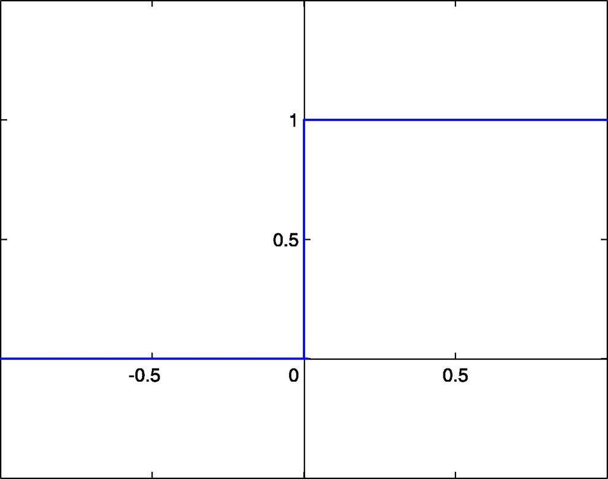
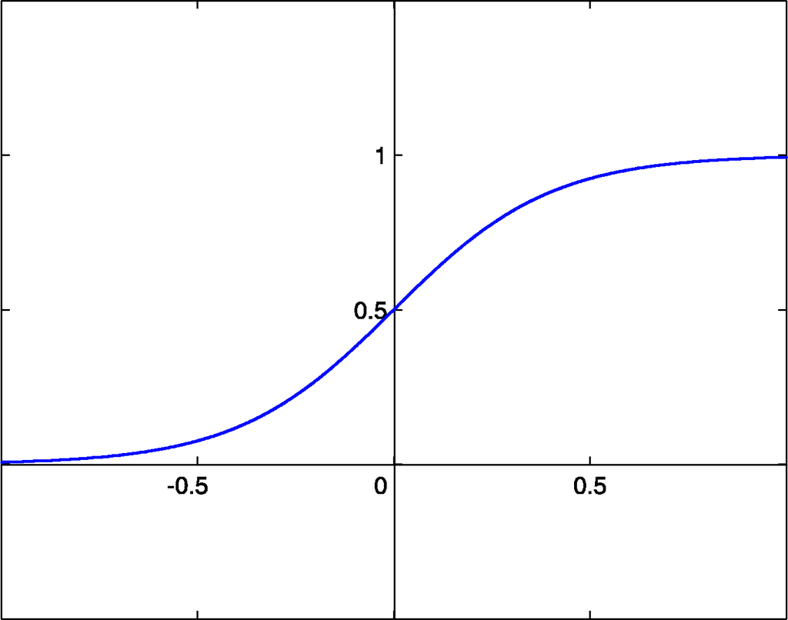
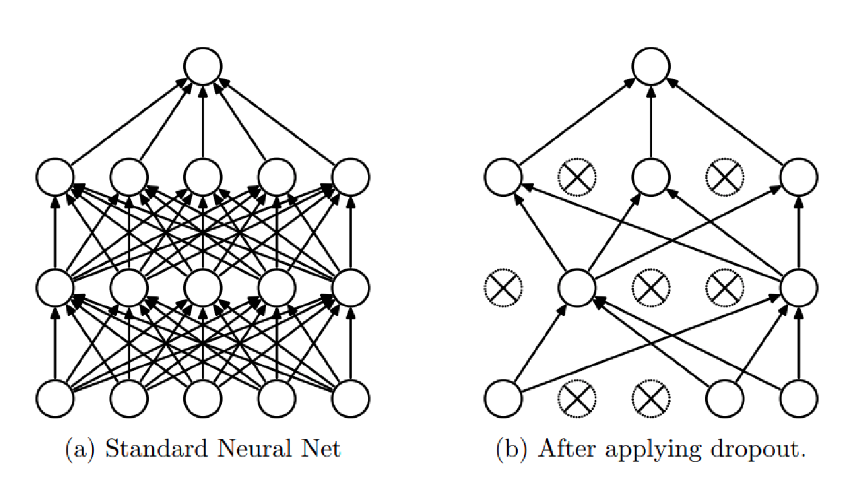

Нейронные сети
==============

Нейронные сети. Модель нейрона. MLP. Понятие функции активации. Алгоритм обратного распространения ошибки.
----------------------------------------------------------------------------------------------------------

### Нейронные сети. Модель нейрона.

Искусственный нейрон - узел искусственной нейронной сети, являющийся
упрощённой моделью естественного нейрона. Математически искусственный
нейрон обычно представляют как некоторую нелинейную функцию от
единственного аргумента --- линейной комбинации всех входных сигналов.
Данную функцию называют **функцией активации**.

Математически нейрон представляет собой взвешенный сумматор,
единственный выход которого определяется через его входы и матрицу весов
следующим образом:

$$y = f(u), \text{где}\quad u=\sum_{i=1}^{n}w_ix_i+w_0x_0$$

тут $x_i$ - сигналы на входах нейрона, $w_i$ - веса входов, функция $u$
называется индуцированным локальным полем, а функция $f(u)$ -
передаточной функцией (функцией активации)

### Функция активации

В биологических нейронных сетях функция активации обычно является
абстракцией, представляющей скорость возбуждения потенциала действия в
клетке. В наиболее простой форме эта функция является двоичной --- то
есть нейрон либо возбуждается, либо нет.

Передаточная функция $f(u)$ определяет зависимость сигнала на выходе
нейрона от взвешенной суммы сигналов на его входах. В большинстве
случаев она является монотонно возрастающей. Использование различных
передаточных функций позволяет вносить нелинейность в работу нейрона и в
целом нейронной сети.

### Виды функций активации

1.  Функция Хевисайда. 

$$f(x) = 
    \begin{cases}
    1, &\text{if $x\geq T = -w_0x_0$}\\
    0, &\text{else}
\end{cases}$$

    

2.  Сигмоида 

$$\sigma(x) = \frac{1}{1+e^{-x}}$$

    

3.  Гиперболический тангенс 

$$tanh(x) = 2\sigma(2x) -1$$

    

4.  Rectified Linear Unit 

$$ReLU(x) = max(0,x)$$

    

5.  ReLU с утечкой (Leaky ReLU)
    
$$LReLU(x) = (x<0)\cdot \alpha x+(x\geq 0)\cdot x$$

    

### Многослойный перцептрон (MLP)

Многослойный персептрон --- это класс искусственных нейронных сетей
прямого распространения, состоящих как минимум из трех слоёв: входного,
скрытого и выходного. За исключением входных, все нейроны использует
нелинейную функцию активации.

При обучении MLP используется обучение с учителем и алгоритм обратного
распространения ошибки.

В качестве активационных функций нейронов используются сигмоидальные:
логистическая или гиперболический тангенс.

### Алгоритм обратного распространения ошибки

Один из распространенных подходов к обучению заключается в
последовательном предъявлении НС векторов наблюдений и последующей
корректировки весовых коэффициентов так, чтобы выходное значение
совпадало с требуемым. Это называется обучение с учителем, так как для
каждого вектора мы знаем нужный ответ и именно его требуем от нашей НС.

Теперь, главный вопрос: как построить алгоритм, который бы наилучшим
образом находил весовые коэффициенты. Наилучший -- это значит,
максимально быстро и с максимально близкими выходными значениями для
требуемых откликов. В общем случае эта задача не решена. Нет
универсального алгоритма обучения. Поэтому, лучшее, что мы можем сделать
-- это выбрать тот алгоритм, который хорошо себя зарекомендовал в
прошлом. Основной «рабочей лошадкой» здесь является алгоритм back
propagation (обратного распространения ошибки), который, в свою очередь,
базируется на алгоритме градиентного спуска.

**Простой пример backpropagation.** Пусть дана функция:
$f(x,y,z) = (x+y)z$. Представим операции в виде графа вычислений:

К примеру, $x=-2, y=5, z=-4$

Конечная цель - нужно распространить ошибку ко входам сети, для этого
нужно вычислить производную от функции потерь (в нашем случае это
функция $f$) по входу ($x,y,z$) (дифференцируем справа налево по графу,
т.е. от конца в начало). Будем это делать с помощью цепного правила
(правило взятия производной от сложной функции) и для этого нужно
вычислить все частные производные по пути. Теперь считаем производные:

$$q=x+y, \frac{\partial q}{\partial x}=1, \frac{\partial q}{\partial y}=1$$

$$f=qz, \Rightarrow \frac{\partial f}{\partial q}=z, \frac{\partial f}{\partial z}=q$$

Хотим посчитать:

$$\frac{\partial f}{\partial x}, \frac{\partial f}{\partial y}, \frac{\partial f}{\partial z}$$

На следующих картинках: значения над стрелками - те, что получили во
время прямого прохода, значения под стрелками - во время обратного
прохода (backward pass) - частные производные.

Глубокие нейронные сети. Принцип работы слоев: сверточного, полносвязного, пулинг (max pooling, average pooling), нормализации (batch normalization, layer normalization), дропаут.
-----------------------------------------------------------------------------------------------------------------------------------------------------------------------------------

### Сверточный слой

Скалярное произведение между элементами фильтра (также наз. **ядро
свертки**) и ограниченной областью входного слоя, с которой имеются
связи, с помощью скользящего окна (слева направо, сверху вниз). Свертка
отвечает за пространственное выделение признаков.

**Параметры сверточного слоя**

-   Размер фильтра - прямоугольный, задается двумя числами: $p\times q$.
    Также называется рецептивным полем.

-   Глубина - кол-во двумерных карт признаков (обычно интересует их
    число на выходе)

-   Шаг свертки (stride) - кол-во элементов по горизонтали или
    вертикали, на которое перемещается фильтр в режиме скользящего окна
    для получения результрующей карты признаков.

-   Добивка, паддинг (padding) - кол-во элементов, которыми дополняется
    исходная карта признаков - обычно нужна для сохранения
    пространственных размеров карты (ширина, высота)

**Padding. Режим VALID**

-   При движении скользящим окном (фильтром) размера $h\times w$ по
    изображению $H\times W$ с шагом $s=1$, если не заходить за границу
    картинки, то на выходе будет изображение размера (т.е. выходной
    размер изображения уменьшается): 

$$(H-h+1)\times (W-w+1)$$

**Padding. Режим SAME**

-   Добавляется рамка вокруг изображения (паддинг), состоящая либо из
    нулей, либо из зеркального отражения картинки внутри рамки, чтобы
    выходной размер был равен входному.

**Формула свертки**

-   **Входной слой** - трехмерный тензор $X_{ij}^{m}$, где верхний
    индекс - кол-во входных карт, два нижних индекса - пространственное
    разрешение карт (по горизонтали и вертикали). Всего входных карт
    $M$.

-   **Выходной слой** - трехмерный тензор $Y_{ij}^{k}$ с теми же
    обозначениями индексов. Всего выходных карт $K$.

-   **Фильтр свертки** - четырехмерный тензор $F_{uv}^{mk}$, где два
    верхних индекса отвечают за индекс входной и выходной карты, а
    нижние - пространственные размерности (например, 5 на 5); а также
    одномерный тензор сдвига (bias) $b^{k}$. Пусть пространственные
    размерности фильтра - $p\times q$
    
$$Y_{ij}^{k}=\sum_{m=1}^{M}\sum_{u,v=1}^{p,q}X_{i+u-1, j+v-1}^{m}\cdot F_{uv}^{mk}+b^{k}, \forall k=1...K$$

### Полносвязный слой FC (Fully connected)

Матричное умножение - в данном случае каждый нейрон выходного слоя
связан со всеми нейронами входного слоя (в отличие от сверточного слоя)

### Слой субдискретизации POOL

Уменьшение размерности по пространственным измерениям $w,h$. Могут
использоваться разные подходы: усреднение (average pooling), взятие
максимума по подобласти (max pooling) и т.п.

Слой субдискретизации решает две проблемы:

1.  Снижает пространственную размерность

2.  Помогает не переобучаться

Параметры слоя субдискретизации:

1.  Размер фильтра - пространственная размерность области (по
    горизонтали и вертикали), внутри которой применяется фукнция
    уменьшения размерности (max, avg)

2.  Шаг (stride) - кол-во элементов по горизонтали или вертикали, на
    которое перемещается фильтр для получения результирующей карты
    признаков.

### Normalization

**Проблема:**

-   **Внутренний ковариативный сдвиг (Internal Covariative Shift,
    ICS)** - изменение распределения значений нейронов вследствие
    изменения параметров нейросети во время обучения.

-   Более глубокая сеть $\Rightarrow$ больший сдвиг

Давайте предположим, что мы обучаем НС распознавать машины (неважно
какие, главное чтобы сеть на выходе выдавала признак: машина или не
машина). Но, при обучении мы используем автомобили только черного цвета.
После этого, сеть переходит в режим эксплуатации и ей предъявляются
машины уже разных цветов. Начальное распределение цветов (пусть это
будут градации серого) обучающей выборки и распределение всего множества
цветов машин, встречающихся в тестовой выборке, имеют различные МО и
дисперсии. Эта разница статистических характеристик и приводит к
ковариационному сдвигу. И теперь мы понимаем: если такой сдвиг имеет
место быть, то это негативно сказывается на работе НС. Но это пример
внешнего ковариационного сдвига. Его легко исправить, поместив в
обучающую выборку нужное количество машин с разными цветами. Есть еще
внутренний ковариационный сдвиг -- это когда статистическая картина
меняется внутри сети от слоя к слою.

Проблемы проявляются в процессе обучения, когда при изменении весов
связей предыдущего слоя статистическое распределение выходных значений
нейронов текущего слоя становится заметно другим. И этот измененный
сигнал идет на вход следующего слоя. Это похоже на то, словно на вход
скрытого слоя поступают то машины черного цвета, то машины красного
цвета или какого другого. То есть, весовые коэффициенты в пределах
мини-батча только адаптировались к черным автомобилям, как в следующем
мини-батче им приходится адаптироваться к другому распределению --
красным машинам и так постоянно. В ряде случаев это может существенно
снижать скорость обучения и, кроме того, для адаптации в таких условиях
приходится устанавливать малое значение шага сходимости, чтобы весовые
коэффициенты имели возможность подстраиваться под разные статистические
распределения.\
**Решение:**

-   Если проблема в изменении статистических характеристик распределения
    на выходах нейронов, то давайте их стандартизировать,
    нормализовывать -- приводить к единому виду. Именно это и делается
    при помощи предложенного алгоритма **Batch Normalization**

**Когда и где применять BN:**

-   В глубоких нейронных сетях

-   Когда нужно ускорить обучение

-   **После** операции свертки или других матричных операций

-   **До** применения функции активации, т.к. она сама по себе сильно
    меняет распределение

-   Тем не менее, есть свидетельства, что порой можно применить BN и
    после активации (хотя, это не всегда работает)

**Режимы работы BN**

-   **Обучение**

    -   *Подсчитываем* $\mu_{B}$ *и* $\sigma_{B}$ *на пакете* $B$.\
        Предположим, что мы используем пакет размера $T$. Тогда,\
        $X_{ij}^{mt} \text{- четырехмерный тензор значений для некоторого слоя, где: }$\
        $1\leq i\leq H, \quad 1\leq j\leq W \text{ - пространственные координаты (ширина и высота)}$\
        $m=1...M \text{ - номер карты признаков}$\
        $t = 1...T\text{ - номер внутри пакета}$\

    -   Статистика на пакете:
        
        $$\mu_{B}^{m}=\frac{1}{HWT}\sum_{t}\sum_{i,j}X_{ij}^{mt}$$
        
        $$\sigma_{B}^{2m}=\frac{1}{HWT}\sum_{t}\sum_{i,j}(X_{ij}^{mt}-\mu_{B}^{m})^2$$

    -   *Обновляем глобальные значения (соотв. всему обуч. мн-ву)
        $\mu_{avg}$ и $\sigma_{avg}$*

    -   Гиперпараметры: $\alpha\in [0,1]$ - параметр сглаживания для обновления глобальных параметров; $\epsilon>0$ - регуляризатор (маленькое число)

    -   Шаг обучения $k$:
        
        $$\mu_{avg,k}^{m} = \alpha\mu_{avg,k-1}^{m}+(1-\alpha)\mu_{B}^{m} \quad (\text{иниц. } \mu_{avg,0}^{m}=0)$$
        
        $$\sigma_{avg,k}^{2m}=\alpha \sigma_{avg,k-1}^{2m} +(1-\alpha)\sigma_{B}^{2m}\quad (\text{иниц. } \sigma_{avg,0}^{2m}=1)$$

    -   Выход нормализованного слоя:
        
        $$Y_{ij}^{mt}=\gamma^{m}\frac{X_{ij}^{mt}-\mu_{B}}{\sqrt{\sigma_{B}^{2m}+\epsilon}}+\beta^{m}$$

    -   Параметры $\gamma^{m}$ (масштаб, scale) и $\beta^{m}$ (сдвиг,
        shift) - обучаемые.

    -   **Замечание.** В случае, когда
        $\gamma^{m}=\sqrt{\sigma_{B}^{2m}+\epsilon}, \beta^{m}=\mu_{B}^{m}$,
        получим $Y_{ij}^{mt} = X_{ij}^{mt}$, т.е. BN в принципе может
        обучиться ничего не делать (ничего не портить)

-   **Тестирование (inference)**

    -   Используем значения $\mu_{avg}$ и $\sigma_{avg}$ вне зависимости
        от $\mu_{B}$ и $\sigma_{B}$ на текущем пакете.

    -   Используем уже обученные параметры масштаба $\gamma^{m}$ и
        сдвига $\beta^{m}$

    -   Несмотря на то, что данные могут также подаваться пакетами, не
        обращаем внимание на статистику пакета $\mu_{B}^{m}$ и
        $\sigma_{B}^{2m}$

    -   Не обновляем глобальные параметры $\mu_{avg}^{m}$ и
        $\sigma_{avg}^{2m}$

    -   Выход нормализованного слоя:
        
        $$Y_{ij}^{mt}=\gamma^{m}\frac{X_{ij}^{mt}-\mu_{avg}^{m}}{\sqrt{\sigma_{avg}^{2m}+\epsilon}}+\beta^{m}$$

**Число параметров для BN:**

-   Для каждой карты признаков нужно хранить 4 числа: 2 - глобальные
    статистики, 2 - параметры сдвига и масштаба

-   Если L слоев по M карт каждый, то число BN параметров $N_{BN}=4LM$

-   $N_{BN}\ll N_{CONV}$

**Другие виды нормализаций**

1.  Нормализация по слою, а не по пакету (layer normalization)

2.  Нормализация по одной карте признаков (instance normalization)

3.  Нормализация по части слоя (group normalization)

**Layer Normalization: Нормализация по слою**

-   Предположим, что мы используем пакет размера $T$.

-   $X_{ij}^{mt} \text{- четырехмерный тензор значений для некоторого слоя, где: }$\
    $1\leq i\leq H, \quad 1\leq j\leq W \text{ - пространственные координаты (ширина и высота)}$\
    $m=1...M \text{ - номер карты признаков}$\
    $t = 1...T\text{ - номер внутри пакета}$\

-   Статистика по слою:
    
    $$\mu_{B}^{t} = \frac{1}{HWM}\sum_{m}\sum_{i,j}X_{ij}^{mt}$$
    
    $$\sigma_{B}^{2t} = \frac{1}{HWM}\sum_{m}\sum_{i,j}(X_{ij}^{mt} - \mu_{B}^{t})^2$$

### Dropout

-   Для уменьшения переобучения, во время обучения нейроны выключают с
    вероятностью $0\leq 1-p\leq 1$

-   Это можно сделать зануляя выключенные нейроны

-   На тесте нейроны не выключаются, при этом выход нейрона умножается
    на p

    -   Матожидание выхода нейрона при обучении: $px+(1-p)0=px$ (т.к. мы
        либо пропускаем нейрон без изменений, либо зануляем)

    -   Поэтому при тестировании, когда все нейроны включены, их выходы
        нужно шкалировать для такого же матожидания

-   Либо при обучении делим выход на p: тогда на тесте ничего домножать
    не надо

Способы искусственного расширения набора данных для увеличения обобщающей способности. Аугментация, генерация, симуляция. Перенос обучения (Transfer learning).
---------------------------------------------------------------------------------------------------------------------------------------------------------------

**Аугментация** -- генерация наборов данных на основе имеющихся данных.
К имеющимся данным применяются различные способы искажения: например,
для изображений могут использоваться различные геометрические
преобразования, искажения цвета, кадрирование, поворот, добавление шума
и иные. Для числовых данных могут использоваться такие искажения, как
добавление объектов с усреднёнными значениями, смешивание с объектами из
другого распределения, добавление случайных выбросов.

**Генерация** -- создание искуственных данных на уровне датасета. То
есть, аугментация является частным случаем генерации.

**Симуляция** -- создание искусственных данных уже не на уровне
датасета, а на уровне эмбеддингов (я не про таргеты, а про внутренние
представления данных из датасета).

### Transfer learning

Смысл **transfer learning** заключается в том, чтобы обучать модели,
формировать значения весов, а затем применять обученные модели для
решения других задач. Работает не всегда, т.к. например CNN-ы довольно
разнообразные, они учаться извлекать какие-то признаки с входных данных.
Эти веса для извлечения можно использовать для решения своих задач с
извлечением признаков. Но надо дообучать модели.

Если датасеты близкие, то можно просто выкинуть последний слой с $N$
классами, ставить другой последний слой с нужным $M$ количеством
классов, и дообучаем веса только на последнем слое. Так тоже делают! На
медицинские CNN так делать вообще нельзя, опасно.

Вопросы практической реализации нейронных сетей в условиях ограничения вычислительных ресурсов. Дистилляция. Прунинг. Квантизация.
----------------------------------------------------------------------------------------------------------------------------------

Зачем это всё нужно?

-   Ускорение модели - чтобы она работала быстрее

-   Оптимизация модели под конкретное устройство - телефон мобильный,
    специфические видеокамеры и т.д.

-   Сжатие модели - чтобы занимала меньше места на диске или в памяти

Зачастую методы по ускорению, сжатию, оптимизации схожи, так как на
устройстве может быть доступен только специфический набор операций для
нейросети (например, доступны не все функции активации, не все способы
сверток и т.д.)

### Прунинг

**Прунинг** - это удаление связей в нейронных сетях (разреживание).

**Как выбирать удаляемые связи?**

-   Чтобы обнуление веса наименьшим образом влияло на качество, надо
    удалять наименее значимые связи, например те, у которых наименьшие
    веса (так как они дают наименьший вклад в результирующее решение
    нейросети)

Однако появляется проблема (несмотря на то, что удаленные веса малы,
они, всё же не нулевые и имеют некоторое влияние на итоговые активации)
- при удалении связей может существенно падать точность модели.\
Возможные решения:

-   при обучении нейросети добавлять $l_1, l_2$ - регуляризацию, чтобы
    появлялось больше весов с маленьким весом.

-   производить дообучение модели после обнуления весов, чтобы
    перераспределить ту ошибку, которая появилась после того, как мы
    удалили хоть и малозначащие, но тем не менее вносящие вклад веса.

С точки зрения вычислений выгоднее удалять не связи из графа, а нейроны
целиком или карты или, даже, слои.

Детали алгоритма

-   Удаление карты происходит путем удаления весов с минимальной нормой
    веса (сумма квадратов или сумма абсолютных значений)

-   Эта же норма добавляется к функции потерь с некоторым весом

-   Удаление происходит постепенно и итеративно вместе с дообучением

-   Критерий остановки - либо достижение порога по качеству модели, либо
    достижение необходимого вычислительного бюджета.

### Квантование

Архитектуру не трогаем, а работаем с самими значениями весов.

**Квантование** - уменьшение битности параметров нейронной сети.\
По умолчанию при обучении нейросети веса 32-битные (float32), могут быть
и double. Если сеть большая, то она занимает очень много места.

-   При уменьшении битности параметров вычисления можно проводить
    быстрее

-   Существенно уменьшается размер модели

**Методы квантования**

-   Обучение модели в полной точности, а потом округление весов до
    нужного количества бит

-   Как правило, после округления идет дообучение (возможно итеративно,
    как в случае с прунингом)

-   Есть методы, позволяющие обучать сразу квантованные модели

**Бинарные нейронные сети** - экстремальный случай квантования, когда
веса имеют только два значения.

В таком виде обучение модели градиентным спуском затруднено, так как
пространство дискретное

Нужно различать квантование весов и квантование значений, которые
возникают при проходе по сети. Т.к. например, мы можем иметь
квантованные (даже бинарные) веса, а когда считаем сумму произведений
(напр. свертку), то не обязательно затем квантовать. И сети тоже
отличатся - активации перед подачей на следующий слой могут
квантоваться, а могут и нет.

### Дистилляция

-   Идея - передать знания от Учителя (большая нейронная сеть или
    ансамбль моделей) к Студенту (маленькая нейронная сеть)

||
|:--:|
|*Дистилляция. На схеме - Учитель (большая сеть) и ученик (малая сеть). При этом ученик использует как ground trurh - разметку, так и знания учителя.*|

Сделаем допущение - будем рассматривать классификационную нейронную
сеть. Возникает вопрос, почему использование учителя может работать
лучше, чем просто обучение? Ответ:

-   В задаче классификации разметка осуществляется путем выбора одного
    наиболее подходящего класса. Обученная нейронная сеть же выдает
    распределение по классам, которое содержит дополнительную информацию
    (при этом распределение не будет являться onehot. Argmax по этому
    вектору дает нужный ответ, но и у других классов вероятность
    $\neq 0$. Т.е. сеть говорит, что картинка в целом собака, но еще
    немного похожа на кошку, свинью и лошадь. И эта информация, что
    ответ не только собака, но и есть схожесть с другими классами -
    важна, так как в случае человека есть априорные знания, что какая-то
    вещь похожа на другие в какой-то степени. И эта информация будет
    передана Ученику от Учителя).

-   Можно расширить обучающий датасет, используя выход Учителя как
    аннотацию. (есть размеченные данные, запускаем на них учителя и
    получаем новую разметку, таким образом получаем новые данные)

При обучении применяется функция потерь Softmax с температурой:

$$q_{i}=\frac{exp(\frac{z_i}{T})}{\sum_{j}exp(\frac{z_j}{T})}$$ 

где $z_i$ - активации\
Свойства:

-   При $T=1$ - обычный Softmax

-   При $T\rightarrow\infty$ вероятности будут все больше выравниваться
    (примерно будет $\frac{1}{n}$)

-   Где-то в промежутке станет доступна для обучения дополнительная
    информация из распределения (сам Хинтон называл это "dark
    knowledge")

Дистилляционная функция потерь:

$$\mathcal{L}(x;W)=\alpha\ast \mathcal{H}(y,\sigma(z_s;T=1))+\beta\ast\mathcal{H}(\sigma(z_t;T=\tau),\sigma(z_s, T=\tau))$$

Здесь: $\mathcal{H}$ - некая функция потерь (напр., кросс-энтропия).
Левое слагаемое - обучаем Ученика на ground truth метках (в формате
onehot encoding) с температурой $T=1$. Правое слагаемое - Ученика
обучаем с температурой $T=\tau$ и в качестве меток берем выход учителя
($z_t$)

||
|:--:|
|*Дистилляция знаний. Вход идет в Учителя и Ученика. У Ученика при температурном коэфф = 1 делаем hard prediction (кросс-энтропийная ф.п., обычное обучение). Но хотим еще и привлечь данные от Учителя, применяем температурный Softmax, получаем распределение (soft labels) и сравниваем распределения (для этого выход Ученика тоже пропускаем через температурный Softmax и сравниваем уже этот выход (soft prediction) с выходом Учителя (soft labels). Тут уже метка не важна. Веса Учителя зафиксированы (считается, что он хорошо обучен), обучается только Ученик)*|
