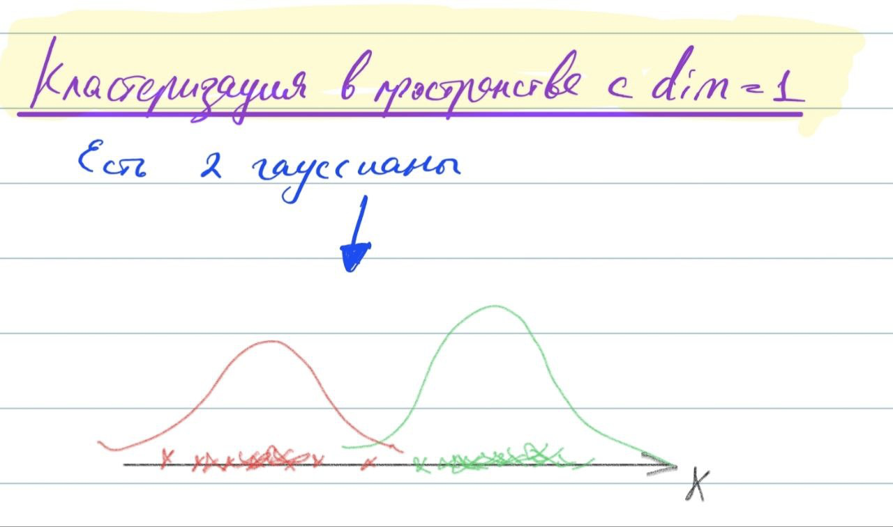

Теория вероятности и математическая статистика
=================

Вероятностное пространство. Аксиоматика Колмогорова. Вероятностная мера. Функция распределения вероятностной меры. Понятие случайной величины. Плотность распределения. Геометрическое понимание случайной величины. Распределение вероятностей и функция распределения.
-----------------------------------------------------------------------------------------------------------------------------------------------------------------------------------------------------------------------------------------------

Произвольное множество $\Omega$ (не обязательно конечное) называется
**пространством элементарных событий**. Элемент этого множества $\omega$
называется элементарным **событием**

*Пространство элементарных событий $\Omega$ в случае бросания игральной
кости $\Omega=\{0, 1, 2, 3, 4, 5, 6\}$*

Обозначим множество подмножеств элементарных событий $\Omega$ как
$\mathcal{F}$. Множество $\mathcal{F}$ называется **алгеброй множеств**,
если выполнены следующие требования

1.  $\Omega \in \mathcal{F}, \varnothing\in\mathcal{F}$ ($\varnothing$ -
    пустое множество)

2.  $A \in \mathcal{F} \Rightarrow \overline{A} \in \mathcal{F}$

3.  $A \in \mathcal{F}$ и
    $B \in \mathcal{F} \Rightarrow A \cup B \in \mathcal{F}, A \cap B \in \mathcal{F}$

Алгебра $\mathcal{F}$ называется *$\sigma$-алгеброй*, если
$A_1, A_2, \dots \in \mathcal{F} \Rightarrow \bigcup\limits_{i=1}^{\infty} A_i \in \mathcal{F}, \bigcap\limits_{i=1}^{\infty} A_i \in \mathcal{F}$

Функция $\mathbb{P}: \mathcal{F} \rightarrow \mathbb{R}$ на множестве
событий называется **вероятностью**, если:

-   Каждому случайному событию $A$ ставится в соответсиве
    неотрицательное число $\mathbb{P}(A)$, называемое его вероятностью.

-   $\mathbb{P}(\Omega) = 1$

-   Если события $A_1, A_2, ..., A_n$ попарно несовметимы, то
    $\mathbb{P}(\bigcup\limits_{k=1}^{\infty} A_k) = \sum\limits_{k=1}^{\infty}\mathbb{P}(A_k)$

**Вероятностное пространство** - это тройка
$(\Omega, \mathcal{F}, \mathbb{P})$.

**Случайная величина** - это функция
$\xi: \Omega \rightarrow \mathbb{R}$, измеримая относительно
$\mathcal{F}$ и борелевской $\sigma$-алгебры на $\mathbb{R}$.

**Дискретной случайной величиной** называется случайная величина,
множество значений которой не более, чем счётно. Пример: выпадение орла
или решки при подбрасывании монеты или выпадение определённого числа на
игральном кубике.

**Непрерывной случайной величиной** называют случайную величину, которая
в результате испытания принимает все значения из некоторого числового
промежутка. Число возможных значений непрерывной случайной величины
бесконечно. Пример: измерение скорости перемещения любого вида
транспорта или температуры в течение конкретного интервала времени.

**Функцией распределения** вероятностной меры называется
$F(x)=P(\{-\infty < x\}),x\in\mathbb{R}$, которая обладает
следующими свойствами:

-   $F(x)$ - неубывающая

-   $\lim_{x\rightarrow -\infty}F(x) = 0$;
    $\lim_{x\rightarrow +\infty}F(x) = 1$

-   $F(x)$ непрерывна справа
    $\lim_{\varepsilon\rightarrow0+}F(x+\varepsilon)=F(x)$

**Функцией распределения случайной величины** называется

$$F(x) = \mathbb{P}(\xi \leq x), x \in \mathbb{R}$$

Случайную величину $\xi$ называют непрерывной, если существует такая
неотрицательная функция $p(x)$, что $\forall x \in \mathbb{R}$ выполняется

$$F(x) = \mathbb{P}\{\xi \leq x\} = \int\limits_{-\infty}^{x}p(t)dt; \frac{dF}{dx} = p(x)$$

Функция $p(t)$ называется **плотностью** распределения.

Смысл функции $p(x)$: если событие «случайная величина $\xi$ попадет в
малый интервал $\Delta x$», то вероятность этого события
$\mathbb{P}(x < \xi < x + \Delta x) \sim F'(x)dx = p(x)\Delta x.$ При
этом $\int\limits_{-\infty}^{\infty} p(x) = 1$, так как попадание $\xi$
в неограниченный интервал гарантировано.

*Функция распределения и функция плотности*

Мода. Медиана. Математическое ожидание случайной величины. Дисперсия случайной величины. Ковариация случайных величин. Матрица ковариаций вектора случайных величин. Корреляция.
----------------------------------------------------------------------------------------------------------------------------------------------------------------------------------------------------

**Мода** - величина, которая встречается чаще всего. Частота моды - сколько раз она встречается.

**Медиана** - значение, которое стоит ровно посередине, то есть среднее по индексу. Если значений чётное количество, просто берут среднее арифметичесное двух элементов, стоящих посередине.

Пусть $\xi$ - абсолютно непрерывная случайная величина, $p(x)$ - ее
плотность распределения. Тогда ее **математическим ожиданием**
называется величина

$$\mathbb{E}(\xi) = \int\limits_{-\infty}^{\infty} x \cdot p(x) dx$$

Свойства математического ожидания:

-   $\mathbb{E}(a\xi + b\eta) = a \cdot \mathbb{E}(\xi) + b \cdot \mathbb{E}(\eta)$

-   $\xi = const = C \Rightarrow \mathbb{E}(\xi) = C$

-   если $\xi$ и $\eta$ независимы, то
    $\mathbb{E}(\xi \eta) = \mathbb{E}(\xi) \cdot \mathbb{E}(\eta)$

**Математическое ожиданием в дискретном** случае можно посчитать как

$$\mathbb{E}(\xi)=\sum\limits_{x \in X} x \cdot p(\xi = x)$$

**Дисперсией** случайной величины называют математическое ожидание
квадрата отклонения случайной величины от её математического ожидания.
Пусть $\xi$ - случайная величина, тогда дисперсией называется:

$$D(\xi) = E(\xi - E(\xi))^2$$

Свойства дисперсии:

-   $D(\xi) \geq 0$

-   $D(a\xi) = a^2 D(\xi)$

-   $D(\xi + const) = D(\xi)$

-   $D(const) = 0$

-   $D(\xi) = \mathbb{E}(\xi^2) - \mathbb{E}^2(\xi)$

-   если $\xi$ и $\eta$ независимы, то
    $D(\xi + \eta) = D(\xi) + D(\eta)$

*Знак ковариации двух случайных величин $X$ и
$Y$*

Пусть $\xi$ и $\eta$ - случайные величины. Тогда **ковариация**
определяется как

$$cov(\xi, \eta) = \mathbb{E}\big[(\xi - \mathbb{E}(\xi)) \cdot (\eta - \mathbb{E}(\eta))]$$

Ковариация случайной величины с собой является дисперсией
$cov(\xi, \xi) = D(\xi)$

**Корреляцией** случайных величин $\xi$ и $\eta$ называется число

$$corr(\xi, \eta) = \frac{cov(\xi, \eta)}{\sqrt{D(\xi) \cdot D(\eta)}}$$

Корреляция принимает значения от -1 до 1, и помимо направления
зависимости она также показывает меру зависимости между случайными
величинами, насколько сильно они зависят друг от друга.

Если у нас есть вектор случайных величин $(\xi_1, \xi_2, \dots, \xi_n)$,
то **матрица ковариаций** этого вектора выглядит: 

$$\begin{bmatrix}
    cov(\xi_1, \xi_1) & cov(\xi_1, \xi_2) & \dots & cov(\xi_1, \xi_n) \\
    cov(\xi_2, \xi_1) & cov(\xi_2, \xi_2) & \dots & cov(\xi_2, \xi_n) \\
    \dots             & \dots             & \dots & \dots             \\
    cov(\xi_n, \xi_1) & cov(\xi_n, \xi_2) & \dots & cov(\xi_n, \xi_n) \\
\end{bmatrix}$$

В многомерном пространтсве по этой матрице можно понять попарную
ковариацию (т.е. положительно или отрициательно зависят друг от друга
случайные величины). А по диагональным элементам понять дисперсию
случайной величины

*"Визуализация матрицы ковариации" на примере свойств растений. На
диагонали распределение случайных величин, по которым можно оценить
дисперсию. А по недиагональным графикам можно понять положительно или
отрицательно зависят друг от друга случайные
величины*

Типы распределения: равномерное, биномиальное, Пуассона, нормальное, экспоненциальное. 
------------------------------------------------------------------------------------------------------------------

### **Непрерывные распределения**

| Распределение           | Равномерное           | Нормальное                 | Экспоненциальное      |
| ----------------------- | --------------------- | -------------------------- |---------------------- |
| Обозначение             | $U[a, b]$             | $\mathcal{N}(\mu, \sigma)$ | $exp(\lambda)$        |
| Плотность распределения | $\begin{cases} \frac{1}{b-a}  & , x \in (a, b) \\ 0  & , x \notin (a, b) \end{cases}$ | $\frac{1}{\sigma\sqrt{2 \pi}} \cdot e^{-\frac{(x - \mu)^2}{2 \sigma^2}}$ | $\begin{cases} \lambda e^{-\lambda x}  &  , x \geq 0 \\ 0  &  , x < 0 \end{cases}$ |
| Математическое ожидание | $\frac{a+b}{2}$       | $\mu$                      | $\frac{1}{\lambda}$   |
| Дисперсия               | $\frac{(b-a)^2}{12}$  | $\sigma^2$                 | $\frac{1}{\lambda^2}$ |

### **Дискретные распределения**

| Распределение           | Биномиальное распределение | Распределение Пуассона              |
| ----------------------- | -------------------------- | ----------------------------------- |
| Обозначение             | $B(n, p)$                  | $Poisson(\lambda)$                  |
| Плотность распределения | $ C_n^k p^k (1 - p)^{n-k}$ | $\frac{\lambda^k}{k!} e^{-\lambda}$ |
| Математическое ожидание | $np$                       | $\lambda$                           |
| Дисперсия               | $npq$                      | $\lambda$                           |

Неравенство Маркова, неравенство Чебышева, ЗБЧ, ЦПТ
------------------------------------------------------------------------------------------------------------------

**Неравенство Маркова** позволяет дать оценку вероятности, что
неотрицательная случайная величина превзойдёт по модулю фиксированную
положительную константу, в терминах ее математического ожиадния.

Итак, пусть $(\Omega, \mathcal{A}, \mathbb{P})$ - некоторое
вероятностное пространство и $\xi \geq 0$. Тогда
$\forall \varepsilon > 0$

$$\mathbb{P}\{ \xi \geq \varepsilon \} \leq \frac{\mathbb{E}(\xi)}{\varepsilon}$$

*Функция распределения $f(x)$ случайной величины $x$. Зафиксируем положительную константу $\varepsilon$.
Множество случайных величин, где функция распределения больше
$\varepsilon$ закрасим красным. Неравенство Маркова позволяет оценить сверху вероятность попасть в красную зону как $\frac{\mathbb{E}(X)}{\varepsilon}$*

**Неравенство Чебышева** утверждает, что случайная величина в основном
принимает значения, близкие к своему среднему. А более точно, оно даёт
оценку вероятности того, что случайная величина примет значение, далёкое
от своего среднего.

Пусть $(\Omega, \mathcal{A}, \mathbb{P})$ - некоторое вероятностное
пространство и $\xi$ - случайная величина с конечными математическим
ожиданием и дисперсией. Тогда $\forall \varepsilon > 0$

$$\mathbb{P}\{ | \xi - E(\xi) | \geq \varepsilon \} \leq \frac{D(\xi)}{\varepsilon^2}$$

*Неравенство Чебышёва, ограничивающее вероятность больших отклонений случайной величины от своего математического ожидания*

В частности, случайная величина с конечной дисперсией отклоняется от
среднего больше, чем на 2 стандартных отклонения, с вероятностью меньше
$\frac{1}{4}$, на 3 стандартных отклонения с вероятностью меньше $\frac{1}{9}$.

**ЗБЧ в форме Чебышева**. Согласно закону, среднее значение конечной
выборки из фиксированного распределения близко к математическому
ожиданию этого распределения.

Пусть $X$ - случайная величина с конечным математическим ожиданием
$\mu$ и конечной ненулевой дисперсией $\sigma^{2}$. Тогда для любого
действительного числа $k>0$ выполняется

$$P{\big (}|X-\mu |\geqslant k\sigma {\big )}\leqslant {\frac {1}{k^{2}}}$$

*Иллюстрация закона больших чисел с использованием определённой серии бросков одной игральной кости. По мере увеличения количества бросков в серии среднее значение всех исходов (выпавших значений) стремится к 3,5*

Условная вероятность и независимость событий. Теорема Байеса.
-------------------------------------------------------------------------------------

Пусть $(\Omega, \mathcal{A}, \mathbb{P})$ - некоторое вероятностное
пространство.

**Условной вероятностью** события $A$ при условии события $B$ с
$P(B) > 0$ называется величина

$$P(A|B) = \frac{P(A\cap B)}{P(B)} = \frac{P(AB)}{P(B)}$$

*Пересечение событий*

События $A$ и $B$ называются **независимыми**, если 

$$P(AB) = P(A)P(B)$$

*Визуализация формулы полной вероятности*

Пусть события $B_1, \dots, B_n$ образуют полную группу, т.е.

1.  $B_i \cap B_j = \varnothing$

2.  $\bigcup\limits_{i=1}^{n} B_i = \Omega$

3.  $P(B_i) > 0 \;\; \forall i$

Тогда
$A = A \cap \Omega = A \cap \bigcup\limits_{i=1}^{n} B_i = \bigcup\limits_{i=1}^{n} A \cap B_i$,
причем $(AB_i)\cup(AB_j) = \varnothing$\
Тогда верна **формула полной вероятности**:

$$P(A) = \sum\limits_{i=1}^{n} P(B_i) \cdot P(A | B_i)$$

**Теорема Байеса**. 

$$P(A|B) = \frac{P(B|A)P(A)}{P(B)}$$

Если же представить $P(B) = \sum \limits_{i=1}^{N} P(B|A_i)P(A_i)$, то
формулу Байеса можно записать как

$$P(A_i|B) = \frac{P(A_i) \cdot P(B|A_i)}{\sum\limits_{i=1}^{n} P(A_i) \cdot P(B|A_i)}$$

Формула Байеса позволяет «переставить причину и следствие»: по
известному факту события вычислить вероятность того, что оно было
вызвано данной причиной. При этом необходимо понимать, для применения
теоремы причинно-следственная связь между $A$ и $B$ не является
обязательной.

Теория информации. Энтропия по Шеннону. Энтропия объединения. Условная энтропия. Математические свойства энтропии по Шеннону. 
---------------------------------------

Менее вероятное событие более информативно. Например, сообщение
"сегодня утром выглянуло солнце" гораздо менее информативно (оно
обычное, для нас это не новая информация), чем "сегодня утром было
солнечное затмение". Сообщение, вероятность которого равна 1, несёт
нулевую информацию(информация о том, что трава зеленая, нам ничего не
дает).

Основываясь на идее о том, что прирост информации равен утраченной
неопределённости, Шеннон выдвинул разумные требования для функции
энтропии $H$:

1. Мера должна быть непрерывной;

2. В случае, когда все варианты равновероятны, увеличение количества
    вариантов должно всегда увеличивать значение функции;

3. Должна быть возможность сделать выбор в два шага, в которых значение функции конечного результата должно являться суммой функций промежуточных результатов.

**Собственной информацией** случайной величины $x$ с плотностью распределения $p_{X}(x)$ называется число 

$$I(x) = − \log{p_{X}(x)}$$

$log$ можно брать по разным основаниям. Если основание = 2, то единица
измерения количества информации называется «бит», если берётся
натуральный логарифм, то - «нат».

Собственная информация сама является случайной величиной определённая для множества сообщений $X = x_1, \dots , x_n$ с распределением вероятностей $P = p(x_1), \dots , p(x_n)$, которую следует отличать от её среднего значения - информационной энтропии.

Информация аддитивна для статистически независимых сообщений:
$I(x_1, x_2) = I(x_1) + I(x_2)$.

*Доказательство*. Действительно, если сообщения независимы, то
$p(x_1, x_2) = p(x_1) \cdot p(x_2)$, а следовательно:

$$I(x_1, x_2) = −\log p(x_1, x_2) = −\log ( p(x_1) \cdot p(x_2) ) = −\log p(x_1) − \log p(x_2) = I(x_1) + I(x_2) \blacksquare$$

Математическое ожидание этой случайной величины $I(x)$ называется
**энтропией**:

$$H(x) = \mathbb{E}(I(x)) = -\sum\limits_{x \in X} p_{X}(x) \cdot \log{p_{X}(x)}$$

Глобально энтропия - это мера неопределённости некоторой системы. В
нашем случае неопределённость возникает при появлении сообщений, то есть
вклад в неопределённость вносит вероятность. Получение информации
уменьшает неопределённость. И энтропия в теории информации как раз
представляет собой среднее количество собственной информации в
сообщениях из множества $X$.

Хартли пошёл по простому логичноему пути: если мы имеем выбор из $N$
возможных вариантов, то для того, чтобы закодировать этот выбор, нам
потребуется последовательность ответов на вопросы из нулей(*нет*)
и единиц (*да*) длиной порядка $H_N = \log_2{N}$.

Два простых примера: Пример 1. Надо выбрать 1 вариант из 8. Закодируем
варианты числами от 0 до 7, нужный $Z = 5$, и будем действовать методом
деления интервала пополам:

1. $Z > 3?$ да $\to 1$
2. $Z > 5?$ нет $\to 0$
3. $Z > 4?$ да $\to 1$

Ответ: $Z = 5$. Последовательность ответов в двоичном виде представляет
трёхзначное число $101$, для него нужно 3 бита, что соответствует
формуле Хартли.

Пример 2. Сколько вопросов нужно задать, чтобы угадать загаданное наугад
число от 0 до 100? Предположим, что мы загадали $Z = 27$:

1. $Z > 50?$ нет $\to 0$
2. $Z > 25?$ да $\to 1$
3. $Z > 38?$ нет $\to 0$
4. $Z < 32?$ да $\to 1$
5. $Z < 29?$ да $\to 1$
6. $Z < 27?$ нет $\to 0$
7. $Z = 28?$ нет $\to 0$

Получили последовательность ответов: $0101100$, для которой нужно 7 бит,
$6 < \log_2{100} < 7$. Заметим, что мы выбирали кратчайший путь, а не
задавали 100 вопросов: *$Z = 0? Z = 1?$* и т.д.

Формула Хартли даёт довольно грубую оценку, поскольку оперирует только
количеством исходов, но игнорирует их вероятности.

**Перекрестная энтропия(или кросс-энтропия)** - ожидаемая длина
закодированных сообщений в битах при использовании распределения $Q(x)$
вместо $P(x)$: 

$$H(P, Q) = -\sum\limits_{x \in X} P(x) \log Q(x)$$

Ее можно рассматривать как меру разницы между двумя распределениями.
Перекрестная энтропия уже широко используется в глубоком обучении в
качестве функции потерь для включения обучения. В этом случае истинное
распределение $P(x)$ вероятностей - это метка, а прогнозируемое
распределение $Q(x)$- это значение из текущей модели.

Пусть $P(x)$ - истинное распределение вероятностей сообщений, а $Q(x)$ -
прогнозируемое распределение вероятностей сообщений.

Измерить схожесть одного распределения $P$ с другим распределением $Q$
позволяет **дивергенция Кульбака-Лейблера (KL-дивергенция)**:

$$KL(P\|Q) = -\sum\limits_{x \in X} P(x) \log Q(x) + \sum\limits_{x \in X} P(x) \log P(x) = \sum \limits_{x \in X} P(x) \log\frac{P(x)}{Q(x)}$$

Это значение можно понимать как количество неучтённой информации
распределения $P(x)$, если бы $Q(x)$ было использовано для приближения
$P(x)$. Здесь $P(x)$ рассматривается как априорное распределение, $Q(x)$
как проверяемое.

KL-дивергенция неотрицательна и измеряет различие между 2
распределениями, но эта мера - не расстояние, т.к. не является
симметричной (не всегда $KL(P\|Q) = KL(Q\|P)$).

*Пример распределения $p$ и $q$ и их $KL$-дивергенции*

Понятие выборки и генеральной совокупности. Доверительный интервал. Функция правдоподобия. Метод максимального правдоподобия. EM-алгоритмы.
-------------------------------------------------------------------------------------------------------------------------------------------

В целом основная задача математической статистики это поиск распределения по выборке.

Обычно мы от распределения не знаем какой-то числовой параметр, чтобы его оценить, пользуются известной нам функцией - статистикой $T(X)$. И да, скорее правильно сказать не выборка из P, а выборка с распределением P.

*Пример нахождения параметров для нормального распределения для описания эксперимента*

**Генеральная совокупность** -- это совокупность всех мысленно возможных
объектов данного вида, над которыми проводятся наблюдения с целью
получения конкретных значений определенной случайной величины.

**Выборкой (выборочной совокупностью)** называется совокупность случайно
отобранных объектов из генеральной совокупности.

**Статистикой** $T(X)$ называется любая случайная величина, являющаяся
функцией лишь от выборки $X$.

Пусть у нас есть параметрическое семейство распределений $\{P_\theta | \theta \in \Theta\}$.
Пусть $X=(X_1,\dots,X_n)$ - выборка из $P \in \{P_\theta | \theta \in \Theta\}$ и $\Theta \subset \mathbb{R}$. **Доверительным интервалом** уровня $\gamma \in (0, 1)$ для параметра $\theta$ называется интервал $(T_1(X), T_2(X))$, что

$$\forall \theta \in \Theta \;\; P_\theta (T_1(X) \leq \theta \leq T_2(X)) \geq \gamma$$

То есть доверительный интервал - это такой интервал, что вероятность
принадлежности параметра $\theta$ больше $\gamma$.

Пример. Пусть у нас есть семейство параметрических нормальных
распределений $\mathcal{N}(\theta, \sigma^2)$, то есть наш параметр - это среднее. Обычно доверительные интервалы используют двумя способами: фиксируют $\theta$ или $\gamma$. Если мы фиксируем $\theta$, то мы хотим
узнать с какой вероятностью наш параметр (в примере среднее) принадлежит
доверительному интервалу. Если мы фиксируем $\gamma$, мы хотим оценить в
каком доверительном интервале лежит наш параметр с заданной
вероятностью(обычно эта вероятность большая $\sim 95\%$).

### Функция правдоподобия

Пусть $X=(X_1,\dots,X_n)$ - выборка из $P \in \{P_\theta | \theta \in \Theta\}$, $x = (x_1, \dots, x_n)$ - реализация выборки $X$. Если $X$ имеет дискретное распределение, то определим функцию $L(x, \theta)$:

$$L(x, \theta) = \prod\limits_{i=1}^{n} P(X_i = x_i)$$

Если $X$ имеет
непрерывное распределение с плотностью $p(x, \theta)$, то определим
функцию $L(x, \theta)$:

$$L(x, \theta) = \prod\limits_{i=1}^{n} p(x_i, \theta)$$

Функция $L(x, \theta)$ называется **функцией правдоподобия**.

### Метод максимального правдоподобия
Пусть $X=(X_1,\dots,X_n)$ --- выборка из
$P \in \{P_\theta | \theta \in \Theta\}$ и $\Theta \in \mathbb{R}$ и
$L(x, \theta)$ - функция правдоподобия. **Оценкой максимального
правдоподобия** $\hat{\theta}$ называется такая точка параметрического
множества $\Theta$, в которой функция максимального правдоподобия
$L(x ,\theta)$ при заданном $x$ достигает максимума:

$$L(x, \hat{\theta}) = \sup_{\theta \in \Theta} L(x, \theta)$$

Для максимизации функции правдоподобия обычно берут ее логарифм, т.к.
вычисления будут проще.

### EM-алгоритм
**EM-алгоритм** (expectation-maximization) - алгоритм
для нахождения оценок максимального правдоподобия параметров, в случае,
когда модель зависит от некоторых скрытых переменных.

Как правило, ЕМ-алгоритм применяется для решения задач двух типов.

-   задачи, связанные с анализом неполных данных, когда некоторые
    статистические данные отсутствуют в силу каких-либо причин.

-   задачи, в которых функцию правдоподобия сложно максимизировать, но
    это можно сделать, если в задачу искусственно ввести дополнительные
    переменные.

Рассмотрим подробнее на примере. Пусть у нас есть смесь двух гауссовых
распределений. $q$ - вероятность первого гауссового распределения,
$1 - q$ - вероятность второго гауссового распределения.
$f(x|\mu_1, \sigma_1^2)$ - плотность первого гауссового распределения,
$f(x|\mu_2, \sigma_2^2)$ - плотность второго гауссового распределения.

*Смесь двух гауссовых распределений*

Плотность смеси распределений будет иметь вид:

$$p(x|q, \mu_1, \sigma_1, \mu_2, \sigma_2) = q \cdot f(x|\mu_1, \sigma_1^2) + (1-q) \cdot f(x|\mu_2, \sigma_2^2)$$

Применим к этой функции метод максимального правдоподобия:

$$\begin{gathered}
    L(X|q, \mu_1, \sigma_1, \mu_2, \sigma_2) = \\
    = \prod\limits_{i=1}^{n}p(x_i|q, \mu_1, \sigma_1, \mu_2, \sigma_2) = \\
    = \prod\limits_{i=1}^{n}  \big( q \cdot f(x_i|\mu_1, \sigma_1^2) + (1-q) \cdot f(x_i|\mu_2, \sigma_2^2) \big)
\end{gathered}$$

Данное выражение будет сложно оптимизировать напрямую. Добавим
искусственно скрытые переменные для решения нашей задачи. Т.е. перейдем
от $X = \{x_i\}_{i=1}^n \Rightarrow \{x_i, z_i\}_{i=1}^n$, где $z_i$ -
индикатор i-ой гауссианы.

$$\begin{gathered}
    L(X, Z|q, \mu_1, \sigma_1, \mu_2, \sigma_2) = \prod\limits_{i=1}^{n}p(x_i, z_i|q, \mu_1, \sigma_1, \mu_2, \sigma_2) = \\
    = \prod\limits_{i=1}^{n}p(z_i|q, \mu_1, \sigma_1, \mu_2, \sigma_2) = p(x_i|z_i, q, \mu_1, \sigma_1, \mu_2, \sigma_2) = \\
    = \prod\limits_{i=1}^{n} q^{z_i} \cdot (1-q)^{1-z_i} \cdot f(x_i|\mu_1, \sigma_1^2)^{z_i} \cdot f(x_i|\mu_2, \sigma_2^2)^{1-z_i}
\end{gathered}$$

Полученное выражение нужно максимизировать. Если мы возьмем логарифм,
как в обычном методе максимального правдоподобия и будем максимизировать
его, беря производную, то найдем все параметры.

Но мы не знаем $z$, откуда его взять? Для этого как раз таки и нужен
EM-алгоритм.

Нам нужно найти $L(X, Z| \theta)$, где $X$ - видимые переменные, $Z$ -
скрытые переменные, $\theta$ - параметры.

-   На E-шаге (expectation) вычисляется ожидаемое значение функции
    правдоподобия, при этом скрытые переменные рассматриваются как
    наблюдаемые: фиксируем $\theta$ и ищем математическое ожидание
    $E(Z)$(для каждого случая поиск мат. ожидания индивидуальный)

-   На M-шаге (maximization) вычисляется оценка максимального
    правдоподобия, таким образом увеличивается ожидаемое правдоподобие,
    вычисляемое на E-шаге: фиксируем математическое ожидание $E(Z)$ и
    ищем $L(X, Z| \theta)$, где $Z$ заменяем на $E(Z)$ и максимизируем
    по $\theta$. Затем это значение используется для E-шага на следующей
    итерации.

Эти шаги мы проводим до сходимости.

Статистические критерии проверки гипотез. Критерии значимости. Критерии согласия. Параметрические критерии. t-критерий Стьюдента. Непараметрические критерии.
-------------------------------------------------------------------------------------------------------------------------------------------
TODO
